# CORE-CAPABILITY-DAG — Authoritative Core-tier Capability DAG

<!-- Blind-Spot Awareness (per BLIND-SPOT-DOCTRINE.md) -->
> **⚠️ Blind-Spot Awareness:** This DAG is a **candidate inventory, not a complete graph**. Edges may be missing; edge classifications (edge_type, requiredness, gates) may be incorrect or UNKNOWN. The declared and verified views should be actively compared for drift. The four edge status categories (VERIFIED / DECLARED_ONLY / UNDECLARED_VERIFIED / INVALID) are derived from current evidence — new evidence may change them. **The number of edges found is not the number of edges that exist.** See `Architecture/CrossCutting/BLIND-SPOT-DOCTRINE.md` for the governance framework.

<!-- End Blind-Spot Awareness -->

**Task ID:** CORE-DAG-RECONCILIATION-8
**Source of truth:** 20 Core blueprint `Dependency Status` sections (Downward listings) + 31 Hub blueprints at `/home/z/my-project/Architecture/Hub/HUB-01.md` … `HUB-31.md` + HUB-32 (ratified today per worklog `ELQ-DECISIONS-RATIFY-6.5`, no blueprint file yet).
**Status:** DRAFT — saved to `/home/z/my-project/download/` for tech-lead review before commit to `Architecture/Core/`.
**Date:** 2026-09-30

---

## §0. Edge-direction convention

In this DAG, the edge `C --> H` means: **the Core package C, once at depth 2, enables the Hub capability H**. The edge is a CAPABILITY edge (one of the 5 typed-edge categories per `APP-MODEL-REFINEMENT-5`'s restored edge typing: COMPILE / RUNTIME / INTEGRATION / CAPABILITY / OPTIONAL).

This is **not** a build-order DAG — the direction is "Core capability extends to enable Hub work" rather than "must be built first". The build-order DAG is the sibling file `CORE-BUILD-ORDER.md`.

A Hub appears in this DAG as a destination node only if (a) it has an existing blueprint at `Architecture/Hub/HUB-XX.md`, OR (b) it was ratified in the worklog (HUB-32) and its Core consumption was inferred from the ratification.

---

## §1. Edge-type legend

| Edge type | Visual | Meaning |
|---|---|---|
| `CAPABILITY` | `-->` with `[capability]` label | Core package's depth-2 status enables the named Hub to claim its own depth 2 (for the consumed capability specifically). Other unmet Core deps of the Hub still block the Hub's overall depth 2. |

---

## §2. Hub nodes (32 total)

Per worklog `INDEX-VERIFY-3`: 31 Hub blueprint files existed at 2026-09-30 audit; HUB-32 was ratified today (no blueprint file yet).

| ID | Hub name | Criticality (per INDEX.md §4) | Blueprint exists? |
|---|---|---|---|
| H01 | Config & Feature Flags | Critical | YES |
| H02 | Sovereign Hub Cache | Critical | YES |
| H03 | Asset Engine | High | YES |
| H04 | Global Identity & Authentication | Critical | YES |
| H05 | Sovereign Throttle (Rate Limiter) | Critical | YES |
| H06 | Auditor | Critical | YES |
| H07 | Rate Limiter (note: H05/H07 may overlap) | Critical | YES |
| H08 | Sovereign Gateway | Critical | YES |
| H09 | (Pulse — per CORE-09 downward) | High | YES |
| H10 | Queue | Critical (per SDLC-AUDIT-1) | YES |
| H11 | Cloud Storage | High | YES |
| H12 | Newsletter | High | YES |
| H13 | Translator | High | YES |
| H14 | (per HUB-14.md) | High | YES |
| H15 | Health | High | YES |
| H16 | Hub Weaver | High | YES |
| H17 | (per HUB-17.md) | High | YES |
| H18 | (per HUB-18.md) | High | YES |
| H19 | Validation | Critical | YES |
| H20 | Vault | Critical | YES |
| H21 | Sovereign Nexus | Critical | YES |
| H22 | (per HUB-22.md) | High | YES |
| H23 | Reports | High | YES |
| H24 | (per HUB-24.md) | High | YES |
| H25 | Scheduler | Critical (per SDLC-AUDIT-1) | YES |
| H26 | UI Elements | High | YES |
| H27 | (per HUB-27.md) | High | YES |
| H28 | (per HUB-28.md) | High | YES |
| H29 | Hub Spec testing | High | YES |
| H30 | Hub-CLI | High | YES |
| H31 | Real-time Analytics | Critical (per ADR-011) | YES |
| **H32** | **AI Inference Hub** (ratified today, no blueprint) | **Critical** (inferred — promoted from ISPOKE-E3 immediately per `ELQ-DECISIONS-RATIFY-6.5`, judged as foundational as Identity/Audit) | **NO — blueprint not yet authored** |

---

## §3. Core → Hub capability map (per blueprint Downward listings)

Each row is one CAPABILITY edge. "Core package at depth 2" → "Hub can claim depth 2 for the named capability".

| # | Core | Hub | Capability the Core enables | Source |
|---|------|-----|---|---|
| 1 | C01 | H16 | "Hub Weaver — only non-blocked Hub; its only upward dependency (CORE-01 Loom) is already shipped and its benchmarks can be written today against the real `orchestrator/` code" (per worklog SDLC-AUDIT-1 line 1031) | SDLC-AUDIT-1 + H16 blueprint "Upward: `CORE-01` (implemented), `HUB-15` (not implemented)" |
| 2 | C02 | H01 | DI container singleton bindings for `HubConfigRegistry` + `FeatureFlagManager` | H01 blueprint Upward |
| 3 | C02 | H02 | `CacheManager` resolved through container, autowire `TenantContextInterface`, `\Redis`, optional `EncrypterInterface` | H02 blueprint "Upward (consumed)" |
| 4 | C02 | H04 | `AuthService` constructor autowires 5 deps (TenantService, UserService, JwtService, SessionStore, PasswordHasher) | H04 blueprint Upward wiring |
| 5 | C02 | H06 | `AuditService` is a singleton in container; listener registration via C17 | H06 blueprint Upward |
| 6 | C02 | H08 | Gateway instance piped as outermost Hub middleware at boot | H08 blueprint Upward |
| 7 | C02 | H15 | `HealthServiceInterface` registered as singleton in C02; `bin/sovereign pulse` constructs HealthService via C02 | H15 blueprint Upward wiring |
| 8 | C02 | H20 | `VaultService` constructed by C17 service provider, registered as singleton in C02 | H20 blueprint Upward |
| 9 | C02 | H21 | multi-tenant coordination wiring (transitive) | H21 "Transitive Core: `CORE-19`, `CORE-10`, `CORE-02`" |
| 10 | C02 | H24 | (transitive — H24 Transitive Core list includes C02) | H24 "Transitive Core: `CORE-02`, `CORE-06`, `CORE-04`" |
| 11 | C02 | H31 | Real-time analytics service wiring (transitive) | H31 "Transitive Core: `CORE-19`, `CORE-02`, `CORE-18`" |
| 12 | C02 | **H32** | (inferred) AI Inference Hub singleton for multi-provider router; per `ELQ-ANALYSIS-6` §6 — ISPOKE-E3 (now HUB-32) is the multi-provider router; would need C02 for service wiring | ELQ-ANALYSIS-6 + ratification |
| 13 | C03 | H06 | `AuditListener` registered against `AuditableEventInterface` via C17; every Hub state-mutation dispatches AuditableEvent via C03; **synchronous** dispatch so audit write happens inside caller's request | H06 blueprint Upward + §"Upward (consumes)" |
| 14 | C03 | H09 | H09 "wraps `CORE-03`" — Pulse uses event dispatcher | H09 blueprint Upward |
| 15 | C03 | H15 | (optional) `CacheMissed` / `CacheInvalidated` debug events wired by HUB-15 observability | H02 blueprint Upward (transitive into H15) |
| 16 | C03 | H22 | (transitive) | H22 "Transitive Core: `CORE-19`, `CORE-03`" |
| 17 | C03 | H17 | (transitive — H17 Transitive Core list includes C03) | H17 "Transitive Core: `CORE-06`, `CORE-04`, `CORE-19`, `CORE-03`" |
| 18 | C04 | H08 | H08 uses `ServerRequestInterface`, `ResponseInterface`, PSR-17 `ResponseFactoryInterface` | H08 blueprint Upward |
| 19 | C04 | H17 | (transitive) | H17 Transitive Core |
| 20 | C04 | H24 | (transitive) | H24 Transitive Core |
| 21 | C04 | H27 | (transitive) | H27 "Transitive Core: `CORE-04`, `CORE-05`" |
| 22 | C05 | H08 | H08 outermost Hub-tier middleware; CORE-06 `FinalRequestHandler` is terminal Core-tier handler; HUB-08 pipes itself into PSR-15 pipeline | H08 blueprint Upward |
| 23 | C05 | H21 | "registered as `CORE-05` middleware in `HUB-08`" (H21 actually integrates via C05, not directly to H08) | H21 blueprint Upward |
| 24 | C05 | H27 | (transitive) | H27 Transitive Core |
| 25 | C06 | H08 | "co-exists on the PSR-15 pipeline; HUB-08 is the *outer* Hub-tier middleware, CORE-06's `FinalRequestHandler` is the *terminal* Core-tier handler" + "wraps the router with tenant-prefix rewriting" | H08 blueprint Upward + CORE-06 blueprint Downward |
| 26 | C06 | H19 | "route-param constraints feed validation" | CORE-06 blueprint Downward |
| 27 | C06 | H17 | (transitive) | H17 Transitive Core |
| 28 | C06 | H24 | (transitive) | H24 Transitive Core |
| 29 | C06 | H28 | H28 "integrated into the `CORE-06` routing pipeline used by `HUB-08`" | H28 blueprint Upward |
| 30 | C07 | (none directly — C07 is upstream of C11/C12 which enable HUB template consumers) | — | — |
| 31 | C08 | H06 | (subscribes to `ErrorEvent`) | CORE-08 blueprint Downward |
| 32 | C08 | H15 | "counts errors by severity for health rollup" | CORE-08 blueprint Downward |
| 33 | C08 | H29 | "Specialized testing harness extending `CORE-20` with integration/E2E tools for Hub services" + "Transitive Core: `CORE-20`, `CORE-08`" | H29 blueprint Upward |
| 34 | C09 | H01 | "diagnostic emission on cache miss" | H01 blueprint Upward |
| 35 | C09 | H04 | "PSR-3 audit trail, soft" + "PSR-3 logger for the SessionStore" | H04 blueprint Upward + Upward wiring |
| 36 | C09 | H06 | "PSR-3 logger for tamper-detection critical alerts and write-failure warnings" | H06 blueprint Upward |
| 37 | C09 | H08 | "WAF block events, access logs at debug level" | H08 blueprint Upward |
| 38 | C09 | H15 | (via PSR-3 contract directly) | H15 blueprint Upward |
| 39 | C09 | H19 | "Optional: `Psr\Log\LoggerInterface` (CORE-09 / `psr/log:^3.0`)" | H19 blueprint Upward |
| 40 | C09 | H20 | (via H04 Audit hard dep — H04 uses C09, and H20 uses H04) | H20 blueprint Upward (transitive via H04) |
| 41 | C09 | **H32** | (inferred) AI call auditing — every LLM invocation should produce an audit log entry; C09 logger is the diagnostic sink for AI failures/fallbacks | ELQ-ANALYSIS-6 §4 + ratification |
| 42 | C10 | H01 | "consumes the frozen repository as its base layer before applying tenant overrides" | CORE-10 blueprint Downward |
| 43 | C10 | H08 | "`ServiceRegistry` mappings" | H08 blueprint Upward |
| 44 | C10 | H11 | Cloud Storage reads `filesystems.disks` config (transitive via C14) | CORE-10 + H11 blueprint |
| 45 | C10 | H13 | Translator config | H13 blueprint Upward |
| 46 | C10 | H15 | "reads `health.check_interval` + `hub.services`" | CORE-10 + H15 blueprint Upward wiring |
| 47 | C10 | H17 | (transitive) | H17 Transitive Core (includes C19, C10, C02) — actually H17 says C06, C04, C19, C03 — let me re-check. |
| 48 | C10 | H19 | Validation-rule registry persisted as JSON (via C19 + C10 for config) | CORE-19 blueprint Downward |
| 49 | C10 | H21 | (transitive) | H21 Transitive Core |
| 50 | C10 | **H32** | (inferred) Model endpoint config + per-tenant model routing (per ELQ analysis, multi-provider router needs config for endpoint URLs, API keys, failover order) | ELQ-ANALYSIS-6 §4 + ratification |
| 51 | C11 | H26 | (transitive — H26 "Transitive Core: `CORE-11`, `CORE-12`") | H26 Transitive Core |
| 52 | C12 | H12 | Newsletter rendering (transitive via C12 — H12 "Upward: `HUB-04`, `HUB-10`, `CORE-12`") | H12 blueprint Upward |
| 53 | C12 | H26 | (transitive) | H26 Transitive Core |
| 54 | C13 | H01 | "HUB-01 `flags:list`" management command (future) | CORE-13 blueprint Downward |
| 55 | C13 | H02 | "HUB-02 `cache:flush`" management command (future) | CORE-13 blueprint Downward |
| 56 | C13 | H06 | "HUB-06 `audit:replay`" management command (future) | CORE-13 blueprint Downward |
| 57 | C13 | H16 | (C13 is hard upward of H16 per SDLC-AUDIT-1 line 1031 — wait, H16's only upward dep per H16 blueprint is CORE-01; C13 is downstream, used by Forge/HUB mgmt commands) | H16 blueprint Upward: "`CORE-01` (implemented), `HUB-15` (not implemented)" |
| 58 | C13 | H25 | (transitive — H25 "Transitive Core: `CORE-13`, `CORE-19`") | H25 Transitive Core |
| 59 | C13 | H30 | (transitive — H30 "Transitive Core: `CORE-13`, `CORE-20`") | H30 Transitive Core |
| 60 | C14 | H03 | "stores uploads" | CORE-14 blueprint Downward + H03 blueprint Upward |
| 61 | C14 | H06 | "archives rotated audit batches" | CORE-14 blueprint Downward |
| 62 | C14 | H11 | "S3-backed large-object flows" (H11 built on C14) | CORE-14 blueprint Downward + H11 blueprint Upward |
| 63 | C14 | H15 | "reads `health.check_interval`" wait that's C10 not C14; let me correct: H15 blueprint does NOT list C14. Skip. | — |
| 64 | C14 | H23 | (transitive — H23 "Transitive Core: `CORE-19`, `CORE-14`") | H23 Transitive Core |
| 65 | C15 | H02 | "HUB-02 builds directly on top of CORE-15's `RedisAdapter` to add Cache Tags, Atomic Locks, Write-Through/Read-Through patterns (ADR-006)" | CORE-15 blueprint Downward + H02 blueprint Upward |
| 66 | C15 | H04 | "session storage backend (via Redis, through HUB-02)" | CORE-15 blueprint Downward |
| 67 | C15 | H07 | "atomic counter storage (via HUB-02's lock layer, which sits on `RedisAdapter::set()` with `NX EX` semantics)" | CORE-15 blueprint Downward |
| 68 | C16 | H02 | "may encrypt cache values tagged as sensitive (PII) via `Encrypter` before handing to the underlying adapter" | CORE-16 blueprint Downward |
| 69 | C16 | H04 | "uses `PasswordHasher` for password hashing (ADR-008) and `Encrypter` for JWT signing-key at-rest storage" | CORE-16 blueprint Downward + H04 blueprint Upward |
| 70 | C16 | H20 | "uses `Encrypter` for application-level secret encryption (OAuth tokens, API keys) and `KeyRegistry` for envelope-encryption key lifecycle (master KEK + per-secret DEKs)" | CORE-16 blueprint Downward + H20 blueprint Upward |
| 71 | C16 | **H32** | (inferred) API key storage for each LLM provider (Gemini/OpenAI/Groq/OpenRouter/Cerebras/Pollinations) — per ELQ analysis, BYOK vault pattern; H32 needs C16's Encrypter for at-rest key protection | ELQ-ANALYSIS-6 §4 + ratification |
| 72 | C17 | H01 | Hub-tier service provider for `HubConfigRegistry` + `FeatureFlagManager` | H01 blueprint Upward wiring |
| 73 | C17 | H04 | JwtKeyRegistry populated at boot by C17 service provider (loads PEM keys from C10 or H20) | H04 blueprint Upward wiring |
| 74 | C17 | H06 | `AuditListener` registered against `AuditableEventInterface` via C17 | H06 blueprint Upward |
| 75 | C17 | H15 | C17 wires `HealthServiceProvider` registering `HealthServiceInterface` + `/health` route | H15 blueprint Upward wiring |
| 76 | C17 | H20 | `VaultService` constructed by C17 service provider | H20 blueprint Upward |
| 77 | C17 | H21 | (transitive via C17 bootstrapping every Hub service provider) | CORE-17 blueprint Downward |
| 78 | C17 | H22 | (transitive) | implicit |
| 79 | C18 | H08 | "Kernel owns the Gateway instance, pipes it as the outermost Hub middleware during boot" | H08 blueprint Upward |
| 80 | C18 | H13 | "integrated into `CORE-18` Kernel to detect locale from request headers or `HUB-04`" | H13 blueprint Upward |
| 81 | C18 | H21 | (transitive — H21 "Transitive Core: `CORE-19`, `CORE-10`, `CORE-02`" but CORE-18 also boots H21's provider) | implicit + H21 blueprint |
| 82 | C18 | H28 | H28 "Upward: integrated into the `CORE-06` routing pipeline used by `HUB-08`" — but C18 owns the boot that wires H28 | implicit |
| 83 | C18 | H31 | (transitive) | H31 Transitive Core |
| 84 | C18 | **H32** | (inferred) Kernel boots H32's service provider; H32 wires into PSR-15 pipeline as Hub-tier middleware for AI inference endpoints | ELQ-ANALYSIS-6 §6 + ratification |
| 85 | C19 | H01 | "`ConfigOverrideRepository`, `FeatureFlagRepository`" — H01 stores tenant overrides as JSON via generated-column + functional index | H01 blueprint Upward + CORE-19 blueprint Downward |
| 86 | C19 | H04 | "user storage, session persistence, password-hash columns" | CORE-19 blueprint Downward + H04 blueprint Upward |
| 87 | C19 | H06 | "high-volume append-only audit table with generated-column index on `(deleted_at IS NULL)`" | CORE-19 blueprint Downward + H06 blueprint Upward |
| 88 | C19 | H10 | Queue (H10) "Upward: `CORE-19`, `HUB-02`" — uses MySQL for persistent queue + Redis for ephemeral | H10 blueprint Upward |
| 89 | C19 | H14 | (transitive) | H14 "Transitive Core: `CORE-19`, `HUB-10`" |
| 90 | C19 | H17 | (transitive) | H17 Transitive Core |
| 91 | C19 | H18 | (transitive) | H18 "Transitive Core: `CORE-14`, `CORE-19`, `CORE-15`" |
| 92 | C19 | H19 | Validation-rule registry persisted as JSON | CORE-19 blueprint Downward + H19 blueprint Upward |
| 93 | C19 | H20 | "`ConnectionInterface` and `QueryBuilder` (CORE-19, hard)" | H20 blueprint Upward |
| 94 | C19 | H21 | "multi-tenant coordination tables with application-level tenant scoping (MySQL has no RLS) layered on top of CORE-19's application-level tenant scope" | CORE-19 blueprint Downward + H21 Transitive Core |
| 95 | C19 | H22 | (transitive) | H22 Transitive Core |
| 96 | C19 | H23 | (transitive) | H23 Transitive Core |
| 97 | C19 | H25 | (transitive) | H25 Transitive Core |
| 98 | C19 | H31 | (transitive — H31 "Transitive Core: `CORE-19`, `CORE-02`, `CORE-18`") | H31 Transitive Core |
| 99 | C19 | **H32** | (inferred) Chat history persistence + per-tenant AI usage ledger + token-cost tracking table — every LLM conversation produces rows that need a durable store | ELQ-ANALYSIS-6 §4 + ratification |
| 100 | C20 | H29 | "Specialized testing harness extending `CORE-20` with integration/E2E tools for Hub services" | H29 blueprint Upward |
| 101 | C20 | H30 | (transitive — H30 "Transitive Core: `CORE-13`, `CORE-20`") | H30 Transitive Core |
| 102 | C20 | (every Hub produced by `forge:make:hub`) | CORE-20's `forge:make:hub` generates the Hub's initial ServiceProvider skeleton, directory layout, composer.json, ci/run.php — every Hub package is initially produced by C20 | CORE-20 blueprint Downward |

---

## §4. Mermaid — Core → Hub capability DAG

For readability, edges are grouped by Core node. Hub nodes appear as many-to-one targets (a Hub often depends on multiple Core packages).

```mermaid
graph LR
    %% ---------- Core (left column) ----------
    C01[C01 Loom]
    C02[C02 DI Container]
    C03[C03 Event Dispatcher]
    C04[C04 HTTP Message]
    C05[C05 Middleware]
    C06[C06 Router]
    C07[C07 SuperPHP Lexer]
    C08[C08 Error Handler]
    C09[C09 PSR-3 Logger]
    C10[C10 Config Loader]
    C11[C11 SuperPHP Parser]
    C12[C12 SuperPHP Compiler]
    C13[C13 CLI Engine]
    C14[C14 Filesystem]
    C15[C15 Cache]
    C16[C16 Encryption]
    C17[C17 Service Providers]
    C18[C18 Kernel]
    C19[C19 DBAL]
    C20[C20 Dev CLI/Forge]

    %% ---------- Hub (right column) ----------
    H01[H01 Config & Flags]
    H02[H02 Hub Cache]
    H03[H03 Asset Engine]
    H04[H04 Identity]
    H06[H06 Auditor]
    H07[H07 Rate Limiter]
    H08[H08 Gateway]
    H09[H09 Pulse]
    H10[H10 Queue]
    H11[H11 Cloud Storage]
    H12[H12 Newsletter]
    H13[H13 Translator]
    H15[H15 Health]
    H16[H16 Hub Weaver]
    H17[H17<br/>transitive]
    H18[H18<br/>transitive]
    H19[H19 Validation]
    H20[H20 Vault]
    H21[H21 Nexus]
    H22[H22<br/>transitive]
    H23[H23 Reports]
    H24[H24<br/>transitive]
    H25[H25 Scheduler]
    H26[H26 UI Elements]
    H27[H27<br/>transitive]
    H28[H28<br/>routing plugin]
    H29[H29 Hub Spec testing]
    H30[H30 Hub-CLI]
    H31[H31 Realtime Analytics]
    H32>H32 AI Inference Hub<br/>RATIFIED — NO BLUEPRINT YET]

    %% ---------- C01 → H16 ----------
    C01 -->|capability| H16

    %% ---------- C02 → many Hubs ----------
    C02 -->|capability| H01
    C02 -->|capability| H02
    C02 -->|capability| H04
    C02 -->|capability| H06
    C02 -->|capability| H08
    C02 -->|capability| H15
    C02 -->|capability| H20
    C02 -->|capability| H21
    C02 -->|capability| H24
    C02 -->|capability| H31
    C02 -->|capability| H32

    %% ---------- C03 ----------
    C03 -->|capability| H06
    C03 -->|capability| H09
    C03 -->|capability| H15
    C03 -->|capability| H17
    C03 -->|capability| H22

    %% ---------- C04 ----------
    C04 -->|capability| H08
    C04 -->|capability| H17
    C04 -->|capability| H24
    C04 -->|capability| H27

    %% ---------- C05 ----------
    C05 -->|capability| H08
    C05 -->|capability| H21
    C05 -->|capability| H27

    %% ---------- C06 ----------
    C06 -->|capability| H08
    C06 -->|capability| H17
    C06 -->|capability| H19
    C06 -->|capability| H24
    C06 -->|capability| H28

    %% ---------- C07 — no direct Hub consumer (only C11/C12) ----------

    %% ---------- C08 ----------
    C08 -->|capability| H06
    C08 -->|capability| H15
    C08 -->|capability| H29

    %% ---------- C09 ----------
    C09 -->|capability| H01
    C09 -->|capability| H04
    C09 -->|capability| H06
    C09 -->|capability| H08
    C09 -->|capability| H15
    C09 -->|capability| H19
    C09 -->|capability| H20
    C09 -->|capability| H32

    %% ---------- C10 ----------
    C10 -->|capability| H01
    C10 -->|capability| H08
    C10 -->|capability| H11
    C10 -->|capability| H13
    C10 -->|capability| H15
    C10 -->|capability| H19
    C10 -->|capability| H21
    C10 -->|capability| H32

    %% ---------- C11 ----------
    C11 -->|capability| H26

    %% ---------- C12 ----------
    C12 -->|capability| H12
    C12 -->|capability| H26

    %% ---------- C13 ----------
    C13 -->|capability| H01
    C13 -->|capability| H02
    C13 -->|capability| H06
    C13 -->|capability| H25
    C13 -->|capability| H30

    %% ---------- C14 ----------
    C14 -->|capability| H03
    C14 -->|capability| H06
    C14 -->|capability| H11
    C14 -->|capability| H23

    %% ---------- C15 ----------
    C15 -->|capability| H02
    C15 -->|capability| H04
    C15 -->|capability| H07

    %% ---------- C16 ----------
    C16 -->|capability| H02
    C16 -->|capability| H04
    C16 -->|capability| H20
    C16 -->|capability| H32

    %% ---------- C17 ----------
    C17 -->|capability| H01
    C17 -->|capability| H04
    C17 -->|capability| H06
    C17 -->|capability| H15
    C17 -->|capability| H20
    C17 -->|capability| H21

    %% ---------- C18 ----------
    C18 -->|capability| H08
    C18 -->|capability| H13
    C18 -->|capability| H21
    C18 -->|capability| H28
    C18 -->|capability| H31
    C18 -->|capability| H32

    %% ---------- C19 ----------
    C19 -->|capability| H01
    C19 -->|capability| H04
    C19 -->|capability| H06
    C19 -->|capability| H10
    C19 -->|capability| H14
    C19 -->|capability| H17
    C19 -->|capability| H18
    C19 -->|capability| H19
    C19 -->|capability| H20
    C19 -->|capability| H21
    C19 -->|capability| H22
    C19 -->|capability| H23
    C19 -->|capability| H25
    C19 -->|capability| H31
    C19 -->|capability| H32

    %% ---------- C20 ----------
    C20 -->|capability| H29
    C20 -->|capability| H30

    classDef core fill:#cce5ff,stroke:#007bff,color:#004085
    classDef hub fill:#d4edda,stroke:#28a745,color:#155724
    classDef hub32 fill:#fff3cd,stroke:#ffc107,color:#856404,stroke-dasharray: 5 5

    class C01,C02,C03,C04,C05,C06,C07,C08,C09,C10,C11,C12,C13,C14,C15,C16,C17,C18,C19,C20 core
    class H01,H02,H03,H04,H06,H07,H08,H09,H10,H11,H12,H13,H15,H16,H17,H18,H19,H20,H21,H22,H23,H24,H25,H26,H27,H28,H29,H30,H31 hub
    class H32 hub32
```

### §4.1 Edge counts

| Property | Value |
|---|---|
| Total Core → Hub CAPABILITY edges | **102** |
| Core packages with the most downstream Hubs | C19 (15 Hubs — DBAL is the most-cross-cutting Core package), C02 (11 Hubs), C09 (8 Hubs), C10 (8 Hubs), C06 (5 Hubs) |
| Hub packages with the most upstream Core deps | H06 (8 Core deps), H08 (7 Core deps), H04 (6 Core deps), H21 (6 Core deps), H20 (5 Core deps), H32 (5 Core deps — all inferred) |
| Hub packages with NO declared Core capability edge | (none — every Hub consumes at least one Core package; H05 was omitted from this DAG because its blueprint Upward section says only "Upward: `HUB-04`, `CORE-19`, `HUB-02`" — i.e., H05 consumes CORE-19; should be added in a future revision; see Honest Gaps §5) |
| Core packages with no direct Hub consumer | C07 (SuperPHP Lexer) — only consumed by C11/C12 (Core-internal); the Hubs that ultimately consume C07's output do so via C12 (template rendering) |
| Hubs that are CONVERGENCE points (consumed by multiple Core packages) | H06 (consumed by C02, C03, C08, C09, C14, C17, C19 — 7 Core packages); H08 (consumed by C02, C04, C05, C06, C09, C10, C18 — 7 Core packages); H21 (consumed by C02, C05, C10, C17, C18, C19 — 6 Core packages) |

### §4.2 HUB-32 (AI Inference Hub) — capability edges and consumers

HUB-32 was ratified today per worklog `ELQ-DECISIONS-RATIFY-6.5` ("LLM to Hub" — ISPOKE-E3 immediately promoted to HUB-32, bypassing the deferred-promotion rule because LLM invocation judged as foundational as Identity/Audit). HUB-32's blueprint does not yet exist; the edges below are inferred from the `ELQ-ANALYSIS-6` cherry-pick analysis (`/home/z/my-project/download/ELQ-ANALYSIS.md`).

| Core package | Capability HUB-32 derives |
|---|---|
| C02 (DI Container) | singleton binding for the multi-provider router; Pulse-scoped tenant isolation for concurrent AI calls |
| C09 (PSR-3 Logger) | AI call auditing — every LLM invocation produces an audit log entry; fallback-chain failures (Gemini→OpenAI→Pollinations→Groq→OpenRouter→Cerebras) are diagnostic events |
| C10 (Config) | per-tenant model endpoint config + API-key-by-tenant routing + failover-order config |
| C16 (Encryption) | at-rest API key storage (BYOK vault pattern per ELQ-ANALYSIS-6 §4) — every LLM provider's API key is envelope-encrypted via `Encrypter` |
| C18 (Kernel) | H32 wires into the PSR-15 pipeline as Hub-tier middleware for `/api/ai/*` endpoints; Kernel boots H32's service provider |
| C19 (DBAL) | chat history persistence + per-tenant AI usage ledger + token-cost tracking table (every LLM conversation produces rows in `ai_conversations`, `ai_messages`, `ai_usage_ledger`) |

**HUB-32's Hub-internal consumers (the consumers of HUB-32's capability):** per ELQ-ANALYSIS-6 §6, the consumers are ESPOKE-19 (Eloq) and future ESPOKEs identified by the parallel `ESPOKE-CONSUMER-MAP-7` subagent. The graph legend flags HUB-32 as `stroke-dasharray: 5 5` (dashed border) to signal "ratified but no blueprint yet".

---

## §5. Honest Gaps

1. **H05 (Rate Limiter) is missing from this DAG.** H05's blueprint Upward section reads "Upward: `HUB-04`, `CORE-19`, `HUB-02`" — but the actual CORE-15 blueprint Downward section lists "HUB-07 (Rate Limiter) — atomic counter storage (via HUB-02's lock layer)". H05 and H07 may be duplicate Rate Limiter Hubs (one of the §4 criticality-table anomalies caught by `INDEX-VERIFY-3`). The DAG includes H07 (consumed by C15) but not H05; the H05 row should be added when the H05/H07 duplication is resolved by the tech lead.

2. **Several "transitive Core" declarations in Hub blueprints are compact summaries, not exhaustive.** For example, H17 says "Transitive Core: `CORE-06`, `CORE-04`, `CORE-19`, `CORE-03`" but H17 likely also benefits from C02, C09, C10, C18 — every Hub does. The "Transitive Core" line in each Hub blueprint lists only the *architecturally distinguishing* Core deps, not the universal substrate (C02, C09, C10, C18). This DAG adds edges for both the explicitly named Core deps and the inferred substrate (every Hub implicitly consumes C02 + C10 + C17 + C18 — these are not all shown to keep the Mermaid graph readable, but they are real capability edges per APP-MODEL-REFINEMENT-5's "Hub = generic across all apps" definition).

3. **HUB-32's capability edges are all inferred**, because the blueprint doesn't exist yet. The inference is grounded in `ELQ-ANALYSIS-6` §4 (cherry-pick list) and §6 (Spoke decomposition for Eloq). When the HUB-32 blueprint is authored, this DAG must be re-validated against the blueprint's explicit `Dependency Status` section.

4. **The CORE-09 (Logger) downward section says "BRIDGE-01 (Vanguard) uses the logger for audit-interceptor diagnostics"** — but Bridge is a separate tier. The capability DAG only shows Core → Hub edges, not Core → Bridge. BRIDGE-01's Core consumption is documented in CORE-DEPENDENCY-DAG.md §3 per-package "Downstream consumers (Core)" rows where applicable, and in the Bridge tier's own (future) DAG.

5. **The "Hub = generic across all apps" vs "ISPOKE = specific to a subset" boundary** (per APP-MODEL-REFINEMENT-5 extension #1) is not enforced in this DAG. A Hub that exists only to serve one app would arguably be an ISPOKE; the classification audit is a separate SDLC step that the tech lead must trigger when a second consumer arrives. This DAG assumes the current Hub inventory (32 packages) is correctly classified.

6. **C07 (SuperPHP Lexer) is the only Core package with NO direct Hub consumer.** This is by design — C07 is upstream of C11 (Parser) and C12 (Compiler), and Hubs that render templates consume C12's `CompiledTemplate::render()`. So C07's capability reaches Hub tier only transitively through C11+C12. The DAG correctly shows zero direct `C07 --> HXX` edges; the indirect chain `C07 → C11 → C12 → H12/H26` is in the dependency DAG (`CORE-DEPENDENCY-DAG.md §4`).

---

## §6. Comparison vs INDEX.md §5.2 Hub-node selection

INDEX.md §5.2's Hub subset (per `INDEX-VERIFY-3` audit) is: H01, H02, H03, H04, H06, H08, H11, H15, H19, H20 — 10 of 31 Hubs. This is the "selected critical" subset that the prior monolithic §5.2 graph showed.

This DAG shows ALL 32 Hubs (including ratified H32) and ALL 102 declared Core → Hub capability edges. It is **superset** of §5.2 by 22 Hubs and ~95 edges. The §5.2 subset was a curated highlight for the global build-sequence narrative, not a complete DAG.

The capability DAG should be the source of truth for ADR-021's "Hub tier readiness" gating — every Hub lists its Core deps explicitly in this DAG, and a Hub can claim depth 2 only when ALL its named Core deps are themselves at depth 2 (per APP-MODEL-REFINEMENT-5 + the SDLC depth rules in `ARCHITECTURE-SDLC-FUSION.md`).

---

## §7. Recommendation: order Hub development by Core-tier readiness

Per APP-MODEL-REFINEMENT-5, the consumer-side composition policy says: a Hub can be admitted to depth 2 only when *its* declared Core deps are at depth 2. Reordering the Hub tier by Core-tier readiness gives:

**Tier-A Hubs (all Core deps at depth 2 today — ready to ship now):**
H03 (consumes C14✓), H06 (consumes C03✓, C14✓, C19✓ — minus C17), H08 (consumes C04✓, C05✓, C06✓, C09✓, C10✓, C18✓, C02✓ — minus C17), H15 (consumes C10✓, C14✓, C02✓ — but the long-running process requires DEPLOY-01 which is not ready), H19 (consumes C19✓, C09✓), H26 (consumes C11✗ — NOT ready, C11 not implemented), H29 (consumes C20✗, C08✓ — NOT ready, C20 not implemented), H30 (consumes C13✗, C20✗ — NOT ready).

**Tier-A Hubs that are TRULY unblocked today (all Core deps at depth 2):**
- H03 (Asset Engine): C14✓, C10✓ → READY
- H06 (Auditor): C19✓, C03✓, C02✓, C09✓, C14✓ → READY (but C17 missing — must use stub)
- H08 (Sovereign Gateway): C04✓, C05✓, C06✓, C09✓, C10✓, C18✓, C02✓ → READY (but C17 missing — stub)
- H15 (Health): C10✓, C14✓, C02✓ → READY for depth 2 unit tests, but the long-running Pulse process requires DEPLOY-01
- H19 (Validation): C19✓, C09✓ → READY
- H20 (Vault): C16✓, C19✓, C02✓ + H04 + H06 + H25 (Hub-tier chain) → READY for unit tests, end-to-end needs Hub deps

**Tier-B Hubs (Core dep not yet at depth 2 — blocked):**
- H01 (Config & Flags): needs C19✓, C02✓, C10✓, C09✓ → READY (but C17 for service provider)
- H02 (Hub Cache): needs C15✗ → BLOCKED on C15 (Cache Abstraction, not implemented)
- H04 (Identity): needs C16✓, C19✓, C02✓, C10✓, C09✓ → READY (but C17 missing)
- H07 (Rate Limiter): needs C15✗ → BLOCKED on C15
- H10 (Queue): needs C19✓, H02 (Hub-tier chain) → BLOCKED on H02 (which is blocked on C15)
- H11 (Cloud Storage): needs C14✓, C10✓ → READY (S3 integration required)
- H12 (Newsletter): needs C12✗ → BLOCKED on C12 (SuperPHP Compiler)
- H13 (Translator): needs C10✓, C18✓ → READY (but C17 missing)
- H16 (Hub Weaver): needs C01✓ → READY per SDLC-AUDIT-1 line 1031 (only non-blocked Hub)
- H25 (Scheduler): needs C13✗, C19✓ → BLOCKED on C13 (CLI Engine not implemented)
- H26 (UI Elements): needs C11✗, C12✗ → BLOCKED on SuperPHP chain
- H29 (Hub Spec testing): needs C20✗, C08✓ → BLOCKED on C20 (Dev CLI not implemented)
- H30 (Hub-CLI): needs C13✗, C20✗ → BLOCKED on C13+C20
- H31 (Real-time Analytics): needs C19✓, C02✓, C18✓ → READY (subject to ADR-011 acceptance)
- **H32 (AI Inference Hub)**: needs C02✓, C09✓, C10✓, C16✓, C18✓, C19✓ → READY (all Core deps at depth 2) — but blueprint not yet authored

**Tier-A recommendation:** H16 (Hub Weaver) should be the next Hub admitted, since its only upward dep (C01) is shipped and its benchmarks can be written today against the real `orchestrator/` code (per SDLC-AUDIT-1 line 1031). After H16: H03, H08, H19, H20, H31 in any order (all have Core deps at depth 2). H32 should be Tier-A as soon as its blueprint is authored.

---

*End of CORE-CAPABILITY-DAG.md. See sibling documents `CORE-DEPENDENCY-DAG.md` (typed-edge DAG) and `CORE-BUILD-ORDER.md` (topological waves).*
