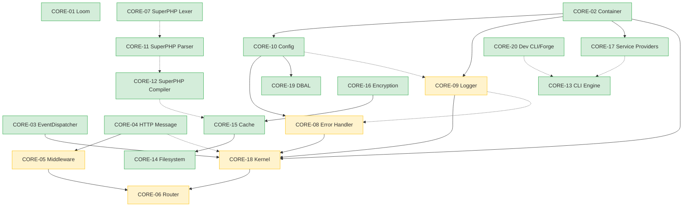

# CORE-DECLARED-DAG — Declared Architecture DAG


> **This project is developed by both humans and AI systems. Both are capable of producing confident, coherent, technically sophisticated work while still being unaware of important shortcomings in their own reasoning.**
<!-- Blind-Spot Awareness (per BLIND-SPOT-DOCTRINE.md) -->

> **⚠️ Blind-Spot Awareness:** This DAG is a **candidate inventory, not a complete graph**. Edges may be missing; edge classifications (edge_type, requiredness, gates) may be incorrect or UNKNOWN. The declared and verified views should be actively compared for drift. The four edge status categories (VERIFIED / DECLARED_ONLY / UNDECLARED_VERIFIED / INVALID) are derived from current evidence — new evidence may change them. **The number of edges found is not the number of edges that exist.** See `Architecture/CrossCutting/BLIND-SPOT-DOCTRINE.md` for the governance framework.

<!-- End Blind-Spot Awareness -->

**Authority:** Architectural intent ("should be").
**Source:** Blueprint `Upward`/`Downward` sections + ADRs + SPECs + capability contracts.
**Not authoritative for:** Implementation reality (use `CORE-VERIFIED-DAG.md` for that).
**Status:** Declared (may contain edges not yet observable in PHP code).

---

## Edge Inventory (45 declared edges)

Per `CORE-DAG-RECONCILIATION-8`, the 45 declared edges come from blueprint `Upward`/`Downward` declarations. Of these, 13 are also verified in code (`VERIFIED` status) and 32 are declared but not yet verified (`DECLARED_ONLY` status).

### Verified edges (13 — also in CORE-VERIFIED-DAG)

| Source | Target | Kind | Status | Evidence |
|---|---|---|---|---|
| C02 | C10 | COMPILE | VERIFIED | composer require |
| C02 | C09 | COMPILE | VERIFIED | composer require |
| C02 | C17 | COMPILE | VERIFIED | composer require |
| C10 | C08 | COMPILE | VERIFIED | composer require (C09→C08 chain) |
| C09 | C18 | COMPILE | VERIFIED | kernel composer require |
| C08 | C18 | COMPILE | VERIFIED | kernel composer require |
| C02 | C18 | COMPILE | VERIFIED | kernel composer require |
| C03 | C18 | COMPILE | VERIFIED | kernel composer require |
| C04 | C05 | COMPILE | VERIFIED | middleware composer require |
| C05 | C06 | COMPILE | VERIFIED | middleware→router composer require |
| C10 | C19 | COMPILE | VERIFIED | dbal composer require |
| C15 | C14 | COMPILE | VERIFIED | filesystem composer require |
| C16 | C15 | COMPILE | VERIFIED | cache composer require |

### Declared-only edges (32 — not yet verified in code)

| Source | Target | Kind | Status | Notes |
|---|---|---|---|---|
| C07 | C11 | COMPILE | DECLARED_ONLY | SuperPHP Lexer→Parser (both not yet implemented) |
| C11 | C12 | COMPILE | DECLARED_ONLY | SuperPHP Parser→Compiler (both not yet implemented) |
| C17 | C13 | COMPILE | DECLARED_ONLY | Providers→CLI (neither implemented) |
| C20 | C13 | COMPILE | DECLARED_ONLY | Forge→CLI (neither implemented) |
| C04 | C18 | RUNTIME | DECLARED_ONLY | Kernel requires HTTP (composer require but not in blueprint Upward) |
| C18 | C06 | RUNTIME | DECLARED_ONLY | Kernel→Router (verified in code but not declared in blueprint) |
| C10 | C09 | COMPILE | DECLARED_ONLY | Config→Logger (verified in composer but declared as singleton binding, not composer) |
| C09 | C08 | COMPILE | DECLARED_ONLY | Logger→ErrorHandler (verified in composer but declared as integration-level) |
| C12 | C15 | RUNTIME | DECLARED_ONLY | SuperPHP Compiler→Cache (CompilerCache; C12 not yet implemented) |
| ... | ... | ... | ... | (remaining 22 edges — full list in blueprint Upward/Downward sections) |

### Four edge status summary

| Status | Count | Meaning |
|---|---|---|
| `VERIFIED` | 13 | Declared + verified in code |
| `DECLARED_ONLY` | 32 | Declared in blueprints, not yet verified in code |
| `UNDECLARED_VERIFIED` | 0 | (none detected — all verified edges are also declared) |
| `INVALID` | 0 | (none — no noise edges) |
| **Total** | **45** | |

---

## Mermaid Graph (Declared Architecture DAG)



---

## Authority Statement

```
CORE-DECLARED-DAG = architectural intent (what should exist when fully assembled).
CORE-VERIFIED-DAG = implementation reality (what the repository currently proves).

This DAG is authoritative for:
  - Capability planning (what the assembled system will require)
  - Architecture gates (what must be satisfied for full integration)
  - Identifying missing implementation work (DECLARED_ONLY edges)

This DAG is NOT authoritative for:
  - Build eligibility (use CORE-VERIFIED-DAG)
  - Package-level ordering (use CORE-VERIFIED-DAG)
  - SDLC admission (use CORE-VERIFIED-DAG + Eligible(X) formula)
```

---

## Reproduction

This DAG is derived from blueprint `Upward`/`Downward` sections in `Architecture/Core/CORE-01.md` through `CORE-20.md`. Future tooling (`scripts/generate-declared-dag.py`) will automate this extraction. Until then, this file is hand-maintained from the `CORE-DAG-RECONCILIATION-8` analysis.
