# CORE-DEPENDENCY-DAG — Authoritative Core-tier Dependency DAG

**Task ID:** CORE-DAG-RECONCILIATION-8
**Source of truth:** 20 blueprint files at `/home/z/my-project/Architecture/Core/CORE-01.md` … `CORE-20.md`
**Implementation truth:** code at `/home/z/my-project/packages/core/` + `/home/z/my-project/orchestrator/`
**Derived from:** direct inspection of (a) each blueprint's `## Dependency Status` section, (b) each implemented package's `composer.json`, (c) each implemented package's `src/*.php` `use` statements via `rg`.
**Status:** DRAFT — saved to `/home/z/my-project/download/` for tech-lead review before commit to `Architecture/Core/`.
**Date:** 2026-09-30

---

## §0. Edge-direction convention (binding, identical to `Architecture/INDEX.md §5.1`)

- **Upward** — the IDs **this component consumes**.
- **Downward** — the IDs that **consume this component**.

In the Mermaid graph below, the edge `X --> Y` means: **Y consumes X** (i.e., **Y depends on X**; **X must be built before Y**). This is the "data flows from X to Y" convention. **Leaves (Wave 0)** are nodes with no incoming edges; **the sink (Wave N)** is the node with the most incoming edges.

A pair that mutually lists the other as Downward is a cycle. No cycles were found in the verified DAG.

---

## §1. Typed-edge legend

| Edge type | Visual | Meaning | Gates admission? |
|---|---|---|---|
| `COMPILE`      | `-->` (solid, plain)         | Consumer's `composer.json` requires the provider package **OR** consumer's `src/*.php` imports a class from the provider's `SovereignStack\Core\<Provider>\` namespace. Build-time hard requirement. | YES — depth 1 (compiles) |
| `RUNTIME`      | `==>` (thick)                | Consumer requires a worker substrate (FrankenPHP / RoadRunner / PHP-FPM long-lived worker, Fiber cooperative scheduler) for *production correctness* of its documented invariants. (Note: this is a package-level characteristic, not a Core-internal edge. See §6.) | YES — depth 2 (production) |
| `INTEGRATION`  | `-->` with `[integration]` label | Consumer reaches an external service (MySQL, Redis, S3, SMTP, HTTP API). | YES — depth 2 (end-to-end tests) |
| `OPTIONAL`     | `-.->` (dotted)              | Consumer's blueprint declares the provider as soft/optional ("can be null", "soft", "test bypass"). The package compiles and unit-tests without the provider. | NO — does not gate admission |

---

## §2. The 20 Core nodes (alphabetical by ID)

| ID | Name | Implemented? | src/ file count | Namespace root | Composer package name |
|---|---|---|---|---|---|
| C01 | Polyrepo Orchestrator ("Loom") | YES (at `orchestrator/`, not `packages/core/`) | 7 src + 1 bin | `SovereignStack\Orchestrator\` | `sovereign-stack/orchestrator` |
| C02 | Reactive DI Container | YES | 7 | `SovereignStack\Core\Container\` | `sovereign-stack/core-container` |
| C03 | PSR-14 Event Dispatcher | YES | 7 | `SovereignStack\Core\EventDispatcher\` | `sovereign-stack/core-event-dispatcher` |
| C04 | PSR-7 HTTP Message & Factory | YES | 14 | `SovereignStack\Core\Http\` *(shared with C05)* | `sovereign-stack/core-http-message` |
| C05 | PSR-15 Middleware & Request Handler | YES | 8 | `SovereignStack\Core\Http\` *(shared with C04)* | `sovereign-stack/core-middleware` |
| C06 | Attribute-Based Router | YES | 13 | `SovereignStack\Core\Router\` | `sovereign-stack/core-router` |
| C07 | SuperPHP Lexer | NO | n/a | `SovereignStack\Core\SuperPHP\Lexer\` | `sovereign-stack/core-superphp-lexer` (declared) |
| C08 | Global Error & Exception Handler | YES | 5 | `SovereignStack\Core\ErrorHandler\` | `sovereign-stack/core-error-handler` |
| C09 | PSR-3 Logging Service | YES | 9 | `SovereignStack\Core\Logger\` | `sovereign-stack/core-logger` |
| C10 | Configuration & Environment Loader | YES | 10 | `SovereignStack\Core\Config\` | `sovereign-stack/core-config` |
| C11 | SuperPHP Parser | NO | n/a | `SovereignStack\Core\SuperPHP\Parser\` | `sovereign-stack/core-superphp-parser` (declared) |
| C12 | SuperPHP Compiler | NO | n/a | `SovereignStack\Core\SuperPHP\Compiler\` | `sovereign-stack/core-superphp-compiler` (declared) |
| C13 | CLI Engine (Console) | NO | n/a | `SovereignStack\Core\Console\` | `sovereign-stack/core-cli` (declared) |
| C14 | Filesystem Abstraction | YES | 10 (7 src + 3 Internal) | `SovereignStack\Core\Filesystem\` | `sovereign-stack/core-filesystem` |
| C15 | Cache Abstraction (PSR-6/16) | NO | n/a | `SovereignStack\Core\Cache\` | `sovereign-stack/core-cache` (declared) |
| C16 | Binary Encryption Envelope | YES | 8 | `SovereignStack\Core\Crypto\` | `sovereign-stack/core-crypto` |
| C17 | Service Provider System | NO (kernel has local `Stub/ProviderRegistryInterface` forward-declaring C17's contract) | n/a | `SovereignStack\Core\Providers\` (inferred) | `sovereign-stack/core-providers` (declared) |
| C18 | Core Kernel & Lifecycle | YES | 15 (12 src + 3 Event + Stub dir) | `SovereignStack\Core\Kernel\` | `sovereign-stack/core-kernel` |
| C19 | Database Abstraction Layer | YES | 11 | `SovereignStack\Core\Database\` | `sovereign-stack/core-dbal` |
| C20 | Developer CLI Toolchain ("Sovereign Forge") | NO | n/a | `SovereignStack\Core\Forge\` (inferred) | `sovereign-stack/core-forge` (declared) |

**Implementation tally:** 13 of 20 blueprints have implementations on disk (12 under `packages/core/` + 1 under `orchestrator/`). The 7 not implemented are C07, C11, C12, C13, C15, C17, C20. The `ARCHITECTURE_BASELINE.md` snapshot from 2026-09-24 lists 11 Core packages because `filesystem/` (C14) was added later and `orchestrator/` (C01) is at a different path.

---

## §3. The 11-field master table — one row per Core blueprint

Fields per the task schema (Step 1).

### C01 — Polyrepo Orchestrator ("Loom")

| # | Field | Value |
|---|---|---|
| 1 | ID / capability | C01 — polyrepo orchestrator ("Loom") |
| 2 | Declared dependencies | None at Core tier (leaf). External: `czproject/git-php`, `php-http/discovery`, `psr/http-message`, `psr/http-factory`, `psr/http-client`, `guzzlehttp/guzzle`. |
| 3 | Actual Composer dependencies | `orchestrator/composer.json` requires: `czproject/git-php ^4.1`, `php-http/discovery ^1.19`, `psr/http-message ^2.0`, `psr/http-factory ^1.0`, `psr/http-client ^1.0`, `guzzlehttp/guzzle ^7.9`. No `sovereign-stack/core-*` packages. |
| 4 | Runtime dependencies | Blueprint says: "Loom runs as a CLI invoked from a CI runner or a developer workstation; it has no long-running process, no HTTP listener, and no shared state between invocations." No worker/process/Fiber requirements. |
| 5 | Integration dependencies | HTTP client (PSR-18) for CI webhook polling (`CIMonitor`, `CiGate`). External `git` binary on PATH (proc_open path when no PSR-18 client). |
| 6 | Dependency type per edge | All edges are external (none Core-internal). External COMPILE: PSR-7/17/18 + czproject/git-php + guzzle. INTEGRATION: external git binary + CI HTTP API. |
| 7 | Current implementation status | IMPLEMENTED: 7 src files (`CIMonitor.php`, `CiGate.php`, `DependencyGraph.php`, `Manifest.php`, `MonorepoPackage.php`, `RepoManager.php`, `VersionBumpEngine.php`) + `bin/loom` (executable). 7 test files. |
| 8 | Downstream consumers (Core) | None — C01 is consumed by Deploy tier only (DEPLOY-01, DEPLOY-04). |
| 9 | Capability provided | Once at depth 2: DEPLOY-01 can sequence tier rollouts; DEPLOY-04 can drive image digest promotion; CI pipelines can gate merges. |
| 10 | SDLC maturity (depth badge) | Depth 2 (shipped, tested — Task 42 worklog confirms Loom shipped v1.2.x). |
| 11 | Gate prerequisites | None for depth 2; `git` 2.40+ on PATH for production use. |

### C02 — Reactive DI Container

| # | Field | Value |
|---|---|---|
| 1 | ID / capability | C02 — PSR-11 DI container with autowiring, compiler passes, circular-dependency detection, **Fiber-scoped pulse bindings** (ADR-017) |
| 2 | Declared dependencies | None at Core tier (foundational leaf). External: `psr/container ^2.0`. Optional: `psr/log ^3.0` (suggest-only, diagnostic logging during compilation). |
| 3 | Actual Composer dependencies | `container/composer.json` requires: `php ^8.4`, `psr/container ^2.0`. Suggests: `psr/log ^3.0`. |
| 4 | Runtime dependencies | Blueprint §"Fiber runtime note (OD-07)" says singleton is worker-lifetime; pulse-scoped binding uses `WeakMap<Fiber, array<string, mixed>>` and auto-evicts on Fiber GC. **Worker substrate is required for the pulse-scoped binding semantics to be meaningful** (ADR-017). PHP-FPM still works; only the pulse scope degrades to transient. |
| 5 | Integration dependencies | None. |
| 6 | Dependency type per edge | None Core-internal (leaf). External COMPILE: `psr/container`. OPTIONAL: `psr/log` (suggest). |
| 7 | Current implementation status | IMPLEMENTED: 7 src files (`Container.php`, `ContainerInterface.php`, `ContainerBuilderInterface.php`, `CompilerPassInterface.php`, `ServiceDefinition.php`, `NotFoundException.php`, `CircularDependencyException.php`). 17 test files including PSR-11 conformance suite. |
| 8 | Downstream consumers (Core) | C03 (optional, lazy listener resolution), C05 (optional), C08 (optional), C09 (required at runtime per blueprint), C10 (singleton binding), C13 (required for autoRegister), C14 (binds FilesystemInterface), C17 (required), C18 (required — instantiated and compiled into), C19 (optional singleton wiring), C20 (soft, auto-wiring). |
| 9 | Capability provided | Once at depth 2: every Hub and Spoke can be wired via autowiring; singletons can be shared per-worker; pulse bindings give tenant isolation per Fiber. |
| 10 | SDLC maturity | Depth 2 (shipped v0.4.0). |
| 11 | Gate prerequisites | None for depth 1; worker substrate (FrankenPHP/RoadRunner/PHP-FPM) for pulse-binding semantics at depth 2. |

### C03 — PSR-14 Event Dispatcher

| # | Field | Value |
|---|---|---|
| 1 | ID / capability | C03 — PSR-14 event dispatcher with prioritized, haltable listener pipeline + lazy resolution |
| 2 | Declared dependencies | Upward: C09 (optional, `Psr\Log\LoggerInterface` for listener-failure recording), C02 (optional, `Psr\Container\ContainerInterface` for lazy listener resolution). External: `psr/event-dispatcher ^1.0`. |
| 3 | Actual Composer dependencies | `event-dispatcher/composer.json` requires: `php ^8.4`, `psr/event-dispatcher ^1.0`. Suggests: `psr/container ^2.0`, `psr/log ^3.0`. |
| 4 | Runtime dependencies | None. |
| 5 | Integration dependencies | None. |
| 6 | Dependency type per edge | OPTIONAL: C02→C03 (suggest in composer), C09→C03 (no composer dep; contract-level via Psr\Log). External COMPILE: `psr/event-dispatcher`. |
| 7 | Current implementation status | IMPLEMENTED: 7 src files (`Event.php`, `EventDispatcher.php`, `EventDispatcherInterface.php`, `ListenerProvider.php`, `ListenerProviderInterface.php`, `Exception/EventDispatchException.php`, `Exception/ListenerRegistrationException.php`). 7 test files + 3 fixtures. |
| 8 | Downstream consumers (Core) | C08 (hard, ErrorEvent dispatch), C14 (optional, FileWritten/FileDeleted events), C18 (hard, lifecycle events). |
| 9 | Capability provided | Once at depth 2: Hub-tier auditors (HUB-06) can subscribe to domain events; lifecycle hooks (boot/terminate) work for C18; cross-Hub event flows work. |
| 10 | SDLC maturity | Depth 2 (shipped v0.1.3). |
| 11 | Gate prerequisites | None for depth 2. |

### C04 — PSR-7 HTTP Message & Factory

| # | Field | Value |
|---|---|---|
| 1 | ID / capability | C04 — PSR-7 message + PSR-17 factory implementations |
| 2 | Declared dependencies | None at Core tier (leaf). External: `psr/http-message ^2.0`, `psr/http-factory ^1.0`. PHP ext: ext-mbstring, ext-fileinfo. |
| 3 | Actual Composer dependencies | `http-message/composer.json` requires: `php ^8.4`, `psr/http-message ^2.0`, `psr/http-factory ^1.0`, `ext-mbstring`, `ext-fileinfo`. Dev: PSR-7 integration tests. |
| 4 | Runtime dependencies | None. |
| 5 | Integration dependencies | None. |
| 6 | Dependency type per edge | None Core-internal. External COMPILE: PSR-7 + PSR-17. |
| 7 | Current implementation status | IMPLEMENTED: 14 src files (Request, Response, ServerRequest, Uri, Stream, UploadedFile + factories). 11 test files including immutability + security (header injection) suites. |
| 8 | Downstream consumers (Core) | C05 (hard, PSR-7 types), C06 (hard, ServerRequestInterface/UriInterface), C08 (hard, ResponseFactoryInterface+StreamFactoryInterface for error responses), C18 (composer-required by kernel even though src/ doesn't import it — see §6 Honest Gaps). |
| 9 | Capability provided | Once at depth 2: any Hub can emit a PSR-7 response; HUB-08 Sovereign Gateway can be built; BRIDGE-01 can intercept payloads. |
| 10 | SDLC maturity | Depth 2 (shipped v0.4.0; Task 42 added Uri CRLF validation). |
| 11 | Gate prerequisites | None. |

### C05 — PSR-15 Middleware & Request Handler

| # | Field | Value |
|---|---|---|
| 1 | ID / capability | C05 — PSR-15 middleware pipeline with cursor-based, immutable-after-freeze stack |
| 2 | Declared dependencies | Upward: C04 (HTTP Message), C02 (lazy class-string middleware resolution), PSR-15 packages. External: `psr/http-server-handler ^1.0`, `psr/http-server-middleware ^1.0`. |
| 3 | Actual Composer dependencies | `middleware/composer.json` requires: `php ^8.4`, `psr/http-message ^2.0`, `psr/http-server-handler ^1.0`, `psr/http-server-middleware ^1.0`, `psr/container ^2.0`, `sovereign-stack/core-http-message`, `sovereign-stack/core-router`. |
| 4 | Runtime dependencies | Blueprint §"long-lived worker (PHP-FPM, RoadRunner, FrankenPHP)" — the pipeline is **frozen after first `handle()` call** so a singleton pipeline can serve 1M sequential requests on a long-lived worker. Worker substrate is a *correctness* requirement for production deployment, not for compile or unit-test. |
| 5 | Integration dependencies | None. |
| 6 | Dependency type per edge | COMPILE: C04→C05 (composer-required), C02→C05 (composer-required via `psr/container`). C06→C05 is the *reverse* direction (middleware imports router) — see C06 below. |
| 7 | Current implementation status | IMPLEMENTED: 8 src files (`CallableMiddlewareAdapter`, `FinalRequestHandler`, `FinalRequestHandlerInterface`, `MiddlewarePipeline`, `MiddlewarePipelineInterface`, `MiddlewareResolver`, `MiddlewareResolverInterface`, `PerRequestHandler`). 7 test files including immutability + exception propagation. |
| 8 | Downstream consumers (Core) | C06 (hard, FinalRequestHandler invokes RouterInterface::match), C18 (hard, pipeline resolved from container). |
| 9 | Capability provided | Once at depth 2: HUB-08 can attach Hub-tier middleware; C18 can serve HTTP; BRIDGE-01 can wrap the pipeline with audit hooks. |
| 10 | SDLC maturity | Depth 2 (shipped v0.4.0). |
| 11 | Gate prerequisites | None for depth 1; worker substrate for production immutability invariant at depth 2. |

### C06 — Attribute-Based Router

| # | Field | Value |
|---|---|---|
| 1 | ID / capability | C06 — attribute-based router with PCRE-compiled route table + method-indexed matching |
| 2 | Declared dependencies | Upward (per blueprint): C04 (HTTP Message — ServerRequestInterface, UriInterface), C05 (Middleware — FinalRequestHandler invokes RouterInterface::match), **C18 (Kernel — owns the Router instance, triggers AttributeRouteLoader during boot)**. |
| 3 | Actual Composer dependencies | `router/composer.json` requires: `php ^8.4`, `psr/http-message ^2.0`, `sovereign-stack/core-http-message`, `ext-mbstring`, `ext-pcre`. Does NOT require sovereign-stack/core-middleware or sovereign-stack/core-kernel. |
| 4 | Runtime dependencies | Blueprint: "PCRE-JIT load-bearing for sub-ms matching" — JIT compiler must be enabled at deploy time. No worker requirement. |
| 5 | Integration dependencies | None. |
| 6 | Dependency type per edge | COMPILE: C04→C06 (composer-required). **MISLABELED IN BLUEPRINT**: the "Upward: C05" and "Upward: C18" entries are actually *Downward* — middleware (C05) imports RouterInterface, and kernel (C18) imports RouterInterface. Actual verified edges from C06 are OUT of C06 (into C05 via composer-required by middleware, into C18 via composer-required by kernel). |
| 7 | Current implementation status | IMPLEMENTED: 13 src files (Router, RouterInterface, Route, RouteAttribute, RouteCollection, CompiledRoute, RouteCompiler, AttributeRouteLoader, RouteResult + 4 Exception classes). 7 test files including performance + path-traversal security. |
| 8 | Downstream consumers (Core) | C05 (composer-required), C18 (composer-required + src-import). |
| 9 | Capability provided | Once at depth 2: HUB-08 can do tenant-prefix rewriting; HUB-19 Validation can constrain route params; HUB-28 can hook the routing pipeline. |
| 10 | SDLC maturity | Depth 2 (shipped v0.4.0). |
| 11 | Gate prerequisites | PCRE JIT enabled in production opcache. |

### C07 — SuperPHP Lexer

| # | Field | Value |
|---|---|---|
| 1 | ID / capability | C07 — pure-PHP lexer producing TokenStream for the SuperPHP three-stage template engine (ADR-005) |
| 2 | Declared dependencies | None at Core tier (pure-PHP leaf). External: `ext-mbstring`. |
| 3 | Actual Composer dependencies | Package not yet implemented; blueprint declares `composer.json` with zero `require` entries beyond PHP itself. |
| 4 | Runtime dependencies | Blueprint: "long-lived worker (PHP-FPM, RoadRunner, FrankenPHP) — Lexer instances are pure; tokenize() resets every per-call field". Worker-scoped singleton is *safe*, not *required*. |
| 5 | Integration dependencies | None. |
| 6 | Dependency type per edge | None Core-internal (leaf). |
| 7 | Current implementation status | NOT IMPLEMENTED. No `packages/core/superphp-lexer/` directory. |
| 8 | Downstream consumers (Core) | C11 (hard, parser consumes TokenStream + TokenType), C12 (indirect, references TokenType via C11's AST), C18 (hard, bootstraps lexer at boot). |
| 9 | Capability provided | Once at depth 2: SuperPHP template engine can be built; HUB-26 (UI Elements) and HUB-12 (Newsletter) can render templates. |
| 10 | SDLC maturity | UNKNOWN (blueprint exists, no code). |
| 11 | Gate prerequisites | ADR-005 (SuperPHP acceptance) — already accepted. |

### C08 — Global Error & Exception Handler

| # | Field | Value |
|---|---|---|
| 1 | ID / capability | C08 — global error/exception handler with PSR-3 logging, multi-format renderer, ErrorEvent dispatch |
| 2 | Declared dependencies | Upward: C09 (PSR-3 LoggerInterface), C04 (PSR-7 ResponseFactoryInterface + StreamFactoryInterface), C03 (PSR-14 EventDispatcherInterface), C10 (Config — debug flag), C02 (Container — optional; logger/renderer resolved through it when present). |
| 3 | Actual Composer dependencies | `error-handler/composer.json` requires: `php ^8.4`, `psr/log ^3.0`, `sovereign-stack/core-logger`. **Does NOT require `sovereign-stack/core-config`, `sovereign-stack/core-event-dispatcher`, `sovereign-stack/core-http-message`, or `sovereign-stack/core-container`.** Repos declared: `../config`, `../logger` (path repos only — not actually required by `require`). |
| 4 | Runtime dependencies | Blueprint: "Worker-scoped per ADR-017: built once at worker boot, holds the logger and renderer references for the worker's lifetime. Under FrankenPHP workers, `register()` is called once per worker process." Worker substrate required for production correctness (PHP global handler state is process-wide). |
| 5 | Integration dependencies | None. |
| 6 | Dependency type per edge | COMPILE: C09→C08 (composer-required). **DECLARED-BUT-UNVERIFIED**: C04→C08, C03→C08, C10→C08, C02→C08 — all declared in blueprint but error-handler/src/ only imports `Psr\Log\*` (PSR-3 contract). No `SovereignStack\Core\Http\*`, `SovereignStack\Core\EventDispatcher\*`, `SovereignStack\Core\Config\*`, or `SovereignStack\Core\Container\*` imports in src/. |
| 7 | Current implementation status | IMPLEMENTED: 5 src files (`ErrorHandler`, `ErrorHandlerInterface`, `RendererInterface`, `Renderer/JsonRenderer`, `Renderer/PlainTextRenderer`). 2 test files. Task 42 added `shutdownRegistered` flag + stale-callback guard. |
| 8 | Downstream consumers (Core) | C18 (hard, registers handler at boot), C05 (middleware delegates uncaught throwables), C13 (reuses ErrorRenderer for console). |
| 9 | Capability provided | Once at depth 2: HUB-06 can subscribe to ErrorEvent; HUB-15 can count errors by severity; production mode (`display_errors=Off`) is enforced. |
| 10 | SDLC maturity | Depth 2 (shipped v0.4.0; Task 42 hardened shutdown guard). |
| 11 | Gate prerequisites | Worker substrate for production register/shutdown semantics. |

### C09 — PSR-3 Logging Service

| # | Field | Value |
|---|---|---|
| 1 | ID / capability | C09 — PSR-3 structured logging engine with HandlerStack, JSON/Line/Redacting formatters, flock-protected StreamHandler |
| 2 | Declared dependencies | Upward: C02 (DI Container — required at runtime; logger injected as singleton), C10 (Config — soft; reads `logging.threshold`, `logging.handlers[]`, `logging.redaction.keys`). External: `psr/log ^3.0`. |
| 3 | Actual Composer dependencies | `logger/composer.json` requires: `php ^8.4`, `psr/log ^3.0`, `sovereign-stack/core-config`. **Does NOT require `sovereign-stack/core-container`.** |
| 4 | Runtime dependencies | Blueprint: "Immutable, worker-scoped per ADR-017". Worker substrate for production singleton semantics. |
| 5 | Integration dependencies | None (file handler writes to local disk; not external-service). |
| 6 | Dependency type per edge | COMPILE: C10→C09 (composer-required). **DECLARED-BUT-UNVERIFIED**: C02→C09 — declared in blueprint as "required at runtime" but logger/src/ only uses `Psr\Log\LoggerTrait`, `Psr\Log\LogLevel`. No `SovereignStack\Core\Container\*` imports. The logger doesn't *consume* the container; it's *registered into* the container by C18 at boot. |
| 7 | Current implementation status | IMPLEMENTED: 9 src files (`Logger`, `LoggerInterface`, `HandlerInterface`, `FormatterInterface`, `LogRecord` + `Formatter/{Json,Line,Redacting}Formatter` + `Handler/StreamHandler`). 8 test files including log-injection security test. Task 42 added StreamHandler 0-byte write fix + HandlerInterface propagation docstring. |
| 8 | Downstream consumers (Core) | C03 (optional, listener-failure recording), C08 (hard, fault recording), C13 (soft, diagnostic events), C14 (hard, FilesystemException diagnostics), C16 (optional, audit-trail logging), C17 (hard, every provider), C18 (hard, boot/shutdown logs), C20 (soft, diagnostic sink). |
| 9 | Capability provided | Once at depth 2: every Hub/Spoke has structured logging; HUB-06 audit can subscribe to log records; redaction policies protect PII. |
| 10 | SDLC maturity | Depth 2 (shipped v0.4.0). |
| 11 | Gate prerequisites | None for depth 1; worker substrate for production singleton at depth 2. |

### C10 — Configuration & Environment Loader

| # | Field | Value |
|---|---|---|
| 1 | ID / capability | C10 — JSON config loader + .env parser with dot-notation access, env interpolation, required-key enforcement |
| 2 | Declared dependencies | Upward: C02 (DI Container — singleton() binding). External: `ext-json`. |
| 3 | Actual Composer dependencies | `config/composer.json` requires: `php ^8.4`, `ext-mbstring`. **Does NOT require `sovereign-stack/core-container` or any other sovereign-stack package.** |
| 4 | Runtime dependencies | Blueprint: "No `getenv()` calls — not thread-safe in PHP-FPM worker pools". Worker substrate required for production correctness. |
| 5 | Integration dependencies | None. |
| 6 | Dependency type per edge | **DECLARED-BUT-UNVERIFIED**: C02→C10 — declared in blueprint as upward but config/src/ doesn't import any `SovereignStack\Core\Container\*` namespace, and composer.json doesn't require it. The "singleton binding" is a runtime/integration concern (C18 does the binding), not a compile-time dep of C10 itself. |
| 7 | Current implementation status | IMPLEMENTED: 10 src files (`ConfigInterface`, `ConfigBuilder`, `ConfigBuilderInterface`, `ConfigRepository`, `EnvLoader`, `EnvLoaderInterface` + 4 Exception classes). 8 test files including security test (config injection). |
| 8 | Downstream consumers (Core) | C08 (debug flag), C09 (log.level, log.channel), C13 (default app name + version, paths), C14 (filesystems.disks), C16 (soft, APP_KEY loading), C17 (Environment enum, ConfigInterface), C18 (app.env, app.debug, app.timezone — loaded first), C19 (database.default_dsn), C20 (no direct dep). |
| 9 | Capability provided | Once at depth 2: HUB-01 can consume frozen repository as base layer; HUB-15 can read health.check_interval; every Hub with `#[ConfigKey]`-annotated params is wired. |
| 10 | SDLC maturity | Depth 2 (shipped v0.4.0). |
| 11 | Gate prerequisites | None. |

### C11 — SuperPHP Parser

| # | Field | Value |
|---|---|---|
| 1 | ID / capability | C11 — recursive-descent parser producing AST (Node hierarchy) for SuperPHP (ADR-005) |
| 2 | Declared dependencies | Upward: C07 (Lexer). External: `ext-mbstring`. Composer: `sovereign-stack/core-superphp-lexer ^0.1`. |
| 3 | Actual Composer dependencies | Package not yet implemented. |
| 4 | Runtime dependencies | Blueprint: "Parser instances are pure — long-lived worker (RoadRunner, FrankenPHP) cannot leak one request's token cursor". Worker-safe, not worker-required. |
| 5 | Integration dependencies | None. |
| 6 | Dependency type per edge | COMPILE: C07→C11 (declared; not yet verifiable in code). |
| 7 | Current implementation status | NOT IMPLEMENTED. |
| 8 | Downstream consumers (Core) | C12 (hard, AST consumption), C18 (hard, bootstraps parser at boot). |
| 9 | Capability provided | Once at depth 2: SuperPHP compiler can transform AST to PHP; HUB-26 (UI Elements) and HUB-12 (Newsletter) can render templates with control flow. |
| 10 | SDLC maturity | UNKNOWN (no code). |
| 11 | Gate prerequisites | C07 at depth 2. |

### C12 — SuperPHP Compiler

| # | Field | Value |
|---|---|---|
| 1 | ID / capability | C12 — AST→PHP compiler with OPcache-preload-friendly output (ADR-010), source-hash cache (uses C15), EchoVisitor default |
| 2 | Declared dependencies | Upward: C07 (indirect, via C11's Node types carrying source-position metadata), C11 (hard, produces Node AST). External: `ext-hash`. |
| 3 | Actual Composer dependencies | Package not yet implemented. |
| 4 | Runtime dependencies | Blueprint: "long-lived worker (PHP-FPM, RoadRunner, FrankenPHP) — same singleton is safe to reuse across concurrent template compiles". Worker-safe. |
| 5 | Integration dependencies | `storage/framework/views/` directory must be writable by PHP-FPM user — deploy-time filesystem concern. |
| 6 | Dependency type per edge | COMPILE: C07→C12 (indirect, declared), C11→C12 (hard, declared). **DECLARED-BUT-UNVERIFIED** until implemented. |
| 7 | Current implementation status | NOT IMPLEMENTED. |
| 8 | Downstream consumers (Core) | C18 (hard, bootstraps compiler as singleton at boot), C20 (hard, `superphp:compile` warm-up command). |
| 9 | Capability provided | Once at depth 2: Hub-tier view factories can render templates; HUB-26 (UI Elements) gets compiled-template cache; C20 can pre-warm cache pre-deploy. |
| 10 | SDLC maturity | UNKNOWN. |
| 11 | Gate prerequisites | C07, C11 at depth 2; C15 (Cache) at depth 2 for CompilerCache. |

### C13 — CLI Engine (Console)

| # | Field | Value |
|---|---|---|
| 1 | ID / capability | C13 — CLI dispatcher (parse argv, find command, validate signature, propagate exit code) — explicitly NOT a job runner or REPL |
| 2 | Declared dependencies | Upward: C02 (hard, autoRegister + command instantiation), C10 (soft, default app name + version + paths), C09 (soft, ?LoggerInterface). |
| 3 | Actual Composer dependencies | Package not yet implemented. |
| 4 | Runtime dependencies | None. |
| 5 | Integration dependencies | None. |
| 6 | Dependency type per edge | COMPILE: C02→C13 (hard). OPTIONAL: C10→C13, C09→C13. |
| 7 | Current implementation status | NOT IMPLEMENTED. |
| 8 | Downstream consumers (Core) | C01 (the `bin/loom` executable constructs Application — but C01 is currently implemented with its OWN minimal CLI dispatcher, not C13), C20 (hard, `bin/forge` uses autoRegister), C17 (downward-listed by C13 as "ConsoleServiceProvider will register Application"). |
| 9 | Capability provided | Once at depth 2: Hub-tier management commands (HUB-01 `flags:list`, HUB-02 `cache:flush`, HUB-06 `audit:replay`) can extend `SovereignStack\Core\Console\Command`. |
| 10 | SDLC maturity | UNKNOWN. |
| 11 | Gate prerequisites | C02 at depth 2. |

### C14 — Filesystem Abstraction

| # | Field | Value |
|---|---|---|
| 1 | ID / capability | C14 — safe blob storage with atomic writes, path-traversal protection, quarantine, integrity verification |
| 2 | Declared dependencies | Upward: C10 (filesystems.disks), C02 (binds FilesystemInterface), C09 (FilesystemException diagnostics), C03 (optional FileWritten/FileDeleted events). Optional: `aws/aws-sdk-php ^3.3` for S3Adapter. |
| 3 | Actual Composer dependencies | `filesystem/composer.json` requires: `php ^8.4`, `ext-fileinfo`. **Does NOT require any sovereign-stack package.** |
| 4 | Runtime dependencies | Blueprint §4.3.2: path-traversal breaker trips on repeated attempts "on the same Fiber" — implies Fiber-aware state per ADR-017. Worker substrate for production. |
| 5 | Integration dependencies | **INTEGRATION (OPTIONAL)**: S3 — only for `S3Adapter`; `aws/aws-sdk-php` is a `composer suggest`, not a hard require. |
| 6 | Dependency type per edge | **DECLARED-BUT-UNVERIFIED**: C02→C14, C10→C14, C09→C14, C03→C14 — all declared in blueprint but filesystem/src/ only imports its own `SovereignStack\Core\Filesystem\Internal\*` namespace. No external Core imports. The blueprint's declared deps are runtime/integration concerns (the bindings + diagnostics happen at C18 boot, not in C14 itself). OPTIONAL: C14→C15 (declared by C15 as blocking for FileAdapter — see below). |
| 7 | Current implementation status | IMPLEMENTED: 10 src files (7 in src/ + 3 in src/Internal/: `AtomicWriter`, `PathGuard`, `Quarantine`). 2 test files including depth-3 test. |
| 8 | Downstream consumers (Core) | C09 (Logger file handler), C12 (compiled-template cache), C15 (optional FileStore driver), C20 (soft, stub loading + file writing). |
| 9 | Capability provided | Once at depth 2: HUB-03 (Asset Engine) can store uploads; HUB-06 (Audit) can archive rotated batches; HUB-11 (Cloud Storage) can do S3-backed large-object flows; C12 can write compiled templates. |
| 10 | SDLC maturity | Depth 2 (shipped v0.1.0). |
| 11 | Gate prerequisites | None for unit tests; S3 credentials + bucket for end-to-end S3Adapter tests. |

### C15 — Cache Abstraction (PSR-6/16)

| # | Field | Value |
|---|---|---|
| 1 | ID / capability | C15 — PSR-6 + PSR-16 cache abstraction with ArrayAdapter (L1) and RedisAdapter (production); JSON-only serialization; stampede protection via Fiber + Redis NX EX |
| 2 | Declared dependencies | None at Core tier (leaf primitive per blueprint). External: `psr/cache ^3.0`, `psr/simple-cache ^3.0`, optional `ext-redis`. **Soft-blocked on C14 (Filesystem)** only for a hypothetical future FileAdapter. |
| 3 | Actual Composer dependencies | Package not yet implemented. |
| 4 | Runtime dependencies | Blueprint §4.2 stampede protection: "in-process `array<string, Fiber>` + Redis `SET NX EX 10` cross-process lock; 1s wait timeout for concurrent fibers; on timeout, fall through". **Fiber + cross-process Redis coordination required for production correctness.** §4.2 circuit breaker (Redis) — CLOSED/OPEN/HALF_OPEN. Worker substrate mandatory. |
| 5 | Integration dependencies | **INTEGRATION (OPTIONAL for production)**: Redis 7.x via `ext-redis` (for RedisAdapter). ArrayAdapter works without Redis. |
| 6 | Dependency type per edge | OPTIONAL: C14→C15 (declared as "blocked on C14 only for FileAdapter" — the core ArrayAdapter/RedisAdapter need no other Core-tier component). |
| 7 | Current implementation status | NOT IMPLEMENTED. No `packages/core/cache/` directory. |
| 8 | Downstream consumers (Core) | C06 (caches compiled route tables), C09 (handler-rotation state), C18 (boot-phase provider manifest), C12 (CompilerCache). |
| 9 | Capability provided | Once at depth 2: HUB-02 (Sovereign Hub Cache) can build directly on RedisAdapter to add Cache Tags, Atomic Locks, Write-Through/Read-Through (ADR-006); HUB-04 session storage; HUB-07 atomic rate-limit counters; BRIDGE-01 DTO transformation cache. |
| 10 | SDLC maturity | UNKNOWN. |
| 11 | Gate prerequisites | C14 at depth 2 (only if FileAdapter is in scope; ArrayAdapter+RedisAdapter don't need C14). Redis 7.x for production RedisAdapter; Fiber-aware worker for stampede protection. |

### C16 — Binary Encryption Envelope

| # | Field | Value |
|---|---|---|
| 1 | ID / capability | C16 — AES-256-GCM encryption envelope + Argon2id password hashing (ADR-008) + HKDF-SHA256 + KeyRegistry |
| 2 | Declared dependencies | External (hard): `ext-openssl`, `ext-sodium` (or PHP built against libargon2), `ext-hash`. Upward: C10 (soft, APP_KEY + per-tenant overrides via ConfigInterface), C09 (optional, audit-trail logging — default `new NullLogger()`). |
| 3 | Actual Composer dependencies | `crypto/composer.json` requires: `php ^8.4`, `ext-openssl`, `ext-sodium`, `ext-hash`, `psr/log ^3.0`. **Does NOT require sovereign-stack/core-config or sovereign-stack/core-logger.** |
| 4 | Runtime dependencies | Blueprint §4.4.5: audit + provenance — "repeated failures from a single Fiber page operator" — implies Fiber-aware breaker state. Worker substrate for production. |
| 5 | Integration dependencies | None. |
| 6 | Dependency type per edge | **DECLARED-BUT-CONTRACT-LEVEL**: C10→C16 (declared as soft — `KeyRegistry` reads APP_KEY via ConfigInterface; in tests can bypass via addKey() directly) and C09→C16 (optional — constructor arg, default NullLogger). crypto/src/ imports only `Psr\Log\LoggerInterface` + `Psr\Log\NullLogger` (PSR-3 contract). No direct `SovereignStack\Core\Config\*` or `SovereignStack\Core\Logger\*` imports. |
| 7 | Current implementation status | IMPLEMENTED: 8 src files (`Encrypter`, `EncrypterInterface`, `Envelope`, `Hasher`, `KeyRegistry`, `KeyRegistryInterface`, `PasswordHasher`, `CryptoException`). 4 test files. |
| 8 | Downstream consumers (Core) | C19 (optional, column-level encryption for tenant PII). Hub-tier: BRIDGE-01 (HMAC payload verification — corrected per Finding 3), HUB-04 (PasswordHasher + JWT signing-key at-rest), HUB-20 (Vault — KEK + per-secret DEKs), HUB-02 (optional PII cache encryption). |
| 9 | Capability provided | Once at depth 2: HUB-04 can verify Argon2id passwords + store JWT signing keys at rest; HUB-20 Vault can manage envelope-encryption key lifecycle; BRIDGE-01 can do AEAD payload verification. |
| 10 | SDLC maturity | Depth 2 (shipped v0.1.0). |
| 11 | Gate prerequisites | `libargon2-dev` installed before PHP compile (per DEPLOY-01 + ADR-008). Worker substrate for production breaker semantics. |

### C17 — Service Provider System

| # | Field | Value |
|---|---|---|
| 1 | ID / capability | C17 — `#[AsProvider]` attribute + ProviderRegistry + boot/register phases; transitively consumed by every Hub and Spoke |
| 2 | Declared dependencies | Upward: C02 (ContainerInterface, CompilerPassInterface), C10 (Environment enum, ConfigInterface), C09 (Psr\Log\LoggerInterface). External: `psr/container ^2.0`, `psr/log ^3.0`. |
| 3 | Actual Composer dependencies | Package not yet implemented. C18 currently has a local `Stub/ProviderRegistryInterface` + `Stub/EmptyProviderRegistry` as a forward-declared placeholder for C17's contract. |
| 4 | Runtime dependencies | None. |
| 5 | Integration dependencies | None. |
| 6 | Dependency type per edge | COMPILE: C02→C17, C10→C17, C09→C17 (all declared; not yet verifiable). |
| 7 | Current implementation status | NOT IMPLEMENTED as a package. **C18's `Stub/ProviderRegistryInterface.php` forward-declares the contract.** |
| 8 | Downstream consumers (Core) | C18 (hard, `ProviderRegistry::discover()` / `registerAll()` / `bootAll()` in boot phase), C20 (hard, generated ServiceProvider skeletons use #[AsProvider]). |
| 9 | Capability provided | Once at depth 2: every Hub and Spoke package ships at least one ServiceProvider annotated with #[AsProvider]; C18 can do tier-aware boot phases; C20 can scaffold new providers. |
| 10 | SDLC maturity | UNKNOWN (no code; placeholder only). |
| 11 | Gate prerequisites | C02, C10, C09 at depth 2. |

### C18 — Core Kernel & Lifecycle

| # | Field | Value |
|---|---|---|
| 1 | ID / capability | C18 — orchestrates request lifecycle (boot → handle → terminate); wires all Core-tier components into the Pulse round-trip; explicitly NOT an HTTP server (delegates to FrankenPHP/RoadRunner/PHP-FPM), NOT a CLI dispatcher (C13 owns that), NOT a service locator |
| 2 | Declared dependencies | Upward: C02 (Container — instantiated, bindings registered into, compiled), C10 (Config — loaded first, drives every subsequent binding), C09 (Logging — singleton, flushed during terminate()), C08 (Error Handler — registered before any other code runs), C17 (Service Providers — discovered, register() then boot()), C03 (Event Dispatcher — dispatched for every lifecycle event), C05 (Middleware Pipeline — resolved from container, handle() invoked per request), C06 (Router — bound into the pipeline's terminal handler). C19 (DBAL) optional during terminate() — no-op if not landed. |
| 3 | Actual Composer dependencies | `kernel/composer.json` requires: `php ^8.4`, `psr/http-message ^2.0`, `psr/event-dispatcher ^1.0`, `psr/container ^2.0`, `psr/log ^3.0`, `sovereign-stack/core-container`, `sovereign-stack/core-event-dispatcher`, `sovereign-stack/core-http-message`, `sovereign-stack/core-middleware`, `sovereign-stack/core-router`, `sovereign-stack/core-config`, `sovereign-stack/core-logger`, `sovereign-stack/core-error-handler`. **Does NOT require `sovereign-stack/core-crypto`, `sovereign-stack/core-dbal`, `sovereign-stack/core-filesystem`, or `sovereign-stack/core-service-providers`.** |
| 4 | Runtime dependencies | Blueprint: "the HTTP entry point (`public/index.php` for PHP-FPM, a RoadRunner worker for long-running, a FrankenPHP worker for the modern path) calls `Kernel::boot()` once at process start, then loops `Kernel::handle($request)` per incoming request, then calls `Kernel::terminate()` on shutdown". **Worker substrate is mandatory for HTTP serving.** §4.5.7 chaos scenarios include "double-handle from parallel fibers" + "terminate during handling" — Fiber-aware. |
| 5 | Integration dependencies | None directly (DBAL MySQL is gated as optional in terminate()). |
| 6 | Dependency type per edge | **VERIFIED-IN-CODE**: C02→C18, C03→C18, C05→C18, C06→C18, C08→C18, C09→C18, C10→C18 — all 7 are imported in `kernel/src/Kernel.php` + `HttpBootstrapper.php` + `KernelInterface.php`. **VERIFIED-IN-COMPOSER-ONLY**: C04→C18 (kernel composer requires core-http-message but src/ doesn't import any http-message class — see §6 Honest Gaps). **DECLARED-BUT-UNVERIFIED**: C17→C18 (C17 not implemented; kernel has Stub/ProviderRegistryInterface as forward-decl). **OPTIONAL**: C19→C18 (DBAL during terminate() — no-op if absent). |
| 7 | Current implementation status | IMPLEMENTED: 15 src files (12 in src/ + 3 Event classes: BootEvent, RequestReceivedEvent, ResponseReadyEvent, TerminateEvent + Stub/ dir). 4 test files (state machine, request context, integration hello-world, worker contamination). Task 42 added `KernelException` named constructors for accurate state-machine messages. |
| 8 | Downstream consumers (Core) | None at Core tier (C18 is the sink). Hub tier (every Hub service booted via service provider); C13/C20 (call Kernel::boot() then dispatch CLI then Kernel::terminate()); HTTP entry point; DEPLOY-01 (container image starts from Kernel::boot()); BRIDGE-01 (RequestReceivedEvent + ResponseReadyEvent hooks). |
| 9 | Capability provided | Once at depth 2: any Hub can be booted via a ServiceProvider; HTTP serving works end-to-end; CLI tools have a boot/terminate envelope; DEPLOY-01 can package the kernel into an OCI image; BRIDGE-01 can intercept lifecycle events. |
| 10 | SDLC maturity | Depth 2 (shipped v0.4.0). |
| 11 | Gate prerequisites | All 8 hard upward deps (C02, C03, C05, C06, C08, C09, C10, C17) at depth 2. Worker substrate (FrankenPHP/RoadRunner/PHP-FPM) for HTTP serving at depth 2. |

### C19 — Database Abstraction Layer

| # | Field | Value |
|---|---|---|
| 1 | ID / capability | C19 — thin PDO wrapper with fluent QueryBuilder, nested transactions, application-level tenant scoping (MySQL has no RLS) |
| 2 | Declared dependencies | Upward: `ext-pdo`, `ext-pdo_mysql` (production), `ext-pdo_sqlite` (test fixture), `psr/log ^3.0`. C10 (optional, DSN resolution), C02 (optional, singleton wiring). MySQL 8 (InnoDB) per ADR-013 (note: ADR-007 says PostgreSQL-over-MySQL; ADR-013 later supersedes — MySQL primary). |
| 3 | Actual Composer dependencies | `dbal/composer.json` requires: `php ^8.4`, `ext-pdo`, `ext-pdo_sqlite`, `psr/log ^3.0`. **Does NOT require `ext-pdo_mysql` (suggested for production), `sovereign-stack/core-config`, or `sovereign-stack/core-container`.** |
| 4 | Runtime dependencies | None beyond MySQL connection. |
| 5 | Integration dependencies | **INTEGRATION (REQUIRED for production)**: MySQL 8 (InnoDB) per ADR-013. SQLite for tests. |
| 6 | Dependency type per edge | **DECLARED-BUT-UNVERIFIED**: C10→C19, C02→C19 — declared as optional in blueprint but dbal/src/ only imports `Psr\Log\LoggerInterface`, `Psr\Log\NullLogger`. No `SovereignStack\Core\Config\*` or `SovereignStack\Core\Container\*` imports. **INTEGRATION**: MySQL 8 (production) / SQLite (test fixture). |
| 7 | Current implementation status | IMPLEMENTED: 11 src files (`Connection`, `ConnectionInterface`, `DatabaseException`, `DriverInterface`, `Driver/MysqlDriver`, `Driver/SqliteDriver`, `QueryBuilder`, `QueryBuilderInterface`, `TenantContext`, `Transaction`, `TypeMapper`). 4 test files. |
| 8 | Downstream consumers (Core) | C18 (optional, terminate-only — close connections), C20 (soft, forge:migrate delegates to MigrationRunner). Hub-tier: HUB-04, HUB-06, HUB-01, HUB-19, HUB-21. |
| 9 | Capability provided | Once at depth 2: HUB-04 (Identity) can persist users/sessions/password-hashes; HUB-06 (Audit) can do high-volume append-only audit table with generated-column index; HUB-21 (Nexus) can do multi-tenant coordination; C20 can do migration scaffolding. |
| 10 | SDLC maturity | Depth 2 (shipped v0.4.0; baseline shows 11 src + 4 tests). |
| 11 | Gate prerequisites | MySQL 8 InnoDB service container in CI; SQLite 3.44 for unit tests. |

### C20 — Developer CLI Toolchain ("Sovereign Forge")

| # | Field | Value |
|---|---|---|
| 1 | ID / capability | C20 — code generator (`forge:make:hub`, `forge:make:spoke`, `forge:make:command`, `forge:migrate`, `forge:serve`) |
| 2 | Declared dependencies | Upward: C13 (hard — Forge extends Application, every command extends Command), C17 (hard — generated ServiceProvider skeletons use #[AsProvider]), C02 (soft, auto-wiring), C14 (soft, stub loading + file writing), C19 (soft, forge:migrate delegates to MigrationRunner), C09 (soft, diagnostic sink). |
| 3 | Actual Composer dependencies | Package not yet implemented. |
| 4 | Runtime dependencies | `forge:serve` shells out to `php -S` (built-in web server) via `proc_open` — only proc_open call in the package, covered by CI security test. |
| 5 | Integration dependencies | None (forge:serve uses local PHP web server, not an external service). |
| 6 | Dependency type per edge | COMPILE: C13→C20, C17→C20 (hard, declared). OPTIONAL: C02→C20, C14→C20, C19→C20, C09→C20 (soft, declared). |
| 7 | Current implementation status | NOT IMPLEMENTED. |
| 8 | Downstream consumers (Core) | None at Core tier. Downward: every Hub/ISpoke/ESpoke package produced by forge:make:* (transitive); C01 release pipeline (consumes composer.json repositories section that Forge maintains); DEPLOY-01 image build (consumes package layout that Forge scaffolds). |
| 9 | Capability provided | Once at depth 2: developers can scaffold new Hub/Spoke packages; Hub-tier management commands can be added via `forge:make:command`; release pipeline can consume Forge-maintained composer.json. |
| 10 | SDLC maturity | UNKNOWN. |
| 11 | Gate prerequisites | C13, C17 at depth 2. |

---

## §4. Mermaid — typed-edge Core dependency DAG

**Convention:** `X --> Y` means Y consumes X (Y depends on X; X is upstream).

```mermaid
graph TD
    %% ---------- Core nodes ----------
    C01[C01 Loom Orchestrator]
    C02[C02 DI Container]
    C03[C03 Event Dispatcher]
    C04[C04 HTTP Message]
    C05[C05 Middleware]
    C06[C06 Router]
    C07[C07 SuperPHP Lexer]
    C08[C08 Error Handler]
    C09[C09 PSR-3 Logger]
    C10[C10 Config Loader]
    C11[C11 SuperPHP Parser]
    C12[C12 SuperPHP Compiler]
    C13[C13 CLI Engine]
    C14[C14 Filesystem]
    C15[C15 Cache Abstraction]
    C16[C16 Encryption]
    C17[C17 Service Providers]
    C18[C18 Kernel]
    C19[C19 DBAL]
    C20[C20 Dev CLI/Forge]

    %% ---------- COMPILE edges (verified-in-code: src/ imports) ----------
    C02 ==>|compile+src| C18
    C03 ==>|compile+src| C18
    C05 ==>|compile+src| C18
    C06 ==>|compile+src| C18
    C08 ==>|compile+src| C18
    C09 ==>|compile+src| C18
    C10 ==>|compile+src| C18

    %% ---------- COMPILE edges (verified-in-composer: composer.json require) ----------
    C04 -->|compile+composer| C05
    C04 -->|compile+composer| C06
    C04 -->|compile+composer| C18
    C05 -->|compile+composer| C06
    C09 -->|compile+composer| C08
    C10 -->|compile+composer| C09

    %% ---------- COMPILE edges (declared-but-unverified — not yet implemented) ----------
    C07 -->|compile+declared| C11
    C11 -->|compile+declared| C12
    C13 -->|compile+declared| C20
    C17 -->|compile+declared| C20

    %% ---------- OPTIONAL edges (declared soft / not gating admission) ----------
    C02 -.->|optional| C03
    C02 -.->|optional| C05
    C02 -.->|optional| C08
    C02 -.->|optional| C09
    C02 -.->|optional| C10
    C02 -.->|optional| C13
    C02 -.->|optional| C14
    C02 -.->|optional| C17
    C02 -.->|optional| C19
    C02 -.->|optional| C20
    C03 -.->|optional| C08
    C03 -.->|optional| C14
    C09 -.->|optional| C13
    C09 -.->|optional| C14
    C09 -.->|optional| C16
    C09 -.->|optional| C17
    C09 -.->|optional| C20
    C10 -.->|optional| C08
    C10 -.->|optional| C13
    C10 -.->|optional| C14
    C10 -.->|optional| C16
    C10 -.->|optional| C17
    C10 -.->|optional| C19
    C14 -.->|optional| C15
    C14 -.->|optional| C20
    C17 -.->|optional| C18
    C19 -.->|optional| C18
    C19 -.->|optional| C20

    %% ---------- INTEGRATION edges ----------
    C14 -->|integration S3 optional| C14S3[S14 S3Adapter external]
    C15 -->|integration Redis 7 production| C15R[C15 RedisAdapter external]
    C16 -->|integration libargon2-dev build| C16A[C16 build dep external]
    C19 -->|integration MySQL 8 InnoDB prod| C19M[C19 MySQL 8 external]

    %% ---------- C01 leaf with external deps ----------
    C01 -->|integration git CLI| C01G[C01 git binary external]
    C01 -->|integration CI HTTP API| C01H[C01 CI webhook external]

    classDef leaf fill:#d4edda,stroke:#28a745,color:#155724
    classDef sink fill:#f8d7da,stroke:#dc3545,color:#721c24
    classDef unimpl fill:#fff3cd,stroke:#ffc107,color:#856404
    classDef hub fill:#cce5ff,stroke:#007bff,color:#004085

    class C02,C03,C04,C07,C10,C11,C12,C13,C14,C15,C16,C17,C19,C20 leaf
    class C18 sink
    class C07,C11,C12,C13,C15,C17,C20 unimpl
    class C14S3,C15R,C16A,C19M,C01G,C01H hub
```



### §4.1 Edge-type counts (verified + declared)

| Edge type | Count | Edges in this set |
|---|---|---|
| **COMPILE — VERIFIED-IN-CODE** (src/ imports) | 7 | C02→C18, C03→C18, C05→C18, C06→C18, C08→C18, C09→C18, C10→C18 |
| **COMPILE — VERIFIED-IN-COMPOSER** (composer require, src/ doesn't import) | 6 | C04→C05, C04→C06, C04→C18, C05→C06, C09→C08, C10→C09 |
| **COMPILE — DECLARED-BUT-UNVERIFIED** (blueprint declares; consumer not yet implemented OR composer.json doesn't require) | 4 | C07→C11, C11→C12, C13→C20, C17→C20 |
| **OPTIONAL** (blueprint declares soft; not gating admission) | 28 | See dotted edges above (all `-.->`) |
| **INTEGRATION** (external service) | 6 | C14→S3, C15→Redis, C16→libargon2 build, C19→MySQL 8, C01→git, C01→CI HTTP API |
| **RUNTIME** (worker substrate; package-level characteristic, not a Core-internal edge — see §6) | (n/a — no Core-internal RUNTIME edges; C18 RUNTIME is to FrankenPHP/RoadRunner/PHP-FPM external) | (none) |
| **Total Core-internal edges (excluding INTEGRATION externals)** | 45 | 7 verified-in-code + 6 verified-in-composer + 4 declared-but-unverified + 28 optional |

### §4.2 Topology summary

| Property | Value |
|---|---|
| Total Core-internal nodes | 20 |
| Total Core-internal edges (verified + declared) | 45 |
| Edges VERIFIED-IN-CODE | 7 |
| Edges VERIFIED-IN-COMPOSER (composer.json require) | 6 |
| Edges DECLARED-BUT-UNVERIFIED (blueprint-only) | 4 |
| Edges DECLARED-BUT-CONTRACT-LEVEL (uses PSR contract, not Core namespace) | 11 (subset of OPTIONAL edges above) |
| Edges NOT-DECLARED-BUT-USED | 1 — `C04→C18` (kernel's composer.json requires `sovereign-stack/core-http-message` but C18's blueprint upward list does NOT include C04) |
| **Leaves (no incoming edges)** | C01, C02, C03, C04, C07, C10, C11, C12, C13, C14, C15, C16, C17, C19, C20 (15 nodes) |
| **Sink (most incoming edges)** | C18 (Kernel) — 8 incoming COMPILE edges (7 verified-in-code + 1 verified-in-composer) |
| **Convergence points (top-3 incoming)** | C18 (8), C20 (4: C13+C17 hard + C02+C14+C19+C09 optional), C08 (3: C09 hard + C03+C10+C02 optional) |

---

## §5. Honest Gaps

1. **C04 → C18 is the only NOT-DECLARED-BUT-USED edge in Core.** The Kernel's blueprint `Dependency Status` section lists 8 hard upward Core deps (C02, C03, C05, C06, C08, C09, C10, C17) + 1 optional (C19). It does **not** list C04 (HTTP Message). Yet `kernel/composer.json` requires `sovereign-stack/core-http-message`. Why? The Kernel uses PSR-7 interfaces (`Psr\Http\Message\ServerRequestInterface`, `ResponseInterface`) in its `handle()` signature; the http-message package is the *canonical implementation* chosen by the composer.json, but the kernel could in principle swap to any other PSR-7 implementation. So this is a contract-level dep that should be acknowledged in the blueprint's `Dependency Status` section.

2. **The `SovereignStack\Core\Http\` namespace is shared between C04 (http-message) and C05 (middleware).** Both `composer.json` files declare `"SovereignStack\\Core\\Http\\": "src/"` as the PSR-4 root. This is unusual — typically one package owns one namespace. Composer resolves by searching both `src/` directories in registration order. Verified classes: `Response`, `Stream`, `Request`, `ServerRequest`, `Uri`, `UploadedFile`, factories — all in http-message/src/. `MiddlewarePipeline`, `MiddlewarePipelineInterface`, `MiddlewareResolver`, `MiddlewareResolverInterface`, `FinalRequestHandler`, `FinalRequestHandlerInterface`, `CallableMiddlewareAdapter`, `PerRequestHandler` — all in middleware/src/. No class-name collision was found, but this is a footgun — adding a new class to one package with the same name as a class in the other would silently alias. Recommend tech-lead review; consider splitting `SovereignStack\Core\Http\` (C04) from `SovereignStack\Core\Middleware\` (C05) in a future minor version of both packages.

3. **C17 (Service Providers) is not implemented; the Kernel carries a forward-declaration stub.** `kernel/src/Stub/ProviderRegistryInterface.php` declares the contract that C17 will eventually own. This is a forward declaration, not an implementation — C17's `ProviderRegistry::discover()` / `registerAll()` / `bootAll()` is referenced in C18's blueprint but does not exist in code yet. Until C17 lands, C18 boots with `EmptyProviderRegistry` (a no-op stub in the kernel package).

4. **Several blueprints declare upward deps that don't manifest in code at all.** Examples: C10 (Config) declares "Upward: C02 (DI Container — provides singleton() binding)" but `config/src/` doesn't import any `SovereignStack\Core\Container\*` namespace, and `config/composer.json` doesn't require `sovereign-stack/core-container`. The "singleton binding" is a runtime concern owned by C18 (kernel), not a compile-time dep of C10 itself. Same pattern for C14 (Filesystem) — declares C02/C10/C09/C03 as upward, but `filesystem/src/` imports only its own `Internal\*` namespace. These are *integration-level* declarations (true at the assembled-application level, false at the package-isolation level). The DAG marks them as DECLARED-BUT-UNVERIFIED with the caveat that they're not wrong — they describe a *future* assembled-system state, not the *current* package-level reality.

5. **C15 (Cache) is not implemented but its consumers (C06, C09, C18) reference it in their blueprints.** C18's blueprint says "boot-phase caching of service-provider manifests" — that's a forward declaration. C06's blueprint says "caches compiled route tables" — also forward. Until C15 lands, those consumers fall through to no-cache behavior.

6. **The `ARCHITECTURE_BASELINE.md` snapshot (2026-09-24) lists 11 Core packages but the actual filesystem now has 12** (C14 Filesystem was added after the baseline). Plus C01 Loom lives at `orchestrator/` (not `packages/core/`), bringing the true implementation count to 13 of 20.

7. **C12 (SuperPHP Compiler) declares a hard upward dep on C15 (Cache) for `CompilerCache`** — verified by reading the C12 blueprint's `CompilerCache` class description ("persists `CompiledTemplate` instances by source hash so re-compiles of unchanged source are O(1)"). This edge is not in the §4 Mermaid because C12 is not implemented; it's an inferred forward edge. When C12 lands, the DAG must add `C15 --> C12`.

---

## §6. Cross-check against `Architecture/INDEX.md §5.2` (the prior monolithic Mermaid block)

INDEX.md §5.2 has **18 Core-internal edges** in this exact list (extracted 2026-09-30):

```
C02 --> C10
C02 --> C09
C02 --> C17
C10 --> C08
C09 --> C18
C08 --> C18
C02 --> C18
C03 --> C18
C04 --> C05
C05 --> C06
C18 --> C06
C10 --> C19
C15 --> C14
C16 --> C15
C07 --> C11
C11 --> C12
C17 --> C13
C20 --> C13
```

### §6.1 Edges in §5.2 with WRONG DIRECTION (per the §5.1 convention "X → Y means Y consumes X")

| §5.2 edge | Actual direction (per blueprint + code) | Severity |
|---|---|---|
| `C18 --> C06` | Should be `C06 --> C18`. Blueprint CORE-06 lists C18 in its "Upward" section but the description ("Kernel owns the Router instance, triggers AttributeRouteLoader during boot") is the inverse — Kernel *owns* the Router, i.e., Kernel *depends on* Router. Code-level verification confirms: `kernel/src/Kernel.php` imports `use SovereignStack\Core\Router\RouterInterface;` (Kernel imports from Router, not vice versa). **HIGH** — this single inverted edge was the one SAAI's prior audit caught ("missed C18 → C06") but the auditor did not catch that the direction is also wrong. |
| `C15 --> C14` | Should be `C14 --> C15` (and it's OPTIONAL). Blueprint CORE-15 says "Blocked on CORE-14 (Filesystem) only for a hypothetical future FileAdapter" — i.e., C15 depends on C14. The §5.2 direction `C15 --> C14` means "C14 consumes C15" — the inverse. **MEDIUM** — the FileAdapter is hypothetical, so this edge is borderline; but the direction is still wrong. |
| `C17 --> C13` | Should be `C13 --> C17` (or removed). Blueprint CORE-13's "Downward" section says "CORE-17 (Service Providers) — a ConsoleServiceProvider will register the Application instance as a singleton in CORE-02" — i.e., C17 consumes C13 (C17 depends on C13). The §5.2 direction `C17 --> C13` means "C13 consumes C17" (C13 depends on C17) — the inverse. **LOW** — neither C13 nor C17 is implemented; the edge is theoretical. |
| `C20 --> C13` | Should be `C13 --> C20`. Blueprint CORE-20's "Upward" section lists "CORE-13 (CLI Engine) — hard" — i.e., C20 depends on C13. Per convention, the edge should be `C13 --> C20` (C13 consumed by C20). The §5.2 direction `C20 --> C13` means "C13 consumes C20" — the inverse. **LOW** — neither C13 nor C20 is implemented. |

### §6.2 Edges in §5.2 that should not exist as Core-internal edges

| §5.2 edge | Reason |
|---|---|
| `C16 --> C15` | Per blueprint CORE-15: "No Core-tier component is an upward dependency — CORE-15 is a leaf primitive." Per blueprint CORE-16's Downward: "**HUB-02 (Sovereign Hub Cache)** — may encrypt cache values tagged as sensitive (PII) via `Encrypter` before handing to the underlying adapter." The actual consumer is HUB-02 (Hub tier), not C15 (Cache). This is a Hub-tier edge (`C16 --> H02`), not a Core-internal edge. The §5.2 graph is mixing tiers. |

### §6.3 Edges MISSING from §5.2 (declared in blueprints but not in §5.2)

The blueprint `Dependency Status` sections declare **45 Core-internal edges** total (including soft/optional). INDEX.md §5.2 has **18**. So §5.2 omits **27 declared edges**. Most are OPTIONAL edges (correctly omitted from a high-level overview). But the following **hard / COMPILE** edges declared in blueprints are missing from §5.2:

| Missing edge | Type | Blueprint source | Why notable |
|---|---|---|---|
| `C04 --> C18` | COMPILE (composer.json require + NOT-DECLARED-BUT-USED) | kernel composer.json requires `sovereign-stack/core-http-message` | Kernel's blueprint does not list C04 as upward, but composer.json does require it. This is the **only NOT-DECLARED-BUT-USED edge in Core**. §5.2 omits it because §5.2's source is the blueprint `Dependency Status` section, not the composer.json. The DAG in §4 above includes this edge. |
| `C04 --> C06` | COMPILE (composer.json require) | router composer.json requires `sovereign-stack/core-http-message` | Verified at composer.json level; router's blueprint lists C04 as upward. §5.2 has `C04 --> C05` (the analogous middleware edge) but not the router edge. Inconsistent. |
| `C04 --> C08` | COMPILE (blueprint declares; composer.json doesn't require) | error-handler blueprint upward | Blueprint declares but composer.json doesn't require and src/ uses only PSR. |
| `C09 --> C08` | COMPILE (composer.json require) | error-handler composer.json requires `sovereign-stack/core-logger` | Verified at composer.json level. §5.2 has the reverse `C10 --> C08` (declared but composer.json doesn't require config) but not this one. |
| `C09 --> C17` | COMPILE (blueprint declares; C17 not implemented) | service-providers blueprint upward | §5.2 omits. |
| `C10 --> C09` | COMPILE (composer.json require) | logger composer.json requires `sovereign-stack/core-config` | Verified at composer.json level. §5.2 has the inverse `C02 --> C09` (logger declares C02 as upward; composer.json doesn't require container). §5.2 is missing the C10 → C09 edge. |
| `C10 --> C17` | COMPILE (blueprint declares; C17 not implemented) | service-providers blueprint upward | §5.2 omits. |
| `C17 --> C18` | COMPILE (blueprint declares; C17 not implemented) | kernel blueprint upward | §5.2 omits — significant gap because C18's blueprint lists C17 as one of its 8 hard upward deps. |
| `C17 --> C20` | COMPILE (blueprint declares; both unimplemented) | forge blueprint upward | §5.2 omits. |
| `C13 --> C20` | COMPILE (blueprint declares; both unimplemented) | forge blueprint upward | §5.2 has the **inverted** `C20 --> C13`. |
| `C13 --> C01` | COMPILE (blueprint declares) | loom blueprint downward says "C01's bin/loom constructs Application" — i.e., C01 depends on C13. §5.2 should have `C13 --> C01` per convention. | Not in §5.2. |

### §6.4 Edges in §5.2 that are CORRECT (no change needed)

12 of 18 edges in §5.2 are correctly directed and match blueprint intent:

`C02 --> C10` ✓, `C02 --> C09` ✓, `C02 --> C17` ✓, `C10 --> C08` ✓ (declared), `C09 --> C18` ✓ (verified-in-code), `C08 --> C18` ✓ (verified-in-code), `C02 --> C18` ✓ (verified-in-code), `C03 --> C18` ✓ (verified-in-code), `C04 --> C05` ✓ (verified-in-composer), `C05 --> C06` ✓ (verified-in-composer), `C10 --> C19` ✓ (declared-but-contract-level), `C07 --> C11` ✓ (declared, not implemented), `C11 --> C12` ✓ (declared, not implemented).

### §6.5 Defect tally for INDEX.md §5.2 (Core-internal block)

| Defect class | Count |
|---|---|
| Edges with WRONG direction | 4 (C18→C06, C15→C14, C17→C13, C20→C13) |
| Edges that should not be Core-internal | 1 (C16→C15 — should be C16→H02 Hub-tier edge) |
| Hard/COMPILE edges MISSING | 11 (see §6.3 above) |
| OPTIONAL edges missing (correctly omitted from overview) | 16 (the bulk of the 27 omitted declared edges) |
| Edges correctly declared | 12 |
| **Total §5.2 Core-internal edges** | **18** (vs **45** blueprint-declared; §5.2 captures ~40% of the truth, with 5 direction/structural errors) |

---

## §7. Implementation-status summary table (replaces INDEX.md's contradictory C02 status table)

The prior `INDEX-VERIFY-3` audit caught three mutually-contradictory statements about CORE-02 in INDEX.md (line 102-104: "Critical-path correction: the true build-blocking dependency is CORE-02..." vs line 72: "CORE-02 ✅ Implemented + tested v1.0.0 97.2% coverage" vs line 37: "packages/core/container/ is 'stub only (.gitkeep)'"). This DAG replaces those contradictions with the ground-truth count from `find packages/core/container/src -name '*.php'`:

| ID | Implemented? | src/ files | test files | composer version | SDLC depth | Notes |
|---|---|---|---|---|---|---|
| C01 | YES (at `orchestrator/`) | 7 src + 1 bin | 7 | (orchestrator has its own composer.json; no version field set) | 2 | `orchestrator/bin/loom` exists + executable |
| C02 | YES | 7 | 17 | 0.4.0.0 | 2 | PSR-11 conformance suite passing |
| C03 | YES | 7 | 7 | 0.1.3.0 | 2 | |
| C04 | YES | 14 | 11 | 0.4.0.0 | 2 | PSR-7 integration tests passing |
| C05 | YES | 8 | 7 | 0.4.0.0 | 2 | |
| C06 | YES | 13 | 7 | 0.4.0.0 | 2 | Path-traversal security test passing |
| C07 | NO | n/a | n/a | n/a | UNKNOWN | |
| C08 | YES | 5 | 2 | 0.4.0.0 | 2 | Task 42 hardened shutdown guard |
| C09 | YES | 9 | 8 | 0.4.0.0 | 2 | Task 42 hardened StreamHandler |
| C10 | YES | 10 | 8 | 0.4.0.0 | 2 | Config-security test passing |
| C11 | NO | n/a | n/a | n/a | UNKNOWN | |
| C12 | NO | n/a | n/a | n/a | UNKNOWN | |
| C13 | NO | n/a | n/a | n/a | UNKNOWN | |
| C14 | YES | 10 (7 src + 3 Internal) | 2 | 0.1.0.0 | 2 | Depth-3 test passing |
| C15 | NO | n/a | n/a | n/a | UNKNOWN | |
| C16 | YES | 8 | 4 | 0.1.0.0 | 2 | |
| C17 | NO (C18 has Stub/) | n/a | n/a | n/a | UNKNOWN | Forward-declared by C18 |
| C18 | YES | 15 (12 src + 3 Event + Stub/) | 4 | 0.4.0.0 | 2 | Worker-contamination + hello-world integration tests passing |
| C19 | YES | 11 | 4 | 0.4.0.0 | 2 | |
| C20 | NO | n/a | n/a | n/a | UNKNOWN | |

**Tally:** 13 of 20 implemented (C01, C02, C03, C04, C05, C06, C08, C09, C10, C14, C16, C18, C19). 7 of 20 not implemented (C07, C11, C12, C13, C15, C17, C20). Of the 13 implemented, all carry composer version `0.x.0.0` (pre-1.0 per ADR-019 pre-MUWV scheme).

---

## §8. Recommendations for ADR-021 (Tier-Stratified Build Order)

1. **Use the 45-edge declared DAG in §4 as the Core-tier source of truth for ADR-021.** Not the 18-edge §5.2 block in INDEX.md, which has 4 wrong directions and omits 11 hard edges.
2. **Wave computation (see CORE-BUILD-ORDER.md) should be derived from the 13 "real" edges** (7 verified-in-code + 6 verified-in-composer). The 4 declared-but-unverified edges (C07→C11, C11→C12, C13→C20, C17→C20) govern *future* build order for not-yet-implemented packages.
3. **The 28 OPTIONAL edges do not gate admission** per the task definition (OPTIONAL means the package can be built without the optional dep satisfied). However, when an OPTIONAL dep lands at depth 2, the consumer's *runtime* depth may deepen (e.g., C09 logger is optional for C16 crypto's audit trail; C16 reaches depth 2 without C09 but its audit-trail feature is dormant until C09 lands).
4. **The C04→C18 edge** (NOT-DECLARED-BUT-USED) should be added to C18's blueprint `Dependency Status` Upward section in a future revision. The kernel *can* technically swap PSR-7 implementations, but the canonical contract is `Psr\Http\Message\*` which http-message provides.
5. **The C04↔C05 namespace collision** (`SovereignStack\Core\Http\` shared between two packages) should be flagged as an ADR-021 consideration — splitting the namespace is a breaking change and would need to be coordinated across both packages and all consumers (C18, future HUB-08, BRIDGE-01).

---

*End of CORE-DEPENDENCY-DAG.md. See sibling documents `CORE-CAPABILITY-DAG.md` and `CORE-BUILD-ORDER.md` for the capability-edge view and the topological-wave build order.*
