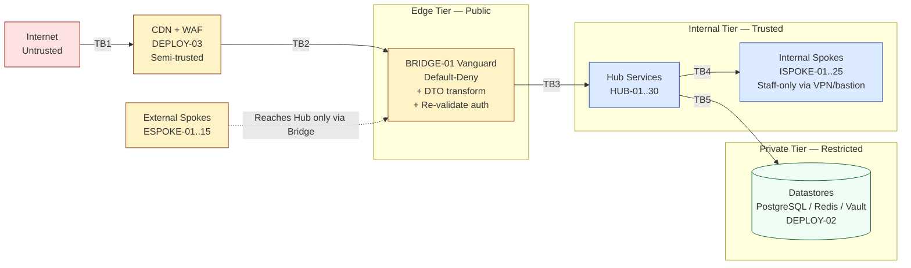
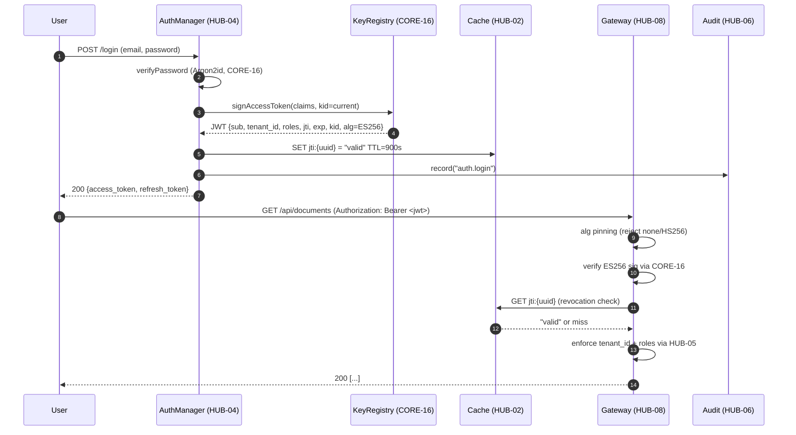

# 03 — STRIDE Threat Model for the DGLab Sovereign Stack

**Status:** Canonical
**Scope:** DGLab Sovereign Stack as defined in `01_MASTER_INDEX.md` §2.
**Method:** STRIDE-per-trust-boundary (Microsoft methodology) with deep-dives on tenant isolation, JWT lifecycle, BRIDGE-01 bypass, secret management, rate-limit evasion, audit-log tampering, and OWASP ASVS L2 coverage.
**Conventions:** Every threat carries an explicit mitigation tied to a blueprint ID (`CORE-XX`, `HUB-XX`, `BRIDGE-01`, `DEPLOY-XX`). The corrected canonical IDs from `01_MASTER_INDEX.md` §2–§3 are used throughout — in particular, payload verification is `CORE-16`, not the stale `CORE-09` reference called out in Finding 3.

---

## §1. Trust Boundaries

The DGLab Sovereign Stack is a five-tier system: Core → Hub → Bridge → (External + Internal) Spokes. Traffic enters from the public Internet, is terminated at a CDN, is funneled through `BRIDGE-01` (the "Vanguard"), and only then reaches Hub services and Internal Spokes. Datastores live on a private network behind the Hub.

Five trust boundaries govern the system. Each boundary is a place where **privilege, identity, or network reachability changes** — and therefore a place where an explicit enforcement control must exist.

| ID | Boundary | Trust delta | Enforcement owner |
|---|---|---|---|
| TB1 | Internet → CDN | Untrusted → semi-trusted | CDN provider (DEPLOY-03) + WAF |
| TB2 | CDN → BRIDGE-01 Vanguard | Semi-trusted → edge-verified | BRIDGE-01 + HUB-08 |
| TB3 | BRIDGE-01 → Hub services | Edge-verified → internal-trusted | HUB-04 AuthMiddleware + HUB-05 Gate |
| TB4 | Hub → Internal Spokes | Internal-trusted → staff-only | VPN/bastion + ISPOKE-01 RBAC |
| TB5 | Hub → Datastores | Internal-trusted → private | Network policy + DB user grants (DEPLOY-02) |

### Trust Boundary Overview Diagram

Each boundary is examined through the full STRIDE lens in §2.

---

## §2. STRIDE per Trust Boundary

For each trust boundary we enumerate all six STRIDE classes — Spoofing, Tampering, Repudiation, Information disclosure, Denial of service, Elevation of privilege — with a concrete threat, asset, mitigation, and owning blueprint.

### TB1 — Internet → CDN (public, untrusted)

| Threat class | Specific threat | Asset at risk | Mitigation | Owning blueprint |
|---|---|---|---|---|
| Spoofing | Attacker sends spoofed TLS SNI / fake `Host` to bypass origin checks. | Origin server, tenant routing | Origin pull protected by mTLS + signed URL tokens; CDN verifies `Host` against allowlist. | DEPLOY-03, BRIDGE-01 |
| Tampering | MITM modifies client-to-CDN traffic. | User requests, response bodies | TLS 1.3 end-to-end; HSTS preload; pinned cert at CDN termination. | DEPLOY-03 |
| Repudiation | User later denies a transaction. | Order/payment state | Every state-changing request writes an audit record with `ip_address`, `user_agent`, signed `signature`. | HUB-06 |
| Information disclosure | Error responses leak stack traces or hostnames. | Internal topology, secrets | Custom error pages at edge; `display_errors=Off`; PII stripped from audit `changes`. | HUB-06, CORE-08 |
| Denial of service | L3/L4 volumetric flood or L7 slowloris. | Service availability | CDN absorbs L3/L4; WAF rate-limits L7 by `client_ip:{ip}`; static assets cached at edge. | DEPLOY-03, HUB-07 |
| Elevation of privilege | Anonymous user reaches admin URL by guessing. | Admin surface | Default-deny in `HUB-08`; admin endpoints require `super_admin` (HUB-05) and are not advertised by HUB-15. | HUB-08, HUB-05, HUB-15 |

### TB2 — CDN → BRIDGE-01 Vanguard (edge, semi-trusted)

| Threat class | Specific threat | Asset at risk | Mitigation | Owning blueprint |
|---|---|---|---|---|
| Spoofing | Attacker forges CDN-to-origin traffic by replaying a captured request. | Origin API | BRIDGE-01 requires `X-CDN-Sig` HMAC-signed by CDN over `method + path + body_hash + timestamp`; verified by CORE-16. | BRIDGE-01, CORE-16 |
| Tampering | Attacker alters the body between CDN and Bridge. | Request integrity | Same HMAC covers `body_hash`; mismatch → 403 within 5ms (BRIDGE-01 CI). | BRIDGE-01 |
| Repudiation | CDN-side logs insufficient to attribute a request. | Forensic trail | BRIDGE-01 re-emits every crossing event to HUB-06 with `tier_crossing=true` (BRIDGE-01 §3 Audit Mandate). | HUB-06, BRIDGE-01 |
| Information disclosure | Bridge leaks existence of internal endpoints via timing or error codes. | Internal endpoint inventory | Unlisted contracts return uniform `403` within 5ms (BRIDGE-01 CI); no `404`-vs-`403` oracle. | BRIDGE-01 |
| Denial of service | Attacker floods Bridge with contract-registration attempts. | Bridge availability | Contract registry is built at boot from code, not API-mutable; per-IP rate limit via HUB-07. | BRIDGE-01, HUB-07 |
| Elevation of privilege | External Spoke tries to use an internal-staff auth context. | Staff privileges | BRIDGE-01 §2 "Authentication Re-validation": internal staff sessions have zero authority in the External tier; `AuthMiddleware` strips staff-role claims. | BRIDGE-01, HUB-04 |

### TB3 — BRIDGE-01 → Hub Services (internal, trusted-but-isolated)

| Threat class | Specific threat | Asset at risk | Mitigation | Owning blueprint |
|---|---|---|---|---|
| Spoofing | A compromised External Spoke impersonates the Bridge to a Hub service. | Hub service trust | Hub services accept requests only from Bridge's mTLS cert (DEPLOY-02 issues SPIFFE-style workload identities); HUB-04 validates the caller principal. | DEPLOY-02, HUB-04 |
| Tampering | Attacker tampers with the DTO after Bridge transforms it. | Domain model integrity | DTOs are immutable value objects (`readonly`); transformer returns a fresh instance, never the internal entity. | BRIDGE-01 |
| Repudiation | Hub service claims "the Bridge never called us." | API contract trail | Hub entrypoints emit `hub.received` via CORE-03, carrying the Bridge's request `jti`. | CORE-03, HUB-06 |
| Information disclosure | Hub service returns an internal entity (skips DTO transform). | Internal data shape | "Zero-Exposure Test" CI gate: no class in `SovereignStack\External` may `use` anything from `SovereignStack\Internal`. Static analysis enforces. | BRIDGE-01 |
| Denial of service | One External Spoke saturates a Hub service's connection pool. | Hub availability | Per-tenant concurrency limit in HUB-07; circuit breaker in HUB-08 returns 429 before pool exhaustion. | HUB-07, HUB-08 |
| Elevation of privilege | External user passes an arbitrary `tenant_id` in request body. | Tenant data | `tenant_id` is taken **only** from the verified JWT claim (HUB-04), never from body/query; HUB-19 rejects client-supplied `tenant_id`. | HUB-04, HUB-19 |

### TB4 — Hub → Internal Spokes (staff-only, VPN/bastion)

| Threat class | Specific threat | Asset at risk | Mitigation | Owning blueprint |
|---|---|---|---|---|
| Spoofing | Non-staff user reaches ISPOKE-01 admin panel by direct IP. | Admin surface | Network policy: ISPOKE containers listen on `127.0.0.1` + a sidecar that accepts only the bastion's mTLS identity (DEPLOY-02). | DEPLOY-02, ISPOKE-01 |
| Tampering | Staff user tampers with their own role via API. | Role integrity | `super_admin` cannot be assigned via API (ISPOKE-01 invariant, see §8); only a bootstrap SQL grant or break-glass Vault path can mint it. | ISPOKE-01, HUB-05 |
| Repudiation | Staff admin performs an action, later claims another admin did it. | Audit integrity | All ISPOKE actions re-authenticate via HUB-04 and write to HUB-06 with the user's `jti`; re-auth required for destructive actions. | HUB-04, HUB-06 |
| Information disclosure | Staff user reads another tenant's data via admin search. | Tenant data | All ISPOKE-01 list views are scoped by `tenant_id` from the staff JWT (HUB-04); cross-tenant queries require `super_admin` and are themselves audited. | HUB-04, HUB-05, HUB-06 |
| Denial of service | Staff member kicks off a long-running import that saturates the queue. | Worker pool | HUB-10 per-tenant priority caps; ISPOKE-16 import jobs are throttleable via HUB-01 feature flag. | HUB-10, HUB-01 |
| Elevation of privilege | Staff member grants themselves `super_admin` by editing the `roles` table via a CRUD endpoint. | Full system compromise | `super_admin` is reserved; ISPOKE-04 role-assignment refuses to write it; DB trigger blocks `INSERT INTO role_user WHERE role='super_admin'` outside the break-glass path. | ISPOKE-04, HUB-05 |

### TB5 — Hub → Datastores (private network)

| Threat class | Specific threat | Asset at risk | Mitigation | Owning blueprint |
|---|---|---|---|---|
| Spoofing | Rogue pod impersonates a Hub service to PostgreSQL. | Database contents | mTLS to datastore (DEPLOY-02 issues per-service DB client cert); `pg_hba.conf` rejects non-cert connections. | DEPLOY-02 |
| Tampering | Attacker with DB access modifies rows directly. | Row integrity | Row-level `tenant_id` constraint + app DB user has `INSERT, UPDATE, SELECT` only; DDL requires a separate `ddl_owner` user. | CORE-19, DEPLOY-02 |
| Repudiation | Data is changed but no audit row exists. | Audit chain | HUB-06 writes via a separate `audit_writer` DB user with `INSERT`-only privilege (see §8); app DB user cannot write to the audit table. | HUB-06, DEPLOY-02 |
| Information disclosure | Backups stolen from object storage. | Tenant data at rest | Volumes and S3 objects encrypted with AES-256-GCM via CORE-16 envelope keys; envelope keys stored in HUB-20 Vault. | CORE-16, HUB-20, DEPLOY-02 |
| Denial of service | Long-running analytical query saturates DB CPU. | DB availability | Per-tenant `statement_timeout` applied by CORE-19 connection decorator; HUB-19 rejects queries with no `LIMIT`. | CORE-19, HUB-19 |
| Elevation of privilege | App DB user runs `GRANT` or `CREATE EXTENSION`. | DB privileges | App DB user has no DDL/DCL grants; DDL is restricted to a CI-managed migration user via `pg_hba.conf`. | CORE-19, DEPLOY-02 |

---

## §3. Tenant Isolation Deep-Dive

The platform is multi-tenant. The canonical kill-chain for "Tenant A reads Tenant B's data" must fail at **every** layer, not just one. Below is the invariant, enforcement point, and a verifiable test case for each of the four layers.

### 3.1 Cache layer (HUB-02)

- **Invariant:** A cache key written under `tenant:{A}:` can never be read by a request whose authenticated `tenant_id` is `B`; a flush of `tenant:{A}:*` must not evict any `tenant:{B}:*` key.
- **Enforcement point:** `HubCacheInterface::tags(['tenant:{id}:'])` is called by `HUB-04` immediately after authentication; the resulting scoped cache instance is the only one injected into downstream services. The tenant-id prefix is **not** caller-supplied — it is appended by the Hub layer from the verified JWT claim, so a caller that asks for `get('users:42')` actually gets `get('tenant:{A}:users:42')` under the hood.
- **Test case:** Authenticate as Tenant A, write `cache.set('secret', 'A-value')`. Authenticate as Tenant B; assert `cache.get('secret')` returns `null`. Flush `tenant:{A}:*`; assert Tenant B's `secret` is still readable. The HUB-02 CI criterion ("Tag Isolation: Flushing tag A must not affect items associated only with tag B") is the gate.

### 3.2 Database layer (CORE-19)

- **Invariant:** A `SELECT` issued in Tenant A's context can never return a row whose `tenant_id` column equals `B`.
- **Enforcement point:** Every multi-tenant table has a non-null `tenant_id BIGINT` column with a composite index on `(tenant_id, id)`. CORE-19's `QueryBuilder` accepts a `TenantScope` decorator that transparently appends `WHERE tenant_id = ?` to every read and `SET tenant_id = ?` on every insert. The scope is bound to the request's authenticated tenant at the `HUB-04` middleware layer — application code cannot remove it without forking CORE-19.
- **Test case:** Seed two tenants, insert 10 rows each. As Tenant A, run `table('documents')->get()`; assert all rows have `tenant_id === A`. Attempt raw `statement('SELECT * FROM documents WHERE tenant_id = ?', [B])` through the app DBAL connection — must throw `TenantScopeViolation`.

### 3.3 JWT layer (HUB-04)

- **Invariant:** A token signed for Tenant A cannot be used to access Tenant B's data even if the attacker modifies the `tenant_id` claim.
- **Enforcement point:** `tenant_id` is a registered claim inside the JWT payload, bound to the ES256 signature (ADR-003). Verification recomputes the signature with the issuer's public key; tampering invalidates it. `AuthMiddleware` (HUB-04) reads `tenant_id` only from the verified claims, never from body/query/cookie. The claim is re-checked against the user record on every privileged action so a token whose user has been moved to a different tenant is rejected after the first cache TTL (≤ 60 s).
- **Test case:** Sign `{sub: 1, tenant_id: A}`. Tamper the payload to `{sub: 1, tenant_id: B}`. Submit to `/api/documents`; assert `401 invalid_token` with `error=signature_mismatch`. Separately, take a valid Tenant-A token and call `/api/documents?tenant_id=B`; assert `403 tenant_mismatch` (the query parameter is ignored).

### 3.4 Config layer (HUB-01)

- **Invariant:** A feature-flag override set for Tenant A must never affect Tenant B's evaluation, and the global default must never leak a tenant's private override value back to another tenant.
- **Enforcement point:** `GlobalConfigInterface::get($key, $default, $tenantId)` merges global defaults with a tenant-scoped override table (`tenant_config`); the `$tenantId` parameter is filled from the verified JWT, not from a request parameter. The merged result is cached with the `tenant:{id}:` prefix (§3.1). The HUB-01 CI criterion ("Tenant overrides must never 'leak' into the global configuration pool") is the gate.
- **Test case:** Set `feature.early_access = true` for Tenant A only. As Tenant B, assert `feature('early_access')` returns `false`. Unset Tenant A's override; both tenants see the global default. Re-set for Tenant A; Tenant B's evaluation is unchanged.

### Kill-chain summary

If all four invariants hold, the only way Tenant A reads Tenant B's data is to (a) forge the ES256 signature (infeasible — §4), (b) compromise a Hub service's private key (§6), or (c) exploit a CORE-19 vulnerability that bypasses the TenantScope decorator. Each is independently detected by HUB-06 audit (`tier_crossing` events for cross-tenant data returns) and HUB-15 health checks (anomalous read patterns trip ISPOKE-15 SOC).

---

## §4. JWT Threat Analysis

The identity layer (HUB-04, per ADR-003) issues ES256-signed JWTs. The token lifecycle is shown below, followed by an analysis of six attack classes.

### JWT Lifecycle Diagram

### 4.1 Token forgery

- **Attack:** Attacker constructs a JWT with arbitrary claims (`sub=admin, tenant_id=any`) and submits it.
- **Mitigation:** ES256 (ECDSA P-256 + SHA-256) signature verification in `CORE-16`. Without the issuer's private key — which never leaves the HUB-20 Vault envelope (see §6) — the attacker cannot produce a verifying signature. The library is pinned to `alg=ES256`; alternatives are rejected at parse time (§4.4).
- **Verification:** CI test submits a token whose signature is mutated by one byte; asserts `401 invalid_token`.

### 4.2 Replay

- **Attack:** Attacker captures a valid token (e.g., from a log file) and replays it within its TTL.
- **Mitigation:** Three controls. (1) Every token carries a `jti` (UUID v7) checked against a `jti:{uuid}` key in HUB-02 on every request — a miss means revoked. (2) `exp` is short (15 min for access tokens). (3) Refresh tokens rotate on every use; a reused refresh `jti` is added to a `revoked_jti` set and trips a replay alert in HUB-06.
- **Verification:** CI test logs out (revokes `jti`), reuses the token; asserts `401 token_revoked`.

### 4.3 Theft

- **Attack:** Token exfiltrated via XSS, log injection, or a compromised client.
- **Mitigation:** Defense in depth. (1) Short access-token TTL limits abuse to 15 min. (2) Refresh tokens are bound to a device fingerprint and rotate on every use. (3) `HttpOnly`, `Secure`, `SameSite=Strict` cookies when cookie storage is used. (4) ISPOKE-01's "Sign out everywhere" flushes every `jti:{uuid}` for that `sub`.
- **Verification:** CI test performs "sign out everywhere"; asserts every prior token returns `401`.

### 4.4 Downgrade

- **Attack:** Attacker submits a token with `alg: none` or `alg: HS256`, hoping the verifier falls back to a permissive algorithm.
- **Mitigation:** Algorithm pinning. The verifier is constructed with a hard-coded allowlist `['ES256']`. The `alg` header is read before signature verification; any value other than `ES256` is rejected with `401 alg_not_allowed`. There is no fallback. CORE-16's `KeyRegistry::verify()` throws `AlgorithmMismatchException` and never invokes the symmetric-key path.
- **Verification:** CI test submits tokens with `alg=none`, `alg=HS256`, `alg=RS256`; each is rejected with the same status code and a non-distinguishing error (no oracle).

### 4.5 Cross-tenant

- **Attack:** A legitimate Tenant A user modifies the `tenant_id` claim in their own token to read Tenant B's data.
- **Mitigation:** `tenant_id` is inside the signed payload (§3.3); tampering invalidates the signature. Additionally, the verifier cross-checks the claim against the user record in CORE-19; if the user's `tenant_id` differs from the token's claim, the token is rejected as `tenant_mismatch`. This catches admin moves between tenants — the old token is invalid immediately, not after `exp`.
- **Verification:** Two CI tests: (a) tampered claim → `401 invalid_token`; (b) moved user → `401 tenant_mismatch` after the DB change.

### 4.6 Key compromise

- **Attack:** The ES256 private key is leaked (stolen laptop, misconfigured backup, SSRF into Vault).
- **Mitigation:** Four layers. (1) The private key never leaves the CORE-16 envelope in plaintext — decrypted in-memory only at boot (DEPLOY-01), never written to disk. (2) Each key has a `kid`; rotation mints a new keypair, publishes the new `kid` to JWKS, keeps the old key valid until outstanding tokens expire. (3) HUB-06 audits every `KeyRegistry::sign()` and `::verify()` call — a spike in `sign()` from a non-AuthManager source is a P0 alert. (4) Emergency revocation: the compromised `kid` is added to a `revoked_kid` set in HUB-02; tokens with that `kid` are rejected with `401 key_revoked`.
- **Verification:** CI test adds the current `kid` to the revocation set; outstanding tokens with that `kid` return `401 key_revoked`; newly issued tokens (rotated `kid`) succeed.

---

## §5. BRIDGE-01 Bypass Scenarios

The Bridge is the single chokepoint between External Spokes and Internal services. An attacker who bypasses it can reach Internal Spokes directly. Below are five bypass attempts, each with prevention, detection, and response.

### 5.1 Direct IP access to a Hub service

- **Attack:** Attacker discovers the internal IP of `HUB-04` (DNS leak, container escape, misconfigured `HUB-15` heartbeat) and sends requests directly, skipping the Bridge.
- **Prevention:** DEPLOY-02 network policy restricts Hub containers to inbound traffic from the Bridge's sidecar only. `HUB-08` Gateway middleware rejects any request lacking the Bridge's mTLS client cert (header `X-Bridge-Cert-Verified`, validated against the cert fingerprint). Per Finding 3, the corrected payload-verification dependency is `CORE-16`, so Bridge mTLS reuses the same envelope library that signs JWTs.
- **Detection:** HUB-06 flags any request that reached a Hub service without a `tier_crossing=true` Bridge event in the prior 5 seconds as `bypass_attempt`.
- **Response:** P0 alert to ISPOKE-15 SOC; source IP added to a temporary Bridge denylist; HUB-15 marks the Hub service `degraded`.

### 5.2 DNS rebinding

- **Attack:** Attacker controls `evil.com`. A victim's browser resolves `evil.com` to the CDN IP, then the attacker flips DNS to an internal Hub IP, bypassing same-origin policy.
- **Prevention:** The Bridge validates `Host` against a strict allowlist of public hostnames; mismatches are dropped at TLS termination. Internal Hub services also reject public-looking `Host` values, breaking the rebinding chain. CORS is a fixed origin allowlist, never `*`.
- **Detection:** HUB-06 records every `Host` value; a novel hostname is a P2 alert.
- **Response:** Novel hostname added to denylist; recurrence across multiple source IPs escalates to P1.

### 5.3 SSRF from an External Spoke

- **Attack:** An External Spoke's image-fetch feature accepts a URL. Attacker submits `http://hub-04.internal:8080/admin/users`; the External Spoke fetches it from inside the cluster and exfiltrates the response.
- **Prevention:** (1) HTTP client denylist for internal CIDRs (RFC 1918, link-local, localhost); DNS resolver refuses internal service names. (2) External Spokes have no direct network path to Hub services (DEPLOY-02). (3) Bridge contract registry only allows the registered URL-fetch contract; arbitrary URLs are blocked.
- **Detection:** HUB-06 logs every outbound URL fetched by an External Spoke; internal-CIDR target is a P0 alert.
- **Response:** Connection is blocked at the network level; image-fetch feature auto-disabled via HUB-01 feature flag; incident opened in ISPOKE-25.

### 5.4 Compromised Hub service credential

- **Attack:** Attacker obtains a Hub service's mTLS client cert (from a backup leak) and impersonates that service to another Hub service.
- **Prevention:** mTLS certs are short-lived (1 hour) and rotated by DEPLOY-02's workload-identity broker (SPIFFE-style); a leaked cert expires within an hour. Each Hub service is bound to a specific role in HUB-05, so a forged cert cannot elevate beyond the impersonated service's role.
- **Detection:** HUB-06 logs every mTLS handshake with the caller's SPIFFE ID; a call from an unusual source IP for a known SPIFFE ID is a P1 alert.
- **Response:** Compromised SPIFFE ID revoked at the broker; affected Hub service restarted (forcing cert rotation); HUB-06 queried for all actions taken by the impersonated service in the prior 24 hours.

### 5.5 Network policy misconfiguration

- **Attack:** A DevOps change opens a Hub service's `NetworkPolicy` to `0.0.0.0/0`. Attacker scans and reaches the service directly.
- **Prevention:** DEPLOY-02 mandates policy-as-code (OPA/Kyverno) review that rejects any `from: 0.0.0.0/0` rule for the `hub` namespace; only the Bridge namespace may receive `0.0.0.0/0` inbound.
- **Detection:** The BRIDGE-01 "Zero-Exposure Test" CI criterion runs every 5 minutes from a probe outside the cluster, attempting to reach every Hub service's internal port. Any success is a P0 alert; the probe also runs as a PR check.
- **Response:** Misconfigured policy auto-reverted by the policy controller; change rolled back via DEPLOY-04 immutable-image promotion; post-mortem filed.

---

## §6. Secret Management Lifecycle

A secret (e.g., the ES256 JWT signing key) traverses six phases. Each phase has an owner, an enforcement control, and an audit signal.

| Phase | Owner | Mechanism | Audit signal |
|---|---|---|---|
| **Generation** | CORE-16 | Keypair generated with `openssl_pkey_new(['ec_key_curve' => 'prime256v1'])`. Private key is immediately encrypted into the CORE-16 binary envelope using an Argon2id-derived key-encryption key (KEK); the KEK input is a master password held in HUB-20 Vault. The envelope format is `{iv, ciphertext, tag, kdf_params}`. | HUB-06: `key.generated { kid, curve }` |
| **Storage** | DEPLOY-01 + HUB-20 | The encrypted envelope is persisted to one of three backends per deployment target: HashiCorp Vault (production), Kubernetes sealed-secrets (self-hosted), or AWS Secrets Manager (cloud-hosted). The envelope is **never** stored in plaintext on disk, in a container image, or in version control. | HUB-06: `key.stored { kid, backend }` |
| **Injection** | DEPLOY-01 | At container start, an init container fetches the envelope from the secret backend, decrypts it in-memory using the KEK from a separate injection path (Vault Agent sidecar or IAM role), and exposes the plaintext key only via an environment variable to the Hub service process. The env var is `SOVEREIGN_JWT_SIGNING_KEY` and is not logged by CORE-09 (redaction filter). | HUB-06: `key.injected { kid, target_service }` |
| **Rotation** | HUB-04 + CORE-16 | A new keypair is generated and assigned a new `kid`. The new `kid` is published to the JWKS endpoint; the old `kid` remains valid for verification (not signing) until all outstanding tokens carrying it have expired (typically 1× access-token TTL = 15 min). The KeyRegistry keeps a `{kid → status}` map: `signing`, `verifying`, or `revoked`. | HUB-06: `key.rotated { old_kid, new_kid }` |
| **Revocation** | HUB-02 + HUB-04 | Two mechanisms. (a) `kid`-level: the `kid` is added to a `revoked_kid` set in HUB-02; every verification checks the set and rejects with `401 key_revoked`. (b) `jti`-level: individual tokens are revoked by deleting their `jti:{uuid}` cache entry; subsequent verifications miss the cache and reject. | HUB-06: `key.revoked { kid, reason }` or `token.revoked { jti }` |
| **Audit** | HUB-06 | Every `KeyRegistry::sign()`, `::verify()`, `::rotate()`, `::revoke()` call emits a CORE-03 event consumed by HUB-06. The audit log is itself tamper-evident (see §8). | (self-referential: HUB-06 logs reads of HUB-06 via a separate meta-audit table) |

### End-to-end trace

1. Admin triggers rotation in ISPOKE-01 → HUB-04 calls `KeyRegistry::rotate()`.
2. CORE-16 generates new ES256 keypair, encrypts private half with Argon2id KEK → envelope.
3. DEPLOY-01 stores envelope in HUB-20 Vault under `secret/jwt/kid/{new_kid}`.
4. HUB-04 updates JWKS, marks `kid=old` as `verifying` only.
5. Hub services reload KeyRegistry via CORE-03 event (no restart).
6. After 15 minutes, `kid=old` is `revoked`; tokens with that `kid` return `401 key_revoked`.
7. HUB-06 records each transition in a tamper-evident hash chain.

---

## §7. Rate-Limit Evasion

BRIDGE-01 enforces per-tenant rate limits via HUB-07, which uses HUB-02 cache for token-bucket state. Four evasion techniques and mitigations:

| Evasion | How it works | Mitigation | Owning blueprint |
|---|---|---|---|
| **IP rotation** | Attacker rotates across a pool of source IPs (residential proxies, Tor) so the per-IP bucket never trips. | The rate-limit key is **composite**: `user_id:{id}:client_ip:{ip}:{endpoint}`. Authenticated requests are counted by `user_id`; unauthenticated requests fall back to `client_ip`. The `user_id` bucket is the binding constraint — an attacker who rotates IPs but keeps the same account still hits the limit. | HUB-07, HUB-04 |
| **Distributed botnet** | Thousands of distinct IPs and accounts, each making a small number of requests, distributed so no single bucket trips. | CDN-level (DEPLOY-03) rate limiting based on aggregate request rate per origin path, independent of identity. WAF applies a JS-challenge or CAPTCHA when the aggregate rate exceeds a baseline. The Bridge also enforces a global concurrency cap per External Spoke. | DEPLOY-03, BRIDGE-01 |
| **Slow requests** | Attacker opens many slow HTTP connections (slowloris) — request count is low but connection slots are exhausted. | Connection-level timeout (not request count): idle-read timeout of 10s, total request timeout of 30s, enforced at the Bridge's reverse proxy. HUB-07 tracks in-flight connection count per `client_ip` and rejects new connections above a threshold. | BRIDGE-01, HUB-07 |
| **Header manipulation** | Attacker spoofs `X-Forwarded-For` to rotate the apparent `client_ip`. | The Bridge trusts `X-Forwarded-For` only from the CDN's IP range (configured in CORE-10). For requests not from the CDN, the connecting socket's remote address is used. The CDN's own `X-Real-IP` header (set by the CDN, signed by the CDN-to-Bridge HMAC) is the source of truth. | BRIDGE-01, CORE-10, CORE-16 |

A fifth, subtle evasion — **authenticated-but-anonymous** (attacker creates many throwaway accounts to spread load) — is mitigated by HUB-04's signup rate limit (per-IP account creation cap) and HUB-05's default-deny role assignment, which prevents new accounts from accessing privileged endpoints until they are explicitly granted a role.

---

## §8. Audit Log Tampering

HUB-06 is the system of record for forensics. If it can be tampered with, no other control can be trusted. Four tampering vectors:

### 8.1 Direct DB modification

- **Vector:** Attacker with SQL access modifies or deletes `audit_log` rows to cover their tracks.
- **Mitigation:** `audit_log` is append-only — application DB user has `INSERT, SELECT` only. A separate `audit_writer` user (DEPLOY-02) has `INSERT` but no `UPDATE`/`DELETE`. DDL requires a third identity (`audit_owner`) used only by CI migrations. A DB trigger rejects any `UPDATE` or `DELETE` regardless of caller.
- **Test case:** `UPDATE audit_log SET action='x' WHERE id=1` via application user → `permission_denied`. Same via `audit_writer` → trigger fires `cannot_modify_audit_row`.

### 8.2 Privilege escalation

- **Vector:** Attacker gains `admin` and reads or modifies audit logs (which contain PII and clues about other tenants).
- **Mitigation:** Audit-log read access is `super_admin`-only (HUB-05 Gate). `super_admin` **cannot be assigned via API** (per ISPOKE-01/ISPOKE-04 invariant, see §2 TB4) — only via a break-glass Vault path that itself writes an HUB-06 entry. Even `super_admin` cannot modify audit rows (§8.1), only read them. To tamper with audit logs you must (a) break into Vault, (b) mint `super_admin`, (c) obtain DDL on the audit table — three independent compromises.
- **Test case:** As `admin`, `GET /api/audit-logs` → `403`. As `super_admin` (break-glass minted), same call → `200`. `DELETE /api/audit-logs/123` → `405 method_not_allowed`.

### 8.3 Log deletion

- **Vector:** Attacker with filesystem or object-storage access deletes audit logs or the DB table.
- **Mitigation:** HUB-06 writes to two destinations in parallel: (1) PostgreSQL `audit_log` (low-latency search) and (2) an S3 WORM bucket with Object Lock in `COMPLIANCE` mode (DEPLOY-02). Once written, an object cannot be deleted by any identity, including root, until retention expires (default 7 years). A daily HUB-10 job reconciles the two: a DB row lacking a WORM object is `integrity_warning`; a WORM object lacking a DB row is `integrity_critical`.
- **Test case:** Delete an audit object from the WORM bucket via the S3 root account → `AccessDenied` (Object Lock). Delete a DB row via `audit_owner` in a test env, run reconciliation → `integrity_critical`.

### 8.4 Time manipulation

- **Vector:** Attacker submits a forged `timestamp` in an audit-event payload to make an action appear to have happened at a different time.
- **Mitigation:** HUB-06 never accepts a client-supplied timestamp. The `timestamp` is set server-side via PostgreSQL `NOW()` at insert time. `AuditManager::record()` takes `(action, resource_type, resource_id, metadata)` — no `timestamp` parameter. The chained-hash integrity scheme (HUB-06) means each row's `signature` covers the previous row's hash; a DB-level timestamp modification breaks the chain and is detected by the integrity verifier (HUB-06 CI: "Must provide a utility that verifies the integrity of the audit chain").
- **Test case:** Submit an audit event with `metadata.timestamp = '2020-01-01'`; stored row's `timestamp` is the server's current time. Modify a row's `timestamp` via `audit_owner` in a test env; integrity verifier reports `chain_broken` at that row.

---

## §9. OWASP ASVS L2 Mapping

The top 20 OWASP Application Security Verification Standard (ASVS) v4.0 L2 controls, mapped to the DGLab blueprints that implement them:

| # | ASVS L2 control | DGLab implementation | Blueprint(s) |
|---|---|---|---|
| 1 | V2.1 Password security | Argon2id hashing via CORE-16; breach-corpus check on signup; minimum entropy enforced by HUB-19 | CORE-16, HUB-04, HUB-19 |
| 2 | V2.7 Out-of-band verifier | Refresh-token rotation bound to device fingerprint; "sign out everywhere" via jti revocation | HUB-04 |
| 3 | V3.1 Session token generation | ES256 JWTs with `jti`, `exp`, `iat`, `kid`; CSPRNG for `jti` | HUB-04, CORE-16 |
| 4 | V3.3 Session termination | `jti:{uuid}` cache entry deleted on logout; TTL-based expiry; revocation list | HUB-02, HUB-04 |
| 5 | V4.1 Access control architecture | Default-deny in HUB-05 Gate; policy-per-resource in PolicyRegistry; deny-by-default for undefined permissions (CI criterion) | HUB-05 |
| 6 | V4.2 Operation-level access control | `DocumentPolicy`-style ownership checks; `tenant_id` scope on every query (CORE-19 TenantScope) | HUB-05, CORE-19 |
| 7 | V5.1 Input validation | Centralized validation engine; recursive rule-sets; explicit `sanitize_html` filter | HUB-19 |
| 8 | V5.2 Sanitization | XSS-blocking sanitization (CI criterion: standard payloads blocked); output encoding in SuperPHP templates (CORE-12) | HUB-19, CORE-12 |
| 9 | V5.3 Output encoding | Context-aware encoding (HTML, attribute, JS, URL) in CORE-12 compiler | CORE-12 |
| 10 | V6.1 Data classification | HUB-06 PII stripping (passwords, SSNs filtered from `changes` payload); CORE-16 envelope for classified data | HUB-06, CORE-16 |
| 11 | V6.2 Secret management | Six-phase lifecycle (see §6); Vault/sealed-secrets/Secrets Manager; env-var injection | DEPLOY-01, HUB-20, CORE-16 |
| 12 | V7.1 Logging | Structured JSON logging via CORE-09 (PSR-3); never logs secrets (redaction filter) | CORE-09 |
| 13 | V7.2 Log content protection | PII stripping; audit `signature` covers sensitive fields; access to logs is `super_admin`-only | HUB-06 |
| 14 | V8.1 Data protection in transit | TLS 1.3 end-to-end; mTLS for service-to-service (DEPLOY-02) | DEPLOY-02, DEPLOY-03 |
| 15 | V8.2 Data protection at rest | AES-256-GCM envelope (CORE-16) for all persisted secrets; encrypted EBS volumes; S3 SSE | CORE-16, DEPLOY-02 |
| 16 | V9.1 Communications security | HSTS preload; certificate pinning at CDN; HMAC-signed CDN-to-origin header | DEPLOY-03, BRIDGE-01 |
| 17 | V9.2 Client-side | CSP headers via HUB-08; `SameSite=Strict` cookies; no `eval()` in CORE-12 output | HUB-08, CORE-12 |
| 18 | V10.1 Business logic | Per-tenant rate limits (HUB-07); concurrency caps; circuit breakers in HUB-08 | HUB-07, HUB-08 |
| 19 | V12.1 File upload | MIME sniffing; size limits; stored on separate disk (HUB-11); served with `Content-Disposition: attachment` for untrusted types | HUB-11, HUB-19 |
| 20 | V13.1 API & web service | DTO transformation at Bridge (BRIDGE-01); contract allowlist; OpenAPI schema validation in HUB-19 | BRIDGE-01, HUB-19 |

ASVS L2 controls not covered by a blueprint (e.g., V11 business-logic for cryptographic keys of unknown provenance, V14 configuration hardening of the build pipeline) are recorded as open threats in §10.

---

## §10. Open Threats (Unaddressed)

These five threats are **not** fully mitigated by the current blueprint set. Each has a recommendation for closure.

### 10.1 Supply-chain compromise of a Composer dependency

- **Threat:** A typosquatted PHP package is pulled in by `composer install` and exfiltrates secrets at boot.
- **Current state:** No blueprint addresses dependency provenance. `CORE-01` (Loom) orchestrates version bumps but does not verify package signatures.
- **Recommendation:** Extend `DEPLOY-04` to mandate Composer 2 `audit` in CI, pin transitive hashes in `composer.lock`, mirror dependencies to an internal Packagist proxy (DEPLOY-02), and run a daily `composer audit` against the production lockfile.

### 10.2 Insider threat from a Hub-tier developer

- **Threat:** A developer with merge access introduces a backdoor (e.g., a hidden `?super=1` parameter that grants `super_admin`). It passes CI because the test suite doesn't exercise that path.
- **Current state:** `HUB-05` enforces deny-by-default for undefined permissions, but a developer could register a new ability gated on the hidden parameter. No blueprint mandates two-person review.
- **Recommendation:** Add a governance rule requiring CODEOWNERS review for any change to `HUB-04`, `HUB-05`, `HUB-06`, `BRIDGE-01`, or `CORE-16`. Add a PHPStan rule flagging new `Gate::define()` calls in a diff. Add a fuzzing harness in CORE-20 Forge that probes for hidden query-parameter privilege grants.

### 10.3 Quantum-computing threat to long-lived signing keys

- **Threat:** ECDSA (ES256) is broken by Shor's algorithm on a sufficiently large quantum computer. The CORE-16 blueprint's "post-quantum-ready" claim is not substantiated by a migration plan.
- **Current state:** CORE-16 asserts "post-quantum-ready security baseline" without specifying a migration path. No ADR covers this.
- **Recommendation:** File ADR-012 to clarify that ES256 is **not** post-quantum; specify the migration path (Ed25519 or a hybrid ECDSA+dilithium scheme) as a future major SemVer change to CORE-16. Update CORE-16's description to remove the misleading claim until the migration lands.

### 10.4 Lack of formal verification for the TenantScope decorator

- **Threat:** CORE-19's `TenantScope` is enforced by a runtime decorator. A future refactor that bypasses the decorator (e.g., a developer calls `$connection->raw(...)` directly) silently disables tenant isolation.
- **Current state:** CORE-19's CI tests tenant isolation through the QueryBuilder API but does not verify that **no code path** bypasses the scope.
- **Recommendation:** Add a static-analysis rule in CORE-20 Forge that rejects `->raw()`, `->statement()`, or `->unprepared()` calls in `SovereignStack\Hub` and `SovereignStack\Internal` / `SovereignStack\External` unless the call site carries a `#[BypassTenantScope]` attribute, gated to a small audited allowlist. Hard-fail in CI.

### 10.5 No formal incident-response runbook for cross-tenant data leak

- **Threat:** If §3's kill-chain fails and Tenant A does read Tenant B's data, there is no blueprint that defines the customer-notification SLA, the forensic-preservation steps, or the regulatory-disclosure trigger.
- **Current state:** ISPOKE-25 (Incident Response Console) is a placeholder; ISPOKE-22 (Compliance Auto-Reporting) handles scheduled compliance reports, not live incident response.
- **Recommendation:** Promote ISPOKE-25 from placeholder to full blueprint, with a runbook section covering: (a) immediate containment (revoke all `jti` for affected tenants via HUB-02), (b) forensic preservation (snapshot audit DB and WORM bucket), (c) customer notification within 72h per GDPR Art. 34, (d) post-mortem template. The runbook should be tested via a quarterly tabletop exercise and the results fed back into HUB-06 audit-rule updates.

---

## §11. Change Log

| Date | Change | Author |
|---|---|---|
| 2026-08-04 | Initial STRIDE threat model; 5 trust boundaries, 30 STRIDE rows, 6 JWT attack analyses, 5 Bridge bypass scenarios, 6-phase secret lifecycle, 4 rate-limit evasions, 4 audit-tampering vectors, 20 ASVS L2 mappings, 5 open threats. | Task 1-b |
