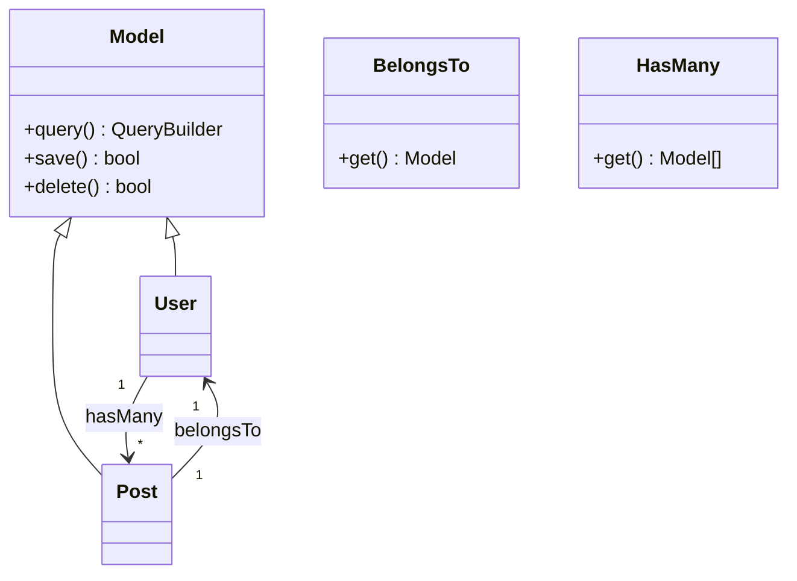

# Database Core Specification

## 1. Overview
The DGLab Database Core is a custom-built, lightweight Object-Relational Mapping (ORM) and Migration system following the **Active Record** pattern.

## 2. Architecture & Components

### Connection Management (`DGLab\Database\Connection`)
Manages PDO lifecycle with retry logic and transaction nesting.

### Relationship Diagram


### Low-Level Internal Logic: SQLite Retry Strategy
```php
private function executeWithRetry(callable $callback)
{
    $attempts = 3;
    $delay = 100; // ms
    for ($i = 0; $i < $attempts; $i++) {
        try {
            return $callback();
        } catch (PDOException $e) {
            if ($this->isGoneAway($e) || $e->getCode() === '40001') {
                usleep($delay * 1000);
                $delay *= 2; // Exponential backoff
                continue;
            }
            throw $e;
        }
    }
}
```

### Usage Sample: Active Record
```php
$user = new User();
$user->name = 'Jules';
$user->email = 'jules@example.com';
$user->save(); // Automatic INSERT

$user->name = 'Jules Updated';
$user->save(); // Automatic UPDATE based on primary key existence
```

## 3. Infrastructure Considerations
- **SQLite Compatibility**: The migration engine includes special regex logic to handle SQLite's unique constraint syntax during table creation.
- **Connection Pooling**: Currently utilizes a single persistent PDO instance per request. Future updates will support read/write splitting for MySQL.

## 4. History & Evolution
- **Phase 1 (Basic PDO)**: Initial wrapper for PDO with basic SELECT/INSERT.
- **Phase 2 (Active Record)**: Implementation of the `Model` class and dynamic attribute handling.
- **Phase 3 (Query Builder)**: Introduction of the fluent `QueryBuilder`.
- **Phase 4 (Relationships)**: Added `HasMany` and `BelongsTo` support.
- **Phase 5 (Migration System)**: Developed the `Migration` and `MigrationBlueprint` classes.

## 5. Future Roadmap
- **Phase 6: EAV Schema Support**: Implement a Hybrid-EAV engine within the Model core for CMS Studio.
  - **Effort**: XL
- **Phase 7: Advanced Relationships**: Add `HasOne`, `ManyToMany` (Pivot tables), and `Polymorphic` support.
  - **Effort**: M
- **Phase 8: Query Caching**: Native integration with `DGLab\Core\Cache`.
  - **Effort**: S
- **Phase 9: Migration Snapshots**: Generate a "schema.php" snapshot to speed up database initialization.
  - **Effort**: L

## 6. Validation
### Success Criteria
- **Security**: 100% prepared statement coverage; zero raw interpolation.
- **Performance**: Hydrating 100 models must take < 5ms.

### Verification Steps
- [ ] Run `vendor/bin/phpunit --group database` to verify ORM and Migration logic.
- [ ] Perform a `migrate:refresh` to ensure full up/down cycle integrity.
