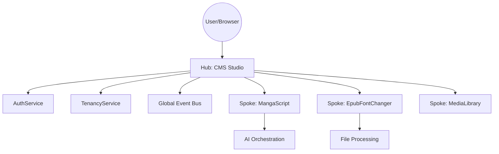

# Hub-and-Spoke Architecture Specification

## 1. Overview
The DGLab ecosystem follows a **Hub-and-Spoke** model. This architecture consolidates all web-accessible front-end concerns into a single central service (The Hub) while delegating domain-specific logic to modular, independent services (The Spokes).

## 2. The Hub (CMS Studio)
The Hub is the only service exposed directly to the public Internet via the main application domain.

### Responsibilities:
- **Routing & Navigation**: Intercepting and handling all browser-initiated navigation.
- **UI/UX**: Providing the global layout, navigation, and the SuperPHP component library.
- **Security**: Centrally enforcing Auth and Tenancy across all requests.
- **State Persistence**: Managing global state and reactive fragments for a seamless SPA experience.
- **Service Orchestration**: Dispatching requests to the appropriate Spokes and rendering the results.

## 3. The Spokes (`app/Spokes/`)
Spokes are domain-specific engines that implement the core business logic of the ecosystem.

### Key Principles:
- **Internal Isolation**: Spokes do not define their own web routes or views.
- **Data-Oriented**: Spokes return data (or pre-compiled fragments) to the Hub for final presentation.
- **Service Inheritance**: All spokes extend a `BaseSpokeService` that provides access to the core framework (Database, Auth, Tenancy).



## 4. Interaction Patterns

### A. Direct Delegation
The Hub calls a Spoke service method directly from a controller action.
```php
public function convert(Request $request)
{
    $spoke = Application::getInstance()->get(MangaScriptSpoke::class);
    $result = $spoke->process($request->all());
    return View::render('mangascript.result', ['data' => $result]);
}
```

### B. Event-Driven Communication
The Hub emits a "Command" event, and one or more Spokes react asynchronously.
```php
// In Hub Controller
event(new \DGLab\Events\Spoke\ProcessRequested($payload));

// In Spoke Subscriber
public function onProcessRequested(Event $event)
{
    $this->executeTask($event->payload);
    event(new \DGLab\Events\Spoke\ProcessCompleted($result));
}
```

### C. Reactive Fragment Update
Spokes can provide specialized SuperPHP components that the Hub "mounts" into the main layout.
```html
<s:hub_layout>
    <s:spoke_mangascript_workspace :session="$session" />
</s:hub_layout>
```

## 5. UI Synchronization
Spokes do not have their own CSS/JS files. All styling must utilize:
1. **Global Bootstrap/Tailwind classes** provided by the Hub.
2. **Standard Hub Components** (`<s:ui_button>`, `<s:ui_modal>`, etc.).
3. **SuperPHP directives** (`@global`, `@persist`) to stay in sync with the Hub's reactive state.

## 6. History & Evolution
- **Phase 1 (Legacy Separation)**: Services like MangaScript and EpubFontChanger existed as independent, monolithic scripts.
- **Phase 2 (Hub Foundations)**: CMS Studio was established as the central administration and navigation portal.
- **Phase 3 (Spoke Refactoring)**: Legacy services were refactored into classes within `app/Spokes/` and stripped of their independent routing logic.
- **Phase 4 (UI Unification)**: All spoke-related views were converted to SuperPHP fragments and migrated to the Hub's component library.

## 7. Future Roadmap
- **Phase 5: Automated Spoke Discovery (M)**: A system that automatically registers Spokes and their capabilities into the Hub's navigation menu.
- **Phase 6: Spoke Sandboxing (XL)**: Running each Spoke in its own isolated process or container to prevent resource exhaustion from impacting the Hub.
- **Phase 7: Centralized Spoke Logs (S)**: A unified dashboard in CMS Studio to monitor the health and performance of all active Spokes.

## 8. Validation
### Success Criteria
- **Independence**: A Spoke can be added or removed without modifying the core Hub routing table.
- **UX**: Navigating from Hub to Spoke UI must feel instantaneous (SPA fragments).
- **Security**: Every Spoke-initiated action must be traceable back to a Hub-authenticated user and tenant.

### Verification Steps
- [ ] Verify that disabling a Spoke service does not crash the Hub's main layout.
- [ ] Confirm that `X-Tenant-Id` is correctly propagated from Hub to Spoke.
- [ ] Run a cross-spoke event test to ensure the global `EventDispatcher` correctly routes messages between Spokes.
