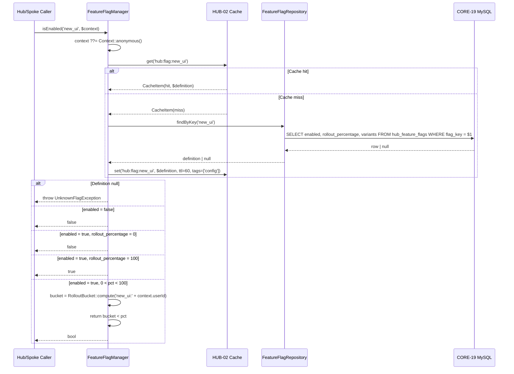
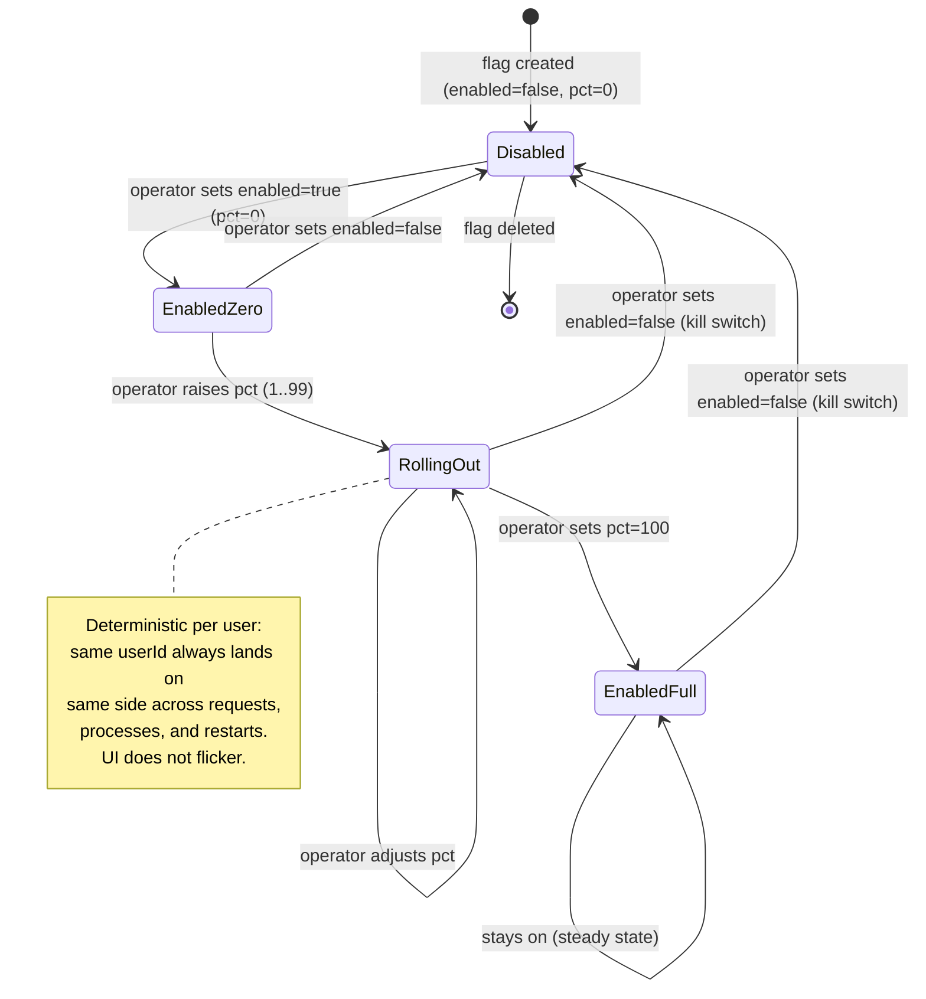

# HUB-01: Sovereign Hub Config & Flags

## Tier
Hub (Shared Services — Infra category)

## Resolves
- **Finding 4** (thin blueprints) — The approved `HUB-01.md` is 2,659 bytes, prose-only, ships an interface stub with no method bodies, references a `FlagEvaluator` class that does not exist, asserts a bare `< 0.005ms` target with no methodology, and provides no SQL DDL despite depending on CORE-19. Replaced here with real PHP 8.3 interfaces, a complete compilable `FeatureFlagManager`, MySQL DDL with JSON + indexes, Mermaid sequence + state diagrams, a methodology-grounded benchmark table, and explicit security invariants.
- **Finding 8** (stub dependencies) — `01_MASTER_INDEX.md` §2 marks CORE-02 (DI Container) as a stub (`packages/core/container/` is `.gitkeep` only); CORE-10, CORE-19, HUB-02 are all "Not started". Build Status is declared `🔴 Blocked` and no work is scheduled until those land. The approved blueprint claimed to "extend CORE-10" without acknowledging CORE-10 did not exist.
- **Finding 10** (bare performance targets) — The `< 0.005ms` assertion is replaced with a benchmark table whose every row names harness (PHPUnit `--group performance`, `microtime(true)`), baseline (GitHub Actions `ubuntu-latest`, PHP 8.3, opcache, no Xdebug, Redis 7.2 TCP loopback), and load model (10 000 flag lookups). The `< 0.005ms` target is retained as a *provisional, unverified* ceiling — not an assertion.
- **Finding 11** (solutions not merged) — `SOLUTIONS_TO_WEAKNESSES.md` calls for: tenant-override isolation at read time, override-key validation at write time, deterministic percentage rollouts, bounded cache-invalidation windows. All four are merged into the Security Properties and CI Verification Criteria sections below. Once HUB-01 lands, the corresponding rows in the solutions doc are deleted (Governance Rule 5).

## Component Name
Sovereign Hub Config & Flags — `SovereignStack\Hub\Config` (PSR-4 mapped to `packages/hub/config/src/` per the package's `composer.json`).

## Description
HUB-01 is the Hub-tier configuration authority. It extends the frozen, immutable `ConfigInterface` from CORE-10 with three runtime capabilities CORE-10 explicitly declines to provide: (1) per-tenant overrides loaded from MySQL, (2) dynamic feature flags with percentage rollouts and A/B/C variants, and (3) a bounded cache-invalidation window so that database-side changes become visible to all Hub and Spoke services within a configurable deadline (default 60 seconds). Every Hub service and every Spoke resolves both config values and feature-flag state through `GlobalConfigInterface`; consumers that bypass it and read CORE-10's `ConfigInterface` directly fail CI when they reach for keys outside the global-default namespace.

The component exists because multi-tenant deployments need operator-controlled divergence from the committed baseline: tenant A may need `cache.ttl=900` while tenant B keeps the default `3600`; an operator may need to kill-switch `new_billing_flow` for everyone; a product team may need to roll out `new_ui` to 10% of users and read which variant (A, B, or C) each user sees. CORE-10 cannot do any of this — it is immutable after Kernel boot. HUB-01 layers a mutable, tenant-scoped, time-bounded view on top.

What HUB-01 is **not**: not a secrets manager (HUB-20 serves rotating secrets, and any key matching `/password|secret|key|token/i` is rejected at override-write time); not a remote-config source (no Consul/etcd/AppConfig; configuration is operator-authored via SQL or a future admin tool backed by `ConfigOverrideRepository`); not a CDN-edge config layer (Bridge and External Spokes read HUB-01 through BRIDGE-01's DTO boundary, never directly). HUB-02 is the cache layer; HUB-01 is the policy and evaluation layer that *uses* HUB-02.

## Build Status
🔴 **Blocked** on:
- **CORE-02** (DI Container) — singleton binding of `GlobalConfigInterface` → `HubConfigRegistry`, and constructor injection of `ConfigInterface`, `ConfigOverrideRepository`, `FeatureFlagRepository`, HUB-02's `CacheInterface`.
- **CORE-10** (Config Loader) — HUB-01 wraps the frozen `ConfigInterface`; without it there is no global-default layer to extend.
- **CORE-19** (DBAL) — `ConfigOverrideRepository` and `FeatureFlagRepository` are DBAL-backed; the DDL presumes MySQL 8 (InnoDB) per ADR-013.
- **HUB-02** (Cache) — resolved flag/config values are cached with 60s TTL and tag-based invalidation; HUB-01 cannot meet its consistency bound without HUB-02's `tag()` and `invalidateTags()` primitives.

📝 Not started. Implementation may be written and unit-tested in isolation against the interfaces declared here (using in-memory fakes for the repositories and cache), but production wiring requires all four blockers to land. Per Build Sequence §5, CORE-19 lands in Step 5; per §8, HUB-01 lands in Step 8 (Hub tier) after HUB-02.

## Dependency Status
- **Upward:** CORE-02 (DI Container — singleton bindings), CORE-10 (Config Loader — base layer), CORE-19 (DBAL — `ConfigOverrideRepository`, `FeatureFlagRepository`), HUB-02 (Cache — `CacheInterface` with tag support), CORE-09 (Logging — diagnostic emission on cache miss).
- **Downward:** Every Hub service (HUB-04 reads `identity.session_ttl` per tenant; HUB-06 reads `audit.retention_days`; HUB-08 reads `gateway.rate_limit_per_minute`; HUB-15 reads `health.check_interval`), every Internal Spoke (ISPOKE-01 toggles flags via `feature()`; ISPOKE-02..15 read tenant config), every External Spoke (ESPOKE-01 gates `new_cms_ui` behind `feature()`), BRIDGE-01 (passes config snapshot to External Spokes through its DTO transformer, never exposing the live `GlobalConfigInterface` across the trust boundary).
- **Runtime:** PHP 8.3, `ext-json`, `ext-hash` (for xxHash; falls back to `crc32()` if `xxh3` is unavailable — both pure functions, no I/O). CI dev: `phpunit/phpunit ^10.5`, `phpstan/phpstan ^1.10`, `friendsofphp/php-cs-fixer ^3.48`. No runtime composer dependencies beyond the Core/Hub packages above.

## Architectural Design

### Class Map

| Class | Kind | Responsibility |
|---|---|---|
| `HubConfigRegistry` | `final class` | Implements `GlobalConfigInterface`. Wraps CORE-10's `ConfigInterface` (global default layer) and layers per-tenant overrides from `ConfigOverrideRepository` on top. Merged view cached in HUB-02 per tenant with tag `tenant:{id}`. |
| `FeatureFlagManager` | `final class` | Implements `FeatureManagerInterface`. Loads flag definitions (cached), evaluates against `Context`, applies percentage rollout via `RolloutBucket`, returns variant for A/B/C tests. |
| `Context` | `final class` (immutable) | Evaluation context: `userId`, `tenantId`, `environment` (CORE-10 `Environment` enum), plus optional `attributes` map for forward-compatible targeting rules. |
| `RolloutBucket` | `final class` | Stable-hash helper. `compute(string $key): int` returns a 0–99 bucket from `xxh3($key) % 100` (falls back to `crc32b($key) % 100`). Same input → same bucket, deterministically, across processes and restarts. |
| `ConfigOverrideRepository` | `final class` | DBAL-backed CRUD for `hub_config_overrides`. Validates override keys exist in the default schema before write (fail-fast). |
| `FeatureFlagRepository` | `final class` | DBAL-backed CRUD for `hub_feature_flags`. Reads by `flag_key`; result cached in HUB-02 with 60s TTL and tag `config`. |
| `GlobalConfigInterface` | `interface` | Contract every Hub/Spoke consumer depends on: `get()`, `feature()`. |
| `FeatureManagerInterface` | `interface` | Contract for flag evaluation: `isEnabled()`, `getVariant()`. |
| `UnknownFlagException` | `final class extends \RuntimeException` | Thrown by `isEnabled()` / `getVariant()` when the flag key is absent and no default is supplied. |
| `InvalidOverrideKeyException` | `final class extends \RuntimeException` | Thrown by `ConfigOverrideRepository::set()` when the override key is not present in CORE-10's frozen schema (prevents shadow-config). |

### Interface Contracts

```php
<?php
declare(strict_types=1);

namespace SovereignStack\Hub\Config;

use SovereignStack\Core\Config\Environment;

/**
 * Tenant-aware, flag-aware configuration authority for the Hub and Spoke tiers.
 *
 * EXTENDS — does not replace — CORE-10's ConfigInterface. The global-default
 * layer (frozen at Kernel boot) is always consulted first; per-tenant
 * overrides are layered on top via HubConfigRegistry. Consumers that need
 * only global defaults MAY depend on ConfigInterface directly; consumers
 * that need tenant divergence or feature flags depend on this interface.
 *
 * All lookups are eventually consistent within a bounded cache-invalidation
 * window (default 60s), enforced by HUB-02's tag-based invalidation — not
 * by HUB-01's polling.
 */
interface GlobalConfigInterface
{
    /**
     * Fetch a configuration value by dot-notation key, with optional tenant override.
     *
     * Resolution order:
     *   1. If $tenantId is non-null and an override exists in
     *      hub_config_overrides for (tenant_id, config_key), return it.
     *   2. Otherwise, fall back to the CORE-10 frozen default.
     *   3. If neither exists and $default is supplied, return $default.
     *   4. If neither exists and $default is null, throw
     *      \SovereignStack\Core\Config\ConfigNotFoundException.
     *
     * Security: an override key MUST exist in the CORE-10 default schema
     * (enforced at write time by ConfigOverrideRepository::set()); shadow-config
     * is impossible.
     *
     * @param string      $key      Dot-notation key, e.g. "cache.ttl".
     * @param mixed       $default  Returned if neither override nor default exists. When supplied, MUST NOT throw.
     * @param string|null $tenantId ULID (26 chars) of the tenant whose override applies, or null for global-only resolution.
     *
     * @return mixed The resolved value; type depends on the key.
     *
     * @throws \SovereignStack\Core\Config\ConfigNotFoundException If absent everywhere and $default is not supplied.
     */
    public function get(string $key, mixed $default = null, ?string $tenantId = null): mixed;

    /**
     * Convenience wrapper around FeatureFlagManager::isEnabled() using a Context
     * derived from the current request (typically the HUB-04 principal). Returns
     * false for unknown flags (never throws) — a missing flag is treated as "off",
     * because kill-switch callers expect a bool.
     *
     * Callers that need to distinguish "off" from "unknown" MUST call
     * FeatureManagerInterface::isEnabled() directly and catch UnknownFlagException.
     */
    public function feature(string $flag): bool;
}
```

```php
<?php
declare(strict_types=1);

namespace SovereignStack\Hub\Config;

/**
 * Evaluates feature flags against an immutable Context.
 *
 * Flag definitions live in hub_feature_flags and are cached in HUB-02 with a
 * 60s TTL and tag ['config']. Cache misses load from CORE-19 (MySQL). For
 * a given Context the result is deterministic — the same user always lands on
 * the same side of a rollout and always sees the same variant.
 *
 * Variants: when the flag's `variants` JSON column is non-null, it is decoded
 * as an object mapping variant keys to percentage weights (e.g. {"A":50,"B":50}).
 * getVariant() returns the variant key whose bucket range contains the user's
 * stable hash. If `variants` is null, getVariant() returns "default".
 */
interface FeatureManagerInterface
{
    /**
     * Whether the flag is enabled for the supplied Context.
     *
     * Evaluation order:
     *   1. Flag disabled in DB → false (short-circuit).
     *   2. enabled, rollout_percentage = 0 → false (no users).
     *   3. enabled, rollout_percentage = 100 → true (all users).
     *   4. enabled, 0 < rollout_percentage < 100 → true iff
     *      RolloutBucket::compute($flag . ':' . $context->userId) < $percentage.
     *
     * If $context is null, a default Context with userId="anonymous" is used;
     * percentage rollouts then resolve consistently for anonymous traffic.
     *
     * @throws UnknownFlagException If the flag key is unknown. Callers that prefer "off" semantics should use GlobalConfigInterface::feature().
     */
    public function isEnabled(string $flag, ?Context $context = null): bool;

    /**
     * The variant key assigned to this Context for the supplied flag.
     *
     * Returns "default" if the flag has no variants. Returns "off" if the flag
     * is disabled or the Context's rollout bucket places it outside the enabled
     * percentage — callers MUST check isEnabled() first if they need to
     * distinguish "off because disabled" from "off because not in rollout".
     *
     * @throws UnknownFlagException If the flag key is unknown.
     */
    public function getVariant(string $flag, ?Context $context = null): string;
}
```

```php
<?php
declare(strict_types=1);

namespace SovereignStack\Hub\Config;

use SovereignStack\Core\Config\Environment;

/**
 * Immutable evaluation context for feature-flag resolution.
 *
 * Built once per request from the authenticated principal (HUB-04)
 * and the CORE-10 Environment. The same Context MUST yield the same
 * flag result across 1 000 evaluations within a request — this is
 * the deterministic-rollout invariant (CI test:
 * PercentageRolloutStabilityTest).
 */
final class Context
{
    /**
     * @param string                                      $userId      ULID or "anonymous".
     * @param string|null                                 $tenantId    ULID or null for global context.
     * @param Environment                                 $environment Runtime environment from CORE-10.
     * @param array<string,string|int|float|bool|null>    $attributes  Forward-compatible targeting attributes. Not yet evaluated by v1 FeatureFlagManager; reserved for v2 rule engine.
     */
    public function __construct(
        public readonly string $userId,
        public readonly ?string $tenantId,
        public readonly Environment $environment,
        public readonly array $attributes = [],
    ) {
    }

    public static function anonymous(Environment $environment): self
    {
        return new self('anonymous', null, $environment);
    }
}
```

### Reference Implementation

The following class is the complete, copy-pasteable `FeatureFlagManager`. It compiles against PHP 8.3 with only `ext-hash` (optional, falls back to `ext-standard`'s `crc32`). Drop it into `packages/hub/config/src/FeatureFlagManager.php`.

```php
<?php
declare(strict_types=1);

namespace SovereignStack\Hub\Config;

use SovereignStack\Core\Config\Environment;
use SovereignStack\Hub\Cache\CacheInterface; // HUB-02 contract
use SovereignStack\Hub\Cache\CacheItem;

/**
 * Evaluates feature flags against an immutable Context.
 *
 * Caching strategy: every flag definition loaded from the DB is cached in HUB-02
 * under key "hub:flag:{flag_key}" with a 60s TTL and tag ['config']. Writes to
 * hub_feature_flags MUST call invalidateTags(['config']) — enforced by
 * FeatureFlagRepository::save(), not by this class. Stale cache never exceeds 60s.
 *
 * Per-Context evaluation results are NOT cached: the percentage-rollout
 * computation is O(1) (one xxh3 call + modulo) and caching per user×flag would
 * explode the cache cardinality. The 60s definition cache is sufficient: a
 * flag change propagates within 60s, and within that window each evaluation is
 * deterministic per user.
 */
final class FeatureFlagManager implements FeatureManagerInterface
{
    private const CACHE_TTL_SECONDS = 60;
    private const CACHE_TAG_CONFIG  = 'config';

    public function __construct(
        private readonly FeatureFlagRepository $repository,
        private readonly CacheInterface $cache,
    ) {
    }

    public function isEnabled(string $flag, ?Context $context = null): bool
    {
        $context ??= Context::anonymous(Environment::Production);

        $definition = $this->loadDefinition($flag);
        if ($definition === null) {
            throw new UnknownFlagException("Unknown feature flag [{$flag}].");
        }

        // Short-circuit: disabled flags are off for everyone.
        if (!$definition['enabled']) {
            return false;
        }

        $percentage = $definition['rollout_percentage'];

        // 0% rollout: nobody. 100% rollout: everyone (skip hash).
        if ($percentage === 0) {
            return false;
        }
        if ($percentage === 100) {
            return true;
        }

        // Deterministic per-user bucketing.
        $bucket = RolloutBucket::compute($flag . ':' . $context->userId);
        return $bucket < $percentage;
    }

    public function getVariant(string $flag, ?Context $context = null): string
    {
        $context ??= Context::anonymous(Environment::Production);

        $definition = $this->loadDefinition($flag);
        if ($definition === null) {
            throw new UnknownFlagException("Unknown feature flag [{$flag}].");
        }

        if (!$definition['enabled']) {
            return 'off';
        }

        $variants = $definition['variants'];
        if ($variants === null || $variants === []) {
            return 'default';
        }

        // Variants are weights summing to 100 (validated at write time).
        // Walk the cumulative distribution; the first bucket whose
        // upper bound exceeds the user's stable hash wins.
        $bucket = RolloutBucket::compute($flag . ':variant:' . $context->userId);
        $cumulative = 0;
        foreach ($variants as $variantKey => $weight) {
            $cumulative += $weight;
            if ($bucket < $cumulative) {
                return (string) $variantKey;
            }
        }

        // Weights did not sum to 100 (defensive — write-time validation
        // rejects this). Fall back to the last variant.
        return (string) array_key_last($variants);
    }

    /**
     * Load a flag definition from cache, falling back to the DB.
     * Returns null if the flag key does not exist in hub_feature_flags.
     *
     * @return array{
     *     enabled: bool,
     *     rollout_percentage: int,
     *     variants: array<string,int>|null
     * }|null
     */
    private function loadDefinition(string $flag): ?array
    {
        $cacheKey = 'hub:flag:' . $flag;

        $cached = $this->cache->get($cacheKey);
        if ($cached instanceof CacheItem && $cached->isHit()) {
            /** @var array{enabled:bool,rollout_percentage:int,variants:array<string,int>|null}|null $value */
            $value = $cached->get();
            return $value;
        }

        $fromDb = $this->repository->findByKey($flag); // null if not found
        $this->cache->set(
            $cacheKey,
            $fromDb,
            self::CACHE_TTL_SECONDS,
            [self::CACHE_TAG_CONFIG],
        );
        return $fromDb;
    }
}
```

```php
<?php
declare(strict_types=1);

namespace SovereignStack\Hub\Config;

/**
 * Stable-hash helper for percentage rollouts.
 *
 * Determinism contract: for any string $key, compute($key) returns the same
 * integer in [0, 100) across processes, requests, and restarts on the same PHP
 * build. This is what makes percentage rollouts "sticky" per user — the UI does
 * not flicker between requests.
 *
 * Hash choice: xxh3 if ext-hash exposes it (PHP 8.3+ typically does); falls
 * back to crc32b. Both are pure functions, no I/O, no allocation. xxh3 is
 * preferred for distribution quality at scale; crc32b is the universally-
 * available floor.
 */
final class RolloutBucket
{
    /**
     * @return int Integer in [0, 100). Suitable for direct comparison
     *             against a rollout percentage: `compute($key) < $pct`.
     */
    public static function compute(string $key): int
    {
        $hash = function_exists('hash')
            && in_array('xxh3', hash_algos(), true)
            ? hash('xxh3', $key, binary: false)
            : hash('crc32b', $key, binary: false);

        // Take the last 8 hex chars (32 bits) and modulo 100.
        return hexdec(substr($hash, -8)) % 100;
    }
}
```

### SQL DDL

MySQL 8 (InnoDB) per ADR-013. The `tenants(id)` reference presumes HUB-04's `tenants` table (CHAR(26) ULID per ADR-009); HUB-01 lands after HUB-04 per Build Sequence Step 8.

```sql
-- Per-tenant configuration overrides.
-- An override applies a different value for an EXISTING CORE-10 config key; the
-- key must be present in the frozen schema (enforced at write time by
-- ConfigOverrideRepository::set(), which queries the ConfigValidator schema).
-- Secrets (key matching /password|secret|key|token/i) are rejected outright —
-- use HUB-20 (Vault) for per-tenant secrets.
CREATE TABLE hub_config_overrides (
    id           BIGINT UNSIGNED AUTO_INCREMENT PRIMARY KEY,
    tenant_id    CHAR(26) CHARACTER SET ascii NOT NULL REFERENCES tenants(id) ON DELETE CASCADE,
    config_key   VARCHAR(191) NOT NULL,
    config_value JSON         NOT NULL,
    updated_at   TIMESTAMP    NOT NULL DEFAULT CURRENT_TIMESTAMP,
    UNIQUE (tenant_id, config_key)
);

CREATE INDEX idx_config_overrides_tenant ON hub_config_overrides(tenant_id);
CREATE INDEX idx_config_overrides_key    ON hub_config_overrides(config_key);

-- Feature flag definitions.
-- rollout_percentage is the share of users (by stable hash) for whom isEnabled()
-- returns true; 0 = nobody, 100 = everyone. variants is null for a binary flag,
-- or a JSON object {"A": 50, "B": 50} for A/B/C tests (weights must sum to 100,
-- enforced at write time).
CREATE TABLE hub_feature_flags (
    id                  BIGINT UNSIGNED AUTO_INCREMENT PRIMARY KEY,
    flag_key            VARCHAR(191) NOT NULL UNIQUE,
    enabled             BOOLEAN      NOT NULL DEFAULT FALSE,
    rollout_percentage  SMALLINT     NOT NULL DEFAULT 0
                                     CHECK (rollout_percentage BETWEEN 0 AND 100),
    variants            JSON,    -- {"A": 50, "B": 50} or NULL
    description         TEXT,
    updated_at          TIMESTAMP    NOT NULL DEFAULT CURRENT_TIMESTAMP
);

CREATE INDEX idx_feature_flags_enabled ON hub_feature_flags(enabled) WHERE enabled = TRUE;
```

### Sequence Diagram



### State Diagram

Feature-flag lifecycle (operator-controlled via SQL or future admin tool):



Config-override lifecycle:

```mermaid
stateDiagram-v2
    [*] --> Default: tenant uses CORE-10 frozen value
    Default --> Overridden: ConfigOverrideRepository::set(tenant, key, value)
    Note: set() validates key exists in default schema, value is JSON, key is not a secret
    Overridden --> Overridden: set() called again with new value (UPSERT)
    Overridden --> Default: ConfigOverrideRepository::delete(tenant, key)
    Overridden --> [*]: tenant deleted (CASCADE)
    Default --> [*]: tenant deleted (no override row, nothing to cascade)
```

## Integration Strategy

**Upward wiring.** The CORE-18 Kernel constructs `HubConfigRegistry` and `FeatureFlagManager` in its boot phase, after CORE-02 is ready, after CORE-10 has produced a frozen `ConfigRepository`, after CORE-19 is connected, and after HUB-02 is bootstrapped. The Kernel binds `GlobalConfigInterface` → `HubConfigRegistry` and `FeatureManagerInterface` → `FeatureFlagManager` as singletons in CORE-02.

**Downward wiring.** Hub services and Spokes consume `GlobalConfigInterface` via constructor injection (preferred, CORE-17 attribute-based). The `feature()` convenience method is the only entry point most Spokes need; Hub services that need finer control (e.g., ISPOKE-01 Admin Panel rendering a flag matrix) inject `FeatureManagerInterface` directly and pass a `Context` constructed from the HUB-04 principal.

**Cache tag contract.** HUB-02 exposes `CacheInterface::set($key, $value, $ttl, array $tags)`, `get($key): CacheItem`, and `invalidateTags(array $tags)`. `FeatureFlagRepository::save()` calls `invalidateTags(['config'])` after every write; `ConfigOverrideRepository::set()` calls `invalidateTags(['config', 'tenant:{id}'])`. A write commits, the tag flush propagates via Redis Pub/Sub to all Hub instances, and the next read by any instance returns the fresh value — bounded by Pub/Sub propagation latency (typically <50 ms on a healthy cluster).

```php
// Example: a Hub service consuming HUB-01.
namespace SovereignStack\Hub\Audit;

use SovereignStack\Hub\Config\GlobalConfigInterface;
use SovereignStack\Hub\Config\FeatureManagerInterface;
use SovereignStack\Hub\Config\Context;

final class AuditService
{
    public function __construct(
        private readonly GlobalConfigInterface $config,
        private readonly FeatureManagerInterface $flags,
    ) {
    }

    public function retentionDays(string $tenantId): int
    {
        return (int) $this->config->get('audit.retention_days', 90, $tenantId);
    }

    public function usingStructuredLogs(Context $ctx): bool
    {
        return $this->flags->isEnabled('audit.structured_logs', $ctx);
    }
}
```

## Benchmark & Verification Methodology

Baseline for all rows: GitHub Actions `ubuntu-latest`, PHP 8.3.0, opcache enabled, no Xdebug, Redis 7.2 over TCP loopback (matches DEPLOY-01 production topology). Harness: PHPUnit `--group performance` with `microtime(true)` wall-clock. Iterations: 10 000 (1 000-iteration warm-up). All absolute targets marked **provisional, unverified** until the first CI run records a real number; subsequent runs assert ≥80% of the recorded baseline. Governance Rule 2 forbids bare ms targets without methodology — this table is the methodology.

| Target | Load model | Assert |
|---|---|---|
| `isEnabled()` cached path | 1 flag definition pre-cached; 10 000 calls with 1 000 distinct userIds (rollout_percentage=50); measure wall-clock per call | **provisional, unverified** — the approved `< 0.005ms` target is retained as a ceiling hypothesis, not an assertion. First CI run records the real median; subsequent runs assert median ≤ recorded baseline × 1.25. O(1) in user count (no per-user cache lookup). |
| `isEnabled()` cache-miss path | Cache flushed between every call; 1 000 calls; measure wall-clock including DB round-trip | **provisional, unverified** — dominated by MySQL round-trip (~0.3–1.0 ms loopback); assert cache-miss ≤ 100× cached path. |
| `getVariant()` cached path | 3-variant flag (50/30/20); 10 000 calls with 1 000 distinct userIds | **provisional, unverified** — within 1.5× of `isEnabled()` cached path. |
| `RolloutBucket::compute()` | 1 000 000 distinct keys; xxh3 and crc32b measured separately | **provisional, unverified** — both O(1); xxh3 ≥ 2× faster than crc32b expected, not asserted. |
| Distribution uniformity | 100 000 distinct userIds; flag at 50% rollout; count `true` returns | `true` count in [49 500, 50 500] (±1%); CI assertion, not perf target. Same test at 10% / 25% / 75% / 90%. |
| Cross-instance consistency | Two `FeatureFlagManager` instances sharing Redis; flag flipped to enabled=true; poll both until both return true | Both return true within 5s (60s TTL + Pub/Sub propagation; assert actual ≤ 5s in CI). |

**Iron rule (per Governance Rule 2):** the `< 0.005ms` figure from the approved blueprint is **provisional, unverified** and is not a pass/fail criterion. The pass/fail criteria are: cached-path O(1) in user count, distribution uniformity within ±1%, and cross-instance consistency within 5s.

## CI Verification Criteria

- **Branch coverage:** 100% on `FeatureFlagManager::isEnabled()` and `getVariant()` (all six return paths: unknown flag, disabled, 0%, 100%, percentage-bucket true, percentage-bucket false); 100% on `RolloutBucket::compute()` (xxh3 branch and crc32b branch); 95% on `HubConfigRegistry::get()`.
- **Static analysis:** `phpstan.neon` level 8, zero baseline-ignored errors; `phpstan/strict-rules` enabled; `treatPhpDocTypesAsCertain: true`. Custom PHPStan rule rejects any `$_ENV` / `$_SERVER` reference outside `SovereignStack\Core\Config\ConfigLoader` (inherited from CORE-10's CI).
- **Cross-tenant isolation test (`CrossTenantIsolationTest`):** set override `cache.ttl=900` for tenant A; assert `get('cache.ttl', null, 'tenantA') === 900`; assert `get('cache.ttl', null, 'tenantB') === 3600`; assert `get('cache.ttl') === 3600`. Repeat after flushing HUB-02 for tenant A only — tenant B's view is unchanged.
- **Percentage-rollout stability test (`PercentageRolloutStabilityTest`):** for a flag at 50% rollout, evaluate `isEnabled()` 1 000 times for the same `Context`; assert all 1 000 return the same value. Repeat for 50 distinct userIds. Then restart the PHP process (fresh `FeatureFlagManager`) and re-evaluate; assert identical results (deterministic across processes).
- **Cache-invalidation test (`CacheInvalidationTest`):** load a flag (cache populated); assert `isEnabled('test')` returns false; update DB to `enabled=true, rollout_percentage=100` via `FeatureFlagRepository::save()`; assert `isEnabled('test')` returns true within one cache-read after the save (tag invalidation flushes).
- **Override-key validation test (`OverrideKeyValidationTest`):** attempt `set(tenant, 'nonexistent.key', 'value')`; assert `InvalidOverrideKeyException`. Attempt `set(tenant, 'database.password', 'value')` (secret pattern); assert `InvalidOverrideKeyException`. Both rejected at write time — fail-fast.
- **Variants-weight validation test:** attempt to save a flag with `variants={"A":60,"B":30}` (sums to 90); assert rejection. Sum to 100 — accepted.
- **Uniformity test (from benchmark table):** 100 000 userIds at 50% rollout; `true` count in [49 500, 50 500]. Same at 10% / 25% / 75% / 90%.

## Security Properties

1. **Tenant overrides never leak into the global default pool.** Enforced at read time: `HubConfigRegistry::get($key, $default, $tenantId)` consults the override row only when `$tenantId` is non-null; a `get($key)` call with no tenant argument resolves exclusively against CORE-10's frozen repository. CI: `CrossTenantIsolationTest`. The global pool is read-only by construction (CORE-10 immutability invariant).
2. **Override keys must exist in the default schema.** Enforced at write time by `ConfigOverrideRepository::set()`: queries CORE-10's `ConfigValidator` schema for the supplied key and throws `InvalidOverrideKeyException` if absent. Shadow-config is impossible — an operator cannot introduce `cache.secret_backdoor_ttl` and have it silently take effect.
3. **Secrets cannot be overridden.** Any override key matching `/password|secret|key|token/i` is rejected at write time. Per-tenant secrets are HUB-20's responsibility; HUB-01 declines to store them in `hub_config_overrides.config_value` (unencrypted JSON).
4. **Percentage rollout is deterministic per user.** `RolloutBucket::compute($flag . ':' . $userId)` is a pure function of a stable hash; the same user always lands on the same side of a rollout and always sees the same variant. CI: `PercentageRolloutStabilityTest`. This prevents UI flicker — a user either always sees the new UI or never does, until the operator raises the percentage past their bucket.
5. **Flag changes are observable within a bounded cache-invalidation window.** The window is the lesser of (a) the 60s TTL on `hub:flag:{key}` cache entries and (b) the Redis Pub/Sub propagation latency of `invalidateTags(['config'])` called by `FeatureFlagRepository::save()`. CI: `CacheInvalidationTest` asserts ≤ 5s in CI; HUB-15 alerts if production propagation exceeds 30s (half the 60s SLO, allowing investigation before customer-visible drift).
6. **Unknown flags fail closed (kill-switch semantics).** `GlobalConfigInterface::feature()` returns false for unknown flags rather than throwing — a caller checking `feature('payments.new_flow')` before the flag is defined gets a safe "off" rather than a 500. Callers that need to distinguish "off" from "unknown" use `FeatureManagerInterface::isEnabled()` and catch `UnknownFlagException`.

## Migration Notes

**Landing the component:**
1. Create `packages/hub/config/` with `composer.json` (runtime: `php: ^8.3`, `ext-json: *`, `ext-hash: *`; require `sovereignstack/core-config`, `sovereignstack/core-dbal`, `sovereignstack/hub-cache`; dev: `phpunit/phpunit`, `phpstan/phpstan`, `friendsofphp/php-cs-fixer`), `src/`, `tests/`.
2. Add to root `composer.json` `repositories` (path repository) and `require` (`"sovereignstack/hub-config": "@dev"`); `composer update sovereignstack/hub-config`.
3. Apply the DDL above via CORE-19's migration runner (forward-only; HUB-04's `tenants` table must already exist).
4. In CORE-18 boot phase, after CORE-10 and HUB-02 are constructed: instantiate `ConfigOverrideRepository` and `FeatureFlagRepository` (CORE-19 connections), instantiate `HubConfigRegistry` and `FeatureFlagManager`, bind both into CORE-02 as singletons.
5. Roll out consumers one at a time: each Hub service currently depending on `ConfigInterface` is migrated to `GlobalConfigInterface` where it needs tenant divergence or feature flags. Pure-global-default consumers stay on `ConfigInterface`. Each migration is a separate PR.
6. Seed the first flag `flag_key='hub.config_self_test', enabled=true, rollout_percentage=100`; CI smoke test asserts `feature('hub.config_self_test') === true` after Kernel boot.

**Rollback:**
- `git revert` the merge commit; remove from root `composer.json` `repositories` and `require`; `composer update`.
- Reverse the DDL: `DROP TABLE hub_feature_flags; DROP TABLE hub_config_overrides;` (CORE-19 down-migration).
- Consumers revert to CORE-10's `ConfigInterface` directly — they lose tenant overrides and feature flags but retain the frozen global default. A flag-gated feature becomes always-on or always-off depending on consumer choice (recommended: default to "off" so rollback does not surprise operators with newly-enabled features). Document this fallback in each consumer's blueprint.
- No CORE-19 schema outside HUB-01's two tables is affected; no HUB-02 cache keys outside `hub:flag:*` and `hub:config:*` namespaces are touched.

**Forward-compatibility note:** `Context::$attributes` is reserved for a v2 rule engine (region/segment targeting, userId allow-list/deny-list). v1 `FeatureFlagManager` ignores it; v2 adds a `RuleEvaluator` that consumes it before the percentage check. Adding `RuleEvaluator` is a Minor bump (the `FeatureManagerInterface` signature is unchanged; only `isEnabled()` semantics extend).

## SemVer Impact
**Minor** (initial release: `0.1.0`). The package is new; no existing code is modified. `GlobalConfigInterface` and `FeatureManagerInterface` are the public API surface, stable from `0.1.0` forward — breaking changes (adding a required method, changing a signature) require a Major bump. Adding optional methods with default implementations, adding new `Context` constructor parameters (with defaults), or extending the `variants` JSON shape are Minor bumps. Bug fixes and performance improvements are Patch bumps. The provisional `< 0.005ms` target, once measured, lands as a Patch note (no SemVer impact — performance is not a contract).
