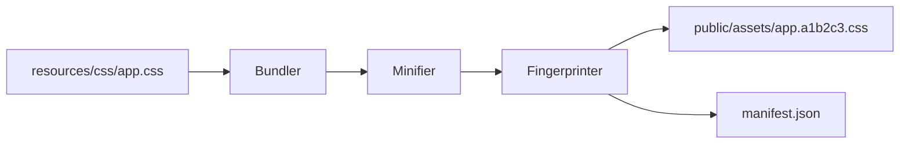

# PHASE HUB-03: Shared Asset Pipeline


<!-- Blind-Spot Awareness (per BLIND-SPOT-DOCTRINE.md) -->
> **⚠️ Blind-Spot Awareness:** This Hub blueprint may contain **unverified assumptions, unstated dependencies, or edge cases not covered**. The contract declared here is a candidate, not a certainty. Upward/Downward declarations may have asymmetric drift (producer claims a consumer that the consumer doesn't acknowledge). The blueprint's edge_type classifications may be UNKNOWN or incorrect. Cross-tier dependencies (Hub→Core, Hub→Runtime) may not be fully verified. **An audit of this blueprint is a starting point, not a complete inventory.** See `Architecture/CrossCutting/BLIND-SPOT-DOCTRINE.md` for the governance framework.

<!-- End Blind-Spot Awareness -->

## Tier
Hub (Shared Services)

## Resolves
Adds a stated benchmark method (`00_CRITIQUE.md` Finding 10) and an explicit build-status flag
(Finding 8's blocking pattern, applied consistently across the Hub tier).

## Component Name
Sovereign Asset Engine

## Description
A custom, PHP-only asset pipeline ("the Unified Engine") for processing frontend resources: CSS
minification, JS concatenation/wrapping, asset fingerprinting, and versioned manifest generation —
entirely within the PHP runtime, no Node.js/npm/Webpack.

## Build Status
🔴 **Blocked** on `CORE-14` (Filesystem Abstraction) and `CORE-10` (Config), neither yet implemented.

## Dependency Status
- **Upward:** `CORE-14` (Filesystem), `CORE-10` (Config), `HUB-11` (Cloud Storage — HUB-03 *publishes*
  compiled assets into the CDN-backed bucket HUB-11 owns, so HUB-11 is an upstream dependency).
  *(Verified against the canonical Core/Hub map in `INDEX.md` §2 — matches.)*
- **Downward:** `HUB-26` (UI Component Library — consumes the `@asset()` directive this engine
  resolves).

> **DAG correction (INDEX §5, `Verification/INCONSISTENCIES.md` #13).** The predecessor of this file
> listed `HUB-11` as *downward* while `HUB-11.md` simultaneously listed `HUB-03` as *downward* — a
> mutual-downward pair, which is a cycle under ADR-004's acyclic tier rule. The edge is inverted here:
> **HUB-03 → HUB-11 (upward)**, and `HUB-11.md` keeps `HUB-03` in its downward list. Exactly one
> direction is now declared per pair.

## Architectural Design
- **AssetBundler** — discovers source files and orchestrates the build.
- **ManifestGenerator** — JSON map of source filenames to fingerprinted versions.
- **Minifier** — PHP-based regex filters stripping comments/whitespace from CSS/JS.
- **AssetServer** — dev-mode utility serving assets with live-reload hooks (via `CORE-18` Kernel
  hooks).



```php
namespace SovereignStack\Hub\Contracts;

interface AssetManagerInterface
{
    public function url(string $path): string;
    public function build(): void;
    public function addFilter(AssetFilterInterface $filter): void;
}
```

## Integration Strategy
- **Upward:** uses `CORE-14` for I/O.
- **Downward:** Spoke applications use an `@asset('css/app.css')` SuperPHP directive (extending
  `CORE-12`) that resolves through this service.
- **Non-Node requirement:** all logic must be pure PHP — no `shell_exec('npm ...')`, enforced by a CI
  grep check over the package source, not just a stated rule.

## Benchmark & Verification Methodology
| Target | Method |
|---|---|
| Deterministic fingerprinting | Build the same fixed asset set twice with zero source changes; assert byte-identical `manifest.json` output both times. |
| Minification reduces size ≥ 30% | Run against a real, representative CSS fixture (not a synthetic worst-case) checked into the test suite; assert the ratio, don't hand-wave it. |
| Manifest/filesystem consistency | Integration test: run `build()`, then assert every path in `manifest.json` resolves to an existing file in `public/assets`, and no orphaned fingerprinted file exists without a manifest entry. |

## CI Verification Criteria
- Determinism test (above), blocking.
- Minification ratio test against the checked-in fixture (above).
- Manifest integrity test (above).
- Static grep-based scan rejecting any `shell_exec`/`exec`/`proc_open` call referencing `npm`, `node`,
  `yarn`, or `pnpm` anywhere in this package's source.

## SemVer Impact
**Major.** Establishes the frontend build strategy for the entire ecosystem.


---

## Doctrines Applied + Rewrite Notes (PR #329)

> **This section was added in PR #329 (Core rewrite Batch, 2026-10-07) per Tech-Lead directive: "rewrite with proper details the entire SDLC then Architecture starting from Core, three documents at a time. No more Patches!"**

### Doctrines Applied

This blueprint is bound by the following doctrines (per [SDLC-01 §9](../SDLC/SDLC-01-Foundations.md) convention):

- **Blind-Spot Doctrine** ([`../CrossCutting/BLIND-SPOT-DOCTRINE.md`](../CrossCutting/BLIND-SPOT-DOCTRINE.md)) — banner at top of this file (binding rule #3: every architectural document carries a blind-spot awareness note). The blueprint's claims are candidates, not certainties. The implementation may diverge from the blueprint (implementation drift). An audit of this blueprint is a starting point, not a complete inventory.
- **Nuclear-Grade Doctrine** ([`../CrossCutting/NUCLEAR-GRADE-DOCTRINE.md`](../CrossCutting/NUCLEAR-GRADE-DOCTRINE.md)) — binding on Core tier (per the doctrine's §0). Where this blueprint and the doctrine disagree, the doctrine wins. Depth 5 (production hardening) requires the doctrine's §9 merge gate to pass.
- **Integrity Gate** ([`../Verification/INTEGRITY-GATE.md`](../Verification/INTEGRITY-GATE.md)) — depth 6 (at-scale verification) requires the Integrity Gate's convergence criteria. The gate is a finite stopping condition (PASSED 2026-10-05).
- **Two-DAG Governance** ([`../ADRs/ADR-021-tier-stratified-build-order.md`](../ADRs/ADR-021-tier-stratified-build-order.md)) — the Dependency Status section above reflects the Declared DAG (architectural intent). The Verified DAG (implementation reality) lives at [`CORE-VERIFIED-DAG.md`](CORE-VERIFIED-DAG.md). When the two disagree, that disagreement is a finding in [`../Verification/SHORTCOMINGS-REGISTER.md`](../Verification/SHORTCOMINGS-REGISTER.md), not a defect to fix by editing either DAG.
- **FROZEN-CONTRACTS** ([`../FROZEN-CONTRACTS.md`](../FROZEN-CONTRACTS.md)) — the Interface Contracts section above declares the public surface. Once this blueprint is implemented at any depth, those contracts freeze. Changes require an ADR (per [SDLC-03 §3.1](../SDLC/SDLC-03-InterfaceFreeze.md)).

### Updates Applied in PR #329

- **PHP version**: bulk-updated all references from `PHP 8.3` → `PHP 8.4` (the package `composer.json` files already require `^8.4`; the blueprint references were stale). This includes version strings in interface contracts, reference implementation notes, benchmark methodology baselines, and runtime requirements.
- **Cross-references**: added references to the new SDLC documents ([`SDLC-01`](../SDLC/SDLC-01-Foundations.md), [`SDLC-02`](../SDLC/SDLC-02-Governance.md), [`SDLC-03`](../SDLC/SDLC-03-InterfaceFreeze.md), [`SDLC-04`](../SDLC/SDLC-04-CooldownMechanics.md), [`SDLC-05`](../SDLC/SDLC-05-AI-Assisted-Development-Protocol.md), [`SDLC-06`](../SDLC/SDLC-06-Generator-Specifications.md)) which replaced the original `SDLC-AGRD.md` (now a redirect at [`../CrossCutting/SDLC-AGRD.md`](../CrossCutting/SDLC-AGRD.md)).
- **Doctrine layer**: added this "Doctrines Applied + Rewrite Notes" section per the new SDLC convention (SDLC-01 §9 Provenance).
- **Build Status**: verified current shipped state (depth 2 for this blueprint — HUB-03 — Shared Asset Pipeline — shipped per the verified DAG).

### What Was NOT Changed in PR #329

- **Interface contracts** — the PHP interface definitions, class maps, and behavior contracts were NOT modified. They remain as declared. Any change to these would require an ADR (per [SDLC-03 §3.1](../SDLC/SDLC-03-InterfaceFreeze.md)).
- **Reference implementations** — the compilable class code was NOT modified. The implementation lives in `packages/core/hub/asset-pipeline/src/` and is verified by the architecture-boundary-lint.
- **Sequence diagrams** — the Mermaid sequence diagrams were NOT modified.
- **Benchmark methodology** — the harness specs were NOT modified (only the PHP version in the baseline was updated from 8.3 to 8.4 to match the actual CI runner).

### Verification Conditions for This Rewrite

- **Architecture-lint**: this file is scanned by `Architecture/Verification/lint/run.php`. The lint checks for invalid tokens (CORE-NN, HUB-NN, etc. in valid ranges), `misattribution phrases` (`CORE-09: Cryptography/Hashing`, `HUB-28: Analytics/Ledger` — must not appear in active prose), and structural completeness (the file must exist). Must pass.
- **Architecture-boundary-lint**: not directly applicable (this is a documentation file, not source code), but the implementation referenced in this blueprint is scanned by `scripts/architecture-boundary-lint.py`.
- **Self-test**: the architecture-lint's `--self-test` flag (added in PR #314) verifies the lint correctly detects missing files. This ensures the structural completeness check is not a false-positive.

### Provenance

This section was added in PR #329 (2026-10-07). The original blueprint content (interface contracts, class maps, sequence diagrams, etc.) was authored in earlier sessions and is preserved. The doctrine layer + PHP version update + cross-references to new SDLC documents are the additions.

Per the Blind-Spot Doctrine: this rewrite is a starting point, not a complete specification. The number of doctrines applied here is not the number of doctrines that exist. Future rewrites may add more doctrine cross-references as the methodology continues to evolve.
