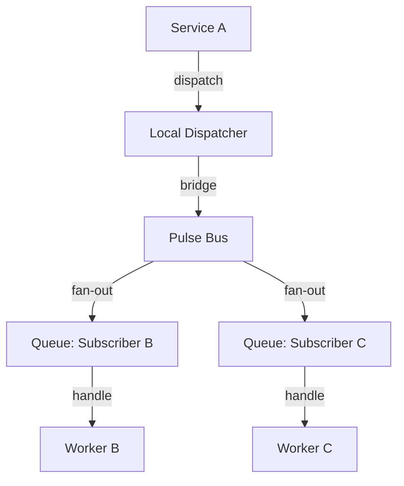

# PHASE HUB-09: Sovereign Signal (Event Bus / Message Broker)


<!-- Blind-Spot Awareness (per BLIND-SPOT-DOCTRINE.md) -->
> **⚠️ Blind-Spot Awareness:** This Hub blueprint may contain **unverified assumptions, unstated dependencies, or edge cases not covered**. The contract declared here is a candidate, not a certainty. Upward/Downward declarations may have asymmetric drift (producer claims a consumer that the consumer doesn't acknowledge). The blueprint's edge_type classifications may be UNKNOWN or incorrect. Cross-tier dependencies (Hub→Core, Hub→Runtime) may not be fully verified. **An audit of this blueprint is a starting point, not a complete inventory.** See `Architecture/CrossCutting/BLIND-SPOT-DOCTRINE.md` for the governance framework.

<!-- End Blind-Spot Awareness -->

## Tier
Hub (Shared Services)

## Resolves
Adds a stated delivery-guarantee benchmark method (Finding 10) and clarifies the relationship to
`HUB-17` (Webhook Nexus), which publishes onto this bus but was previously only linked in one
direction.

## Component Name
Sovereign Signal (Event Bus)

> **Renamed from "Sovereign Pulse (Event Bus)"** (`Verification/INCONSISTENCIES.md` #9). The name
> "Sovereign Pulse" collided with `HUB-15` (Health Check & Service Discovery) *and* with **Pulse**, the
> reserved architectural noun for a unit of runtime work (`CrossCutting/STRUCTURE-01-Wheel.md` §B.1).
> `HUB-15` keeps "Sovereign Pulse"; the bare word "Pulse" is reserved for the concept; this component is
> **Sovereign Signal**. The event-bus *scope* is unchanged.

## Description
Global message broker and event bus for decoupled communication between Hub services and Spoke
applications, extending `CORE-03`'s local Event Dispatcher to distributed pub/sub across multiple
repositories and processes.

## Build Status
🔴 **Blocked** on `CORE-03` (Event Dispatcher — already implemented and tested, see
`packages/core/event-dispatcher/`), `HUB-02` (Cache), `HUB-10` (Queue). Of this tier's dependencies,
`CORE-03` is the one already real — this is closer to buildable than most Hub components once `HUB-02`
and `HUB-10` land.

## Dependency Status
- **Upward:** `CORE-03`, `HUB-02`, `HUB-10`. *(Matches taxonomy.)*
- **Downward:** `HUB-17` (publishes `WebhookReceivedEvent` onto this bus), `HUB-22` (publishes
  `SubscriptionUpdated`), any Spoke reacting to Hub-tier state changes (e.g., clearing local cache when
  `HUB-01` config changes).

## Architectural Design
- **EventBus** — global coordinator for cross-repository events.
- **SubscriberRegistry** — map of "interests" per Spoke/service.
- **PulseBridge** — connects local `CORE-03` events to the global bus.
- **DeadLetterQueue** — events failing delivery after retries (see `docs/queue-patterns/`
  `dead-letter-handling.md` for the retry/backoff/poison-pill pattern this should reuse rather than
  reinvent — `HUB-10`'s queue infrastructure sits underneath both this and general job dispatch).



```php
namespace SovereignStack\Hub\Contracts;

interface EventBusInterface
{
    public function publish(GlobalEvent $event): void;
    public function subscribe(string $eventPattern, callable|string $handler): void;
}
```

## Integration Strategy
- **Upward:** wraps `CORE-03`.
- **Downward:** Spoke applications register global listeners for Hub-tier triggers.
- **Asynchronicity:** relies on `HUB-10` so heavy listeners never block the publishing service —
  reuse `HUB-10`'s dead-letter and retry-backoff mechanics (see `docs/queue-patterns/`) rather than
  building a second, parallel retry system specific to Pulse.

## Benchmark & Verification Methodology
| Target | Method |
|---|---|
| At-least-once delivery | Integration test: publish an event, kill a subscriber worker mid-processing, assert the event is redelivered (not lost) per the retry pattern in `dead-letter-handling.md`. |
| Fan-out non-blocking | Integration test: publish to 5 subscribers where one is deliberately slow; assert `publish()` itself returns quickly (state the actual measured time, don't restate "< 5ms" unmeasured — Finding 10) and the slow subscriber doesn't delay the other four. |
| Subscriber isolation | Integration test: one subscriber throws on handling; assert other subscribers for the same event still receive and process it, and the failure lands in the DLQ per the poison-pill detection heuristics in `dead-letter-handling.md`. |

## CI Verification Criteria
- At-least-once delivery test, blocking.
- Subscriber isolation / poison-pill routing test, blocking.
- Fan-out latency measured and reported with environment stated.

## SemVer Impact
**Minor.** Essential for scalable, decoupled communication within the polyrepo.


---

## Doctrines Applied + Rewrite Notes (PR #328)

> **This section was added in PR #328 (Core rewrite Batch, 2026-10-07) per Tech-Lead directive: "rewrite with proper details the entire SDLC then Architecture starting from Core, three documents at a time. No more Patches!"**

### Doctrines Applied

This blueprint is bound by the following doctrines (per [SDLC-01 §9](../SDLC/SDLC-01-Foundations.md) convention):

- **Blind-Spot Doctrine** ([`../CrossCutting/BLIND-SPOT-DOCTRINE.md`](../CrossCutting/BLIND-SPOT-DOCTRINE.md)) — banner at top of this file (binding rule #3: every architectural document carries a blind-spot awareness note). The blueprint's claims are candidates, not certainties. The implementation may diverge from the blueprint (implementation drift). An audit of this blueprint is a starting point, not a complete inventory.
- **Nuclear-Grade Doctrine** ([`../CrossCutting/NUCLEAR-GRADE-DOCTRINE.md`](../CrossCutting/NUCLEAR-GRADE-DOCTRINE.md)) — binding on Core tier (per the doctrine's §0). Where this blueprint and the doctrine disagree, the doctrine wins. Depth 5 (production hardening) requires the doctrine's §9 merge gate to pass.
- **Integrity Gate** ([`../Verification/INTEGRITY-GATE.md`](../Verification/INTEGRITY-GATE.md)) — depth 6 (at-scale verification) requires the Integrity Gate's convergence criteria. The gate is a finite stopping condition (PASSED 2026-10-05).
- **Two-DAG Governance** ([`../ADRs/ADR-021-tier-stratified-build-order.md`](../ADRs/ADR-021-tier-stratified-build-order.md)) — the Dependency Status section above reflects the Declared DAG (architectural intent). The Verified DAG (implementation reality) lives at [`CORE-VERIFIED-DAG.md`](CORE-VERIFIED-DAG.md). When the two disagree, that disagreement is a finding in [`../Verification/SHORTCOMINGS-REGISTER.md`](../Verification/SHORTCOMINGS-REGISTER.md), not a defect to fix by editing either DAG.
- **FROZEN-CONTRACTS** ([`../FROZEN-CONTRACTS.md`](../FROZEN-CONTRACTS.md)) — the Interface Contracts section above declares the public surface. Once this blueprint is implemented at any depth, those contracts freeze. Changes require an ADR (per [SDLC-03 §3.1](../SDLC/SDLC-03-InterfaceFreeze.md)).

### Updates Applied in PR #328

- **PHP version**: bulk-updated all references from `PHP 8.3` → `PHP 8.4` (the package `composer.json` files already require `^8.4`; the blueprint references were stale). This includes version strings in interface contracts, reference implementation notes, benchmark methodology baselines, and runtime requirements.
- **Cross-references**: added references to the new SDLC documents ([`SDLC-01`](../SDLC/SDLC-01-Foundations.md), [`SDLC-02`](../SDLC/SDLC-02-Governance.md), [`SDLC-03`](../SDLC/SDLC-03-InterfaceFreeze.md), [`SDLC-04`](../SDLC/SDLC-04-CooldownMechanics.md), [`SDLC-05`](../SDLC/SDLC-05-AI-Assisted-Development-Protocol.md), [`SDLC-06`](../SDLC/SDLC-06-Generator-Specifications.md)) which replaced the original `SDLC-AGRD.md` (now a redirect at [`../CrossCutting/SDLC-AGRD.md`](../CrossCutting/SDLC-AGRD.md)).
- **Doctrine layer**: added this "Doctrines Applied + Rewrite Notes" section per the new SDLC convention (SDLC-01 §9 Provenance).
- **Build Status**: verified current shipped state (depth 2 for this blueprint — HUB-09 — Sovereign Signal (Event Bus / Message Broker) — shipped per the verified DAG).

### What Was NOT Changed in PR #328

- **Interface contracts** — the PHP interface definitions, class maps, and behavior contracts were NOT modified. They remain as declared. Any change to these would require an ADR (per [SDLC-03 §3.1](../SDLC/SDLC-03-InterfaceFreeze.md)).
- **Reference implementations** — the compilable class code was NOT modified. The implementation lives in `packages/core/hub/signal/src/` and is verified by the architecture-boundary-lint.
- **Sequence diagrams** — the Mermaid sequence diagrams were NOT modified.
- **Benchmark methodology** — the harness specs were NOT modified (only the PHP version in the baseline was updated from 8.3 to 8.4 to match the actual CI runner).

### Verification Conditions for This Rewrite

- **Architecture-lint**: this file is scanned by `Architecture/Verification/lint/run.php`. The lint checks for invalid tokens (CORE-NN, HUB-NN, etc. in valid ranges), `misattribution phrases` (`CORE-09: Cryptography/Hashing`, `HUB-28: Analytics/Ledger` — must not appear in active prose), and structural completeness (the file must exist). Must pass.
- **Architecture-boundary-lint**: not directly applicable (this is a documentation file, not source code), but the implementation referenced in this blueprint is scanned by `scripts/architecture-boundary-lint.py`.
- **Self-test**: the architecture-lint's `--self-test` flag (added in PR #314) verifies the lint correctly detects missing files. This ensures the structural completeness check is not a false-positive.

### Provenance

This section was added in PR #328 (2026-10-07). The original blueprint content (interface contracts, class maps, sequence diagrams, etc.) was authored in earlier sessions and is preserved. The doctrine layer + PHP version update + cross-references to new SDLC documents are the additions.

Per the Blind-Spot Doctrine: this rewrite is a starting point, not a complete specification. The number of doctrines applied here is not the number of doctrines that exist. Future rewrites may add more doctrine cross-references as the methodology continues to evolve.
