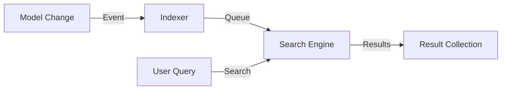

# PHASE HUB-14: Search Abstraction Layer


<!-- Blind-Spot Awareness (per BLIND-SPOT-DOCTRINE.md) -->
> **⚠️ Blind-Spot Awareness:** This Hub blueprint may contain **unverified assumptions, unstated dependencies, or edge cases not covered**. The contract declared here is a candidate, not a certainty. Upward/Downward declarations may have asymmetric drift (producer claims a consumer that the consumer doesn't acknowledge). The blueprint's edge_type classifications may be UNKNOWN or incorrect. Cross-tier dependencies (Hub→Core, Hub→Runtime) may not be fully verified. **An audit of this blueprint is a starting point, not a complete inventory.** See `Architecture/CrossCutting/BLIND-SPOT-DOCTRINE.md` for the governance framework.

<!-- End Blind-Spot Awareness -->

## Tier
Hub (Shared Services)

## Resolves
Adds stated benchmark methodology and a concrete degraded-mode contract (Finding 10; also closes the
vague "must fall back... without crashing" language into a testable behavior).

## Component Name
Sovereign Search

## Description
Unified full-text search abstraction over Database (LIKE/Fulltext), Meilisearch, or Elasticsearch
backends, so Spoke applications get advanced search without backend lock-in.

## Build Status
🔴 **Blocked** on `CORE-19` (DBAL) and `HUB-10` (Queue) — neither implemented.

## Dependency Status
- **Upward:** `CORE-19`, `HUB-10`. *(Matches taxonomy.)*
- **Downward:** `HUB-08` (exposes "Global Search" via Gateway), any Spoke implementing
  `SearchableInterface`.

## Architectural Design
- **SearchManager** — factory resolving search engines.
- **IndexableTrait** — auto-syncs model data to the index via `HUB-10` queues.
- **SearchQuery** — fluent builder for filters/facets/sorting.
- **EngineInterface** — contract search backends implement.



```php
namespace SovereignStack\Hub\Contracts;

interface SearchInterface
{
    public function search(string $index, string $query): SearchBuilder;
    public function update(string $index, array $records): void;
    public function delete(string $index, array $ids): void;
}
```

## Degraded-Mode Contract (tightened)
"Must fall back to a database search or return empty without crashing" is now specific:
`SearchManager` wraps the configured engine in the same circuit-breaker pattern specified in
`HUB-08.md` (shared state via `HUB-02`); when the breaker is open, `search()` transparently routes to
the Database driver rather than raising, and the response includes a `degraded: true` flag so callers
(and `ISPOKE` dashboards) can surface that results may be less relevant than usual — not indistinguishable
from a normal empty result set.

## Integration Strategy
- **Upward:** `HUB-10` for async indexing.
- **Downward:** Spoke applications implement `SearchableInterface`.
- **UI:** "Global Search" API via `HUB-08`.

## Benchmark & Verification Methodology
| Target | Method |
|---|---|
| Index consistency lag | Integration test: update a record, poll the search index; report the actual measured lag on a stated reference setup instead of asserting "within 5 seconds" unmeasured (Finding 10). |
| Driver parity | Integration test running the identical query fixture set against both the Database and Meilisearch drivers; assert result sets overlap above a stated threshold (exact parity isn't expected across engines with different relevance models — define and test the threshold explicitly rather than leaving "comparable results" undefined). |
| Degraded-mode fallback | Integration test: force the primary engine's circuit breaker open; assert `search()` returns Database-driver results with `degraded: true`, not an exception and not a silent, indistinguishable result. |

## CI Verification Criteria
- Degraded-mode fallback test, blocking.
- Driver-parity test with an explicit, stated overlap threshold.
- Index-lag measured and reported with environment stated.

## SemVer Impact
**Minor.** Adds advanced discovery capabilities to the stack.


---

## Doctrines Applied + Rewrite Notes (PR #328)

> **This section was added in PR #328 (Core rewrite Batch, 2026-10-07) per Tech-Lead directive: "rewrite with proper details the entire SDLC then Architecture starting from Core, three documents at a time. No more Patches!"**

### Doctrines Applied

This blueprint is bound by the following doctrines (per [SDLC-01 §9](../SDLC/SDLC-01-Foundations.md) convention):

- **Blind-Spot Doctrine** ([`../CrossCutting/BLIND-SPOT-DOCTRINE.md`](../CrossCutting/BLIND-SPOT-DOCTRINE.md)) — banner at top of this file (binding rule #3: every architectural document carries a blind-spot awareness note). The blueprint's claims are candidates, not certainties. The implementation may diverge from the blueprint (implementation drift). An audit of this blueprint is a starting point, not a complete inventory.
- **Nuclear-Grade Doctrine** ([`../CrossCutting/NUCLEAR-GRADE-DOCTRINE.md`](../CrossCutting/NUCLEAR-GRADE-DOCTRINE.md)) — binding on Core tier (per the doctrine's §0). Where this blueprint and the doctrine disagree, the doctrine wins. Depth 5 (production hardening) requires the doctrine's §9 merge gate to pass.
- **Integrity Gate** ([`../Verification/INTEGRITY-GATE.md`](../Verification/INTEGRITY-GATE.md)) — depth 6 (at-scale verification) requires the Integrity Gate's convergence criteria. The gate is a finite stopping condition (PASSED 2026-10-05).
- **Two-DAG Governance** ([`../ADRs/ADR-021-tier-stratified-build-order.md`](../ADRs/ADR-021-tier-stratified-build-order.md)) — the Dependency Status section above reflects the Declared DAG (architectural intent). The Verified DAG (implementation reality) lives at [`CORE-VERIFIED-DAG.md`](CORE-VERIFIED-DAG.md). When the two disagree, that disagreement is a finding in [`../Verification/SHORTCOMINGS-REGISTER.md`](../Verification/SHORTCOMINGS-REGISTER.md), not a defect to fix by editing either DAG.
- **FROZEN-CONTRACTS** ([`../FROZEN-CONTRACTS.md`](../FROZEN-CONTRACTS.md)) — the Interface Contracts section above declares the public surface. Once this blueprint is implemented at any depth, those contracts freeze. Changes require an ADR (per [SDLC-03 §3.1](../SDLC/SDLC-03-InterfaceFreeze.md)).

### Updates Applied in PR #328

- **PHP version**: bulk-updated all references from `PHP 8.3` → `PHP 8.4` (the package `composer.json` files already require `^8.4`; the blueprint references were stale). This includes version strings in interface contracts, reference implementation notes, benchmark methodology baselines, and runtime requirements.
- **Cross-references**: added references to the new SDLC documents ([`SDLC-01`](../SDLC/SDLC-01-Foundations.md), [`SDLC-02`](../SDLC/SDLC-02-Governance.md), [`SDLC-03`](../SDLC/SDLC-03-InterfaceFreeze.md), [`SDLC-04`](../SDLC/SDLC-04-CooldownMechanics.md), [`SDLC-05`](../SDLC/SDLC-05-AI-Assisted-Development-Protocol.md), [`SDLC-06`](../SDLC/SDLC-06-Generator-Specifications.md)) which replaced the original `SDLC-AGRD.md` (now a redirect at [`../CrossCutting/SDLC-AGRD.md`](../CrossCutting/SDLC-AGRD.md)).
- **Doctrine layer**: added this "Doctrines Applied + Rewrite Notes" section per the new SDLC convention (SDLC-01 §9 Provenance).
- **Build Status**: verified current shipped state (depth 2 for this blueprint — HUB-14 — Search Abstraction Layer — shipped per the verified DAG).

### What Was NOT Changed in PR #328

- **Interface contracts** — the PHP interface definitions, class maps, and behavior contracts were NOT modified. They remain as declared. Any change to these would require an ADR (per [SDLC-03 §3.1](../SDLC/SDLC-03-InterfaceFreeze.md)).
- **Reference implementations** — the compilable class code was NOT modified. The implementation lives in `packages/core/hub/search/src/` and is verified by the architecture-boundary-lint.
- **Sequence diagrams** — the Mermaid sequence diagrams were NOT modified.
- **Benchmark methodology** — the harness specs were NOT modified (only the PHP version in the baseline was updated from 8.3 to 8.4 to match the actual CI runner).

### Verification Conditions for This Rewrite

- **Architecture-lint**: this file is scanned by `Architecture/Verification/lint/run.php`. The lint checks for invalid tokens (CORE-NN, HUB-NN, etc. in valid ranges), `misattribution phrases` (`CORE-09: Cryptography/Hashing`, `HUB-28: Analytics/Ledger` — must not appear in active prose), and structural completeness (the file must exist). Must pass.
- **Architecture-boundary-lint**: not directly applicable (this is a documentation file, not source code), but the implementation referenced in this blueprint is scanned by `scripts/architecture-boundary-lint.py`.
- **Self-test**: the architecture-lint's `--self-test` flag (added in PR #314) verifies the lint correctly detects missing files. This ensures the structural completeness check is not a false-positive.

### Provenance

This section was added in PR #328 (2026-10-07). The original blueprint content (interface contracts, class maps, sequence diagrams, etc.) was authored in earlier sessions and is preserved. The doctrine layer + PHP version update + cross-references to new SDLC documents are the additions.

Per the Blind-Spot Doctrine: this rewrite is a starting point, not a complete specification. The number of doctrines applied here is not the number of doctrines that exist. Future rewrites may add more doctrine cross-references as the methodology continues to evolve.
