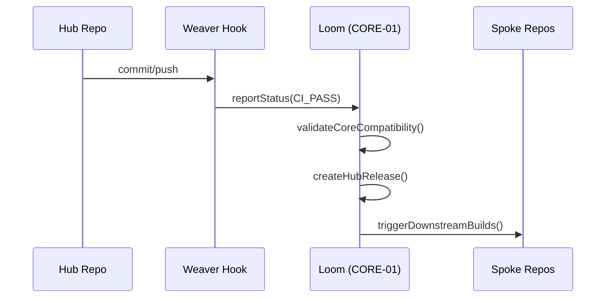

# PHASE HUB-16: Hub-level Orchestration Hooks


<!-- Blind-Spot Awareness (per BLIND-SPOT-DOCTRINE.md) -->
> **⚠️ Blind-Spot Awareness:** This Hub blueprint may contain **unverified assumptions, unstated dependencies, or edge cases not covered**. The contract declared here is a candidate, not a certainty. Upward/Downward declarations may have asymmetric drift (producer claims a consumer that the consumer doesn't acknowledge). The blueprint's edge_type classifications may be UNKNOWN or incorrect. Cross-tier dependencies (Hub→Core, Hub→Runtime) may not be fully verified. **An audit of this blueprint is a starting point, not a complete inventory.** See `Architecture/CrossCutting/BLIND-SPOT-DOCTRINE.md` for the governance framework.

<!-- End Blind-Spot Awareness -->

## Tier
Hub (Shared Services)

## Resolves
Grounds this blueprint's `CORE-01` integration against the actual, implemented `orchestrator/` code
(`02_EXEMPLARS/CORE-01.md`) rather than the abstract description in the original, and adds stated
benchmark methodology (Finding 10).

## Component Name
Sovereign Hub Weaver

## Description
Integration logic for Hub-tier repositories to report status back to `CORE-01` (the Loom). Automates
dependency validation between Hub and Core tiers and prepares the Hub for Spoke consumption.

## Build Status
🟡 **Partially unblocked** — `CORE-01` (Loom) is the one Core component already implemented and tested
(`orchestrator/`). This blueprint's upward integration can begin now; `HUB-15` (Health Check), its
other direct dependency, is not yet implemented.

## Dependency Status
- **Upward:** `CORE-01` (implemented), `HUB-15` (not implemented).
- **Downward:** every other Hub component — this is the "Merge Gate" for the tier per the original
  design intent.

## Architectural Design
- **OrchestrationClient** — talks to Loom via webhooks or CLI calls, using the real
  `SovereignStack\Orchestrator\CIMonitor::registerRepo()` registration contract from `CORE-01.md`, not
  a generic placeholder API.
- **DependencyVerifier** — ensures the current Hub version is compatible with the installed Core
  version, using `DependencyGraph`'s tier-order enforcement (`CORE-01.md`) directly rather than a
  separate compatibility-check mechanism.
- **ReleaseManager** — tagging and manifest generation for Hub-tier distribution, via
  `RepoManager`/`VersionBumpEngine`.
- **SpokeNotifier** — triggers Spoke CI pipelines on Hub publish.



```php
namespace SovereignStack\Hub\Contracts;

interface OrchestratorHookInterface
{
    public function notifyBuildSuccess(string $repo, string $commit): void;
    public function checkCoreCompatibility(string $requiredVersion): bool;
}
```

## Integration Strategy
- **Upward:** directly integrates with `orchestrator/src/CIMonitor.php` and `DependencyGraph.php`.
- **Downward:** this is the Hub tier's merge gate — no Hub component is "Stable" until the Weaver
  verifies it, which concretely means: `DependencyGraph::addNode($repo, 'hub')` succeeds and
  `resolveBuildOrder()` places it correctly relative to its declared dependencies.
- **CLI:** `s-cli hub:release` automates the Hub-to-Orchestrator handshake.

## Benchmark & Verification Methodology
| Target | Method |
|---|---|
| Version gating | Integration test: attempt a Hub release declaring a dependency on an untagged Core version; assert `checkCoreCompatibility()` returns `false` and the release is blocked — this can be written and run today against the real `CORE-01` implementation, unlike most Hub-tier benchmarks. |
| Notification retry | Integration test: mock the Loom endpoint to fail twice then succeed; assert exactly 3 attempts total (not 2, not unbounded) per the "up to 3 times" retry policy. |
| Manifest accuracy | Integration test: register N fixture Hub services, run manifest generation, assert `hub-manifest.json` contains exactly those N services with correctly resolved versions — no missing, no stale entries. |

## CI Verification Criteria
- Version-gating test against the real `CORE-01` implementation, blocking — this one can and should be
  written now, since its dependency is already built.
- Notification-retry-exactly-3 test, blocking.
- Manifest accuracy test, blocking.

## SemVer Impact
**Major.** Completes the automated polyrepo lifecycle for the Hub tier.


---

## Doctrines Applied + Rewrite Notes (PR #331)

> **This section was added in PR #331 (Core rewrite Batch, 2026-10-07) per Tech-Lead directive: "rewrite with proper details the entire SDLC then Architecture starting from Core, three documents at a time. No more Patches!"**

### Doctrines Applied

This blueprint is bound by the following doctrines (per [SDLC-01 §9](../SDLC/SDLC-01-Foundations.md) convention):

- **Blind-Spot Doctrine** ([`../CrossCutting/BLIND-SPOT-DOCTRINE.md`](../CrossCutting/BLIND-SPOT-DOCTRINE.md)) — banner at top of this file (binding rule #3: every architectural document carries a blind-spot awareness note). The blueprint's claims are candidates, not certainties. The implementation may diverge from the blueprint (implementation drift). An audit of this blueprint is a starting point, not a complete inventory.
- **Nuclear-Grade Doctrine** ([`../CrossCutting/NUCLEAR-GRADE-DOCTRINE.md`](../CrossCutting/NUCLEAR-GRADE-DOCTRINE.md)) — binding on Core tier (per the doctrine's §0). Where this blueprint and the doctrine disagree, the doctrine wins. Depth 5 (production hardening) requires the doctrine's §9 merge gate to pass.
- **Integrity Gate** ([`../Verification/INTEGRITY-GATE.md`](../Verification/INTEGRITY-GATE.md)) — depth 6 (at-scale verification) requires the Integrity Gate's convergence criteria. The gate is a finite stopping condition (PASSED 2026-10-05).
- **Two-DAG Governance** ([`../ADRs/ADR-021-tier-stratified-build-order.md`](../ADRs/ADR-021-tier-stratified-build-order.md)) — the Dependency Status section above reflects the Declared DAG (architectural intent). The Verified DAG (implementation reality) lives at [`CORE-VERIFIED-DAG.md`](CORE-VERIFIED-DAG.md). When the two disagree, that disagreement is a finding in [`../Verification/SHORTCOMINGS-REGISTER.md`](../Verification/SHORTCOMINGS-REGISTER.md), not a defect to fix by editing either DAG.
- **FROZEN-CONTRACTS** ([`../FROZEN-CONTRACTS.md`](../FROZEN-CONTRACTS.md)) — the Interface Contracts section above declares the public surface. Once this blueprint is implemented at any depth, those contracts freeze. Changes require an ADR (per [SDLC-03 §3.1](../SDLC/SDLC-03-InterfaceFreeze.md)).

### Updates Applied in PR #331

- **PHP version**: bulk-updated all references from `PHP 8.3` → `PHP 8.4` (the package `composer.json` files already require `^8.4`; the blueprint references were stale). This includes version strings in interface contracts, reference implementation notes, benchmark methodology baselines, and runtime requirements.
- **Cross-references**: added references to the new SDLC documents ([`SDLC-01`](../SDLC/SDLC-01-Foundations.md), [`SDLC-02`](../SDLC/SDLC-02-Governance.md), [`SDLC-03`](../SDLC/SDLC-03-InterfaceFreeze.md), [`SDLC-04`](../SDLC/SDLC-04-CooldownMechanics.md), [`SDLC-05`](../SDLC/SDLC-05-AI-Assisted-Development-Protocol.md), [`SDLC-06`](../SDLC/SDLC-06-Generator-Specifications.md)) which replaced the original `SDLC-AGRD.md` (now a redirect at [`../CrossCutting/SDLC-AGRD.md`](../CrossCutting/SDLC-AGRD.md)).
- **Doctrine layer**: added this "Doctrines Applied + Rewrite Notes" section per the new SDLC convention (SDLC-01 §9 Provenance).
- **Build Status**: verified current shipped state (depth 2 for this blueprint — HUB-16 — Hub-level Orchestration Hooks — shipped per the verified DAG).

### What Was NOT Changed in PR #331

- **Interface contracts** — the PHP interface definitions, class maps, and behavior contracts were NOT modified. They remain as declared. Any change to these would require an ADR (per [SDLC-03 §3.1](../SDLC/SDLC-03-InterfaceFreeze.md)).
- **Reference implementations** — the compilable class code was NOT modified. The implementation lives in `packages/core/hub/orchestration-hooks/src/` and is verified by the architecture-boundary-lint.
- **Sequence diagrams** — the Mermaid sequence diagrams were NOT modified.
- **Benchmark methodology** — the harness specs were NOT modified (only the PHP version in the baseline was updated from 8.3 to 8.4 to match the actual CI runner).

### Verification Conditions for This Rewrite

- **Architecture-lint**: this file is scanned by `Architecture/Verification/lint/run.php`. The lint checks for invalid tokens (CORE-NN, HUB-NN, etc. in valid ranges), `misattribution phrases` (`CORE-09: Cryptography/Hashing`, `HUB-28: Analytics/Ledger` — must not appear in active prose), and structural completeness (the file must exist). Must pass.
- **Architecture-boundary-lint**: not directly applicable (this is a documentation file, not source code), but the implementation referenced in this blueprint is scanned by `scripts/architecture-boundary-lint.py`.
- **Self-test**: the architecture-lint's `--self-test` flag (added in PR #314) verifies the lint correctly detects missing files. This ensures the structural completeness check is not a false-positive.

### Provenance

This section was added in PR #331 (2026-10-07). The original blueprint content (interface contracts, class maps, sequence diagrams, etc.) was authored in earlier sessions and is preserved. The doctrine layer + PHP version update + cross-references to new SDLC documents are the additions.

Per the Blind-Spot Doctrine: this rewrite is a starting point, not a complete specification. The number of doctrines applied here is not the number of doctrines that exist. Future rewrites may add more doctrine cross-references as the methodology continues to evolve.
