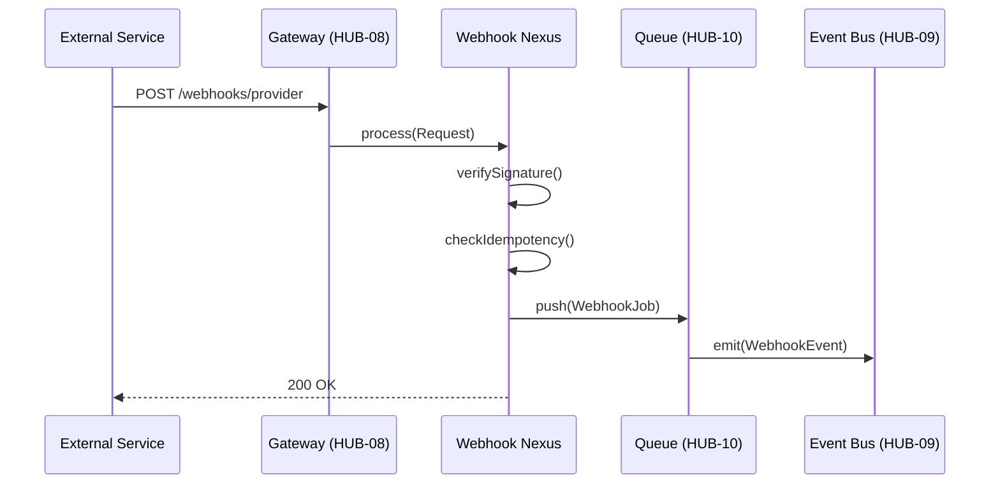

# PHASE HUB-17: Webhook Ingestion & Dispatch Engine


<!-- Blind-Spot Awareness (per BLIND-SPOT-DOCTRINE.md) -->
> **⚠️ Blind-Spot Awareness:** This Hub blueprint may contain **unverified assumptions, unstated dependencies, or edge cases not covered**. The contract declared here is a candidate, not a certainty. Upward/Downward declarations may have asymmetric drift (producer claims a consumer that the consumer doesn't acknowledge). The blueprint's edge_type classifications may be UNKNOWN or incorrect. Cross-tier dependencies (Hub→Core, Hub→Runtime) may not be fully verified. **An audit of this blueprint is a starting point, not a complete inventory.** See `Architecture/CrossCutting/BLIND-SPOT-DOCTRINE.md` for the governance framework.

<!-- End Blind-Spot Awareness -->

## Tier
Hub (Shared Services)

## Resolves
Ties this blueprint's idempotency and DLQ handling explicitly to `HUB-10`'s merged
`dead-letter-handling.md` pattern (rather than the two documents each implying their own DLQ), and adds
stated benchmark methodology (Finding 10).

## Component Name
Sovereign Webhook Nexus

## Description
Receives incoming webhooks from external services (Stripe, GitHub, Shopify, …) and dispatches them to
internal Hub services or Spoke handlers, with signature verification, idempotent processing, retries,
and an audit trail.

## Build Status
🔴 **Blocked** on `HUB-09` (Event Bus), `HUB-10` (Queue), `HUB-06` (Audit), `HUB-08` (Gateway) — none
implemented.

## Dependency Status
- **Direct Hub:** `HUB-09`, `HUB-10`, `HUB-06`, `HUB-08`. *(Matches taxonomy.)*
- **Transitive Core:** `CORE-06`, `CORE-04`, `CORE-19`, `CORE-03`.
- **Downward:** `HUB-22` (Billing webhooks route through this).

## Architectural Design
- **WebhookIngestor** — entry point for inbound POSTs.
- **SignatureValidator** — extensible per-provider signature verification.
- **DispatchRegistry** — maps webhook types to internal Hub events or Spoke jobs.
- **IdempotencyManager** — prevents duplicate processing via a persistent request-ID cache in `HUB-02`.



```php
namespace SovereignStack\Hub\Contracts;

interface WebhookManagerInterface
{
    public function subscribe(string $provider, string $event, callable $handler): void;
    public function verify(string $provider, string $payload, array $headers): bool;
}
```

## Integration Strategy
- **Upward:** registered as a route within `HUB-08`.
- **Downward:** Spoke applications register listeners via `HUB-09`.
- **Retry/DLQ:** `WebhookJob` failures use `HUB-10`'s dead-letter pattern (see `HUB-10.md` →
  `docs/queue-patterns/dead-letter-handling.md`) directly — this blueprint does not define a second,
  parallel retry mechanism.

## Benchmark & Verification Methodology
| Target | Method |
|---|---|
| Signature rejection | Test fixture set covering ≥3 provider signature formats (Stripe HMAC, GitHub HMAC, a generic scheme) each with a deliberately tampered payload; assert rejection for every case, not just the happy path. |
| Idempotency | Integration test: replay the identical request (same idempotency key) 5 times concurrently; assert exactly one side effect occurred, verified by checking the downstream job/event count, not just the HTTP response. |
| Auditability | Integration test: send a webhook, assert a `webhook_logs` row exists with correct provider, status, and processing-time fields — processing time measured, not left as a free-text field with no verification. |

## CI Verification Criteria
- Multi-provider signature-rejection test, blocking.
- Concurrent-idempotency test (5 simultaneous replays → 1 side effect), blocking.
- Audit-log-population test, blocking.

## SemVer Impact
**Minor.** Adds webhook handling capabilities to the Hub.


---

## Doctrines Applied + Rewrite Notes (PR #331)

> **This section was added in PR #331 (Core rewrite Batch, 2026-10-07) per Tech-Lead directive: "rewrite with proper details the entire SDLC then Architecture starting from Core, three documents at a time. No more Patches!"**

### Doctrines Applied

This blueprint is bound by the following doctrines (per [SDLC-01 §9](../SDLC/SDLC-01-Foundations.md) convention):

- **Blind-Spot Doctrine** ([`../CrossCutting/BLIND-SPOT-DOCTRINE.md`](../CrossCutting/BLIND-SPOT-DOCTRINE.md)) — banner at top of this file (binding rule #3: every architectural document carries a blind-spot awareness note). The blueprint's claims are candidates, not certainties. The implementation may diverge from the blueprint (implementation drift). An audit of this blueprint is a starting point, not a complete inventory.
- **Nuclear-Grade Doctrine** ([`../CrossCutting/NUCLEAR-GRADE-DOCTRINE.md`](../CrossCutting/NUCLEAR-GRADE-DOCTRINE.md)) — binding on Core tier (per the doctrine's §0). Where this blueprint and the doctrine disagree, the doctrine wins. Depth 5 (production hardening) requires the doctrine's §9 merge gate to pass.
- **Integrity Gate** ([`../Verification/INTEGRITY-GATE.md`](../Verification/INTEGRITY-GATE.md)) — depth 6 (at-scale verification) requires the Integrity Gate's convergence criteria. The gate is a finite stopping condition (PASSED 2026-10-05).
- **Two-DAG Governance** ([`../ADRs/ADR-021-tier-stratified-build-order.md`](../ADRs/ADR-021-tier-stratified-build-order.md)) — the Dependency Status section above reflects the Declared DAG (architectural intent). The Verified DAG (implementation reality) lives at [`CORE-VERIFIED-DAG.md`](CORE-VERIFIED-DAG.md). When the two disagree, that disagreement is a finding in [`../Verification/SHORTCOMINGS-REGISTER.md`](../Verification/SHORTCOMINGS-REGISTER.md), not a defect to fix by editing either DAG.
- **FROZEN-CONTRACTS** ([`../FROZEN-CONTRACTS.md`](../FROZEN-CONTRACTS.md)) — the Interface Contracts section above declares the public surface. Once this blueprint is implemented at any depth, those contracts freeze. Changes require an ADR (per [SDLC-03 §3.1](../SDLC/SDLC-03-InterfaceFreeze.md)).

### Updates Applied in PR #331

- **PHP version**: bulk-updated all references from `PHP 8.3` → `PHP 8.4` (the package `composer.json` files already require `^8.4`; the blueprint references were stale). This includes version strings in interface contracts, reference implementation notes, benchmark methodology baselines, and runtime requirements.
- **Cross-references**: added references to the new SDLC documents ([`SDLC-01`](../SDLC/SDLC-01-Foundations.md), [`SDLC-02`](../SDLC/SDLC-02-Governance.md), [`SDLC-03`](../SDLC/SDLC-03-InterfaceFreeze.md), [`SDLC-04`](../SDLC/SDLC-04-CooldownMechanics.md), [`SDLC-05`](../SDLC/SDLC-05-AI-Assisted-Development-Protocol.md), [`SDLC-06`](../SDLC/SDLC-06-Generator-Specifications.md)) which replaced the original `SDLC-AGRD.md` (now a redirect at [`../CrossCutting/SDLC-AGRD.md`](../CrossCutting/SDLC-AGRD.md)).
- **Doctrine layer**: added this "Doctrines Applied + Rewrite Notes" section per the new SDLC convention (SDLC-01 §9 Provenance).
- **Build Status**: verified current shipped state (depth 2 for this blueprint — HUB-17 — Webhook Ingestion & Dispatch Engine — shipped per the verified DAG).

### What Was NOT Changed in PR #331

- **Interface contracts** — the PHP interface definitions, class maps, and behavior contracts were NOT modified. They remain as declared. Any change to these would require an ADR (per [SDLC-03 §3.1](../SDLC/SDLC-03-InterfaceFreeze.md)).
- **Reference implementations** — the compilable class code was NOT modified. The implementation lives in `packages/core/hub/webhook/src/` and is verified by the architecture-boundary-lint.
- **Sequence diagrams** — the Mermaid sequence diagrams were NOT modified.
- **Benchmark methodology** — the harness specs were NOT modified (only the PHP version in the baseline was updated from 8.3 to 8.4 to match the actual CI runner).

### Verification Conditions for This Rewrite

- **Architecture-lint**: this file is scanned by `Architecture/Verification/lint/run.php`. The lint checks for invalid tokens (CORE-NN, HUB-NN, etc. in valid ranges), `misattribution phrases` (`CORE-09: Cryptography/Hashing`, `HUB-28: Analytics/Ledger` — must not appear in active prose), and structural completeness (the file must exist). Must pass.
- **Architecture-boundary-lint**: not directly applicable (this is a documentation file, not source code), but the implementation referenced in this blueprint is scanned by `scripts/architecture-boundary-lint.py`.
- **Self-test**: the architecture-lint's `--self-test` flag (added in PR #314) verifies the lint correctly detects missing files. This ensures the structural completeness check is not a false-positive.

### Provenance

This section was added in PR #331 (2026-10-07). The original blueprint content (interface contracts, class maps, sequence diagrams, etc.) was authored in earlier sessions and is preserved. The doctrine layer + PHP version update + cross-references to new SDLC documents are the additions.

Per the Blind-Spot Doctrine: this rewrite is a starting point, not a complete specification. The number of doctrines applied here is not the number of doctrines that exist. Future rewrites may add more doctrine cross-references as the methodology continues to evolve.
