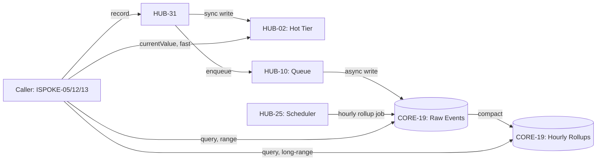

# PHASE HUB-31: Real-Time Analytics & Metrics Ledger

## Tier
Hub (Shared Services)

## Resolves
Closes `OD-01` (accepted 2026-08-12, `ADR-011`) and the concrete gap it created: `ISPOKE-05`, `ISPOKE-12`,
and `ISPOKE-13` have each depended on this component since Finding 14 first registered it, all three
explicitly marked "blocked, `HUB-31` not yet specified." This blueprint is that specification — designed
against their *existing* interface expectations rather than inventing a new contract they'd have to be
rewritten to match.

## Component Name
Sovereign Ledger (Metrics) — **Hub tier**; distinct from `HUB-22`'s "Sovereign Ledger (Billing)" and
`ISPOKE-13`'s "Sovereign Ledger (Billing)" naming — same cross-tier disambiguation note as the
`Forge`/`Pulse`/`Nexus` collisions resolved elsewhere in `INDEX.md` §2.3. If "Sovereign Ledger" comes up
in conversation, confirm which tier before assuming which one.

## Description
Real-time metrics ingestion and query service: the backing store for live BI dashboards, feature-rollout
impact monitoring, and revenue metrics — the genuine streaming-data need that `HUB-23` (Reporter, async
batch export) was never scoped to cover. Two-tier by design: a hot path (`HUB-02`) for sub-second current
values, a durable path (`CORE-19`) for historical range queries, kept in sync via `HUB-10` so the caller
never blocks on the durable write.

## Build Status
🔴 **Blocked** on `CORE-02` (DI Container), `CORE-19` (DBAL), `HUB-02` (Cache), `HUB-10` (Queue), `HUB-25`
(Scheduler) — none implemented. Per `SDLC-AGRD.md`'s lap structure, this is a lap-admission candidate
once `HUB-02`/`HUB-10` are in the matrix — not part of Milestone 0, and shouldn't be forced in ahead of
its real dependencies just because three Spokes are waiting on it.

## Dependency Status
- **Direct Hub:** `HUB-02` (hot-tier storage, via its `LockInterface` for rollup-job coordination —
  see `HUB-02.md`), `HUB-10` (durable-write queue, dead-letter pattern per `HUB-10.md`), `HUB-25`
  (scheduled rollup compaction), `HUB-21` (tenant scoping — every metric is tenant-isolated, same
  severity class as `HUB-21`'s own cross-tenant leak test).
- **Transitive Core:** `CORE-19` (DBAL, MySQL 8/InnoDB per `ADR-013`), `CORE-02`, `CORE-18`.
- **Downward:** `ISPOKE-05` (`QueryBuilder`), `ISPOKE-12` (`ImpactMonitor`), `ISPOKE-13`
  (`RevenueDashboard`) — all three already coded against the assumption this interface would exist;
  see `Interface Contracts` below for exactly how each maps to it.

## Architectural Design

### Two-tier storage, not a new datastore
No dedicated time-series database is introduced — `ADR-013` established MySQL 8 as primary and nothing
about this component's needs justifies a third datastore technology for a solo-maintained project.
Instead:

- **Hot tier (`HUB-02`/Redis):** sliding-window aggregates (last 5 min / 1 hour), written synchronously
  on `record()` so `currentValue()` reflects a write immediately. This is what makes the "real-time" in
  the component's name literal rather than aspirational.
- **Durable tier (`CORE-19`/MySQL):** the full event log, written asynchronously via `HUB-10` so
  `record()` never blocks the caller on a database round-trip. Retained ~7 days at raw granularity.
- **Rollup tier (`CORE-19`/MySQL):** hourly aggregates compacted from raw events by a `HUB-25`-scheduled
  job, retained longer (13 months, enough for year-over-year comparison) once raw events age out.



### Data model

```sql
CREATE TABLE metrics_events (
    id           CHAR(26) CHARACTER SET ascii PRIMARY KEY,
    tenant_id    CHAR(26) CHARACTER SET ascii NOT NULL,
    metric       VARCHAR(64) NOT NULL,
    value        DOUBLE NOT NULL,
    dimensions   JSON NOT NULL,
    recorded_at  TIMESTAMP NOT NULL,
    INDEX idx_tenant_metric_time (tenant_id, metric, recorded_at)
);

CREATE TABLE metrics_rollups_hourly (
    id           CHAR(26) CHARACTER SET ascii PRIMARY KEY,
    tenant_id    CHAR(26) CHARACTER SET ascii NOT NULL,
    metric       VARCHAR(64) NOT NULL,
    dimensions   JSON NOT NULL,
    bucket_hour  TIMESTAMP NOT NULL,
    sum_value    DOUBLE NOT NULL,
    count_value  BIGINT NOT NULL,
    UNIQUE KEY uniq_rollup (tenant_id, metric, bucket_hour)
);
```

Both tables follow `ADR-013` exactly — `CHAR(26) CHARACTER SET ascii` for ULIDs (no `ulid_generate()`
default; the DBAL generates the value before insert), plain `JSON` (not `JSONB`), `TIMESTAMP` (not
`timestamptz`), and no partial indexes — `metrics_rollups_hourly` is itself the generated-column-style
workaround for what would otherwise be an unbounded raw-event range scan.

### Interface Contracts

```php
namespace SovereignStack\Hub\Contracts;

interface RealTimeMetricsInterface
{
    /**
     * Record a single metric data point. Returns as soon as the hot-tier write
     * completes — the durable write is enqueued via HUB-10, not awaited.
     */
    public function record(
        string $metric,
        float $value,
        array $dimensions = [],
        ?\DateTimeInterface $at = null
    ): void;

    /**
     * Range query, optionally grouped by dimension. Serves raw events for
     * ranges within the hot retention window, hourly rollups beyond it —
     * transparently to the caller.
     */
    public function query(
        string $metric,
        \DateTimeInterface $start,
        \DateTimeInterface $end,
        array $groupBy = []
    ): array;

    /** Fast path: latest value for a metric+dimension combination, hot-tier only. */
    public function currentValue(string $metric, array $dimensions = []): float;
}
```

**How the three already-written consumers map to this:**
- **`ISPOKE-05`'s `AnalyticsQueryInterface`** (`setTimeRange()->groupBy()->execute()`) is a fluent
  builder local to `ISPOKE-05` — its `execute()` calls this interface's `query()` under the hood. No
  change needed to `ISPOKE-05.md`; its builder was already written as a thin wrapper over exactly this
  shape.
- **`ISPOKE-12`'s `getRolloutImpact(string $flagKey): array`** calls `currentValue('flag_rollout_rate',
  ['flagKey' => $flagKey])` for the live number, plus `query()` over a short recent window for the
  trend line the dashboard shows alongside it.
- **`ISPOKE-13`'s `RevenueDashboard`** calls `currentValue('mrr', ['tenant' => $tenantId])` and
  equivalent calls for churn/LTV, plus `query()` for the historical trend charts.

None of the three need their own blueprint files touched — this was designed to fit the contract they
already assumed, not the other way around.

## Integration Strategy
- **Upward:** `HUB-02` for hot-tier reads/writes, `HUB-10` for durable-write buffering, `HUB-25` for
  rollup scheduling, `CORE-19` for the durable/rollup tables.
- **Downward:** exposed via `HUB-08` Gateway for the three documented Internal Spoke consumers; no
  External Spoke has a direct dependency on this component today (`ESPOKE-05`'s conversion tracking
  writes durably to `HUB-06` regardless of this component's availability — see `ESPOKE-05.md`'s
  Conversion Durability CI criterion — and only its *dashboard* depends on `HUB-31`).
- **Tenant isolation:** every table, every query, is `tenant_id`-scoped via `HUB-21`. A metric recorded
  for one tenant must never be readable by another — enforced at the interface level, not left to
  caller discipline.

## Benchmark & Verification Methodology
| Target | Method |
|---|---|
| `currentValue()` reflects a `record()` call | Integration test: `record()` then immediately `currentValue()` on the same metric/dimensions; assert the new value is visible — this is the literal test of whether "real-time" is true, not aspirational. |
| Durable write eventually lands | Integration test: `record()`, then poll `CORE-19`'s raw table (not the hot tier); assert the row appears within a stated, measured window on a reference environment — state the environment before citing a number (Finding 10). |
| Cross-tenant isolation | Integration test: record a metric under Tenant A, query it under Tenant B's context; assert zero visibility — same severity class as `HUB-21`'s and `BRIDGE-01`'s isolation tests, CI-blocking. |
| Rollup correctness | Integration test: record N raw events within one hour bucket, run the `HUB-25` rollup job once (not wait for the real schedule), assert `metrics_rollups_hourly`'s `sum_value`/`count_value` match the N raw events exactly. |
| Retention boundary | Integration test: query a range that spans the raw/rollup boundary (e.g., 6 days ago to 8 days ago); assert the result correctly stitches raw and rolled-up data without a gap or double-count at the boundary. |

## CI Verification Criteria
- Real-time-reflection test (`record()` → `currentValue()`), blocking.
- Cross-tenant isolation test, blocking.
- Rollup-correctness test, blocking.
- Retention-boundary stitching test, blocking — this is the test that makes the two-tier design
  actually transparent to callers rather than a leaky abstraction at the exact point where it matters.
- Durable-write-lands test, measured and reported with environment stated, not asserted unmeasured.

## SemVer Impact
**Major.** Unblocks three previously-blocked Internal Spokes simultaneously — the first release of this
component is the point at which `ISPOKE-05`, `ISPOKE-12`, and `ISPOKE-13` stop being design sketches and
become buildable.
