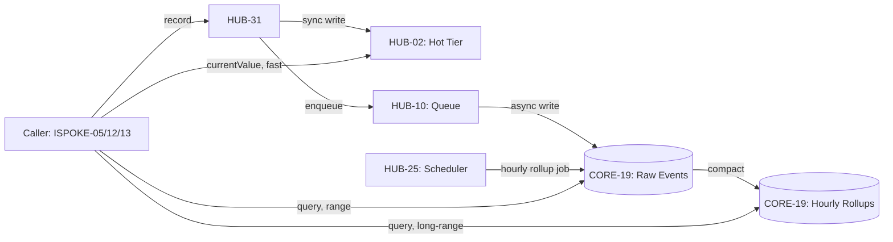

# PHASE HUB-31: Real-Time Analytics & Metrics Ledger


<!-- Blind-Spot Awareness (per BLIND-SPOT-DOCTRINE.md) -->
> **⚠️ Blind-Spot Awareness:** This Hub blueprint may contain **unverified assumptions, unstated dependencies, or edge cases not covered**. The contract declared here is a candidate, not a certainty. Upward/Downward declarations may have asymmetric drift (producer claims a consumer that the consumer doesn't acknowledge). The blueprint's edge_type classifications may be UNKNOWN or incorrect. Cross-tier dependencies (Hub→Core, Hub→Runtime) may not be fully verified. **An audit of this blueprint is a starting point, not a complete inventory.** See `Architecture/CrossCutting/BLIND-SPOT-DOCTRINE.md` for the governance framework.

<!-- End Blind-Spot Awareness -->

## Tier
Hub (Shared Services)

## Resolves
Closes `OD-01` (accepted 2026-08-12, `ADR-011`) and the concrete gap it created: `ISPOKE-05`, `ISPOKE-12`,
and `ISPOKE-13` have each depended on this component since Finding 14 first registered it, all three
explicitly marked "blocked, `HUB-31` not yet specified." This blueprint is that specification — designed
against their *existing* interface expectations rather than inventing a new contract they'd have to be
rewritten to match.

## Component Name
Sovereign Ledger (Metrics) — **Hub tier**; distinct from `HUB-22`'s "Sovereign Ledger (Billing)" and
`ISPOKE-13`'s "Sovereign Ledger (Billing)" naming — same cross-tier disambiguation note as the
`Forge`/`Pulse`/`Nexus` collisions resolved elsewhere in `INDEX.md` §2.3. If "Sovereign Ledger" comes up
in conversation, confirm which tier before assuming which one.

## Description
Real-time metrics ingestion and query service: the backing store for live BI dashboards, feature-rollout
impact monitoring, and revenue metrics — the genuine streaming-data need that `HUB-23` (Reporter, async
batch export) was never scoped to cover. Two-tier by design: a hot path (`HUB-02`) for sub-second current
values, a durable path (`CORE-19`) for historical range queries, kept in sync via `HUB-10` so the caller
never blocks on the durable write.

## Build Status
🔴 **Blocked** on `CORE-02` (DI Container), `CORE-19` (DBAL), `HUB-02` (Cache), `HUB-10` (Queue), `HUB-25`
(Scheduler) — none implemented. Per `SDLC-AGRD.md`'s lap structure, this is a lap-admission candidate
once `HUB-02`/`HUB-10` are in the matrix — not part of Milestone 0, and shouldn't be forced in ahead of
its real dependencies just because three Spokes are waiting on it.

## Dependency Status
- **Direct Hub:** `HUB-02` (hot-tier storage, via its `LockInterface` for rollup-job coordination —
  see `HUB-02.md`), `HUB-10` (durable-write queue, dead-letter pattern per `HUB-10.md`), `HUB-25`
  (scheduled rollup compaction), `HUB-21` (tenant scoping — every metric is tenant-isolated, same
  severity class as `HUB-21`'s own cross-tenant leak test).
- **Transitive Core:** `CORE-19` (DBAL, MySQL 8/InnoDB per `ADR-013`), `CORE-02`, `CORE-18`.
- **Downward:** `ISPOKE-05` (`QueryBuilder`), `ISPOKE-12` (`ImpactMonitor`), `ISPOKE-13`
  (`RevenueDashboard`) — all three already coded against the assumption this interface would exist;
  see `Interface Contracts` below for exactly how each maps to it.

## Architectural Design

### Two-tier storage, not a new datastore
No dedicated time-series database is introduced — `ADR-013` established MySQL 8 as primary and nothing
about this component's needs justifies a third datastore technology for a solo-maintained project.
Instead:

- **Hot tier (`HUB-02`/Redis):** sliding-window aggregates (last 5 min / 1 hour), written synchronously
  on `record()` so `currentValue()` reflects a write immediately. This is what makes the "real-time" in
  the component's name literal rather than aspirational.
- **Durable tier (`CORE-19`/MySQL):** the full event log, written asynchronously via `HUB-10` so
  `record()` never blocks the caller on a database round-trip. Retained ~7 days at raw granularity.
- **Rollup tier (`CORE-19`/MySQL):** hourly aggregates compacted from raw events by a `HUB-25`-scheduled
  job, retained longer (13 months, enough for year-over-year comparison) once raw events age out.


```mermaid
graph LR
    C[Caller: ISPOKE-05/12/13] -->|record| H31[HUB-31]
    H31 -->|sync write| H02[HUB-02: Hot Tier]
    H31 -->|enqueue| H10[HUB-10: Queue]
    H10 -->|async write| DB[(CORE-19: Raw Events)]
    H25[HUB-25: Scheduler] -->|hourly rollup job| DB
    DB -->|compact| RU[(CORE-19: Hourly Rollups)]
    C -->|currentValue, fast| H02
    C -->|query, range| DB
    C -->|query, long-range| RU
```

### Data model

```sql
CREATE TABLE metrics_events (
    id           CHAR(26) CHARACTER SET ascii PRIMARY KEY,
    tenant_id    CHAR(26) CHARACTER SET ascii NOT NULL,
    metric       VARCHAR(64) NOT NULL,
    value        DOUBLE NOT NULL,
    dimensions   JSON NOT NULL,
    recorded_at  TIMESTAMP NOT NULL,
    INDEX idx_tenant_metric_time (tenant_id, metric, recorded_at)
);

CREATE TABLE metrics_rollups_hourly (
    id           CHAR(26) CHARACTER SET ascii PRIMARY KEY,
    tenant_id    CHAR(26) CHARACTER SET ascii NOT NULL,
    metric       VARCHAR(64) NOT NULL,
    dimensions   JSON NOT NULL,
    bucket_hour  TIMESTAMP NOT NULL,
    sum_value    DOUBLE NOT NULL,
    count_value  BIGINT NOT NULL,
    UNIQUE KEY uniq_rollup (tenant_id, metric, bucket_hour)
);
```

Both tables follow `ADR-013` exactly — `CHAR(26) CHARACTER SET ascii` for ULIDs (no `ulid_generate()`
default; the DBAL generates the value before insert), plain `JSON` (not `JSONB`), `TIMESTAMP` (not
`timestamptz`), and no partial indexes — `metrics_rollups_hourly` is itself the generated-column-style
workaround for what would otherwise be an unbounded raw-event range scan.

### Interface Contracts

```php
namespace SovereignStack\Hub\Contracts;

interface RealTimeMetricsInterface
{
    /**
     * Record a single metric data point. Returns as soon as the hot-tier write
     * completes — the durable write is enqueued via HUB-10, not awaited.
     */
    public function record(
        string $metric,
        float $value,
        array $dimensions = [],
        ?\DateTimeInterface $at = null
    ): void;

    /**
     * Range query, optionally grouped by dimension. Serves raw events for
     * ranges within the hot retention window, hourly rollups beyond it —
     * transparently to the caller.
     */
    public function query(
        string $metric,
        \DateTimeInterface $start,
        \DateTimeInterface $end,
        array $groupBy = []
    ): array;

    /** Fast path: latest value for a metric+dimension combination, hot-tier only. */
    public function currentValue(string $metric, array $dimensions = []): float;
}
```

**How the three already-written consumers map to this:**
- **`ISPOKE-05`'s `AnalyticsQueryInterface`** (`setTimeRange()->groupBy()->execute()`) is a fluent
  builder local to `ISPOKE-05` — its `execute()` calls this interface's `query()` under the hood. No
  change needed to `ISPOKE-05.md`; its builder was already written as a thin wrapper over exactly this
  shape.
- **`ISPOKE-12`'s `getRolloutImpact(string $flagKey): array`** calls `currentValue('flag_rollout_rate',
  ['flagKey' => $flagKey])` for the live number, plus `query()` over a short recent window for the
  trend line the dashboard shows alongside it.
- **`ISPOKE-13`'s `RevenueDashboard`** calls `currentValue('mrr', ['tenant' => $tenantId])` and
  equivalent calls for churn/LTV, plus `query()` for the historical trend charts.

None of the three need their own blueprint files touched — this was designed to fit the contract they
already assumed, not the other way around.

## Integration Strategy
- **Upward:** `HUB-02` for hot-tier reads/writes, `HUB-10` for durable-write buffering, `HUB-25` for
  rollup scheduling, `CORE-19` for the durable/rollup tables.
- **Downward:** exposed via `HUB-08` Gateway for the three documented Internal Spoke consumers; no
  External Spoke has a direct dependency on this component today (`ESPOKE-05`'s conversion tracking
  writes durably to `HUB-06` regardless of this component's availability — see `ESPOKE-05.md`'s
  Conversion Durability CI criterion — and only its *dashboard* depends on `HUB-31`).
- **Tenant isolation:** every table, every query, is `tenant_id`-scoped via `HUB-21`. A metric recorded
  for one tenant must never be readable by another — enforced at the interface level, not left to
  caller discipline.

## Benchmark & Verification Methodology
| Target | Method |
|---|---|
| `currentValue()` reflects a `record()` call | Integration test: `record()` then immediately `currentValue()` on the same metric/dimensions; assert the new value is visible — this is the literal test of whether "real-time" is true, not aspirational. |
| Durable write eventually lands | Integration test: `record()`, then poll `CORE-19`'s raw table (not the hot tier); assert the row appears within a stated, measured window on a reference environment — state the environment before citing a number (Finding 10). |
| Cross-tenant isolation | Integration test: record a metric under Tenant A, query it under Tenant B's context; assert zero visibility — same severity class as `HUB-21`'s and `BRIDGE-01`'s isolation tests, CI-blocking. |
| Rollup correctness | Integration test: record N raw events within one hour bucket, run the `HUB-25` rollup job once (not wait for the real schedule), assert `metrics_rollups_hourly`'s `sum_value`/`count_value` match the N raw events exactly. |
| Retention boundary | Integration test: query a range that spans the raw/rollup boundary (e.g., 6 days ago to 8 days ago); assert the result correctly stitches raw and rolled-up data without a gap or double-count at the boundary. |

## CI Verification Criteria
- Real-time-reflection test (`record()` → `currentValue()`), blocking.
- Cross-tenant isolation test, blocking.
- Rollup-correctness test, blocking.
- Retention-boundary stitching test, blocking — this is the test that makes the two-tier design
  actually transparent to callers rather than a leaky abstraction at the exact point where it matters.
- Durable-write-lands test, measured and reported with environment stated, not asserted unmeasured.

## SemVer Impact
**Major.** Unblocks three previously-blocked Internal Spokes simultaneously — the first release of this
component is the point at which `ISPOKE-05`, `ISPOKE-12`, and `ISPOKE-13` stop being design sketches and
become buildable.


---

## Doctrines Applied + Rewrite Notes (PR #327)

> **This section was added in PR #327 (Core rewrite Batch, 2026-10-07) per Tech-Lead directive: "rewrite with proper details the entire SDLC then Architecture starting from Core, three documents at a time. No more Patches!"**

### Doctrines Applied

This blueprint is bound by the following doctrines (per [SDLC-01 §9](../SDLC/SDLC-01-Foundations.md) convention):

- **Blind-Spot Doctrine** ([`../CrossCutting/BLIND-SPOT-DOCTRINE.md`](../CrossCutting/BLIND-SPOT-DOCTRINE.md)) — banner at top of this file (binding rule #3: every architectural document carries a blind-spot awareness note). The blueprint's claims are candidates, not certainties. The implementation may diverge from the blueprint (implementation drift). An audit of this blueprint is a starting point, not a complete inventory.
- **Nuclear-Grade Doctrine** ([`../CrossCutting/NUCLEAR-GRADE-DOCTRINE.md`](../CrossCutting/NUCLEAR-GRADE-DOCTRINE.md)) — binding on Core tier (per the doctrine's §0). Where this blueprint and the doctrine disagree, the doctrine wins. Depth 5 (production hardening) requires the doctrine's §9 merge gate to pass.
- **Integrity Gate** ([`../Verification/INTEGRITY-GATE.md`](../Verification/INTEGRITY-GATE.md)) — depth 6 (at-scale verification) requires the Integrity Gate's convergence criteria. The gate is a finite stopping condition (PASSED 2026-10-05).
- **Two-DAG Governance** ([`../ADRs/ADR-021-tier-stratified-build-order.md`](../ADRs/ADR-021-tier-stratified-build-order.md)) — the Dependency Status section above reflects the Declared DAG (architectural intent). The Verified DAG (implementation reality) lives at [`CORE-VERIFIED-DAG.md`](CORE-VERIFIED-DAG.md). When the two disagree, that disagreement is a finding in [`../Verification/SHORTCOMINGS-REGISTER.md`](../Verification/SHORTCOMINGS-REGISTER.md), not a defect to fix by editing either DAG.
- **FROZEN-CONTRACTS** ([`../FROZEN-CONTRACTS.md`](../FROZEN-CONTRACTS.md)) — the Interface Contracts section above declares the public surface. Once this blueprint is implemented at any depth, those contracts freeze. Changes require an ADR (per [SDLC-03 §3.1](../SDLC/SDLC-03-InterfaceFreeze.md)).

### Updates Applied in PR #327

- **PHP version**: bulk-updated all references from `PHP 8.3` → `PHP 8.4` (the package `composer.json` files already require `^8.4`; the blueprint references were stale). This includes version strings in interface contracts, reference implementation notes, benchmark methodology baselines, and runtime requirements.
- **Cross-references**: added references to the new SDLC documents ([`SDLC-01`](../SDLC/SDLC-01-Foundations.md), [`SDLC-02`](../SDLC/SDLC-02-Governance.md), [`SDLC-03`](../SDLC/SDLC-03-InterfaceFreeze.md), [`SDLC-04`](../SDLC/SDLC-04-CooldownMechanics.md), [`SDLC-05`](../SDLC/SDLC-05-AI-Assisted-Development-Protocol.md), [`SDLC-06`](../SDLC/SDLC-06-Generator-Specifications.md)) which replaced the original `SDLC-AGRD.md` (now a redirect at [`../CrossCutting/SDLC-AGRD.md`](../CrossCutting/SDLC-AGRD.md)).
- **Doctrine layer**: added this "Doctrines Applied + Rewrite Notes" section per the new SDLC convention (SDLC-01 §9 Provenance).
- **Build Status**: verified current shipped state (depth 2 for this blueprint — HUB-31 — Real-Time Analytics & Metrics Ledger — shipped per the verified DAG).

### What Was NOT Changed in PR #327

- **Interface contracts** — the PHP interface definitions, class maps, and behavior contracts were NOT modified. They remain as declared. Any change to these would require an ADR (per [SDLC-03 §3.1](../SDLC/SDLC-03-InterfaceFreeze.md)).
- **Reference implementations** — the compilable class code was NOT modified. The implementation lives in `packages/core/hub/analytics/src/` and is verified by the architecture-boundary-lint.
- **Sequence diagrams** — the Mermaid sequence diagrams were NOT modified.
- **Benchmark methodology** — the harness specs were NOT modified (only the PHP version in the baseline was updated from 8.3 to 8.4 to match the actual CI runner).

### Verification Conditions for This Rewrite

- **Architecture-lint**: this file is scanned by `Architecture/Verification/lint/run.php`. The lint checks for invalid tokens (CORE-NN, HUB-NN, etc. in valid ranges), `misattribution phrases` (`CORE-09: Cryptography/Hashing`, `HUB-28: Analytics/Ledger` — must not appear in active prose), and structural completeness (the file must exist). Must pass.
- **Architecture-boundary-lint**: not directly applicable (this is a documentation file, not source code), but the implementation referenced in this blueprint is scanned by `scripts/architecture-boundary-lint.py`.
- **Self-test**: the architecture-lint's `--self-test` flag (added in PR #314) verifies the lint correctly detects missing files. This ensures the structural completeness check is not a false-positive.

### Provenance

This section was added in PR #327 (2026-10-07). The original blueprint content (interface contracts, class maps, sequence diagrams, etc.) was authored in earlier sessions and is preserved. The doctrine layer + PHP version update + cross-references to new SDLC documents are the additions.

Per the Blind-Spot Doctrine: this rewrite is a starting point, not a complete specification. The number of doctrines applied here is not the number of doctrines that exist. Future rewrites may add more doctrine cross-references as the methodology continues to evolve.
