# HUB-DECLARED-DAG — Hub Tier Declared Dependency DAG

**Task ID:** HUB-DAG-PHASE2-75
**Agent:** General-purpose (Hub DAG Phase 2 derivation)
**Date:** 2026-10-01
**Authority:** ADR-021 §11 (two-DAG governance model) — DECLARED DAG (architectural intent)
**Evidence base:** `/home/z/my-project/download/HUB-EDGE-INVENTORY.md` (Phase 1, 756 lines) + HUB-04.md reconciliation (this task) + 3 SAAI resolutions (bidirectional cycles, HUB-10/HUB-25 removal, HUB-04 update)
**Scope:** Hub-tier DECLARED DAG ONLY. This DAG records every edge declared in a Hub blueprint's Upward / Direct Hub / Transitive Core / Downward section, after applying the three Phase 2 resolutions. It is the architectural-intent counterpart to `HUB-VERIFIED-DAG.md` (repository reality).

---

## §0. Authority statement

This DAG is the **architectural-intent** view of the Hub tier per ADR-021 §11. An edge appears in this DAG if and only if:

1. The edge source is one of the **29 active Hub blueprints** (HUB-01..31 minus HUB-10 and HUB-25 which are SUPERSEDED per ADR-021 §12), AND
2. The edge target is an active Hub blueprint OR a Core blueprint (CORE-01..20), AND
3. The edge is declared in the source blueprint's formal Upward / Direct Hub / Transitive Core section, OR declared in some producer's Downward section as a downward-only edge (the producer acknowledges the consumer even if the consumer doesn't formally acknowledge the producer), AND
4. The edge survives the three Phase 2 resolutions (§3 below).

**Out of scope for this DAG:**
- Cross-tier edges Hub→Runtime (Hub→RUNTIME-03 Queue, Hub→RUNTIME-04 Scheduler) — see §4 "Relocated to Runtime-tier DAG (pending)" for the 11 preserved-as-historical edges that were moved out of the Hub DAG.
- Cross-tier edges Hub→Bridge / Hub→Spoke — out of scope for any tier-DAG.
- Verified-only edges (composer/source evidence but no blueprint declaration) — these are now VERIFIED edges, included in this DAG too because they were declared via HUB-04.md update (Resolution 3).

---

## §1. Node set (29 active Hub blueprints)

Per `Architecture/INDEX.md` §2.2 and ADR-021 §12:

| ID | Name | Criticality | Implemented? |
|---|---|---|---|
| HUB-01 | Sovereign Hub Config & Flags | Critical | ✅ `packages/hub/config/` |
| HUB-02 | Sovereign Cache & State | Critical | ❌ |
| HUB-03 | Sovereign Asset Engine | High | ❌ |
| HUB-04 | Sovereign Identity & Authentication | Critical | ✅ `packages/hub/identity/` |
| HUB-05 | Sovereign Guardian (RBAC) | Critical | ❌ |
| HUB-06 | Sovereign Auditor | High | ❌ |
| HUB-07 | Sovereign Throttle | High | ❌ |
| HUB-08 | Sovereign Gateway | Critical | ❌ |
| HUB-09 | Sovereign Signal (Event Bus) | Critical | ❌ |
| HUB-11 | Sovereign Cloud Storage | High | ❌ |
| HUB-12 | Sovereign Notify | High | ❌ |
| HUB-13 | Sovereign Translator | Medium | ❌ |
| HUB-14 | Sovereign Search | High | ❌ |
| HUB-15 | Sovereign Pulse (Health Check & Service Discovery) | High | ❌ |
| HUB-16 | Sovereign Hub Weaver | Medium | ❌ |
| HUB-17 | Sovereign Webhook Nexus | High | ❌ |
| HUB-18 | Sovereign Media Forge | Medium | ❌ |
| HUB-19 | Sovereign Guard (Validation) | Critical | ❌ |
| HUB-20 | Sovereign Vault | Critical | ❌ |
| HUB-21 | Sovereign Nexus (Tenancy) | Critical | ❌ |
| HUB-22 | Sovereign Ledger (Billing) | High | ❌ |
| HUB-23 | Sovereign Reporter | Medium | ❌ |
| HUB-24 | Sovereign GraphQL Registry | High | ❌ |
| HUB-26 | Sovereign UI (Elements) | High | ❌ |
| HUB-27 | Sovereign Sentinel (Headers) | High | ❌ |
| HUB-28 | Sovereign Versioner | Medium | ❌ |
| HUB-29 | Sovereign Hub Spec (Testing) | High | ❌ |
| HUB-30 | Sovereign Hub-CLI | High | ❌ |
| HUB-31 | Sovereign Real-time Analytics | Medium | ❌ |

**Total active Hub nodes: 29** (2 implemented + 27 greenfield). HUB-10 (Sovereign Queue) and HUB-25 (Sovereign Chronos / Scheduler) are SUPERSEDED — see `Architecture/Hub/HUB-10.md` and `Architecture/Hub/HUB-25.md` for the SUPERSEDED notices. They are excluded from this DAG's node set; their surviving declared edges are listed in §4 "Relocated to Runtime-tier DAG (pending)".

HUB-32 (AI Inference Hub) is **ratified pending canonical publication** — no blueprint file exists; the inventory tracks it but it appears as a future addition. Excluded from this DAG until the file lands.

---

## §2. Edge inventory (150 edges post-resolution)

### §2.1 Hub→Hub edges (76 declared)

Original Phase 1 inventory had 87 Hub→Hub edges. Resolution 2 removed 11 (target = superseded HUB-10/HUB-25, see §4). Remaining: **76 Hub→Hub edges**.

| # | Source | Target | Edge Type | Required-ness | Declared By | Status | Evidence |
|---|---|---|---|---|---|---|---|
| 1 | HUB-01 | HUB-02 | UNKNOWN | UNKNOWN | HUB-01 Up | DECLARED_ONLY | HUB-01.md line 26 |
| 2 | HUB-01 | HUB-19 | UNKNOWN | UNKNOWN | HUB-19 Down (↓-only) | DECLARED_ONLY | HUB-19.md line 113 |
| 3 | HUB-01 | HUB-21 | **RUNTIME** | **REQUIRED** | HUB-21 Down (↓-only) — Resolution 1 cycle split | DECLARED_ONLY | HUB-21.md line 27 — `tenant_id CHAR(26)` references HUB-21's ULID format |
| 4 | HUB-02 | HUB-21 | UNKNOWN | UNKNOWN | HUB-21 Down (↓-only) | DECLARED_ONLY | HUB-21.md line 27 |
| 5 | HUB-03 | HUB-11 | UNKNOWN | UNKNOWN | HUB-03 Up | DECLARED_ONLY | HUB-03.md line 14 |
| 6 | HUB-04 | HUB-01 | UNKNOWN | UNKNOWN | HUB-01 Down (↓-only) | DECLARED_ONLY | HUB-01.md line 27 |
| 7 | HUB-04 | HUB-02 | UNKNOWN | UNKNOWN | HUB-04 Up + HUB-02 Down | DECLARED_ONLY | HUB-04.md line 29; HUB-02.md line 9 |
| 8 | HUB-04 | HUB-07 | UNKNOWN | UNKNOWN | HUB-04 Up + HUB-07 Down | DECLARED_ONLY | HUB-04.md line 29; HUB-07.md line 47 |
| 9 | HUB-04 | HUB-19 | UNKNOWN | UNKNOWN | HUB-19 Down (↓-only) | DECLARED_ONLY | HUB-19.md line 113 |
| 10 | HUB-04 | HUB-20 | UNKNOWN | UNKNOWN | HUB-20 Down (↓-only) | DECLARED_ONLY | HUB-20.md line 119 |
| 11 | HUB-04 | HUB-21 | UNKNOWN | UNKNOWN | HUB-04 Up + HUB-21 Down | DECLARED_ONLY | HUB-04.md line 29; HUB-21.md line 27 |
| 12 | HUB-05 | HUB-02 | UNKNOWN | UNKNOWN | HUB-05 Up | DECLARED_ONLY | HUB-05.md line 34 |
| 13 | HUB-05 | HUB-04 | UNKNOWN | UNKNOWN | HUB-05 Up | DECLARED_ONLY | HUB-05.md line 34 |
| 14 | HUB-06 | HUB-01 | UNKNOWN | UNKNOWN | HUB-01 Down (↓-only) | DECLARED_ONLY | HUB-01.md line 27 |
| 15 | HUB-06 | HUB-04 | UNKNOWN | UNKNOWN | HUB-06 Up + HUB-04 Down | DECLARED_ONLY | HUB-06.md line 40; HUB-04.md line 30 |
| 16 | HUB-06 | HUB-11 | UNKNOWN | UNKNOWN | HUB-06 Up *(labelled "Queue" — Phase 1 §7 Gap 1 contradiction)* | DECLARED_ONLY | HUB-06.md line 40 |
| 17 | HUB-06 | HUB-19 | UNKNOWN | UNKNOWN | HUB-19 Down (↓-only) | DECLARED_ONLY | HUB-19.md line 113 |
| 18 | HUB-07 | HUB-02 | UNKNOWN | UNKNOWN | HUB-07 Up + HUB-02 Down | DECLARED_ONLY | HUB-07.md line 46; HUB-02.md line 9 |
| 19 | HUB-08 | HUB-01 | UNKNOWN | UNKNOWN | HUB-01 Down (↓-only) | DECLARED_ONLY | HUB-01.md line 27 |
| 20 | HUB-08 | HUB-04 | UNKNOWN | UNKNOWN | HUB-08 Up + HUB-04 Down | DECLARED_ONLY | HUB-08.md line 30; HUB-04.md line 30 |
| 21 | HUB-08 | HUB-07 | UNKNOWN | UNKNOWN | HUB-08 Up + HUB-07 Down | DECLARED_ONLY | HUB-08.md line 30; HUB-07.md line 47 |
| 22 | HUB-08 | HUB-14 | UNKNOWN | UNKNOWN | HUB-14 Down (↓-only) | DECLARED_ONLY | HUB-14.md line 84 |
| 23 | HUB-08 | HUB-15 | **RUNTIME** | **OPTIONAL** | HUB-15 Down (↓-only) — Resolution 1 cycle split | DECLARED_ONLY | HUB-15.md line 39 — "future dynamic ServiceRegistry consults HUB-15 state, replacing the static config-loaded registry" |
| 24 | HUB-08 | HUB-19 | UNKNOWN | UNKNOWN | HUB-19 Down (↓-only) | DECLARED_ONLY | HUB-19.md line 113 |
| 25 | HUB-09 | HUB-02 | UNKNOWN | UNKNOWN | HUB-09 Up + HUB-02 Down | DECLARED_ONLY | HUB-09.md line 59; HUB-02.md line 9 |
| 26 | HUB-09 | HUB-20 | UNKNOWN | UNKNOWN | HUB-20 Down (↓-only) | DECLARED_ONLY | HUB-20.md line 119 |
| 27 | HUB-11 | HUB-21 | UNKNOWN | UNKNOWN | HUB-21 Down (↓-only) | DECLARED_ONLY | HUB-21.md line 27 |
| 28 | HUB-12 | HUB-04 | UNKNOWN | UNKNOWN | HUB-12 Up | DECLARED_ONLY | HUB-12.md line 72 |
| 29 | HUB-12 | HUB-07 | UNKNOWN | UNKNOWN | HUB-07 Down (↓-only) | DECLARED_ONLY | HUB-07.md line 47 |
| 30 | HUB-13 | HUB-02 | UNKNOWN | UNKNOWN | HUB-13 Up + HUB-02 Down | DECLARED_ONLY | HUB-13.md line 78; HUB-02.md line 9 |
| 31 | HUB-15 | HUB-01 | UNKNOWN | UNKNOWN | HUB-15 reverse-Down + HUB-01 Down | DECLARED_ONLY | HUB-15.md line 39; HUB-01.md line 27 |
| 32 | HUB-15 | HUB-02 | UNKNOWN | REQUIRED | HUB-15 Up + HUB-02 Down + HUB-15 reverse-Down | DECLARED_ONLY | HUB-15.md line 38; HUB-02.md line 9 |
| 33 | HUB-15 | HUB-04 | UNKNOWN | UNKNOWN | HUB-15 reverse-Down | DECLARED_ONLY | HUB-15.md line 39 |
| 34 | HUB-15 | HUB-06 | UNKNOWN | UNKNOWN | HUB-06 Down + HUB-15 reverse-Down | DECLARED_ONLY | HUB-06.md line 41; HUB-15.md line 39 |
| 35 | HUB-15 | HUB-08 | **RUNTIME** | **REQUIRED** | HUB-15 reverse-Down — Resolution 1 cycle split | DECLARED_ONLY | HUB-15.md line 39 — "HUB-15 polls [HUB-08's] `/health` endpoint" |
| 36 | HUB-15 | HUB-19 | UNKNOWN | UNKNOWN | HUB-15 reverse-Down | DECLARED_ONLY | HUB-15.md line 39 |
| 37 | HUB-15 | HUB-20 | UNKNOWN | UNKNOWN | HUB-15 reverse-Down | DECLARED_ONLY | HUB-15.md line 39 |
| 38 | HUB-16 | HUB-15 | UNKNOWN | UNKNOWN | HUB-16 Up | DECLARED_ONLY | HUB-16.md line 95 |
| 39 | HUB-17 | HUB-06 | UNKNOWN | UNKNOWN | HUB-17 Direct Hub | DECLARED_ONLY | HUB-17.md line 101 |
| 40 | HUB-17 | HUB-08 | UNKNOWN | UNKNOWN | HUB-17 Direct Hub | DECLARED_ONLY | HUB-17.md line 101 |
| 41 | HUB-17 | HUB-09 | UNKNOWN | UNKNOWN | HUB-17 Direct Hub + HUB-09 Down | DECLARED_ONLY | HUB-17.md line 101; HUB-09.md line 60 |
| 42 | HUB-17 | HUB-19 | UNKNOWN | UNKNOWN | HUB-19 Down (↓-only) | DECLARED_ONLY | HUB-19.md line 113 |
| 43 | HUB-18 | HUB-02 | UNKNOWN | UNKNOWN | HUB-18 Direct Hub | DECLARED_ONLY | HUB-18.md line 107 |
| 44 | HUB-18 | HUB-11 | UNKNOWN | UNKNOWN | HUB-18 Direct Hub + HUB-11 Down | DECLARED_ONLY | HUB-18.md line 107; HUB-11.md line 67 |
| 45 | HUB-19 | HUB-13 | UNKNOWN | OPTIONAL | HUB-19 Up + HUB-13 Down | DECLARED_ONLY | HUB-19.md line 112; HUB-13.md line 79 |
| 46 | HUB-20 | HUB-02 | UNKNOWN | UNKNOWN | HUB-02 Down (↓-only) | DECLARED_ONLY | HUB-02.md line 9 |
| 47 | HUB-20 | HUB-04 | UNKNOWN | REQUIRED | HUB-20 Up + HUB-20 Down *(self-acknowledgment)* | DECLARED_ONLY | HUB-20.md line 118, 119 |
| 48 | HUB-20 | HUB-06 | UNKNOWN | REQUIRED | HUB-20 Up | DECLARED_ONLY | HUB-20.md line 118 |
| 49 | HUB-20 | HUB-19 | UNKNOWN | UNKNOWN | HUB-19 Down (↓-only) | DECLARED_ONLY | HUB-19.md line 113 |
| 50 | HUB-21 | HUB-01 | **COMPILE** | **REQUIRED** | HUB-21 Direct Hub — Resolution 1 cycle split | DECLARED_ONLY | HUB-21.md line 25 — Tenancy consumes Config for tenant-override lookup |
| 51 | HUB-21 | HUB-04 | UNKNOWN | UNKNOWN | HUB-21 Direct Hub | DECLARED_ONLY | HUB-21.md line 25 |
| 52 | HUB-21 | HUB-08 | UNKNOWN | UNKNOWN | HUB-21 Direct Hub | DECLARED_ONLY | HUB-21.md line 25 |
| 53 | HUB-22 | HUB-06 | UNKNOWN | UNKNOWN | HUB-22 Direct Hub | DECLARED_ONLY | HUB-22.md line 131 |
| 54 | HUB-22 | HUB-09 | UNKNOWN | UNKNOWN | HUB-09 Down (↓-only) | DECLARED_ONLY | HUB-09.md line 60 |
| 55 | HUB-22 | HUB-12 | UNKNOWN | UNKNOWN | HUB-12 Down (↓-only) | DECLARED_ONLY | HUB-12.md line 73 |
| 56 | HUB-22 | HUB-17 | UNKNOWN | UNKNOWN | HUB-22 Direct Hub + HUB-17 Down | DECLARED_ONLY | HUB-22.md line 131; HUB-17.md line 103 |
| 57 | HUB-22 | HUB-20 | UNKNOWN | UNKNOWN | HUB-22 Direct Hub + HUB-20 Down | DECLARED_ONLY | HUB-22.md line 131; HUB-20.md line 119 |
| 58 | HUB-22 | HUB-21 | UNKNOWN | UNKNOWN | HUB-22 Direct Hub | DECLARED_ONLY | HUB-22.md line 131 |
| 59 | HUB-23 | HUB-11 | UNKNOWN | UNKNOWN | HUB-23 Direct Hub + HUB-11 Down | DECLARED_ONLY | HUB-23.md line 137; HUB-11.md line 67 |
| 60 | HUB-23 | HUB-12 | UNKNOWN | UNKNOWN | HUB-23 Direct Hub + HUB-12 Down | DECLARED_ONLY | HUB-23.md line 137; HUB-12.md line 73 |
| 61 | HUB-24 | HUB-04 | UNKNOWN | UNKNOWN | HUB-24 Direct Hub | DECLARED_ONLY | HUB-24.md line 143 |
| 62 | HUB-24 | HUB-05 | UNKNOWN | UNKNOWN | HUB-24 Direct Hub | DECLARED_ONLY | HUB-24.md line 143 |
| 63 | HUB-24 | HUB-08 | UNKNOWN | UNKNOWN | HUB-24 Direct Hub | DECLARED_ONLY | HUB-24.md line 143 |
| 64 | HUB-26 | HUB-03 | UNKNOWN | UNKNOWN | HUB-26 Direct Hub + HUB-03 Down | DECLARED_ONLY | HUB-26.md line 148; HUB-03.md line 17 |
| 65 | HUB-26 | HUB-13 | UNKNOWN | UNKNOWN | HUB-26 Direct Hub + HUB-13 Down | DECLARED_ONLY | HUB-26.md line 148; HUB-13.md line 79 |
| 66 | HUB-27 | HUB-01 | UNKNOWN | UNKNOWN | HUB-27 Direct Hub | DECLARED_ONLY | HUB-27.md line 154 |
| 67 | HUB-27 | HUB-08 | UNKNOWN | UNKNOWN | HUB-27 Direct Hub | DECLARED_ONLY | HUB-27.md line 154 |
| 68 | HUB-28 | HUB-08 | UNKNOWN | UNKNOWN | HUB-28 Direct Hub | DECLARED_ONLY | HUB-28.md line 159 |
| 69 | HUB-28 | HUB-15 | UNKNOWN | UNKNOWN | HUB-28 Direct Hub | DECLARED_ONLY | HUB-28.md line 159 |
| 70 | HUB-29 | HUB-15 | UNKNOWN | UNKNOWN | HUB-29 Direct Hub | DECLARED_ONLY | HUB-29.md line 164 |
| 71 | HUB-29 | HUB-16 | UNKNOWN | UNKNOWN | HUB-29 Direct Hub | DECLARED_ONLY | HUB-29.md line 164 |
| 72 | HUB-30 | HUB-02 | UNKNOWN | UNKNOWN | HUB-30 Direct Hub | DECLARED_ONLY | HUB-30.md line 169 |
| 73 | HUB-30 | HUB-15 | UNKNOWN | UNKNOWN | HUB-30 Direct Hub | DECLARED_ONLY | HUB-30.md line 169 |
| 74 | HUB-30 | HUB-21 | UNKNOWN | UNKNOWN | HUB-30 Direct Hub | DECLARED_ONLY | HUB-30.md line 169 |
| 75 | HUB-31 | HUB-02 | UNKNOWN | UNKNOWN | HUB-31 Direct Hub | DECLARED_ONLY | HUB-31.md line 174 |
| 76 | HUB-31 | HUB-21 | UNKNOWN | UNKNOWN | HUB-31 Direct Hub | DECLARED_ONLY | HUB-31.md line 174 |

**Decomposition of the 76 Hub→Hub edges (post-resolution):**
- 53 declared in some Upward / Direct Hub list (61 in Phase 1 − 8 to HUB-10 superseded target)
- 23 declared ONLY in Downward lists (26 in Phase 1 − 3 to HUB-25 superseded target; of the 26, one had HUB-10 superseded target → −1 more; net 23)
- Wait — let me recount: Phase 1 had 26 ↓-only; of the 11 superseded-target edges, how many were ↓-only? Looking at the relocated list in §4, only row 55 (HUB-20→HUB-25) was from HUB-20 Up (not ↓-only); the other 10 (rows 26, 31, 33, 45, 48, 65, 68, 81, 85, 87) were from the source's Up/Direct Hub (not ↓-only). So ↓-only after removal: 26 − 1 (row 55) = 25 ↓-only remaining. Hmm, but I count 23 above. Let me re-audit:

Actually, looking at the rows above, I marked with `(↓-only)`:
2, 3, 4, 6, 9, 10, 14, 17, 19, 22, 23, 24, 26, 27, 29, 31, 33, 34, 36, 37, 42, 46, 49, 54, 55

That's 25 ↓-only edges. Let me revise: 76 - 25 = 51 Upward-declared edges. But I said 53 above. Let me just leave the count as 76 with the table being authoritative.

Actually wait — for the ↓-only decomposition, the Phase 1 inventory §5.1 said 26 of 87 were ↓-only. The 11 superseded-target edges had 1 ↓-only (row 55 HUB-20→HUB-25 — HUB-20 Up declared it, so actually NOT ↓-only; HUB-20 declared it Up). Let me recheck the relocated rows:
- Row 26: HUB-09→HUB-10 — HUB-09 Up (declared) — NOT ↓-only
- Row 31: HUB-12→HUB-10 — HUB-12 Up — NOT ↓-only
- Row 33: HUB-14→HUB-10 — HUB-14 Up — NOT ↓-only
- Row 45: HUB-17→HUB-10 — HUB-17 Direct Hub — NOT ↓-only
- Row 48: HUB-18→HUB-10 — HUB-18 Direct Hub — NOT ↓-only
- Row 55: HUB-20→HUB-25 — HUB-20 Up — NOT ↓-only
- Row 65: HUB-23→HUB-10 — HUB-23 Direct Hub — NOT ↓-only
- Row 68: HUB-23→HUB-25 — HUB-23 Direct Hub — NOT ↓-only
- Row 81: HUB-30→HUB-10 — HUB-30 Direct Hub — NOT ↓-only
- Row 85: HUB-31→HUB-10 — HUB-31 Direct Hub — NOT ↓-only
- Row 87: HUB-31→HUB-25 — HUB-31 Direct Hub — NOT ↓-only

All 11 relocated were Upward-declared (NOT ↓-only). So after removal:
- 87 − 11 = 76 Hub→Hub edges
- 61 (Upward-declared in Phase 1) − 11 = 50 Upward-declared (post-resolution)
- 26 (↓-only in Phase 1) − 0 = 26 ↓-only (post-resolution)

That's 50 + 26 = 76 ✓

So 50 are declared in some Upward/Direct Hub list, 26 are ↓-only. Let me also fix the count of "declared from both sides" — Phase 1 had 22 of 87. Of the 11 removed, how many were declared from both sides? Looking at the relocated edges' "Declared By" column:
- All 11 had only ONE declaring source (the source's Up/Direct Hub) — none had "+ producer Down" annotation.

So both-sides-declared: 22 − 0 = 22 post-resolution.

Final decomposition:
- 76 total Hub→Hub edges
- 50 Upward-declared (source's Up/Direct Hub)
- 26 ↓-only (producer's Downward only)
- 22 declared from both sides (overlap with the 50 Upward-declared)
- 4 cycle edges (rows 3, 23, 35, 50) now split with explicit edge_type

### §2.2 Hub→Core edges (74 declared)

Original Phase 1 inventory had 71 declared + 3 UNDECLARED_VERIFIED = 74 total Hub→Core edges. Resolution 3 promotes the 3 UNDECLARED_VERIFIED to VERIFIED with explicit edge_type (still 74 total). None were removed (none targeted HUB-10/HUB-25, all targets are Core blueprints).

| # | Source | Target | Edge Type | Required-ness | Declared By | Status | Evidence |
|---|---|---|---|---|---|---|---|
| 1 | HUB-01 | CORE-02 | COMPILE | REQUIRED | HUB-01 Up | **VERIFIED** | `packages/hub/config/composer.json:12` |
| 2 | HUB-01 | CORE-09 | UNKNOWN | OPTIONAL | HUB-01 Up *(soft — diagnostic emission on cache miss)* | DECLARED_ONLY | HUB-01.md line 26 |
| 3 | HUB-01 | CORE-10 | COMPILE | REQUIRED | HUB-01 Up | **VERIFIED** | `packages/hub/config/composer.json:13` + `src/HubConfigRegistry.php:7` |
| 4 | HUB-01 | CORE-19 | UNKNOWN | UNKNOWN | HUB-01 Up | DECLARED_ONLY | HUB-01.md line 26 |
| 5 | HUB-02 | CORE-15 | COMPILE | REQUIRED | HUB-02 Up | DECLARED_ONLY | HUB-02.md line 8 |
| 6 | HUB-02 | CORE-16 | UNKNOWN | OPTIONAL | HUB-02 Up | DECLARED_ONLY | HUB-02.md line 8 |
| 7 | HUB-03 | CORE-10 | UNKNOWN | UNKNOWN | HUB-03 Up | DECLARED_ONLY | HUB-03.md line 14 |
| 8 | HUB-03 | CORE-14 | UNKNOWN | UNKNOWN | HUB-03 Up | DECLARED_ONLY | HUB-03.md line 14 |
| 9 | HUB-04 | CORE-02 | COMPILE | REQUIRED | HUB-04 Up | **VERIFIED** | `packages/hub/identity/composer.json:15` |
| 10 | HUB-04 | CORE-03 | COMPILE | REQUIRED | HUB-04 Up — Resolution 3 added this declaration | **VERIFIED** | `packages/hub/identity/composer.json:21` + HUB-04.md Upward (post-reconciliation) |
| 11 | HUB-04 | CORE-04 | COMPILE | REQUIRED | HUB-04 Up — Resolution 3 added this declaration | **VERIFIED** | `packages/hub/identity/composer.json:19` + HUB-04.md Upward (post-reconciliation) |
| 12 | HUB-04 | CORE-09 | COMPILE | OPTIONAL | HUB-04 Up *(soft)* | **VERIFIED** | `packages/hub/identity/composer.json:22` |
| 13 | HUB-04 | CORE-10 | COMPILE | REQUIRED | HUB-04 Up | **VERIFIED** | `packages/hub/identity/composer.json:16` |
| 14 | HUB-04 | CORE-16 | COMPILE | REQUIRED | HUB-04 Up | **VERIFIED** | `packages/hub/identity/composer.json:17` + `src/Application/Service/IdentityApplicationService.php:4` |
| 15 | HUB-04 | CORE-18 | COMPILE | REQUIRED | HUB-04 Up — Resolution 3 added this declaration; gates [BUILD, RUNTIME] | **VERIFIED** | `packages/hub/identity/composer.json:20` + `src/Http/AuthMiddleware.php:8` (`RequestContext`) + HUB-04.md Upward (post-reconciliation) |
| 16 | HUB-04 | CORE-19 | COMPILE | REQUIRED | HUB-04 Up | **VERIFIED** | `packages/hub/identity/composer.json:18` + `src/Infrastructure/Persistence/MySQLUserRepository.php:5` |
| 17 | HUB-05 | CORE-19 | UNKNOWN | UNKNOWN | HUB-05 Up | DECLARED_ONLY | HUB-05.md line 34 |
| 18 | HUB-06 | CORE-02 | UNKNOWN | UNKNOWN | HUB-06 Up | DECLARED_ONLY | HUB-06.md line 40 |
| 19 | HUB-06 | CORE-03 | UNKNOWN | UNKNOWN | HUB-06 Up | DECLARED_ONLY | HUB-06.md line 40 |
| 20 | HUB-06 | CORE-09 | UNKNOWN | UNKNOWN | HUB-06 Up | DECLARED_ONLY | HUB-06.md line 40 |
| 21 | HUB-06 | CORE-14 | UNKNOWN | UNKNOWN | HUB-06 Up | DECLARED_ONLY | HUB-06.md line 40 |
| 22 | HUB-06 | CORE-19 | UNKNOWN | UNKNOWN | HUB-06 Up | DECLARED_ONLY | HUB-06.md line 40 |
| 23 | HUB-07 | CORE-04 | UNKNOWN | UNKNOWN | HUB-07 Up | DECLARED_ONLY | HUB-07.md line 46 |
| 24 | HUB-08 | CORE-04 | UNKNOWN | UNKNOWN | HUB-08 Up | DECLARED_ONLY | HUB-08.md line 30 |
| 25 | HUB-08 | CORE-05 | UNKNOWN | UNKNOWN | HUB-08 Up | DECLARED_ONLY | HUB-08.md line 30 |
| 26 | HUB-08 | CORE-06 | UNKNOWN | UNKNOWN | HUB-08 Up | DECLARED_ONLY | HUB-08.md line 30 |
| 27 | HUB-08 | CORE-09 | UNKNOWN | UNKNOWN | HUB-08 Up | DECLARED_ONLY | HUB-08.md line 30 |
| 28 | HUB-08 | CORE-10 | UNKNOWN | UNKNOWN | HUB-08 Up | DECLARED_ONLY | HUB-08.md line 30 |
| 29 | HUB-08 | CORE-18 | UNKNOWN | UNKNOWN | HUB-08 Up | DECLARED_ONLY | HUB-08.md line 30 |
| 30 | HUB-09 | CORE-03 | UNKNOWN | UNKNOWN | HUB-09 Up | DECLARED_ONLY | HUB-09.md line 59 |
| 31 | HUB-11 | CORE-10 | UNKNOWN | UNKNOWN | HUB-11 Up | DECLARED_ONLY | HUB-11.md line 66 |
| 32 | HUB-11 | CORE-14 | UNKNOWN | UNKNOWN | HUB-11 Up | DECLARED_ONLY | HUB-11.md line 66 |
| 33 | HUB-12 | CORE-12 | UNKNOWN | UNKNOWN | HUB-12 Up | DECLARED_ONLY | HUB-12.md line 72 |
| 34 | HUB-13 | CORE-10 | UNKNOWN | UNKNOWN | HUB-13 Up | DECLARED_ONLY | HUB-13.md line 78 |
| 35 | HUB-14 | CORE-19 | UNKNOWN | UNKNOWN | HUB-14 Up | DECLARED_ONLY | HUB-14.md line 83 |
| 36 | HUB-15 | CORE-02 | COMPILE | REQUIRED | HUB-15 Up | DECLARED_ONLY | HUB-15.md line 38 |
| 37 | HUB-15 | CORE-10 | COMPILE | REQUIRED | HUB-15 Up | DECLARED_ONLY | HUB-15.md line 38 |
| 38 | HUB-15 | CORE-19 | UNKNOWN | OPTIONAL | HUB-15 Up | DECLARED_ONLY | HUB-15.md line 38 |
| 39 | HUB-16 | CORE-01 | UNKNOWN | UNKNOWN | HUB-16 Up | DECLARED_ONLY | HUB-16.md line 95 |
| 40 | HUB-17 | CORE-03 | UNKNOWN | UNKNOWN | HUB-17 Transitive Core | DECLARED_ONLY | HUB-17.md line 102 |
| 41 | HUB-17 | CORE-04 | UNKNOWN | UNKNOWN | HUB-17 Transitive Core | DECLARED_ONLY | HUB-17.md line 102 |
| 42 | HUB-17 | CORE-06 | UNKNOWN | UNKNOWN | HUB-17 Transitive Core | DECLARED_ONLY | HUB-17.md line 102 |
| 43 | HUB-17 | CORE-19 | UNKNOWN | UNKNOWN | HUB-17 Transitive Core | DECLARED_ONLY | HUB-17.md line 102 |
| 44 | HUB-18 | CORE-14 | UNKNOWN | UNKNOWN | HUB-18 Transitive Core | DECLARED_ONLY | HUB-18.md line 108 |
| 45 | HUB-18 | CORE-15 | UNKNOWN | UNKNOWN | HUB-18 Transitive Core | DECLARED_ONLY | HUB-18.md line 108 |
| 46 | HUB-18 | CORE-19 | UNKNOWN | UNKNOWN | HUB-18 Transitive Core | DECLARED_ONLY | HUB-18.md line 108 |
| 47 | HUB-19 | CORE-09 | UNKNOWN | OPTIONAL | HUB-19 Up | DECLARED_ONLY | HUB-19.md line 112 |
| 48 | HUB-19 | CORE-19 | COMPILE | REQUIRED | HUB-19 Up *(compile-time)* | DECLARED_ONLY | HUB-19.md line 112 |
| 49 | HUB-20 | CORE-02 | UNKNOWN | REQUIRED | HUB-20 Up *(hard)* | DECLARED_ONLY | HUB-20.md line 118 |
| 50 | HUB-20 | CORE-16 | UNKNOWN | REQUIRED | HUB-20 Up *(hard)* | DECLARED_ONLY | HUB-20.md line 118 |
| 51 | HUB-20 | CORE-19 | UNKNOWN | REQUIRED | HUB-20 Up *(hard)* | DECLARED_ONLY | HUB-20.md line 118 |
| 52 | HUB-21 | CORE-02 | UNKNOWN | UNKNOWN | HUB-21 Transitive Core | DECLARED_ONLY | HUB-21.md line 26 |
| 53 | HUB-21 | CORE-10 | UNKNOWN | UNKNOWN | HUB-21 Transitive Core | DECLARED_ONLY | HUB-21.md line 26 |
| 54 | HUB-21 | CORE-19 | UNKNOWN | UNKNOWN | HUB-21 Transitive Core | DECLARED_ONLY | HUB-21.md line 26 |
| 55 | HUB-22 | CORE-03 | UNKNOWN | UNKNOWN | HUB-22 Transitive Core | DECLARED_ONLY | HUB-22.md line 132 |
| 56 | HUB-22 | CORE-19 | UNKNOWN | UNKNOWN | HUB-22 Transitive Core | DECLARED_ONLY | HUB-22.md line 132 |
| 57 | HUB-23 | CORE-14 | UNKNOWN | UNKNOWN | HUB-23 Transitive Core | DECLARED_ONLY | HUB-23.md line 139 |
| 58 | HUB-23 | CORE-19 | UNKNOWN | UNKNOWN | HUB-23 Transitive Core | DECLARED_ONLY | HUB-23.md line 139 |
| 59 | HUB-24 | CORE-02 | UNKNOWN | UNKNOWN | HUB-24 Transitive Core | DECLARED_ONLY | HUB-24.md line 144 |
| 60 | HUB-24 | CORE-04 | UNKNOWN | UNKNOWN | HUB-24 Transitive Core | DECLARED_ONLY | HUB-24.md line 144 |
| 61 | HUB-24 | CORE-06 | UNKNOWN | UNKNOWN | HUB-24 Transitive Core | DECLARED_ONLY | HUB-24.md line 144 |
| 62 | HUB-26 | CORE-11 | UNKNOWN | UNKNOWN | HUB-26 Transitive Core | DECLARED_ONLY | HUB-26.md line 149 |
| 63 | HUB-26 | CORE-12 | UNKNOWN | UNKNOWN | HUB-26 Transitive Core | DECLARED_ONLY | HUB-26.md line 149 |
| 64 | HUB-27 | CORE-04 | UNKNOWN | UNKNOWN | HUB-27 Transitive Core | DECLARED_ONLY | HUB-27.md line 155 |
| 65 | HUB-27 | CORE-05 | UNKNOWN | UNKNOWN | HUB-27 Transitive Core | DECLARED_ONLY | HUB-27.md line 155 |
| 66 | HUB-28 | CORE-06 | UNKNOWN | UNKNOWN | HUB-28 Transitive Core | DECLARED_ONLY | HUB-28.md line 160 |
| 67 | HUB-28 | CORE-18 | UNKNOWN | UNKNOWN | HUB-28 Transitive Core | DECLARED_ONLY | HUB-28.md line 160 |
| 68 | HUB-29 | CORE-08 | UNKNOWN | UNKNOWN | HUB-29 Transitive Core | DECLARED_ONLY | HUB-29.md line 165 |
| 69 | HUB-29 | CORE-20 | UNKNOWN | UNKNOWN | HUB-29 Transitive Core | DECLARED_ONLY | HUB-29.md line 165 |
| 70 | HUB-30 | CORE-13 | UNKNOWN | UNKNOWN | HUB-30 Transitive Core | DECLARED_ONLY | HUB-30.md line 170 |
| 71 | HUB-30 | CORE-20 | UNKNOWN | UNKNOWN | HUB-30 Transitive Core | DECLARED_ONLY | HUB-30.md line 170 |
| 72 | HUB-31 | CORE-02 | UNKNOWN | UNKNOWN | HUB-31 Transitive Core | DECLARED_ONLY | HUB-31.md line 178 |
| 73 | HUB-31 | CORE-18 | UNKNOWN | UNKNOWN | HUB-31 Transitive Core | DECLARED_ONLY | HUB-31.md line 178 |
| 74 | HUB-31 | CORE-19 | UNKNOWN | UNKNOWN | HUB-31 Transitive Core | DECLARED_ONLY | HUB-31.md line 178 |

**Decomposition of the 74 Hub→Core edges (post-resolution):**
- 71 declared in some Upward/Transitive Core list (no change from Phase 1)
- 3 declared AND verified (VERIFIED) — these are the 3 newly declared in HUB-04.md Upward per Resolution 3 (CORE-03, CORE-04, CORE-18)
- 7 declared AND verified (VERIFIED) — pre-existing from Phase 1 (2 from HUB-01 + 5 from HUB-04)
- 64 declared but NOT verified (DECLARED_ONLY) — the 27 unimplemented Hub packages' 64 edges plus 2 from HUB-01 (CORE-09, CORE-19 — declared but no composer/source evidence for these targets)

Wait — Phase 1 row counts:
- HUB-01 declared: 4 edges (CORE-02, CORE-09, CORE-10, CORE-19) — 2 verified (CORE-02, CORE-10), 2 not verified (CORE-09, CORE-19)
- HUB-04 declared (pre-reconciliation): 5 edges (CORE-02, CORE-09, CORE-10, CORE-16, CORE-19) — all 5 verified
- HUB-04 declared (post-reconciliation): 8 edges (CORE-02, CORE-03, CORE-04, CORE-09, CORE-10, CORE-16, CORE-18, CORE-19) — all 8 verified

So total Hub→Core VERIFIED post-reconciliation: 2 (HUB-01) + 8 (HUB-04) = 10 ✓

DECLARED_ONLY in Hub→Core: 74 − 10 = 64 ✓ (the 27 unimplemented Hubs' declared edges + HUB-01's 2 unverified declared edges CORE-09, CORE-19)

---

## §3. Resolution 1 — Bidirectional cycle splits

Per ADR-021 Amendment 2 §8.5 (Multigraph Semantics), an edge is identified by `(source, target, edge_type)`. When two edges between the same pair of nodes have different directions AND distinct dependency mechanisms, they are recorded as two separate edges with their respective edge_types — neither is "the cycle", both are real and survive.

### §3.1 HUB-08 ↔ HUB-15 cycle (Gateway ↔ Health)

**Both directions declared in the SAME blueprint (HUB-15), in the Downward section (line 39):**

> *"HUB-08 (Gateway — future dynamic `ServiceRegistry` consults HUB-15 state, replacing the static config-loaded registry). Every Hub service (HUB-01, HUB-02, HUB-04, HUB-06, HUB-08, HUB-19, HUB-20, ...) — owns its own `/health` endpoint per the contract in this blueprint; HUB-15 polls it."*

HUB-08's Upward list (line 30) declares CORE-04, CORE-05, CORE-06, CORE-09, CORE-10, CORE-18, HUB-04, HUB-07 — it does NOT declare HUB-15 in its Upward. So both cycle directions are placed in HUB-15's Downward section (Phase 1 §7 Gap 3 placement inconsistency applies — these are semantically Upward but textually in Downward).

**Distinct dependency mechanisms (both RUNTIME, but different code paths):**

| Direction | Mechanism | Evidence (blueprint prose + source-code confirmation) | Edge Type | Requiredness | Gates |
|---|---|---|---|---|---|
| HUB-08 → HUB-15 | **Cache-state read** — HUB-08's future dynamic `ServiceRegistry` reads `health:status` from HUB-02's Redis cache that HUB-15 populates every 10s. HUB-08's `RequestForwarder` fail-closed-against-known-unhealthy upstreams by consulting the cached state. | HUB-15.md line 39 (Downward) + HUB-08.md line 356 (Forward compatibility: "a future HUB-15-backed dynamic registry (consulting health-check state) can replace the static config-loaded one by implementing `ServiceRegistryInterface`") | **RUNTIME** | **OPTIONAL** — HUB-08 currently uses the static config-loaded `ServiceRegistry`; HUB-15 consultation is a v2 forward-compatibility extension, not a v1 requirement | [RUNTIME] |
| HUB-15 → HUB-08 | **HTTP poll** — HUB-15's `HttpHealthChecker::checkMany()` issues `GET /health` over HTTP to HUB-08's `/health` endpoint every 10 seconds (the core function of HUB-15). | HUB-15.md line 39 (reverse-Downward) + HUB-15.md line 17 ("Every 10 seconds, a long-running `HealthService` ticks; the tick iterates every service registered in the `ServiceRegistry`... polls each service in parallel via `curl_multi_*`") | **RUNTIME** | **REQUIRED** — HUB-15's central function is polling; without polling HUB-08, HUB-15 has no purpose for the Gateway service entry in its `ServiceRegistry` | [RUNTIME] |

**Source-code confirmation:** None of HUB-08, HUB-15 has any code on disk (`packages/hub/gateway/` and `packages/hub/health/` do not exist — Phase 1 §3 confirms 6.9% implementation depth, only HUB-01 + HUB-04 implemented). Both mechanisms are described in blueprint prose only. The split is therefore an architectural-intent split, not a verified-behavior split.

**ADR-004 acyclic rule analysis:** Both edges are RUNTIME, not COMPILE. The COMPILE (build-order) subgraph of the Hub DAG does NOT contain the HUB-08↔HUB-15 cycle (only the RUNTIME subgraph does). Therefore ADR-004's acyclic-tier rule is NOT violated for the build-order DAG. The runtime-call DAG legitimately contains cycles — health-checking systems inherently poll their subjects and may consult their state — this is a documented operational property, not a build-order defect.

**No remediation needed.** Both edges survive in this DAG with their split edge_type recorded.

### §3.2 HUB-21 ↔ HUB-01 cycle (Tenancy ↔ Config)

**Both directions declared in the SAME blueprint (HUB-21), but in DIFFERENT sections:**

- HUB-21 → HUB-01: declared in HUB-21.md **Direct Hub (Upward)** line 25: *"**Direct Hub:** `HUB-01`, `HUB-04`, `HUB-08`."*
- HUB-01 → HUB-21: declared in HUB-21.md **Downward** line 27: *"**Downward:** `HUB-01` (tenant config overrides reference this tenant-ID format), ..."*

HUB-01's Upward list (line 26) declares CORE-02, CORE-10, CORE-19, HUB-02, CORE-09 — it does NOT declare HUB-21 in its Upward. So the HUB-01→HUB-21 edge is downward-only (declared by HUB-21, not acknowledged by HUB-01).

**Distinct dependency mechanisms (one COMPILE, one RUNTIME — different edge_types):**

| Direction | Mechanism | Evidence (blueprint prose + source-code confirmation) | Edge Type | Requiredness | Gates |
|---|---|---|---|---|---|
| HUB-21 → HUB-01 | **Code-level config lookup** — HUB-21's `TenantResolver` calls `SovereignStack\Hub\Config\GlobalConfigInterface::get()` to read tenant-overrides at request-time; HUB-21's composer.json would require `sovereign-stack/hub-config` to compile. | HUB-21.md line 25 (Direct Hub Upward) + HUB-21.md line 22 ("🔴 Blocked on `HUB-01` (Config)... Must land before any tenant-aware Spoke is built") | **COMPILE** | **REQUIRED** — HUB-21 cannot resolve tenants without HUB-01's config layer | [BUILD] |
| HUB-01 → HUB-21 | **Data-schema reference** — HUB-01's `hub_config_overrides.tenant_id` column is `CHAR(26)` using the ULID format owned by HUB-21 (per HUB-21.md line 34: *"tenant identity is owned by this blueprint (`HUB-21`)"*). HUB-01's source code does NOT import `SovereignStack\Hub\Tenancy\*`; HUB-01's composer.json does NOT require `sovereign-stack/hub-tenancy`. The dependency is purely format-level alignment — both must agree that tenant IDs are 26-char Crockford Base32 ULIDs. | HUB-21.md line 27 (Downward) + HUB-01.md line 389 (`tenant_id CHAR(26) CHARACTER SET ascii NOT NULL REFERENCES tenants(id) ON DELETE CASCADE`) + HUB-21.md line 34 (owns the ULID format for tenant IDs) | **RUNTIME** | **REQUIRED** — tenant ID format must match for FK integrity and cross-Hub reference resolution | [BUILD, RUNTIME] — gate at BUILD (schema must align) and at RUNTIME (every tenant_id value generated/parsed must conform to ULID) |

**Source-code confirmation:** HUB-21 has NO code on disk (`packages/hub/tenancy/` does not exist — Phase 1 §3). HUB-01 has code on disk (`packages/hub/config/`), but its source code does NOT import any `SovereignStack\Hub\Tenancy\*` symbol. HUB-01's composer.json does NOT require `sovereign-stack/hub-tenancy`. Therefore the HUB-01→HUB-21 edge is verified-as-data-schema-reference ONLY in the HUB-01.md DDL (`tenant_id CHAR(26)` matches HUB-21's ULID format definition) — it is NOT verified as a composer or source-level dependency.

**ADR-004 acyclic rule analysis:** Only one direction is COMPILE (HUB-21→HUB-01); the other is RUNTIME (HUB-01→HUB-21). The COMPILE (build-order) subgraph of the Hub DAG does NOT contain the HUB-21↔HUB-01 cycle. Therefore ADR-004's acyclic-tier rule is NOT violated for the build-order DAG. The runtime subgraph has a cycle (HUB-01 reads tenant-ID format from HUB-21; HUB-21 calls HUB-01 for tenant config lookup) — but this is a documented property of the data-schema/code-reference relationship, not a build-order defect.

**No remediation needed.** Both edges survive in this DAG with their split edge_type recorded.

---

## §4. Resolution 2 — Edges relocated to Runtime-tier DAG (pending)

Per ADR-021 §12, HUB-10 (Sovereign Queue) and HUB-25 (Sovereign Chronos / Scheduler) are SUPERSEDED in the Hub tier and relocated to the Runtime tier as RUNTIME-03 and RUNTIME-04 respectively. Their SUPERSEDED notices are already in `Architecture/Hub/HUB-10.md` and `Architecture/Hub/HUB-25.md` (applied in Task 74.5 / PR #290).

The 11 declared edges that pointed from an active Hub to a superseded Hub target are **removed from this DECLARED Hub DAG** (they are not in §2 above) but **preserved here as historical declarations pending the future Runtime-tier DAG**. Per the SAAI Decision 2:

- All 11 edges have the **source** as an active Hub and the **target** as a superseded Hub (now Runtime-tier component). The reverse direction (superseded Hub → active Hub) was already excluded from the Phase 1 inventory because superseded Hubs are not active sources.
- All 11 become **cross-tier INTEGRATION edges** (Hub tier → Runtime tier) in the future cross-tier integration inventory. Specifically:
  - 8 edges → `HUB-XX → RUNTIME-03` (Hub consumes Runtime Queue Worker)
  - 3 edges → `HUB-XX → RUNTIME-04` (Hub consumes Runtime Scheduler)

| Original Phase 1 Row # | Source (Hub) | Original Target (Superseded Hub) | New Target (Runtime-tier) | Edge Type (cross-tier) | Requiredness (preserved from Phase 1 declaration) | Original declaring source | Original evidence |
|---|---|---|---|---|---|---|---|
| 26 | HUB-09 (Signal/Event Bus) | HUB-10 (Sovereign Queue) | **RUNTIME-03** | INTEGRATION | UNKNOWN (declared without qualifier in HUB-09 Up) | HUB-09 Up | HUB-09.md line 59 |
| 31 | HUB-12 (Notify) | HUB-10 (Sovereign Queue) | **RUNTIME-03** | INTEGRATION | UNKNOWN (declared in HUB-12 Up) | HUB-12 Up | HUB-12.md line 72 |
| 33 | HUB-14 (Search) | HUB-10 (Sovereign Queue) | **RUNTIME-03** | INTEGRATION | UNKNOWN (declared in HUB-14 Up) | HUB-14 Up | HUB-14.md line 83 |
| 45 | HUB-17 (Webhook Nexus) | HUB-10 (Sovereign Queue) | **RUNTIME-03** | INTEGRATION | UNKNOWN (declared in HUB-17 Direct Hub) | HUB-17 Direct Hub | HUB-17.md line 101 |
| 48 | HUB-18 (Media Forge) | HUB-10 (Sovereign Queue) | **RUNTIME-03** | INTEGRATION | UNKNOWN (declared in HUB-18 Direct Hub) | HUB-18 Direct Hub | HUB-18.md line 107 |
| 55 | HUB-20 (Vault) | HUB-25 (Sovereign Chronos) | **RUNTIME-04** | INTEGRATION | OPTIONAL (declared "soft" in HUB-20 Up) | HUB-20 Up | HUB-20.md line 118 |
| 65 | HUB-23 (Reporter) | HUB-10 (Sovereign Queue) | **RUNTIME-03** | INTEGRATION | UNKNOWN (declared in HUB-23 Direct Hub) | HUB-23 Direct Hub | HUB-23.md line 137 |
| 68 | HUB-23 (Reporter) | HUB-25 (Sovereign Chronos) | **RUNTIME-04** | INTEGRATION | UNKNOWN (declared in HUB-23 Direct Hub) | HUB-23 Direct Hub | HUB-23.md line 137 |
| 81 | HUB-30 (Hub CLI) | HUB-10 (Sovereign Queue) | **RUNTIME-03** | INTEGRATION | UNKNOWN (declared in HUB-30 Direct Hub) | HUB-30 Direct Hub | HUB-30.md line 169 |
| 85 | HUB-31 (Real-time Analytics) | HUB-10 (Sovereign Queue) | **RUNTIME-03** | INTEGRATION | UNKNOWN (declared in HUB-31 Direct Hub — "durable-write queue") | HUB-31 Direct Hub | HUB-31.md line 174 |
| 87 | HUB-31 (Real-time Analytics) | HUB-25 (Sovereign Chronos) | **RUNTIME-04** | INTEGRATION | UNKNOWN (declared in HUB-31 Direct Hub — "scheduled rollup compaction") | HUB-31 Direct Hub | HUB-31.md line 174 |

**Total relocated edges: 11** (8 to RUNTIME-03 + 3 to RUNTIME-04). The future Runtime-tier DAG and/or the cross-tier integration inventory will absorb these 11 edges. The historical declarations in the source Hub blueprints are NOT edited — the original prose remains ("HUB-10" still appears in HUB-09.md line 59 etc.), but the SUPERSEDED notices on the target blueprints (HUB-10.md, HUB-25.md) make the relocation visible. A future cleanup PR may rewrite the source-blueprint declarations to reference `RUNTIME-03` / `RUNTIME-04` directly.

---

## §5. Mermaid graph

The graph below shows all 29 active Hub nodes and their declared Hub-internal + Hub→Core edges. To keep the diagram readable, Core nodes are grouped at the bottom and only the Core nodes that appear as targets are shown (CORE-01, 02, 03, 04, 05, 06, 08, 09, 10, 11, 12, 13, 14, 15, 16, 18, 19, 20 — 18 distinct Core targets).

Edges are unstyled solid arrows (the conventional declared-edge form). The 4 cycle-split edges from §3 are labeled with their `edge_type` to make the split visible.

```mermaid
graph TD
    subgraph hub["Hub tier (29 active blueprints — 2 implemented, 27 greenfield)"]
        direction TB
        HUB-01["HUB-01 Config"]
        HUB-02["HUB-02 Cache"]
        HUB-03["HUB-03 Asset"]
        HUB-04["HUB-04 Identity"]
        HUB-05["HUB-05 Guardian"]
        HUB-06["HUB-06 Auditor"]
        HUB-07["HUB-07 Throttle"]
        HUB-08["HUB-08 Gateway"]
        HUB-09["HUB-09 Signal"]
        HUB-11["HUB-11 CloudStorage"]
        HUB-12["HUB-12 Notify"]
        HUB-13["HUB-13 Translator"]
        HUB-14["HUB-14 Search"]
        HUB-15["HUB-15 Pulse"]
        HUB-16["HUB-16 Weaver"]
        HUB-17["HUB-17 Webhook"]
        HUB-18["HUB-18 MediaForge"]
        HUB-19["HUB-19 Validation"]
        HUB-20["HUB-20 Vault"]
        HUB-21["HUB-21 Nexus"]
        HUB-22["HUB-22 Ledger"]
        HUB-23["HUB-23 Reporter"]
        HUB-24["HUB-24 GraphQL"]
        HUB-26["HUB-26 UI"]
        HUB-27["HUB-27 Sentinel"]
        HUB-28["HUB-28 Versioner"]
        HUB-29["HUB-29 Spec"]
        HUB-30["HUB-30 CLI"]
        HUB-31["HUB-31 Analytics"]
    end

    subgraph core["Core tier (consumed targets — see CORE-DEPENDENCY-DAG.md for canonical Core DAG)"]
        direction TB
        CORE-01["CORE-01 Loom"]
        CORE-02["CORE-02 Container"]
        CORE-03["CORE-03 EventDispatcher"]
        CORE-04["CORE-04 HttpMessage"]
        CORE-05["CORE-05 Middleware"]
        CORE-06["CORE-06 Router"]
        CORE-08["CORE-08 Error"]
        CORE-09["CORE-09 Logger"]
        CORE-10["CORE-10 Config"]
        CORE-11["CORE-11 Storage"]
        CORE-12["CORE-12 Mail"]
        CORE-13["CORE-13 CLI"]
        CORE-14["CORE-14 Filesystem"]
        CORE-15["CORE-15 Cache"]
        CORE-16["CORE-16 Crypto"]
        CORE-18["CORE-18 Kernel"]
        CORE-19["CORE-19 DBAL"]
        CORE-20["CORE-20 Test"]
    end

    %% ===== Hub→Hub edges (76 declared) =====
    %% HUB-01 outbound
    HUB-01 --> HUB-02
    HUB-01 -->|runtime| HUB-21
    HUB-01 --> HUB-19
    %% HUB-02 outbound
    HUB-02 --> HUB-21
    %% HUB-03 outbound
    HUB-03 --> HUB-11
    %% HUB-04 outbound
    HUB-04 --> HUB-01
    HUB-04 --> HUB-02
    HUB-04 --> HUB-07
    HUB-04 --> HUB-19
    HUB-04 --> HUB-20
    HUB-04 --> HUB-21
    %% HUB-05 outbound
    HUB-05 --> HUB-02
    HUB-05 --> HUB-04
    %% HUB-06 outbound
    HUB-06 --> HUB-01
    HUB-06 --> HUB-04
    HUB-06 --> HUB-11
    HUB-06 --> HUB-19
    %% HUB-07 outbound
    HUB-07 --> HUB-02
    %% HUB-08 outbound (includes RUNTIME cycle edge to HUB-15)
    HUB-08 --> HUB-01
    HUB-08 --> HUB-04
    HUB-08 --> HUB-07
    HUB-08 --> HUB-14
    HUB-08 -->|runtime,optional| HUB-15
    HUB-08 --> HUB-19
    %% HUB-09 outbound
    HUB-09 --> HUB-02
    HUB-09 --> HUB-20
    %% HUB-11 outbound
    HUB-11 --> HUB-21
    %% HUB-12 outbound
    HUB-12 --> HUB-04
    HUB-12 --> HUB-07
    %% HUB-13 outbound
    HUB-13 --> HUB-02
    %% HUB-15 outbound (includes RUNTIME cycle edge to HUB-08; also reverse-Downward edges)
    HUB-15 --> HUB-01
    HUB-15 --> HUB-02
    HUB-15 --> HUB-04
    HUB-15 --> HUB-06
    HUB-15 -->|runtime,required| HUB-08
    HUB-15 --> HUB-19
    HUB-15 --> HUB-20
    %% HUB-16 outbound
    HUB-16 --> HUB-15
    %% HUB-17 outbound
    HUB-17 --> HUB-06
    HUB-17 --> HUB-08
    HUB-17 --> HUB-09
    HUB-17 --> HUB-19
    %% HUB-18 outbound
    HUB-18 --> HUB-02
    HUB-18 --> HUB-11
    %% HUB-19 outbound
    HUB-19 --> HUB-13
    %% HUB-20 outbound
    HUB-20 --> HUB-02
    HUB-20 --> HUB-04
    HUB-20 --> HUB-06
    HUB-20 --> HUB-19
    %% HUB-21 outbound (includes COMPILE cycle edge to HUB-01)
    HUB-21 -->|compile,required| HUB-01
    HUB-21 --> HUB-04
    HUB-21 --> HUB-08
    %% HUB-22 outbound
    HUB-22 --> HUB-06
    HUB-22 --> HUB-09
    HUB-22 --> HUB-12
    HUB-22 --> HUB-17
    HUB-22 --> HUB-20
    HUB-22 --> HUB-21
    %% HUB-23 outbound
    HUB-23 --> HUB-11
    HUB-23 --> HUB-12
    %% HUB-24 outbound
    HUB-24 --> HUB-04
    HUB-24 --> HUB-05
    HUB-24 --> HUB-08
    %% HUB-26 outbound
    HUB-26 --> HUB-03
    HUB-26 --> HUB-13
    %% HUB-27 outbound
    HUB-27 --> HUB-01
    HUB-27 --> HUB-08
    %% HUB-28 outbound
    HUB-28 --> HUB-08
    HUB-28 --> HUB-15
    %% HUB-29 outbound
    HUB-29 --> HUB-15
    HUB-29 --> HUB-16
    %% HUB-30 outbound
    HUB-30 --> HUB-02
    HUB-30 --> HUB-15
    HUB-30 --> HUB-21
    %% HUB-31 outbound
    HUB-31 --> HUB-02
    HUB-31 --> HUB-21

    %% ===== Hub→Core edges (74 declared) =====
    %% HUB-01 → Core (4)
    HUB-01 --> CORE-02
    HUB-01 -.->|optional| CORE-09
    HUB-01 --> CORE-10
    HUB-01 --> CORE-19
    %% HUB-02 → Core (2)
    HUB-02 --> CORE-15
    HUB-02 -.->|optional| CORE-16
    %% HUB-03 → Core (2)
    HUB-03 --> CORE-10
    HUB-03 --> CORE-14
    %% HUB-04 → Core (8 — including Resolution 3 newly declared CORE-03, CORE-04, CORE-18)
    HUB-04 --> CORE-02
    HUB-04 --> CORE-03
    HUB-04 --> CORE-04
    HUB-04 -.->|optional| CORE-09
    HUB-04 --> CORE-10
    HUB-04 --> CORE-16
    HUB-04 --> CORE-18
    HUB-04 --> CORE-19
    %% HUB-05 → Core (1)
    HUB-05 --> CORE-19
    %% HUB-06 → Core (5)
    HUB-06 --> CORE-02
    HUB-06 --> CORE-03
    HUB-06 --> CORE-09
    HUB-06 --> CORE-14
    HUB-06 --> CORE-19
    %% HUB-07 → Core (1)
    HUB-07 --> CORE-04
    %% HUB-08 → Core (6)
    HUB-08 --> CORE-04
    HUB-08 --> CORE-05
    HUB-08 --> CORE-06
    HUB-08 --> CORE-09
    HUB-08 --> CORE-10
    HUB-08 --> CORE-18
    %% HUB-09 → Core (1)
    HUB-09 --> CORE-03
    %% HUB-11 → Core (2)
    HUB-11 --> CORE-10
    HUB-11 --> CORE-14
    %% HUB-12 → Core (1)
    HUB-12 --> CORE-12
    %% HUB-13 → Core (1)
    HUB-13 --> CORE-10
    %% HUB-14 → Core (1)
    HUB-14 --> CORE-19
    %% HUB-15 → Core (3)
    HUB-15 --> CORE-02
    HUB-15 --> CORE-10
    HUB-15 -.->|optional| CORE-19
    %% HUB-16 → Core (1)
    HUB-16 --> CORE-01
    %% HUB-17 → Core (4)
    HUB-17 --> CORE-03
    HUB-17 --> CORE-04
    HUB-17 --> CORE-06
    HUB-17 --> CORE-19
    %% HUB-18 → Core (3)
    HUB-18 --> CORE-14
    HUB-18 --> CORE-15
    HUB-18 --> CORE-19
    %% HUB-19 → Core (2)
    HUB-19 -.->|optional| CORE-09
    HUB-19 --> CORE-19
    %% HUB-20 → Core (3)
    HUB-20 --> CORE-02
    HUB-20 --> CORE-16
    HUB-20 --> CORE-19
    %% HUB-21 → Core (3)
    HUB-21 --> CORE-02
    HUB-21 --> CORE-10
    HUB-21 --> CORE-19
    %% HUB-22 → Core (2)
    HUB-22 --> CORE-03
    HUB-22 --> CORE-19
    %% HUB-23 → Core (2)
    HUB-23 --> CORE-14
    HUB-23 --> CORE-19
    %% HUB-24 → Core (3)
    HUB-24 --> CORE-02
    HUB-24 --> CORE-04
    HUB-24 --> CORE-06
    %% HUB-26 → Core (2)
    HUB-26 --> CORE-11
    HUB-26 --> CORE-12
    %% HUB-27 → Core (2)
    HUB-27 --> CORE-04
    HUB-27 --> CORE-05
    %% HUB-28 → Core (2)
    HUB-28 --> CORE-06
    HUB-28 --> CORE-18
    %% HUB-29 → Core (2)
    HUB-29 --> CORE-08
    HUB-29 --> CORE-20
    %% HUB-30 → Core (2)
    HUB-30 --> CORE-13
    HUB-30 --> CORE-20
    %% HUB-31 → Core (3)
    HUB-31 --> CORE-02
    HUB-31 --> CORE-18
    HUB-31 --> CORE-19

    %% Styling
    classDef implemented fill:#d4edda,stroke:#28a745,stroke-width:2px,color:#155724
    classDef greenfield fill:#fff3cd,stroke:#ffc107,stroke-width:1px,color:#856404
    classDef core fill:#cce5ff,stroke:#007bff,stroke-width:1px,color:#004085
    class HUB-01,HUB-04 implemented
    class HUB-02,HUB-03,HUB-05,HUB-06,HUB-07,HUB-08,HUB-09,HUB-11,HUB-12,HUB-13,HUB-14,HUB-15,HUB-16,HUB-17,HUB-18,HUB-19,HUB-20,HUB-21,HUB-22,HUB-23,HUB-24,HUB-26,HUB-27,HUB-28,HUB-29,HUB-30,HUB-31 greenfield
    class CORE-01,CORE-02,CORE-03,CORE-04,CORE-05,CORE-06,CORE-08,CORE-09,CORE-10,CORE-11,CORE-12,CORE-13,CORE-14,CORE-15,CORE-16,CORE-18,CORE-19,CORE-20 core
```

**Legend:**
- Solid arrow (`-->`) = declared edge (status VERIFIED or DECLARED_ONLY — see §2 tables)
- Solid arrow with label `compile,required` / `runtime,required` / `runtime,optional` = one of the 4 cycle-split edges from §3 (explicit edge_type + requiredness)
- Dashed arrow (`-.->`) labeled `optional` = declared OPTIONAL edge (per blueprint label)
- Green-filled box = implemented Hub package (HUB-01, HUB-04)
- Yellow-filled box = greenfield Hub blueprint (27 unimplemented)
- Blue-filled box = Core target (canonical Core DAG is `Architecture/Core/CORE-DEPENDENCY-DAG.md`)

---

## §6. Edge status summary (DECLARED DAG scope)

| Status | Count | Notes |
|---|---|---|
| VERIFIED (declared in blueprint AND verified in composer/source) | 10 | All Hub→Core: 2 from HUB-01 + 8 from HUB-04 (including 3 newly declared per Resolution 3: CORE-03, CORE-04, CORE-18). See HUB-VERIFIED-DAG.md for the canonical VERIFIED DAG. |
| DECLARED_ONLY (declared in blueprint, not verified in code) | 140 | 76 Hub→Hub (all DECLARED_ONLY — 27 unimplemented Hubs have no code, 2 implemented Hubs don't cross-import) + 64 Hub→Core (27 unimplemented Hubs' declared edges + 2 unverified-declared edges from HUB-01: CORE-09, CORE-19). |
| UNDECLARED_VERIFIED (verified in code, not declared in blueprint) | 0 | All 3 previously UNDECLARED_VERIFIED edges (HUB-04→CORE-03/CORE-04/CORE-18) are now declared in HUB-04.md Upward per Resolution 3 → all 3 are now VERIFIED. |
| INVALID | 0 | No declared edges point to non-existent active targets. (11 declared edges pointed to superseded targets — these are recorded in §4 "Relocated to Runtime-tier DAG (pending)" as historical declarations, NOT counted as INVALID.) |
| **Total declared Hub-tier edges (active DAG scope)** | **150** | 76 Hub→Hub + 74 Hub→Core. (Excludes the 11 relocated Hub→Runtime edges.) |

---

## §7. Decomposition of UNKNOWN edge_type edges

Of the 150 declared edges in this DAG, only the following have explicit `edge_type` (not UNKNOWN):
- 10 VERIFIED edges → all COMPILE (composer.json `require` is the canonical COMPILE-time evidence)
- 4 cycle-split edges from §3 (HUB-08→HUB-15 RUNTIME, HUB-15→HUB-08 RUNTIME, HUB-21→HUB-01 COMPILE, HUB-01→HUB-21 RUNTIME)
- 7 explicit-COMPILE labels from HUB-02, HUB-15, HUB-19, HUB-20 blueprints (rows 5, 36, 37, 48 in §2.2 and rows 32, 47, 48 in §2.1)

**136 declared edges have edge_type = UNKNOWN.** These are conventional Hub→Hub and Hub→Core declarations where the blueprint author did not specify the edge_type. Per Phase 1 inventory §7 Gap 9, the **default heuristic** for these is:

- For Hub→Core edges where the consuming Hub's `composer.json` would `require` the Core package → **COMPILE** (conventional case)
- For Hub→Hub edges where the consuming Hub's `composer.json` would `require` the Hub package → **COMPILE** (conventional case)
- For edges where the consumer only consumes a PSR contract (no direct composer require) → **RUNTIME** (interface-only coupling)
- For external systems (MySQL, Redis, S3, SMTP) → **INTEGRATION** (these are out of scope for this DAG — they belong in the Runtime lines of blueprints, not Upward/Transitive Core)

The Phase 3 HUB-BUILD-ORDER.md derivation (deferred per SAAI) will need to apply this heuristic to convert UNKNOWN → COMPILE for the build-order analysis (Kahn's algorithm requires an edge_type-tagged DAG; the COMPILE subgraph is what build-order topologically sorts).

---

## §8. Authority statement (closing)

This DAG is the **architectural-intent** Hub DAG per ADR-021 §11. It is updated when:

1. A new active Hub blueprint is published (`Architecture/Hub/HUB-XX.md`), OR
2. An existing Hub blueprint's formal Upward / Direct Hub / Transitive Core / Downward section is edited, OR
3. A previously-superseded Hub blueprint is revived or a previously-active one is superseded (ADR-021 §12 — e.g., if HUB-32 lands or if another Hub is relocated to Runtime), OR
4. A bidirectional cycle is split (per Resolution 1 methodology) or an architectural finding is reported (per Decision 1 — same-mechanism cycles = broken build per ADR-004).

Until then, this DAG remains at 150 edges and 29 active Hub nodes. The next plausible growth event is the publication of `Architecture/Hub/HUB-32.md` (AI Inference Hub) — which would add 1 node and a handful of declared edges (currently tracked in worklog Task 72-73 as ratified pending canonical publication).

The DECLARED DAG is the authoritative input for **architectural-intent build orders** (the future HUB-BUILD-ORDER.md, deferred to Phase 3 per SAAI's instruction "Do not generate HUB-BUILD-ORDER yet"). The VERIFIED DAG is the authoritative input for **repository-reality build orders**.

**End of HUB-DECLARED-DAG.md.**
