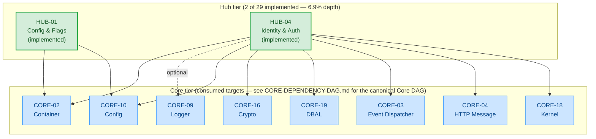

# HUB-VERIFIED-DAG — Hub Tier Verified Dependency DAG

**Task ID:** HUB-DAG-PHASE2-75
**Agent:** General-purpose (Hub DAG Phase 2 derivation)
**Date:** 2026-10-01
**Authority:** ADR-021 §11 (two-DAG governance model) — VERIFIED DAG (repository reality)
**Evidence base:** `/home/z/my-project/download/HUB-EDGE-INVENTORY.md` (Phase 1, 756 lines) + HUB-04.md reconciliation (this task)
**Scope:** Hub-tier VERIFIED DAG ONLY. This DAG records the edges that are verified in `packages/hub/*/composer.json` `require` and `packages/hub/*/src/` `use SovereignStack\*` source imports. It is the repository-reality counterpart to `HUB-DECLARED-DAG.md` (architectural intent).

---

## §0. Authority statement

This DAG is the **repository-reality** view of the Hub tier per ADR-021 §11. An edge appears in this DAG if and only if:

1. The edge source is an **implemented** Hub package (`packages/hub/{config,identity}/`), AND
2. The edge target is a SovereignStack Core package referenced either:
   - as a `sovereign-stack/core-*` entry in `composer.json` `require` (COMPILE-time evidence), OR
   - as a `use SovereignStack\Core\*` import statement in any `src/` PHP file (source-level evidence, additionally confirms runtime usage of the imported symbol)

Both evidence layers count. A `composer.json` `require` is sufficient on its own (composer resolves and autoloader guarantees the symbol). A source-level import alone is not sufficient — it would be a runtime error if the composer `require` were missing — but it strengthens the verification by naming the specific class consumed.

**Out of scope for this DAG:**
- Declared-only edges (no composer/source evidence) → belong in `HUB-DECLARED-DAG.md`
- Cross-tier edges Hub→Runtime (Hub→RUNTIME-03 Queue, Hub→RUNTIME-04 Scheduler) → belong in the future Runtime-tier DAG
- Cross-tier edges Hub→Bridge/Spoke → out of scope for any tier-DAG

---

## §1. Implemented Hub packages (the VERIFIED DAG's node set)

Per Phase 1 inventory §3, exactly **2 of 29** active Hub blueprints have any implementation on disk — a **6.9% implementation depth** for the Hub tier:

| Hub ID | Package path | composer.json `name` | `src/` PHP files | `tests/` PHP files |
|---|---|---|---|---|
| HUB-01 (Config & Flags) | `packages/hub/config/` | `sovereign-stack/hub-config` | 13 | 5 |
| HUB-04 (Identity & Auth) | `packages/hub/identity/` | `sovereign-stack/hub-identity` | 15 | 5 |

The other 27 active Hub blueprints (HUB-02, HUB-03, HUB-05–HUB-09, HUB-11–HUB-24, HUB-26–HUB-31) have **ZERO code on disk** — no `composer.json`, no `src/`, no `tests/`. They are pure architectural intent. Consequently:

- They appear in `HUB-DECLARED-DAG.md` (declared intent) but NOT here (no code to verify).
- The VERIFIED Hub DAG is necessarily tiny: 2 Hub source nodes, 0 Hub→Hub edges.

---

## §2. Verified edge inventory (10 edges, all Hub→Core)

Every verified Hub-tier edge points from one of the 2 implemented Hub packages into a SovereignStack Core package. There are **zero Hub→Hub verified edges** — see §4 for why.

### §2.1 HUB-01 (config package) — 2 verified Hub→Core edges

**`packages/hub/config/composer.json` `require` (lines 12–13):**
```
"sovereign-stack/core-container": "*",   → CORE-02
"sovereign-stack/core-config": "*",      → CORE-10
```
(plus `php`, `ext-json`, `ext-hash`, `psr/container` — non-Core, not tracked here)

**Source-level confirmation (`rg "^use SovereignStack" packages/hub/config/src/`):**
```
packages/hub/config/src/HubConfigRegistry.php:7:use SovereignStack\Core\Config\ConfigInterface;
```

| # | Source | Target | Edge Type | Requiredness | Gates | Verification evidence |
|---|---|---|---|---|---|---|
| V-01 | HUB-01 | CORE-02 | COMPILE | REQUIRED | [BUILD] | `packages/hub/config/composer.json:12` (`sovereign-stack/core-container`) |
| V-02 | HUB-01 | CORE-10 | COMPILE | REQUIRED | [BUILD] | `packages/hub/config/composer.json:13` (`sovereign-stack/core-config`) + `packages/hub/config/src/HubConfigRegistry.php:7` (`use SovereignStack\Core\Config\ConfigInterface`) |

### §2.2 HUB-04 (identity package) — 8 verified Hub→Core edges

**`packages/hub/identity/composer.json` `require` (lines 15–22):**
```
"sovereign-stack/core-container": "*",          → CORE-02
"sovereign-stack/core-config": "*",             → CORE-10
"sovereign-stack/core-crypto": "*",             → CORE-16
"sovereign-stack/core-dbal": "*",               → CORE-19
"sovereign-stack/core-http-message": "*",       → CORE-04
"sovereign-stack/core-kernel": "*",             → CORE-18
"sovereign-stack/core-event-dispatcher": "*",   → CORE-03
"sovereign-stack/core-logger": "*",             → CORE-09
```
(plus `php`, `ext-json`, `ext-openssl`, `psr/container`, `psr/http-message`, `psr/http-server-middleware`, `psr/log` — PSR contracts, not Core blueprints per se)

**Source-level confirmation (`rg "^use SovereignStack\\Core" packages/hub/identity/src/`):**
```
packages/hub/identity/src/Application/Service/IdentityApplicationService.php:4:use SovereignStack\Core\Crypto\PasswordHasher;            → CORE-16
packages/hub/identity/src/Http/AuthMiddleware.php:8:use SovereignStack\Core\Kernel\RequestContext;                              → CORE-18
packages/hub/identity/src/Infrastructure/Persistence/MySQLUserRepository.php:5:use SovereignStack\Core\Database\ConnectionInterface;  → CORE-19
```
(3 distinct source imports into Core; the other 5 Hub→Core edges for HUB-04 are composer-only — no direct source-level import into the corresponding `SovereignStack\Core\*` namespace, though PSR container/log/http-message contracts are imported at the PSR layer)

| # | Source | Target | Edge Type | Requiredness | Gates | Verification evidence |
|---|---|---|---|---|---|---|
| V-03 | HUB-04 | CORE-02 | COMPILE | REQUIRED | [BUILD] | `packages/hub/identity/composer.json:15` (`sovereign-stack/core-container`) — DI Container service wiring |
| V-04 | HUB-04 | CORE-03 | COMPILE | REQUIRED | [BUILD] | `packages/hub/identity/composer.json:21` (`sovereign-stack/core-event-dispatcher`) — declared in HUB-04.md Upward post-reconciliation (HUB-DAG-PHASE2-75) |
| V-05 | HUB-04 | CORE-04 | COMPILE | REQUIRED | [BUILD] | `packages/hub/identity/composer.json:19` (`sovereign-stack/core-http-message`) — PSR-7 implementations used by `AuthMiddleware` and `JwtService` |
| V-06 | HUB-04 | CORE-09 | COMPILE | OPTIONAL | [BUILD] | `packages/hub/identity/composer.json:22` (`sovereign-stack/core-logger`) — soft audit trail per HUB-04.md Upward |
| V-07 | HUB-04 | CORE-10 | COMPILE | REQUIRED | [BUILD] | `packages/hub/identity/composer.json:16` (`sovereign-stack/core-config`) — per-tenant Argon2id parameter overrides |
| V-08 | HUB-04 | CORE-16 | COMPILE | REQUIRED | [BUILD] | `packages/hub/identity/composer.json:17` (`sovereign-stack/core-crypto`) + `src/Application/Service/IdentityApplicationService.php:4` (`PasswordHasher`) |
| V-09 | HUB-04 | CORE-18 | COMPILE | REQUIRED | [BUILD, RUNTIME] | `packages/hub/identity/composer.json:20` (`sovereign-stack/core-kernel`) + `src/Http/AuthMiddleware.php:8` (`RequestContext`) — declared in HUB-04.md Upward post-reconciliation (HUB-DAG-PHASE2-75) |
| V-10 | HUB-04 | CORE-19 | COMPILE | REQUIRED | [BUILD] | `packages/hub/identity/composer.json:18` (`sovereign-stack/core-dbal`) + `src/Infrastructure/Persistence/MySQLUserRepository.php:5` (`ConnectionInterface`) |

---

## §3. Mermaid graph



**Legend:**
- Solid arrow (`-->`) = COMPILE, REQUIRED edge
- Dashed arrow (`-.->`) labeled `optional` = COMPILE, OPTIONAL edge (only HUB-04→CORE-09 in this DAG)
- Green-filled box = implemented Hub package
- Blue-filled box = Core target (referenced; canonical Core DAG is in `Architecture/Core/CORE-DEPENDENCY-DAG.md`)

---

## §4. Why the VERIFIED Hub DAG has zero Hub→Hub edges

This is the dominant fact about the Hub tier as of 2026-10-01: the two implemented Hub packages (config + identity) have **no compile-time coupling to each other**.

Verification commands run during Phase 1 evidence collection (§4.3 of the Phase 1 inventory):

```
$ rg "sovereign-stack/hub-" packages/hub/*/composer.json
packages/hub/config/composer.json:2:    "name": "sovereign-stack/hub-config",
packages/hub/identity/composer.json:2:    "name": "sovereign-stack/hub-identity",
```
→ Only the two `name` fields match — no `sovereign-stack/hub-*` entry appears in any Hub package's `require` section.

```
$ rg "^use SovereignStack\\\\Hub\\\\" packages/hub/{identity,config}/src/
packages/hub/identity/src/...   (only intra-package: SovereignStack\Hub\Identity\*)
packages/hub/config/src/...     (only intra-package: SovereignStack\Hub\Config\*)
```
→ Every `use SovereignStack\Hub\*` import found in source code is **intra-package** (the identity package importing its own `SovereignStack\Hub\Identity\*` namespace, the config package importing its own `SovereignStack\Hub\Config\*` namespace). No cross-package Hub imports exist.

**Implication:** The Hub tier today is a contract-coupled set of independent packages. Every cross-Hub dependency exists only in blueprint prose (DECLARED DAG, 76 edges post-Phase-2-resolution); none has been expressed in code or composer yet. As the 27 unimplemented Hub blueprints land, the VERIFIED Hub DAG will grow Hub→Hub edges — but today it has none.

---

## §5. Edge status summary (VERIFIED DAG scope)

| Status | Count | Notes |
|---|---|---|
| VERIFIED (declared in blueprint AND verified in composer/source) | 10 | All Hub→Core. See §2.1 + §2.2 tables. |
| DECLARED_ONLY (declared in blueprint, not verified in code) | 0 | The VERIFIED DAG excludes these by definition. See HUB-DECLARED-DAG.md for the 140 DECLARED_ONLY edges. |
| UNDECLARED_VERIFIED (verified in code, not declared in blueprint) | 0 | The 3 previously-UNDECLARED_VERIFIED edges (HUB-04→CORE-03/CORE-04/CORE-18) are now declared in HUB-04.md Upward per HUB-DAG-PHASE2-75 Resolution 3 → all 3 are now VERIFIED. |
| INVALID | 0 | No verified edge points to a non-existent target. All 8 Core targets consumed (CORE-02, CORE-03, CORE-04, CORE-09, CORE-10, CORE-16, CORE-18, CORE-19) are active Core blueprints. |
| **Total verified Hub-tier edges** | **10** | All Hub→Core; 0 Hub→Hub. |

---

## §6. Cross-DAG reconciliation

| Property | VERIFIED DAG (this file) | DECLARED DAG (HUB-DECLARED-DAG.md) |
|---|---|---|
| Hub node count | 2 (only HUB-01, HUB-04 implemented) | 29 (all active Hub blueprints) |
| Hub→Hub edge count | 0 | 76 |
| Hub→Core edge count | 10 | 74 |
| Total edges | 10 | 150 |
| Acyclic (build-order)? | Yes — trivially, since 2 nodes with no inter-Hub edges cannot cycle | Yes — post-Resolution 1 (HUB-08↔HUB-15 and HUB-21↔HUB-01 split by edge_type, leaving the COMPILE subgraph acyclic) |
| Buildable as a topological order? | Yes, but trivial: HUB-01 and HUB-04 build in parallel, each after its Core prereqs (CORE-02, CORE-10 for HUB-01; CORE-02, CORE-03, CORE-04, CORE-09, CORE-10, CORE-16, CORE-18, CORE-19 for HUB-04) | Yes, after the Phase 2 cycle splits — but the topological order is the architectural intent, NOT the repository reality |

---

## §7. Authority statement (closing)

This DAG is the **repository-reality** Hub DAG per ADR-021 §11. It is updated when:

1. A new Hub package is implemented under `packages/hub/<name>/` with a `composer.json` declaring `sovereign-stack/core-*` or `sovereign-stack/hub-*` requires, OR
2. An existing Hub package adds a new `sovereign-stack/*` entry to its `composer.json` `require`, OR
3. An existing Hub package adds a new `use SovereignStack\Core\*` or `use SovereignStack\Hub\<OtherPackage>\*` import to any `src/` PHP file.

Until then, this DAG remains at 10 edges and 2 Hub nodes. The next plausible growth event is the landing of HUB-02 (Cache) — which would add at minimum a HUB-04→HUB-02 edge (declared in HUB-04.md Upward; verified once `packages/hub/cache/composer.json` requires `sovereign-stack/hub-identity` or vice versa, or once `packages/hub/identity/src/` imports `SovereignStack\Hub\Cache\*`).

The VERIFIED DAG is the authoritative input for **repository-reality build orders**. The DECLARED DAG is the authoritative input for **architectural-intent build orders** (e.g., the future HUB-BUILD-ORDER.md, deferred to Phase 3 per SAAI).

**End of HUB-VERIFIED-DAG.md.**
