# INDEX — Governance & Numbering Authority

**Status:** Canonical.
**Scope:** the polyrepo, tier-isolated Sovereign Stack (Core → Hub → Bridge → Spokes → Deploy).
**Last verified against `main`:** 2026-08-05.
**Merged from:** `01_MASTER_INDEX(4).md` (governance rules, DAG, build sequence, fidelity bar) and
`01_MASTER_INDEX(5).md` (the eight cross-reference drift patterns, HUB-31 registration, Finding 15).
Five other `01_MASTER_INDEX*` revisions are archived under `Analysis_Critiques_Rewrites/`.

This document is the **single source of truth** for the DGLab Sovereign Stack architecture. If any
other document disagrees with this index on an ID→component mapping, a tier count, or a
cross-reference, **this index is correct and the other document is stale** (Governance Rule 1).

---

## §1. Single-source-of-truth declaration

### Canonical (active development)

| Path | Contents |
|---|---|
| `Architecture/Core/CORE-01..20` | 20 Core-tier blueprints |
| `Architecture/Hub/HUB-01..30` | 30 Hub-tier blueprints |
| `Architecture/Spoke/Internal/ISPOKE-01..25` | 25 Internal Spoke blueprints (16–25 are placeholder blueprints) |
| `Architecture/Spoke/External/ESPOKE-01..15` | 15 External Spoke blueprints |
| `Architecture/Spoke/Bridge/BRIDGE-01` | 1 Bridge blueprint |
| `Architecture/Deploy/DEPLOY-00..04` | 5 Deploy blueprints (00 renamed; 02/03/04 are stubs) |
| `Architecture/ADRs/ADR-001..010` | 10 Accepted Architecture Decision Records |
| `Architecture/ADRs/ADR-011` | 1 **Proposed** ADR (HUB-31) — not accepted, not counted |
| `Architecture/CrossCutting/` | STRUCTURE-01..09, OBSERVABILITY, GLOSSARY, THREAT_MODEL |
| `orchestrator/` | CORE-01 reference implementation (real, tested) |
| `packages/core/event-dispatcher/` | CORE-03 reference implementation (real, tested) |
| `packages/core/container/` | CORE-02 reference implementation — **stub only (`.gitkeep`)**; full spec in `Core/CORE-02.md` |

### Archived — read-only, banner-only, never merged

Each of these trees carries an `ARCHIVED.md`. They are preserved for provenance. **No content may be
copied from them into `Architecture/` without re-verifying it against this index.**

| Path | Reason |
|---|---|
| `Arc/` | Direct predecessor of `Architecture/`; superseded in full |
| `Analysis_Critiques_Rewrites/` | The provenance corpus (critiques, rewrites, chat exports); contained a plaintext GitHub PAT — see the security note in its `ARCHIVED.md` |
| `docs/blueprints/` | A **third, incompatible** CORE numbering, and cites `thephpleague/event` which is not a dependency (Finding 20). **Never merge content from here.** |
| `docs/architecture/origin/` | Vision A — the CMS-Studio monolith rebuild; contradicts Vision B on every tier boundary (Findings 1, 5, 6, 7) |
| `docs/evaluation/` | Scores a Core tier that no longer exists (Finding 2) |
| `Legacy/` | Vision A code |

### Replaced (root-level artefacts)

| Path | Replacement |
|---|---|
| Root `Dockerfile` | Serves the *legacy* docs (Finding 18) — replaced by `Deploy/DEPLOY-00.md` (docs, pointing at `Architecture/`) and `Deploy/DEPLOY-01.md` (application image) |
| Root `render.yaml` | Free-tier docs hosting — replaced by `Deploy/DEPLOY-00.md` |
| Root `docker-compose.yml` | Empty (Finding 17) — replaced by the dev-environment compose file in `Deploy/DEPLOY-01.md` |

---

## §2. Canonical ID → component map

**This section is the only place a Core/Hub/Spoke/Bridge/Deploy ID's identity is defined.**

### §2.1 Core tier

| ID | Component | Namespace | Real implementation | Build status |
|---|---|---|---|---|
| CORE-01 | Polyrepo Orchestrator ("Loom") | `SovereignStack\Orchestrator` | `orchestrator/` | ✅ Implemented + tested |
| CORE-02 | Dependency Injection Container | `SovereignStack\Core\Container` | `packages/core/container/` | ❌ **Stub only (`.gitkeep`) — blocking** |
| CORE-03 | PSR-14 Event Dispatcher | `SovereignStack\Core\EventDispatcher` | `packages/core/event-dispatcher/` | ✅ Implemented + tested |
| CORE-04 | PSR-7 HTTP Message & Factory | `SovereignStack\Core\Http` | — | 📝 Not started |
| CORE-05 | PSR-15 Middleware & Request Handler | `SovereignStack\Core\Http` | — | 📝 Not started |
| CORE-06 | Attribute-Based Router | `SovereignStack\Core\Router` | — | 📝 Not started |
| CORE-07 | SuperPHP Lexer | `SovereignStack\Core\SuperPHP\Lexer` | — | 📝 Not started |
| CORE-08 | Global Error & Exception Handler | `SovereignStack\Core\Error` | — | 📝 Not started |
| CORE-09 | **PSR-3 Logging Service** | `SovereignStack\Core\Logging` | — | 📝 Not started |
| CORE-10 | Configuration & Environment Loader | `SovereignStack\Core\Config` | — | 📝 Not started |
| CORE-11 | SuperPHP Parser | `SovereignStack\Core\SuperPHP\Parser` | — | 📝 Not started |
| CORE-12 | SuperPHP Compiler | `SovereignStack\Core\SuperPHP\Compiler` | — | 📝 Not started |
| CORE-13 | CLI Engine (Console) | `SovereignStack\Core\Console` | — | 📝 Not started |
| CORE-14 | Filesystem Abstraction | `SovereignStack\Core\Filesystem` | — | 📝 Not started |
| CORE-15 | Cache Abstraction (PSR-6/16) | `SovereignStack\Core\Cache` | — | 📝 Not started |
| CORE-16 | **Binary Encryption Envelope** | `SovereignStack\Core\Crypto` | — | 📝 Not started |
| CORE-17 | Service Provider System | `SovereignStack\Core\Providers` | — | 📝 Not started |
| CORE-18 | Core Kernel & Lifecycle | `SovereignStack\Core\Kernel` | — | 📝 Not started |
| CORE-19 | Database Abstraction Layer | `SovereignStack\Core\Database` | — | 📝 Not started |
| CORE-20 | Developer CLI Toolchain ("Sovereign Forge") | `SovereignStack\Forge` | — | 📝 Not started |

> **CORE-09 is logging. CORE-16 is cryptography.** These two are the single most-confused pair in the
> corpus (Finding 3, Pattern A — 14 files). Any document that cites `CORE-09` for hashing, encryption,
> signing, or payload verification is wrong, and `Verification/lint/run.php` fails the build on it.

**Stale evaluation-layer mapping — do not use:** CORE-01="Bootstrapper & Kernel", CORE-02="Lifecycle
Hooks", CORE-03="Service Container", CORE-04="Encryption Primitives", CORE-05="Router & Dispatch",
CORE-06, CORE-07="Middleware Pipeline", CORE-08, CORE-09="Error Handling", CORE-11="ORM & Query
Builder", CORE-14="Caching Layer", CORE-15="Validation Engine", CORE-16="Logging & Observability",
CORE-17, CORE-18="Event System", CORE-19="Service Locator". All wrong (Finding 2).

**Critical-path correction:** the true build-blocking dependency is **CORE-02**, not the kernel
(CORE-18) and not the orchestrator (CORE-01, already done). Nearly every Hub blueprint lists CORE-02 as
a dependency and is therefore blocked. §5 makes closing CORE-02 the top priority.

### §2.2 Hub tier

Full descriptions and categories: `CrossCutting/GLOSSARY.md` §1.2.

| ID | Component | ID | Component |
|---|---|---|---|
| HUB-01 | Sovereign Hub Config & Flags | HUB-16 | Sovereign Hub Weaver |
| HUB-02 | Sovereign Cache & State | HUB-17 | Sovereign Webhook Nexus |
| HUB-03 | Sovereign Asset Engine | HUB-18 | Sovereign Media Forge |
| HUB-04 | Sovereign Identity & Authentication | HUB-19 | Sovereign Guard (Validation) |
| HUB-05 | Sovereign Guardian (RBAC) | HUB-20 | Sovereign Vault |
| HUB-06 | Sovereign Auditor | HUB-21 | Sovereign Nexus (Tenancy) |
| HUB-07 | Sovereign Throttle | HUB-22 | Sovereign Ledger (Billing) |
| HUB-08 | Sovereign Gateway | HUB-23 | Sovereign Reporter |
| **HUB-09** | **Sovereign Signal (Event Bus)** — *renamed from "Sovereign Pulse"* | HUB-24 | Sovereign GraphQL Registry |
| HUB-10 | Sovereign Queue | HUB-25 | Sovereign Chronos (Scheduler) |
| HUB-11 | Sovereign Cloud Storage | HUB-26 | Sovereign UI (Elements) |
| HUB-12 | Sovereign Notify | HUB-27 | Sovereign Sentinel (Headers) |
| HUB-13 | Sovereign Translator | **HUB-28** | **Sovereign Versioner** — API versioning, *not* analytics |
| HUB-14 | Sovereign Search | HUB-29 | Sovereign Hub Spec (Testing) |
| HUB-15 | Sovereign Pulse (Health Check & Service Discovery) | HUB-30 | Sovereign Hub-CLI |

| Proposed | Component | Status |
|---|---|---|
| HUB-31 | Real-Time Analytics & Metrics Ledger | **Proposed, not accepted** — `ADRs/ADR-011-hub-31-real-time-analytics.md`, `OPEN-DECISIONS.md` OD-01. Not counted in §4. No blueprint file. |

> **HUB-28 is API versioning.** Five spoke blueprints cited `HUB-28: Distributed Ledger & Analytics
> Engine`, which never existed (Pattern B). All five are corrected — three to `HUB-31 (pending)`, one
> to `HUB-23`, one dropped.
>
> **"Sovereign Pulse" is reserved for `HUB-15`.** `HUB-09` was renamed **Sovereign Signal** because the
> bare word *Pulse* is the reserved architectural noun for a unit of runtime work
> (`CrossCutting/STRUCTURE-01-Wheel.md` §B.1).

### §2.3 Spoke, Bridge, and Deploy tiers

Full name tables: `CrossCutting/GLOSSARY.md` §1.3–§1.5.

- **Internal Spokes** — `ISPOKE-01..15` documented; `ISPOKE-16..25` are placeholder blueprints
  (present as files, deliberately below the fidelity bar).
- **External Spokes** — `ESPOKE-01..15`, all documented.
- **Bridge** — `BRIDGE-01` (The Vanguard), `SovereignStack\Bridge`.
- **Deploy** — `DEPLOY-00` (Documentation Site, renamed), `DEPLOY-01` (Core & Hub Service Deployment),
  `DEPLOY-02`/`03`/`04` (stubs).

**Namespace rule.** Every PHP namespace in this architecture starts with `SovereignStack\`. Internal
Spokes are `SovereignStack\Internal\<Name>`; External Spokes `SovereignStack\External\<Name>`; Hub
`SovereignStack\Hub\<Name>`; Core `SovereignStack\Core\<Name>` (except `SovereignStack\Orchestrator`
and `SovereignStack\Forge`). The bare `Sovereign\` prefix used by seven predecessor files is
withdrawn.

---

## §3. Cross-reference corrections (Findings 3 and 15)

What began as a single fix (`BRIDGE-01`'s `CORE-09`) turned out to be **eight recurring,
independently-introduced mislabelling patterns** once the full Spoke tiers were read. This table is the
single correction reference for all of them.

| Pattern | Wrong reference | Corrected reference | Files originally affected |
|---|---|---|---|
| **A** | `CORE-09: Cryptography & Hashing` | `CORE-16: Binary Encryption Envelope` | `BRIDGE-01`, `ISPOKE-05`,`06`,`10`,`13`,`15`, `ESPOKE-02`,`03`,`07`,`08`,`09`,`10`,`13`,`14` |
| **B** | `HUB-28: Distributed Ledger & Analytics Engine` | Split three ways — see §2.2 and ADR-011 | `ISPOKE-05`,`10`,`12`,`13`,`15`, `ESPOKE-05` |
| **C** | Queue attributed to `HUB-11` or `HUB-14` | `HUB-10: Sovereign Queue` (`HUB-11` is Cloud Storage) | `SOLUTIONS_TO_WEAKNESSES.md`, `ISPOKE-07`,`09`, `ESPOKE-06`,`13` |
| **D** | `HUB-12` used for Event Bus / pub-sub | `HUB-09: Sovereign Signal (Event Bus)` (`HUB-12` is Notify) | `ISPOKE-07`,`08`,`15`, `ESPOKE-06` |
| **E** | `HUB-13`/`HUB-14` swapped for Search/Media | `HUB-14` = Search; Media is `HUB-18`; `HUB-13` is Translator | `ISPOKE-09`,`14`, `ESPOKE-04` |
| **F** | `CORE-07` used for Event Dispatcher or HTTP Message | `CORE-07` is SuperPHP Lexer; Event Dispatcher is `CORE-03`; HTTP Message is `CORE-04` | `ESPOKE-02`,`13`,`15` |
| **G** | Reference to a Core "phase" that was never real | No mapping exists — dropped, not redirected | `ESPOKE-02` (`CORE-08` as HTTP Client), `ESPOKE-15` (`CORE-15` as Process Management) |
| **H** | Wrong Internal Spoke ID referenced from External Spokes | `ISPOKE-05`=Insight, `ISPOKE-13`=Ledger (Billing), `ISPOKE-14`=Nexus (Tenancy) | `ESPOKE-09`,`10`, `ESPOKE-14` |

Two further corrections outside the pattern set:

| Source | Wrong reference | Correct reference | Finding |
|---|---|---|---|
| `BRIDGE-01` | `CORE-01: Polyrepo Orchestrator (Enforcement Logic)` | *(removed — CORE-01 is the release tool, not an enforcement component)* | 3 |
| `BRIDGE-01` | `CORE-06: Router (Gateway Routing)` | `HUB-08: Sovereign Gateway` | 3 |
| `CORE-03` | "referencing CORE-08" for listener exception logging | `CORE-09: PSR-3 Logging Service` | 20 |
| `CORE-03` | "Reference: `thephpleague/event`" | *(removed — only `psr/event-dispatcher` is a dependency)* | 20 |

**This class of bug is now mechanically prevented.** `Verification/lint/run.php` re-derives every
`CORE-/HUB-/ISPOKE-/ESPOKE-/BRIDGE-/DEPLOY-` reference against this section and fails the build on a
mismatch.

---

## §4. Tier inventory

| Tier | Documented | Placeholder-only | **Total files** |
|---|---|---|---|
| Core | 20 | 0 | **20** |
| Hub | 30 | 0 | **30** |
| Internal Spoke | 15 | 10 (`ISPOKE-16`–`25`) | **25** |
| External Spoke | 15 | 0 | **15** |
| Bridge | 1 | 0 | **1** |
| Deploy | 2 (`DEPLOY-00`, `DEPLOY-01`) | 3 (`DEPLOY-02`–`04`, stubs) | **5** |
| **Total** | **83** | **13** | **96** |

**Not counted:** `HUB-31` — proposed only (ADR-011). If ADR-011 is accepted, Hub becomes 31 and the
total becomes 97.

**Hub criticality distribution** (corrected from Finding 14: the taxonomy claimed "Medium | 6" while
listing 5, and totalled 31 against 30 rows):

| Criticality | Count | Blueprints |
|---|---|---|
| Critical | 10 | HUB-01, 02, 04, 05, 08, 09, 10, 19, 20, 21 |
| High | 15 | HUB-03, 06, 07, 11, 12, 14, 15, 17, 22, 24, 25, 26, 27, 29, 30 |
| Medium | 5 | HUB-13, 16, 18, 23, 28 |
| **Total** | **30** | |

**Timeline impact.** Every "32-week total timeline" claim in the archived evaluation layer assumed 15
Internal Spokes. With 25, Phase 3 re-estimates at roughly 1.6×, or is split into Phase 3a (the 15
documented spokes) and Phase 3b (`ISPOKE-16`–`25`). See `Migration/04_MIGRATION_PLAN.md`; the realistic
end-to-end figure is **40–48 weeks** with a 3-person team (Finding 15), not 32.

---

## §5. Tier dependency DAG & build sequence

### §5.1 Edge-direction convention (binding)

Every blueprint's `Dependency Status` section uses these two words with exactly these meanings — the
same meanings as `AUTHORING_GUIDE.md`:

- **Upward** — the IDs **this component consumes**.
- **Downward** — the IDs that **consume this component**.

A pair of components that each list the other as *Downward* is a **cycle** and a broken build, even if
the intent was harmless. `Verification/lint/run.php` detects mutual-downward pairs. Two such pairs
existed before consolidation and are fixed: `HUB-03`↔`HUB-11` and the `Upward`/`Downward` label
inversion inside `DEPLOY-01`'s Integration Strategy.

**Tier order is absolute** (ADR-004): `Core → Hub → Bridge → Spoke → Deploy`. A Deploy blueprint may
never appear in a Core blueprint's *Upward* list; `CORE-01` is upstream of `DEPLOY-01`, never the
reverse.

### §5.2 Dependency DAG

```mermaid
graph TD
    %% Core tier (foundational)
    C02[CORE-02 DI Container]
    C10[CORE-10 Config]
    C09[CORE-09 Logging]
    C08[CORE-08 Error Handler]
    C18[CORE-18 Kernel]
    C04[CORE-04 HTTP Message]
    C05[CORE-05 Middleware]
    C06[CORE-06 Router]
    C19[CORE-19 DBAL]
    C15[CORE-15 Cache Abstraction]
    C14[CORE-14 Filesystem]
    C16[CORE-16 Encryption]
    C07[CORE-07 SuperPHP Lexer]
    C11[CORE-11 SuperPHP Parser]
    C12[CORE-12 SuperPHP Compiler]
    C13[CORE-13 CLI Engine]
    C17[CORE-17 Service Providers]
    C20[CORE-20 Dev CLI/Forge]
    C03[CORE-03 Event Dispatcher]
    C01[CORE-01 Polyrepo Orchestrator]

    C02 --> C10
    C02 --> C09
    C02 --> C17
    C10 --> C08
    C09 --> C18
    C08 --> C18
    C02 --> C18
    C03 --> C18
    C04 --> C05
    C05 --> C06
    C18 --> C06
    C10 --> C19
    C15 --> C14
    C16 --> C15
    C07 --> C11
    C11 --> C12
    C17 --> C13
    C20 --> C13

    %% Hub tier (selected critical)
    H01[HUB-01 Config & Flags]
    H02[HUB-02 Cache & State]
    H03[HUB-03 Asset Engine]
    H04[HUB-04 Identity]
    H06[HUB-06 Auditor]
    H08[HUB-08 Gateway]
    H11[HUB-11 Cloud Storage]
    H15[HUB-15 Health]
    H19[HUB-19 Validation]
    H20[HUB-20 Vault]

    C10 --> H01
    C02 --> H01
    C19 --> H01
    C15 --> H02
    C02 --> H02
    C16 --> H02
    C14 --> H11
    C10 --> H11
    H11 --> H03
    C14 --> H03
    C10 --> H03
    C19 --> H04
    C16 --> H04
    H02 --> H04
    C19 --> H06
    H04 --> H06
    C03 --> H06
    C06 --> H08
    H04 --> H08
    C10 --> H15
    C14 --> H15
    H02 --> H15
    C19 --> H19
    C16 --> H20
    C19 --> H20

    %% Bridge & Spokes
    B01[BRIDGE-01 Vanguard]
    H08 --> B01
    H04 --> B01
    H06 --> B01
    H15 --> B01
    C16 --> B01

    IS01[ISPOKE-01 Command Center]
    H01 --> IS01
    H04 --> IS01
    H06 --> IS01
    H15 --> IS01

    ES01[ESPOKE-01 Sovereign Canvas]
    B01 --> ES01
    H01 --> ES01
    H04 --> ES01

    %% Deploy is terminal
    D01[DEPLOY-01 Core & Hub Deployment]
    C01 --> D01
    C18 --> D01
    H15 --> D01
    D02[DEPLOY-02 Datastores]
    D03[DEPLOY-03 Edge]
    D04[DEPLOY-04 Promotion]
    D01 --> D02
    D01 --> D03
    D01 --> D04
    D02 --> D04
    D03 --> D04

    classDef core fill:#EFF6FF,stroke:#1E40AF
    classDef hub fill:#F0FDF4,stroke:#166534
    classDef bridge fill:#FEF3C7,stroke:#92400E
    classDef spoke fill:#FDF2F8,stroke:#9D174D
    classDef deploy fill:#F5F3FF,stroke:#5B21B6
    class C01,C02,C03,C04,C05,C06,C07,C08,C09,C10,C11,C12,C13,C14,C15,C16,C17,C18,C19,C20 core
    class H01,H02,H03,H04,H06,H08,H11,H15,H19,H20 hub
    class B01 bridge
    class IS01,ES01 spoke
    class D01,D02,D03,D04 deploy
```



### §5.3 Build sequence (11 steps)

The archived evaluation's sequence (`CORE-01 → 02 → 03 → 05 → 06 → 07 → 10`) is derived from the stale
Core numbering and is wrong (Finding 2). The correct sequence, derived from the DAG above:

| Step | Work items | Entry criteria | Exit criteria | Est. effort |
|---|---|---|---|---|
| 1 | **CORE-02** (DI Container) | None — foundational leaf | Container compiles, autowires, detects cycles, passes PSR-11 suite | 1 week |
| 2 | **CORE-10, CORE-09, CORE-08** — parallelizable | Step 1 lands | All three pass CI; Config loads `.env` + JSON; Logging writes structured JSON; Error Handler converts all PHP errors to exceptions | 2 weeks |
| 3 | **CORE-18** (Kernel) | Steps 1–2 land | Kernel boots, runs boot-phase events via CORE-03, terminates cleanly | 1 week |
| 4 | **CORE-04 → CORE-05 → CORE-06** — sequential | Step 3 lands | A "Hello World" request completes the full pipeline | 2 weeks |
| 5 | **CORE-19, CORE-15, CORE-14, CORE-16** — parallelizable | Step 1 lands (Kernel not required) | Each passes CI; DBAL targets **PostgreSQL 16** (ADR-007); Cache is PSR-6/16 over **Redis 7** (ADR-006); Filesystem abstracts local + S3; Encryption is AES-256-GCM + Argon2id (ADR-008) | 3 weeks |
| 6 | **CORE-07 → CORE-11 → CORE-12** (SuperPHP) — sequential | None | SuperPHP renders a template with variables and conditionals (ADR-005: Blade/Twig are rejected) | 3 weeks |
| 7 | **CORE-13, CORE-17, CORE-20** — parallelizable | Steps 1–3 land | CLI runs commands; providers register bindings; Forge scaffolds a new Hub service | 2 weeks |
| 8 | **Hub tier** (30 blueprints) | Steps 1–7 land | All 30 pass CI; HUB-15 reports all Hub services healthy | 12 weeks |
| 9 | **BRIDGE-01** (Vanguard) | Step 8 lands (minimum HUB-04, HUB-06, HUB-08, HUB-15) | Default-deny enforced; DTO transformation works; zero-exposure test passes | 2 weeks |
| 10 | **Internal Spokes 01–15**, then **16–25** (Phase 3b) | Step 9 lands | All 25 pass CI; admin panel operational | 12 weeks |
| 11 | **External Spokes 01–15** | Step 9 lands (may parallel Step 10 if the Bridge is stable) | All 15 pass CI; public CMS serves traffic through the Bridge | 8 weeks |

**Minimum critical path:** Steps 1 → 2 → 3 → 4 → 8 → 9 → 11 = **28 weeks** of sequential work, with
Steps 5–7 overlapping Step 4 and Step 10 overlapping Step 11. **Realistic end-to-end with a 3-person
team: 40–48 weeks** (Finding 15).

---

## §6. Deploy tier

The original `DEPLOY-01` deployed only Markdown documentation (Finding 9) — and the *legacy*
documentation at that (Finding 18). The tier is 5 blueprints:

| ID | Component | Origin | Status |
|---|---|---|---|
| DEPLOY-00 | Documentation Site | Renamed from the docs-only `DEPLOY-01`; document root corrected to `Architecture/` | Documented |
| DEPLOY-01 | Core & Hub Service Deployment | New — containerized Core+Hub, one OCI image per Hub service, health checks wired to `HUB-15` | Documented |
| DEPLOY-02 | Datastore Provisioning | New — **PostgreSQL 16** + **Redis 7** + queue broker; secrets via `HUB-20`/sealed-secrets; backup/restore | Stub |
| DEPLOY-03 | Bridge & External Spoke Deployment | New — public tier, CDN/edge caching via `HUB-02`, network-policy enforcement of the Zero-Exposure Test, 3-replica Vanguard | Stub |
| DEPLOY-04 | Multi-Environment & Promotion Pipeline | New — dev → staging → production across 50+ repos; ties into `CORE-01` (Loom); immutable image-digest promotion | Stub |

---

## §7. Governance rules

Binding on all contributions. `Verification/lint/run.php` enforces the mechanical subset.

**Rule 1 — One numbering authority.** §2 is the only place a Core/Hub/Spoke/Bridge/Deploy ID's identity
is defined. A blueprint that changes a component's ID, name, or scope must update §2 in the same
commit. A blueprint and this index disagreeing is a **broken build**.

**Rule 2 — No performance target without a method.** Every performance target must name its
**harness** (e.g. PHPUnit `--group performance`, `wrk`, `k6`), its **baseline** (hardware/runtime,
e.g. GitHub Actions `ubuntu-latest`, PHP 8.3, opcache on, Xdebug off), and its **load model**
(concurrency, request mix, dataset size). A target that cannot meet this bar must be written
**"provisional, unverified"**. Bare millisecond claims are forbidden (Finding 10).

**Rule 3 — Evaluation docs are dated snapshots.** Any evaluation document must carry
`Valid as of commit <sha>. Do not use for planning without re-verification.` The archived
`docs/evaluation/` tree is valid as of an unknown pre-renumbering commit and must not be used
(Finding 2).

**Rule 4 — Rejections need a real reason.** A `disapproved/` entry must state specifically what was
rejected and why. The single boilerplate line *"Varying from the original blueprints"* covering 74
files is insufficient (Finding 12).

**Rule 5 — Solutions must land in the artefact, not beside it.** A weakness write-up is not resolved
until the referenced blueprint file is edited (Finding 11).

**Rule 6 — Duplicate directories require a diff check.** Nothing named `*_Optimized`, `*_v2`,
`*_mobile`, or similar may be committed without CI verifying it is not byte-identical (or within a 5%
size delta) to its source (Findings 5, 18).

**Rule 7 — Blueprint fidelity bar.** See `AUTHORING_GUIDE.md`. Placeholder and stub blueprints are
explicitly exempt and must say so in their first paragraph; everything else is gated.

**Rule 8 — ADRs are required for non-obvious decisions.** Any decision with a viable alternative is
recorded in `ADRs/` in Nygard format before the corresponding blueprint merges (Finding 19).

**Rule 9 — Open questions are recorded, never silently resolved.** Any fork this consolidation could
not close is in `OPEN-DECISIONS.md` with an owner and a decision route. Picking one silently is a
governance violation.

---

## §8. Verification

| Artefact | Purpose |
|---|---|
| `Verification/INCONSISTENCIES.md` | Human-readable scan report: every contradiction found, its resolution, and its status |
| `Verification/lint/run.php` | The machine-readable mirror; exits non-zero with `file:line + rule-id` on any violation |
| `Verification/lint/architecture-lint.yml` | GitHub Actions wiring — runs on every PR touching `Architecture/**` |

Run locally:

```bash
php Architecture/Verification/lint/run.php
```

---

## §9. Change log

| Date | Change | Author |
|---|---|---|
| 2026-08-04 | Initial canonical declaration; supersedes the stale evaluation layer | Independent re-analysis |
| 2026-08-05 | Consolidation: merged `01_MASTER_INDEX(4)`+`(5)`; `Architecture/` declared sole source of truth; 4 legacy trees archived; 20 documented inconsistencies reconciled (see `Verification/INCONSISTENCIES.md`); `HUB-09` renamed; `DEPLOY-00` rename executed; `ISPOKE-16..25` and `DEPLOY-02..04` materialised; ADR-011 (HUB-31) filed as Proposed; CI lint added | Consolidation pass |
