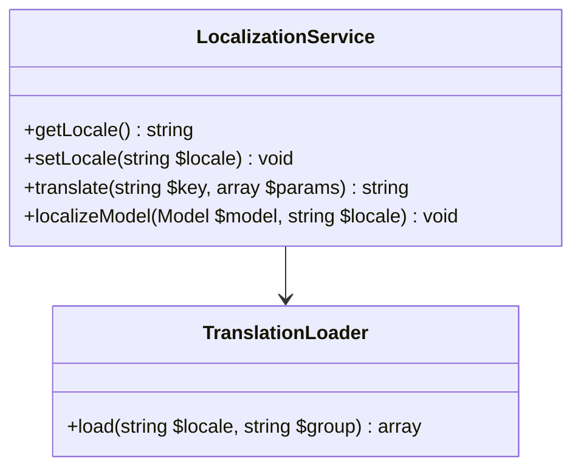

# Localization Service Specification

## 1. Overview
The `LocalizationService` enables multi-language support across the DGLab ecosystem, handling both static UI translations and dynamic content localization for CMS Studio.

## 2. Core Concepts

### UI Translations (i18n)
Managed via pure PHP translation files or a JSON-based key-value store.
```php
echo trans('auth.login_success'); // Returns "Welcome back!" or "¡Bienvenido!"
```

### Content Localization (l10n)
Handles field-level translations for CMS Studio models.
- **Strategy**: EAV-based or JSON-column storage for translated fields.
- **Fallback**: Automatically falls back to the default locale if a translation is missing.

## 3. Architecture


## 4. Hub-and-Spoke Integration
- **Hub Preference**: The Hub manages the user's preferred locale (via session, cookie, or URL prefix).
- **Spoke Readiness**: Spokes must utilize the `trans()` helper for all user-facing strings to ensure consistency with the Hub's active locale.

## 5. History & Evolution
- **Phase 1 (Static Strings)**: Initial support for file-based translations in `resources/lang/`.
- **Phase 2 (Locale Middleware)**: Automatically detecting the locale from the `Accept-Language` header or URL.
- **Phase 3 (Dynamic Content)**: Implementation of the `Localizable` trait for Eloquent-style models.

## 6. Future Roadmap
- **Phase 4: Database Translation Store (M)**: Moving UI translations into the database for live editing in CMS Studio.
- **Phase 5: Auto-Translate (L)**: Integration with AI providers (via MangaScript) for automated content translation.
- **Phase 6: Pluralization & ICU (S)**: Full support for complex pluralization rules and ICU message formats.

## 7. Validation
### Success Criteria
- **Transparency**: Switching the locale must not require any changes to the view logic.
- **Completeness**: All user-facing strings must be translatable; no hardcoded English in the `app/` directory.
- **Speed**: Translation lookups must be cached to avoid I/O overhead.

### Verification Steps
- [ ] Confirm that the locale correctly persists across multiple requests.
- [ ] Verify that missing translation keys are logged for developer attention.
- [ ] Test the "Content App" in CMS Studio to ensure multi-language fields are correctly saved and retrieved.
