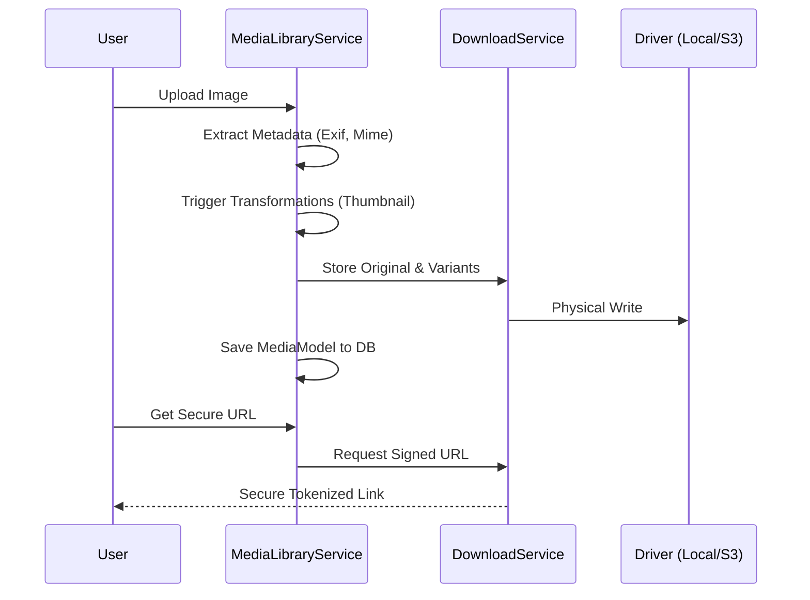

# Media Library Service Specification

## 1. Overview
The `MediaLibraryService` is an asset management layer built on top of the `DownloadService`. It provides a unified way to handle media uploads, metadata extraction, transformations (e.g., image resizing), and secure delivery.

## 2. Relationship with DownloadService
The `MediaLibraryService` acts as a high-level orchestrator, while the `DownloadService` handles the physical storage and secure token generation.



## 3. Transformations & Variants
The service supports on-the-fly and background transformations via a pluggable driver system (e.g., GD, ImageMagick).

```php
$media = Media::find(123);
$thumbnailUrl = $media->getUrl('thumbnail'); // Automatically generates if missing
```

## 4. Hub-and-Spoke Integration
- **Hub Assets**: The CMS Studio "Media Center" is the primary interface for managing global assets.
- **Spoke Assets**: Spokes can link to existing media assets or upload new ones via the service, ensuring all media follows the same security and audit rules.

## 5. History & Evolution
- **Phase 1 (Basic Uploads)**: Direct integration with `DownloadService` for raw file storage.
- **Phase 2 (Metadata Extraction)**: Automatically saving dimensions, file sizes, and MIME types.
- **Phase 3 (Image Transformations)**: Support for basic resizing and cropping using the GD driver.

## 6. Future Roadmap
- **Phase 4: CDN Integration (M)**: Support for direct S3-to-Cloudfront delivery with signed cookies.
- **Phase 5: AI-Driven Tagging (L)**: Automatic object detection and alt-text generation using the MangaScript AI orchestration engine.
- **Phase 6: Video Transcoding (XL)**: Background video processing using FFmpeg for optimized streaming.

## 7. Validation
### Success Criteria
- **Storage Efficiency**: Zero duplication of identical files (content-based hashing).
- **Security**: Media assets must be inaccessible via direct URL; all access must be tokenized.
- **Performance**: Thumbnail generation must not block the main request thread (async queue support).

### Verification Steps
- [ ] Confirm that deleting a Media record also removes all its physical file variants.
- [ ] Verify that MIME type sniffing correctly prevents malicious file uploads.
- [ ] Test the async transformation queue to ensure images are processed without impacting UI latency.
