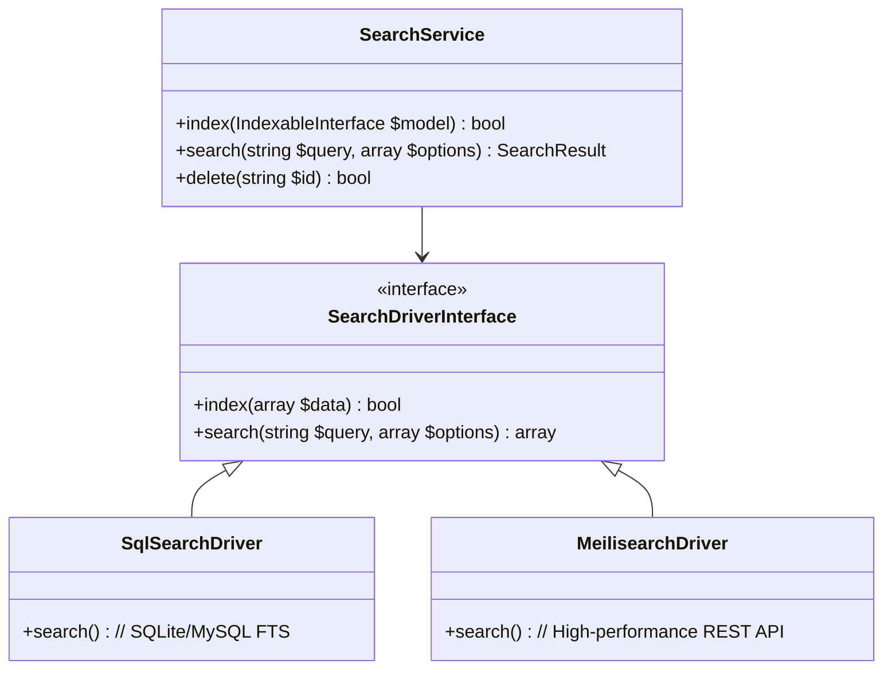

# Search Service Specification

## 1. Overview
The `SearchService` provides a unified, driver-based engine for indexing and searching content across the DGLab ecosystem. It is designed to handle full-text search requirements for the CMS Studio "Architect" and "Content" apps.

## 2. Architecture
The service follows a driver-based pattern to support multiple backends, from lightweight SQL-based search to advanced search engines.



## 3. Indexing Strategy
Models that implement the `IndexableInterface` are automatically indexed upon `save()` through a standard `ModelSaved` event listener.

```php
interface IndexableInterface {
    public function getSearchIndex(): string;
    public function toSearchArray(): array;
}
```

## 4. Hub-and-Spoke Integration
- **Hub UI**: The CMS Studio global search bar consumes the `SearchService` via a central Hub controller.
- **Spoke Indexing**: Spokes can push domain-specific data (e.g., Manga titles, EPUB metadata) into the unified search index by emitting a `Search.IndexRequested` event.

## 5. History & Evolution
- **Phase 1 (Basic SQL LIKE)**: Initial implementation using simple `LIKE` queries for development.
- **Phase 2 (SQLite FTS5)**: Leveraging SQLite's Full-Text Search extension for faster local indexing.
- **Phase 3 (Unified API)**: Establishing the `SearchService` and `IndexableInterface` for framework-wide adoption.

## 6. Future Roadmap
- **Phase 4: Meilisearch Driver (L)**: Support for a dedicated, low-latency search server for production environments.
- **Phase 5: Faceted Search (M)**: Support for filtering results by category, author, date, and custom EAV attributes.
- **Phase 6: Multi-Tenant Indexing (S)**: Native isolation of search results based on `tenant_id`.

## 7. Validation
### Success Criteria
- **Latency**: Search results returned in < 150ms for 10,000 documents using the SQL driver.
- **Accuracy**: Relevance-based sorting of results (BM25 or similar for FTS).
- **Consistency**: Updates to models must reflect in the search index within 1 second.

### Verification Steps
- [ ] Verify that saving an `Indexable` model triggers a background indexing job.
- [ ] Confirm that search results are correctly filtered by the current `tenant_id`.
- [ ] Run benchmark tests with 100 concurrent search requests to ensure stability.
