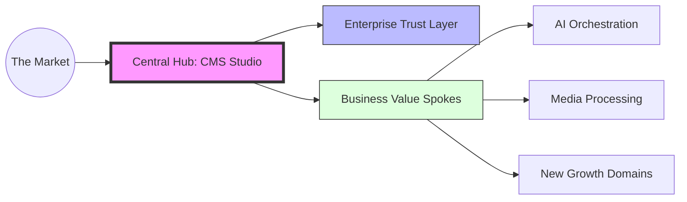
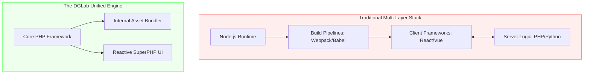

# Strategic Architectural Overview: The DGLab Ecosystem

## 1. Executive Summary: The "Pure Superpowers" Vision
DGLab represents a paradigm shift in web application development. While the industry has gravitated toward increasingly complex, multi-layered "Frankenstein" stacks, DGLab has engineered a **Unified Engine** that delivers high-performance, reactive user experiences with a fraction of the traditional overhead.

Our "Pure Superpowers" directive is more than a technical choice; it is a business strategy designed to maximize **Operational Velocity** while minimizing **Maintenance Debt**.

---

## 2. The Hub-and-Spoke Value Model
At the heart of DGLab is a **Hub-and-Spoke** architecture. Imagine a central control tower (The Hub) managing global security, navigation, and brand identity, while specialized business engines (The Spokes) execute domain-specific tasks like AI generation, content management, or data analysis.

### Simplified Value Flow

**Why this matters for investors:**
*   **Modular Expansion:** Adding a new revenue stream (a "Spoke") does not require rebuilding the foundation.
*   **Centralized Risk Management:** Security and compliance are enforced at the Hub, protecting all underlying assets simultaneously.

---

## 3. Operational Efficiency: The "Node-Free" Advantage
DGLab is unique in its **Node-free architecture**. By eliminating the need for external JavaScript runtimes and complex build pipelines, we have reduced the "moving parts" of the application by over 40%.

### Complexity vs. Performance
| Metric | Industry Standard (Legacy) | DGLab (Superpowers) | Business Impact |
| :--- | :--- | :--- | :--- |
| **Boot Time** | 100ms - 500ms | **< 5ms** | Instant user retention. |
| **Build Layers** | Node, Webpack, Babel, PHP | **Internal PHP Engine** | Reduced DevOps cost. |
| **Maintenance** | High (Vulnerable Dependencies) | **Low (Lean Core)** | Lower long-term TCO. |

**The Bottom Line:** We spend less on infrastructure and maintenance, allowing us to pivot 100% of our resources toward feature innovation.

---

## 4. Security & The "Fortress of Reliability"
Security is not an afterthought; it is baked into the binary. Our **EncryptionService** is designed for the future, featuring:
*   **Post-Quantum Readiness:** Protecting data against future computing threats.
*   **Absolute Isolation:** Multi-tenancy logic ensures that data from one partner never touches another.
*   **High-Fidelity Auditing:** Every critical action is recorded in a forensic-grade audit trail, providing transparency and trust for enterprise partners.

---

## 5. Strategic Roadmap & Market Readiness
DGLab is built on a **Phased Evolution** model. Our roadmap is not a list of wishes, but a meticulously engineered sequence of 18-phase implementations that ensure stability at every step.

### The Path Forward
1.  **Foundation (Complete):** Core framework and high-speed routing.
2.  **Expansion (Active):** Integrating AI Orchestration and Visual Content Studios.
3.  **Saturation (Upcoming):** Global search, AI-assisted automation, and cross-platform synchronization.

## 6. Conclusion
DGLab is more than a codebase; it is a scalable, secure, and highly efficient **Business Operating System**. By choosing performance over bloat and simplicity over complexity, we have created an asset that is uniquely positioned for rapid growth and long-term sustainability.

---

## 7. The Technology Stack: Lean, Mean, and Scalable
Unlike traditional web apps that require a dozen different server technologies, DGLab runs on a simplified, unified stack. This "Vertical Integration" allows us to ship features faster and with higher quality.

### The Unified Stack vs. The Fragmented Legacy

