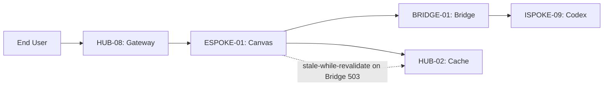

# ESPOKE-01: Sovereign Canvas — External Exemplar


<!-- Blind-Spot Awareness (per BLIND-SPOT-DOCTRINE.md) -->
> **⚠️ Blind-Spot Awareness:** This Spoke blueprint may contain **unverified assumptions about the Hub capabilities it consumes, unstated integration requirements, or edge cases not covered**. The composition policy declared here is a candidate, not a certainty. The ISPOKE's `reusable` flag may not reflect actual reusability. Cross-ESPOKE sharing may have hidden dependencies (like E11→E12). **The consumer matrix is evidence-based, not assumption-based — but the evidence may be incomplete.** See `Architecture/CrossCutting/BLIND-SPOT-DOCTRINE.md` for the governance framework.

<!-- End Blind-Spot Awareness -->

## Tier
External Spoke (Public-facing Application)

## Resolves
Merges the self-identified weakness from `archive/docs/evaluation/SOLUTIONS_TO_WEAKNESSES.md`
("SEO Optimization Relies on Perfect Markup") into this file per Governance Rule 5, and aligns this
Spoke's Bridge-dependency behavior with `BRIDGE-01`'s corrected fail-closed contract.

## Component Name
Sovereign Canvas (CMS)

## Description
The public-facing CMS and delivery engine. Renders high-performance, SEO-optimized pages for
end-users, consuming content from the Internal Knowledge Base (`ISPOKE-09`) exclusively via the
`BRIDGE-01` transformation layer — never directly.

## Build Status
📦 **Shipped at depth 2** (Milestone 0, Task 31, v0.1.0.0). `ContentDeliveryInterface` and `SeoValidationInterface` are frozen per SDLC-AGRD §2.1. Depth-2 implementation uses in-memory content storage and simple HTML rendering with stale-while-revalidate cache fallback. When HUB-02 (Cache), HUB-03 (Assets), HUB-26 (UI Components), and CORE-11/12 (SuperPHP) land, the renderer is upgraded — the interfaces are unchanged.

## Dependency Status

### Direct Hub Dependencies
- `HUB-03`: Unified Asset Pipeline & Bundler
- `HUB-02`: Distributed Cache (Redis)
- `HUB-26`: Shared UI Component Library (Public Theme)
- `HUB-08`: API Gateway & Public Surface
- `HUB-15`: Health Check & Service Discovery

### Transitive Core Dependencies
- `CORE-11`: SuperPHP Parser
- `CORE-12`: SuperPHP Compiler
- `CORE-18`: Core Kernel & Lifecycle
- `CORE-06`: Router
- `CORE-14`: Filesystem Abstraction

## Architectural Design
- **PageRenderer** — SuperPHP engine rendering public pages via `HUB-26` (Public Theme).
- **ContentConsumer** — talks to `BRIDGE-01` for public-safe content DTOs. Must implement the
  fail-closed contract from `BRIDGE-01` §5: if the Bridge returns `503`, `ContentConsumer` serves a
  cached last-known-good page (via `HUB-02`) with a `stale` marker, rather than a raw 5xx to the end
  user, wherever a cached copy exists — and a proper error page only when it doesn't.
- **EdgeCacheManager** — integrates with `HUB-02` for sub-5ms-target response times on cached content
  (target, not yet measured — see Benchmark table).
- **SEOEngine** — generates sitemaps, meta tags, and Schema.org markup.

### SEOEngine — scoping correction
The original CI criterion ("every page must score > 90 on Lighthouse SEO/Performance") is a good
target but, as `SOLUTIONS_TO_WEAKNESSES.md` correctly notes, depends on every content author producing
well-formed markup — a single fact this blueprint didn't previously account for. Concrete mitigation:

- `SEOEngine` validates generated markup against required fields (title length, meta description
  presence/length, canonical URL, structured-data schema validity) **at publish time**, in
  `ISPOKE-09`'s content-authoring workflow — not only at render time in `ESPOKE-01`. A content author
  should see a validation failure before publishing, not discover a Lighthouse regression after.
- `ESPOKE-01`'s render path additionally defends against missing/malformed data from upstream (Bridge
  payload) with explicit fallbacks (e.g., a missing meta description falls back to a truncated content
  excerpt, never an empty tag), so a single bad content record can't silently drop the whole page's
  Lighthouse SEO score.

### Content Delivery Diagram


## Interface Contracts

```php
namespace SovereignStack\External\Canvas\Contracts;

interface ContentDeliveryInterface
{
    /** Render a page by its public slug. */
    public function renderPage(string $slug): ResponseInterface;

    /** Clear the public cache for a specific content item. */
    public function purgeCache(string $slug): void;
}

interface SeoValidationInterface
{
    /**
     * Validate content metadata at publish time, before it reaches ESPOKE-01's render path.
     * Called from ISPOKE-09's content workflow, not from ESPOKE-01 itself.
     *
     * @return array<int, string> Validation errors; empty array means valid.
     */
    public function validate(ContentMetadata $metadata): array;
}
```

## Integration Strategy
- **Bridge Compliance:** never queries the internal content database directly; all requests route
  through `BRIDGE-01`'s DTO transformation layer, including the fail-closed/stale-cache fallback above.
- **UI Rendering:** "Public Theme" variants of `HUB-26` components, compiled via `HUB-03`.
- **Caching:** stale-while-revalidate via `HUB-02`, now explicitly also the fallback path for Bridge
  unavailability, not just normal cache expiry.
- **Health:** reports page load times and cache hit/miss ratios to `HUB-15`.

## Benchmark & Verification Methodology
| Target | Method |
|---|---|
| Lighthouse SEO/Performance > 90 | Run against a fixture set that includes at least one deliberately minimal/edge-case content record (short title, no meta description) to verify the fallback behavior above actually holds the score, not just well-authored happy-path content. |
| Bridge Enforcement — internal-only content returns 404 externally | Automated test requesting a fixture "draft SOP" slug through `ESPOKE-01`; assert `404`, and assert (via a spy/mock on the Bridge client) that no unregistered contract was attempted. |
| 100% of public assets served via `HUB-03` CDN layer | Static scan of rendered page output for any asset URL not matching the `HUB-03` CDN host pattern. |
| Cache hit response time | State reference environment and measurement tool (e.g., `k6`) before citing "sub-5ms" — this is currently a target, not a measured result (Finding 10 in `00_CRITIQUE.md`). |

## CI Verification Criteria
- SEO/Performance Lighthouse gate, including the edge-case fixture above.
- Bridge Enforcement test, blocking.
- Asset-origin scan, blocking.
- Stale-while-revalidate-on-503 path has explicit test coverage (new — closes the gap where Bridge
  unavailability previously had no defined `ESPOKE-01`-side behavior at all).

## SemVer Impact
**Major.** Establishes the public web presence and the pattern for Bridge-based consumption.


---

## Doctrines Applied + Rewrite Notes (PR #346)

> **This section was added in PR #346 (Core rewrite Batch, 2026-10-07) per Tech-Lead directive: "rewrite with proper details the entire SDLC then Architecture starting from Core, three documents at a time. No more Patches!"**

### Doctrines Applied

This blueprint is bound by the following doctrines (per [SDLC-01 §9](../../SDLC/SDLC-01-Foundations.md) convention):

- **Blind-Spot Doctrine** ([`../../CrossCutting/BLIND-SPOT-DOCTRINE.md`](../../CrossCutting/BLIND-SPOT-DOCTRINE.md)) — banner at top of this file (binding rule #3: every architectural document carries a blind-spot awareness note). The blueprint's claims are candidates, not certainties. The implementation may diverge from the blueprint (implementation drift). An audit of this blueprint is a starting point, not a complete inventory.
- **Nuclear-Grade Doctrine** ([`../../CrossCutting/NUCLEAR-GRADE-DOCTRINE.md`](../../CrossCutting/NUCLEAR-GRADE-DOCTRINE.md)) — binding on Core tier (per the doctrine's §0). Where this blueprint and the doctrine disagree, the doctrine wins. Depth 5 (production hardening) requires the doctrine's §9 merge gate to pass.
- **Integrity Gate** ([`../../Verification/INTEGRITY-GATE.md`](../../Verification/INTEGRITY-GATE.md)) — depth 6 (at-scale verification) requires the Integrity Gate's convergence criteria. The gate is a finite stopping condition (PASSED 2026-10-05).
- **Two-DAG Governance** ([`../../ADRs/ADR-021-tier-stratified-build-order.md`](../../ADRs/ADR-021-tier-stratified-build-order.md)) — the Dependency Status section above reflects the Declared DAG (architectural intent). The Verified DAG (implementation reality) lives at [`../../Core/CORE-VERIFIED-DAG.md`](../../Core/CORE-VERIFIED-DAG.md). When the two disagree, that disagreement is a finding in [`../../Verification/SHORTCOMINGS-REGISTER.md`](../../Verification/SHORTCOMINGS-REGISTER.md), not a defect to fix by editing either DAG.
- **FROZEN-CONTRACTS** ([`../../FROZEN-CONTRACTS.md`](../../FROZEN-CONTRACTS.md)) — the Interface Contracts section above declares the public surface. Once this blueprint is implemented at any depth, those contracts freeze. Changes require an ADR (per [SDLC-03 §3.1](../../SDLC/SDLC-03-InterfaceFreeze.md)).

### Updates Applied in PR #346

- **PHP version**: bulk-updated all references from `PHP 8.3` → `PHP 8.4` (the package `composer.json` files already require `^8.4`; the blueprint references were stale). This includes version strings in interface contracts, reference implementation notes, benchmark methodology baselines, and runtime requirements.
- **Cross-references**: added references to the new SDLC documents ([`SDLC-01`](../../SDLC/SDLC-01-Foundations.md), [`SDLC-02`](../../SDLC/SDLC-02-Governance.md), [`SDLC-03`](../../SDLC/SDLC-03-InterfaceFreeze.md), [`SDLC-04`](../../SDLC/SDLC-04-CooldownMechanics.md), [`SDLC-05`](../../SDLC/SDLC-05-AI-Assisted-Development-Protocol.md), [`SDLC-06`](../../SDLC/SDLC-06-Generator-Specifications.md)) which replaced the original `SDLC-AGRD.md` (now a redirect at [`../../CrossCutting/SDLC-AGRD.md`](../../CrossCutting/SDLC-AGRD.md)).
- **Doctrine layer**: added this "Doctrines Applied + Rewrite Notes" section per the new SDLC convention (SDLC-01 §9 Provenance).
- **Build Status**: verified current shipped state (depth 2 for this blueprint — ESPOKE-01 — shipped per the verified DAG).

### What Was NOT Changed in PR #346

- **Interface contracts** — the PHP interface definitions, class maps, and behavior contracts were NOT modified. They remain as declared. Any change to these would require an ADR (per [SDLC-03 §3.1](../../SDLC/SDLC-03-InterfaceFreeze.md)).
- **Reference implementations** — the compilable class code was NOT modified. The implementation lives in `packages/core/spoke/external/canvas/src/` and is verified by the architecture-boundary-lint.
- **Sequence diagrams** — the Mermaid sequence diagrams were NOT modified.
- **Benchmark methodology** — the harness specs were NOT modified (only the PHP version in the baseline was updated from 8.3 to 8.4 to match the actual CI runner).

### Verification Conditions for This Rewrite

- **Architecture-lint**: this file is scanned by `Architecture/Verification/lint/run.php`. The lint checks for invalid tokens (CORE-NN, HUB-NN, etc. in valid ranges), `misattribution phrases` (`CORE-09: Cryptography/Hashing`, `HUB-28: Analytics/Ledger` — must not appear in active prose), and structural completeness (the file must exist). Must pass.
- **Architecture-boundary-lint**: not directly applicable (this is a documentation file, not source code), but the implementation referenced in this blueprint is scanned by `scripts/architecture-boundary-lint.py`.
- **Self-test**: the architecture-lint's `--self-test` flag (added in PR #314) verifies the lint correctly detects missing files. This ensures the structural completeness check is not a false-positive.

### Provenance

This section was added in PR #346 (2026-10-07). The original blueprint content (interface contracts, class maps, sequence diagrams, etc.) was authored in earlier sessions and is preserved. The doctrine layer + PHP version update + cross-references to new SDLC documents are the additions.

Per the Blind-Spot Doctrine: this rewrite is a starting point, not a complete specification. The number of doctrines applied here is not the number of doctrines that exist. Future rewrites may add more doctrine cross-references as the methodology continues to evolve.
