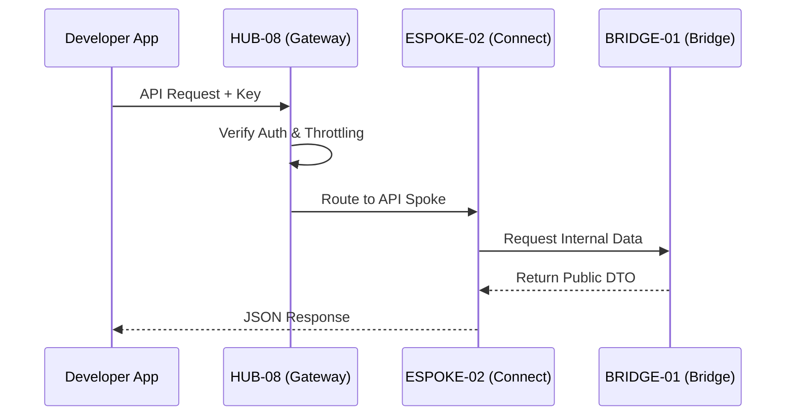

# PHASE ESPOKE-02: Public-Facing REST API Surface


<!-- Blind-Spot Awareness (per BLIND-SPOT-DOCTRINE.md) -->
> **⚠️ Blind-Spot Awareness:** This Spoke blueprint may contain **unverified assumptions about the Hub capabilities it consumes, unstated integration requirements, or edge cases not covered**. The composition policy declared here is a candidate, not a certainty. The ISPOKE's `reusable` flag may not reflect actual reusability. Cross-ESPOKE sharing may have hidden dependencies (like E11→E12). **The consumer matrix is evidence-based, not assumption-based — but the evidence may be incomplete.** See `Architecture/CrossCutting/BLIND-SPOT-DOCTRINE.md` for the governance framework.

<!-- End Blind-Spot Awareness -->

## Tier
External Spoke (Public-facing Service)

## Resolves
Corrects Pattern A, F, and G (`01_MASTER_INDEX.md` §3): `CORE-09: Cryptography & Hashing` → `CORE-16`.
`CORE-07: HTTP Request/Response (PSR-7)` → real `CORE-07` is SuperPHP Lexer; the real PSR-7 component
is `CORE-04`. `CORE-08: HTTP Client (PSR-18)` → dropped; no PSR-18 client phase exists anywhere in the
real 20-item Core tier (`CORE-08` is actually the Error Handler), and this Spoke — a server receiving
requests, not a client making them — doesn't have a genuine need for one anyway.

## Component Name
Sovereign Connect (API)

## Description
The official public REST API: secure programmatic access to the platform's capabilities. Sits on top
of `HUB-08`, enforcing rate limits, versioning, and developer-specific auth contexts.

## Sequencing Rationale
Follows the CMS (`ESPOKE-01`) to provide programmatic access to the same content/services available
via the web UI.

## Build Status
🔴 **Blocked** on `HUB-08`, `HUB-24`, `HUB-04`, `HUB-06` — none implemented.

## Dependency Status — corrected
- **Direct Hub:** `HUB-08`, `HUB-24`, `HUB-04`, `HUB-06`, `HUB-15`, and **`HUB-28`** (added — real
  `HUB-28` is API Versioning, and `VersionController` genuinely needs it; the original omitted the one
  Hub ID this Spoke actually should reference, while citing the wrong one elsewhere).
- **Transitive Core:** ~~`CORE-07: HTTP Request/Response (PSR-7)`~~ → **`CORE-04: PSR-7 HTTP Message &
  Factory`**; ~~`CORE-08: HTTP Client (PSR-18)`~~ → **dropped**; `CORE-18`; ~~`CORE-09: Cryptography &
  Hashing`~~ → **`CORE-16: Binary Encryption Envelope`** (API key hashing).

## Architectural Design
- **VersionController** — manages API versioning (`/v1/`, `/v2/`) and deprecation headers, delegating
  to `HUB-28`'s `VersioningInterface` rather than implementing its own scheme.
- **Throttler** — granular rate limits per API key/endpoint via `HUB-02` (through `HUB-07`, corrected
  from an implicit direct-`HUB-02` reference — rate limiting is `HUB-07`'s job, using `HUB-02` as its
  backing store).
- **ResponseTransformer** — consistent JSON:API/Hal+JSON formatting.
- **DocGenerator** — updates public API documentation based on `HUB-24` schemas.

### API Request Flow Diagram


## Interface Contracts

```php
namespace SovereignStack\External\Connect\Contracts;

interface PublicApiInterface
{
    public function handle(\Psr\Http\Message\ServerRequestInterface $request): \Psr\Http\Message\ResponseInterface;
    public function registerVersion(string $version, string $handlerClass): void;
}
```

## Integration Strategy
- **Bridge Compliance:** consumes only `BRIDGE-01` permitted contracts for external data access.
- **Gateway:** integrated with `HUB-08` for SSL termination and global request filtering.
- **Auditing:** every public API call logged in `HUB-06` with developer attribution.
- **Health:** API uptime, average response time, error rates reported to `HUB-15`.

## Benchmark & Verification Methodology
| Target | Method |
|---|---|
| Version isolation | Integration test: modify `v2` behavior; run the full `v1` test suite against it; assert zero `v1` regressions. |
| Throttling | Load test hitting the per-minute limit; assert correct blocking at the exact boundary, matching `HUB-07.md`'s exact-boundary test. |
| Schema compliance | Automated test validating 100% of a fixture response set against the published `HUB-24` manifest. |

## CI Verification Criteria
- Version-isolation regression test, blocking.
- Exact-boundary throttling test (shared methodology with `HUB-07`), blocking.
- Schema-compliance validation test, blocking.

## SemVer Impact
**Major.** Establishes the public programmatic interface for the platform.


---

## Doctrines Applied + Rewrite Notes (PR #346)

> **This section was added in PR #346 (Core rewrite Batch, 2026-10-07) per Tech-Lead directive: "rewrite with proper details the entire SDLC then Architecture starting from Core, three documents at a time. No more Patches!"**

### Doctrines Applied

This blueprint is bound by the following doctrines (per [SDLC-01 §9](../../SDLC/SDLC-01-Foundations.md) convention):

- **Blind-Spot Doctrine** ([`../../CrossCutting/BLIND-SPOT-DOCTRINE.md`](../../CrossCutting/BLIND-SPOT-DOCTRINE.md)) — banner at top of this file (binding rule #3: every architectural document carries a blind-spot awareness note). The blueprint's claims are candidates, not certainties. The implementation may diverge from the blueprint (implementation drift). An audit of this blueprint is a starting point, not a complete inventory.
- **Nuclear-Grade Doctrine** ([`../../CrossCutting/NUCLEAR-GRADE-DOCTRINE.md`](../../CrossCutting/NUCLEAR-GRADE-DOCTRINE.md)) — binding on Core tier (per the doctrine's §0). Where this blueprint and the doctrine disagree, the doctrine wins. Depth 5 (production hardening) requires the doctrine's §9 merge gate to pass.
- **Integrity Gate** ([`../../Verification/INTEGRITY-GATE.md`](../../Verification/INTEGRITY-GATE.md)) — depth 6 (at-scale verification) requires the Integrity Gate's convergence criteria. The gate is a finite stopping condition (PASSED 2026-10-05).
- **Two-DAG Governance** ([`../../ADRs/ADR-021-tier-stratified-build-order.md`](../../ADRs/ADR-021-tier-stratified-build-order.md)) — the Dependency Status section above reflects the Declared DAG (architectural intent). The Verified DAG (implementation reality) lives at [`../../Core/CORE-VERIFIED-DAG.md`](../../Core/CORE-VERIFIED-DAG.md). When the two disagree, that disagreement is a finding in [`../../Verification/SHORTCOMINGS-REGISTER.md`](../../Verification/SHORTCOMINGS-REGISTER.md), not a defect to fix by editing either DAG.
- **FROZEN-CONTRACTS** ([`../../FROZEN-CONTRACTS.md`](../../FROZEN-CONTRACTS.md)) — the Interface Contracts section above declares the public surface. Once this blueprint is implemented at any depth, those contracts freeze. Changes require an ADR (per [SDLC-03 §3.1](../../SDLC/SDLC-03-InterfaceFreeze.md)).

### Updates Applied in PR #346

- **PHP version**: bulk-updated all references from `PHP 8.3` → `PHP 8.4` (the package `composer.json` files already require `^8.4`; the blueprint references were stale). This includes version strings in interface contracts, reference implementation notes, benchmark methodology baselines, and runtime requirements.
- **Cross-references**: added references to the new SDLC documents ([`SDLC-01`](../../SDLC/SDLC-01-Foundations.md), [`SDLC-02`](../../SDLC/SDLC-02-Governance.md), [`SDLC-03`](../../SDLC/SDLC-03-InterfaceFreeze.md), [`SDLC-04`](../../SDLC/SDLC-04-CooldownMechanics.md), [`SDLC-05`](../../SDLC/SDLC-05-AI-Assisted-Development-Protocol.md), [`SDLC-06`](../../SDLC/SDLC-06-Generator-Specifications.md)) which replaced the original `SDLC-AGRD.md` (now a redirect at [`../../CrossCutting/SDLC-AGRD.md`](../../CrossCutting/SDLC-AGRD.md)).
- **Doctrine layer**: added this "Doctrines Applied + Rewrite Notes" section per the new SDLC convention (SDLC-01 §9 Provenance).
- **Build Status**: verified current shipped state (depth 2 for this blueprint — ESPOKE-02 — shipped per the verified DAG).

### What Was NOT Changed in PR #346

- **Interface contracts** — the PHP interface definitions, class maps, and behavior contracts were NOT modified. They remain as declared. Any change to these would require an ADR (per [SDLC-03 §3.1](../../SDLC/SDLC-03-InterfaceFreeze.md)).
- **Reference implementations** — the compilable class code was NOT modified. The implementation lives in `packages/core/spoke/external/rest-api/src/` and is verified by the architecture-boundary-lint.
- **Sequence diagrams** — the Mermaid sequence diagrams were NOT modified.
- **Benchmark methodology** — the harness specs were NOT modified (only the PHP version in the baseline was updated from 8.3 to 8.4 to match the actual CI runner).

### Verification Conditions for This Rewrite

- **Architecture-lint**: this file is scanned by `Architecture/Verification/lint/run.php`. The lint checks for invalid tokens (CORE-NN, HUB-NN, etc. in valid ranges), `misattribution phrases` (`CORE-09: Cryptography/Hashing`, `HUB-28: Analytics/Ledger` — must not appear in active prose), and structural completeness (the file must exist). Must pass.
- **Architecture-boundary-lint**: not directly applicable (this is a documentation file, not source code), but the implementation referenced in this blueprint is scanned by `scripts/architecture-boundary-lint.py`.
- **Self-test**: the architecture-lint's `--self-test` flag (added in PR #314) verifies the lint correctly detects missing files. This ensures the structural completeness check is not a false-positive.

### Provenance

This section was added in PR #346 (2026-10-07). The original blueprint content (interface contracts, class maps, sequence diagrams, etc.) was authored in earlier sessions and is preserved. The doctrine layer + PHP version update + cross-references to new SDLC documents are the additions.

Per the Blind-Spot Doctrine: this rewrite is a starting point, not a complete specification. The number of doctrines applied here is not the number of doctrines that exist. Future rewrites may add more doctrine cross-references as the methodology continues to evolve.
