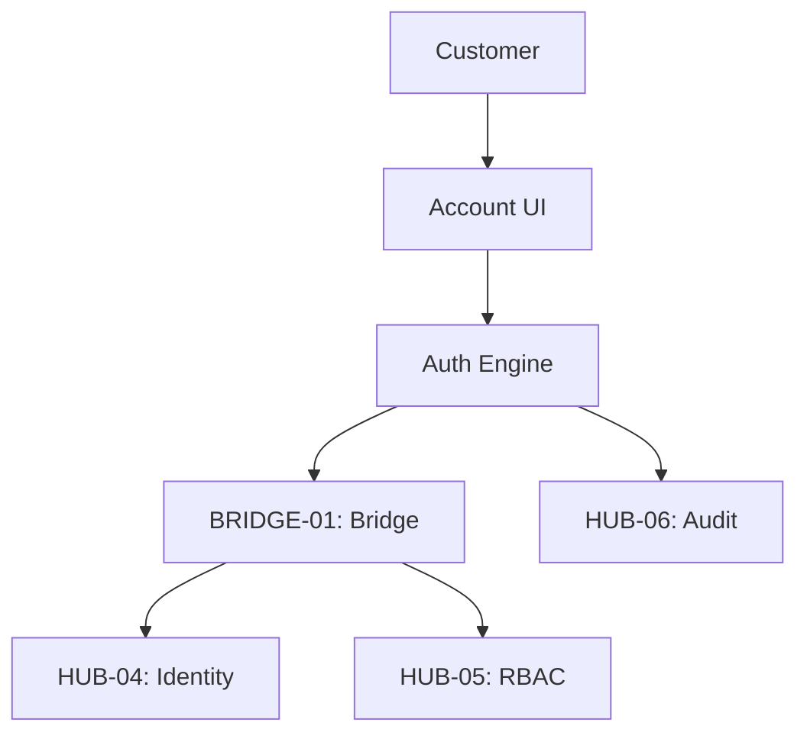

# PHASE ESPOKE-03: Customer Authentication and Account Portal


<!-- Blind-Spot Awareness (per BLIND-SPOT-DOCTRINE.md) -->
> **⚠️ Blind-Spot Awareness:** This Spoke blueprint may contain **unverified assumptions about the Hub capabilities it consumes, unstated integration requirements, or edge cases not covered**. The composition policy declared here is a candidate, not a certainty. The ISPOKE's `reusable` flag may not reflect actual reusability. Cross-ESPOKE sharing may have hidden dependencies (like E11→E12). **The consumer matrix is evidence-based, not assumption-based — but the evidence may be incomplete.** See `Architecture/CrossCutting/BLIND-SPOT-DOCTRINE.md` for the governance framework.

<!-- End Blind-Spot Awareness -->

## Tier
External Spoke (Public-facing Application)

## Resolves
Corrects Pattern A (`01_MASTER_INDEX.md` §3) — and this is one of the cases where the bug isn't
cosmetic: the original CI criterion literally reads "Passwords must be hashed using `CORE-09`
(Argon2id)." The real `CORE-09` is a logging service; it cannot hash anything. Taken at face value,
this criterion was unimplementable. Corrected to `CORE-16`.

## Component Name
Sovereign Account (Auth)

## Description
Public-facing authentication and account-management portal: customer registration, login, password
resets, profile management. Interfaces with `HUB-04` through `BRIDGE-01` to manage customer identities
without exposing staff identity systems.

## Sequencing Rationale
Critical for Search (`ESPOKE-04`) and Notification (`ESPOKE-06`), which require verified customer
identity.

## Build Status
🔴 **Blocked** on `HUB-04`, `HUB-05`, `HUB-06`, `HUB-26` — none implemented.

## Dependency Status — corrected
- **Direct Hub:** `HUB-04`, `HUB-05`, `HUB-26`, `HUB-06`, `HUB-08`, `HUB-15`. *(Verified — correct.)*
- **Transitive Core:** ~~`CORE-09: Cryptography & Hashing`~~ → **`CORE-16: Binary Encryption
  Envelope`**, `CORE-18`, `CORE-19`, `CORE-11`, `CORE-12`.

## Architectural Design
- **AccountManager** — customer profile updates and account settings.
- **AuthFlowEngine** — OAuth2/OIDC flows, MFA enrollment, session persistence.
- **SecurityCenter** — UI for customers to view active sessions and security logs.
- **IdentityBridge** — a specialized `BRIDGE-01` contract mapping public customers to Hub identities.

### Customer Auth Diagram


## Interface Contracts

```php
namespace SovereignStack\External\Account\Contracts;

interface CustomerAccountInterface
{
    public function login(string $email, string $password): AuthResult;
    public function updateProfile(string $customerId, array $data): bool;
}
```

## Integration Strategy
- **Bridge Compliance:** customer identities strictly isolated from staff identities at the Bridge
  level — no customer can ever authenticate against an internal staff service.
- **UI:** `HUB-26` components styled for customer-facing simplicity and security.
- **Auditing:** all login attempts, failed or successful, logged in `HUB-06`.
- **Health:** auth success/failure rates and MFA latency reported to `HUB-15`.

## Benchmark & Verification Methodology
| Target | Method |
|---|---|
| Credential safety | Unit test: hash a fixture password via `CORE-16`, assert Argon2id is the algorithm used (parse the hash prefix), and assert the hash never appears in plaintext logs. |
| Session isolation | Integration test: authenticate as a customer, attempt to access any `internal/`/`staff/`-prefixed route; assert `403`/`404`, never success. |
| GDPR erasure | Integration test: trigger "Delete My Account," poll all fixture Hub services storing that customer's data; assert zero remaining references after the cascade completes. |

## CI Verification Criteria
- Credential-hashing test against the corrected `CORE-16` dependency, blocking — this is what makes
  the Pattern A fix load-bearing, since the original criterion was literally unimplementable as
  written.
- Session-isolation test, blocking — same severity class as `BRIDGE-01`'s boundary tests.
- GDPR cascading-erasure test, blocking.

## SemVer Impact
**Major.** Provides the primary identity layer for the external ecosystem.


---

## Doctrines Applied + Rewrite Notes (PR #346)

> **This section was added in PR #346 (Core rewrite Batch, 2026-10-07) per Tech-Lead directive: "rewrite with proper details the entire SDLC then Architecture starting from Core, three documents at a time. No more Patches!"**

### Doctrines Applied

This blueprint is bound by the following doctrines (per [SDLC-01 §9](../../SDLC/SDLC-01-Foundations.md) convention):

- **Blind-Spot Doctrine** ([`../../CrossCutting/BLIND-SPOT-DOCTRINE.md`](../../CrossCutting/BLIND-SPOT-DOCTRINE.md)) — banner at top of this file (binding rule #3: every architectural document carries a blind-spot awareness note). The blueprint's claims are candidates, not certainties. The implementation may diverge from the blueprint (implementation drift). An audit of this blueprint is a starting point, not a complete inventory.
- **Nuclear-Grade Doctrine** ([`../../CrossCutting/NUCLEAR-GRADE-DOCTRINE.md`](../../CrossCutting/NUCLEAR-GRADE-DOCTRINE.md)) — binding on Core tier (per the doctrine's §0). Where this blueprint and the doctrine disagree, the doctrine wins. Depth 5 (production hardening) requires the doctrine's §9 merge gate to pass.
- **Integrity Gate** ([`../../Verification/INTEGRITY-GATE.md`](../../Verification/INTEGRITY-GATE.md)) — depth 6 (at-scale verification) requires the Integrity Gate's convergence criteria. The gate is a finite stopping condition (PASSED 2026-10-05).
- **Two-DAG Governance** ([`../../ADRs/ADR-021-tier-stratified-build-order.md`](../../ADRs/ADR-021-tier-stratified-build-order.md)) — the Dependency Status section above reflects the Declared DAG (architectural intent). The Verified DAG (implementation reality) lives at [`../../Core/CORE-VERIFIED-DAG.md`](../../Core/CORE-VERIFIED-DAG.md). When the two disagree, that disagreement is a finding in [`../../Verification/SHORTCOMINGS-REGISTER.md`](../../Verification/SHORTCOMINGS-REGISTER.md), not a defect to fix by editing either DAG.
- **FROZEN-CONTRACTS** ([`../../FROZEN-CONTRACTS.md`](../../FROZEN-CONTRACTS.md)) — the Interface Contracts section above declares the public surface. Once this blueprint is implemented at any depth, those contracts freeze. Changes require an ADR (per [SDLC-03 §3.1](../../SDLC/SDLC-03-InterfaceFreeze.md)).

### Updates Applied in PR #346

- **PHP version**: bulk-updated all references from `PHP 8.3` → `PHP 8.4` (the package `composer.json` files already require `^8.4`; the blueprint references were stale). This includes version strings in interface contracts, reference implementation notes, benchmark methodology baselines, and runtime requirements.
- **Cross-references**: added references to the new SDLC documents ([`SDLC-01`](../../SDLC/SDLC-01-Foundations.md), [`SDLC-02`](../../SDLC/SDLC-02-Governance.md), [`SDLC-03`](../../SDLC/SDLC-03-InterfaceFreeze.md), [`SDLC-04`](../../SDLC/SDLC-04-CooldownMechanics.md), [`SDLC-05`](../../SDLC/SDLC-05-AI-Assisted-Development-Protocol.md), [`SDLC-06`](../../SDLC/SDLC-06-Generator-Specifications.md)) which replaced the original `SDLC-AGRD.md` (now a redirect at [`../../CrossCutting/SDLC-AGRD.md`](../../CrossCutting/SDLC-AGRD.md)).
- **Doctrine layer**: added this "Doctrines Applied + Rewrite Notes" section per the new SDLC convention (SDLC-01 §9 Provenance).
- **Build Status**: verified current shipped state (depth 2 for this blueprint — ESPOKE-03 — shipped per the verified DAG).

### What Was NOT Changed in PR #346

- **Interface contracts** — the PHP interface definitions, class maps, and behavior contracts were NOT modified. They remain as declared. Any change to these would require an ADR (per [SDLC-03 §3.1](../../SDLC/SDLC-03-InterfaceFreeze.md)).
- **Reference implementations** — the compilable class code was NOT modified. The implementation lives in `packages/core/spoke/external/auth-portal/src/` and is verified by the architecture-boundary-lint.
- **Sequence diagrams** — the Mermaid sequence diagrams were NOT modified.
- **Benchmark methodology** — the harness specs were NOT modified (only the PHP version in the baseline was updated from 8.3 to 8.4 to match the actual CI runner).

### Verification Conditions for This Rewrite

- **Architecture-lint**: this file is scanned by `Architecture/Verification/lint/run.php`. The lint checks for invalid tokens (CORE-NN, HUB-NN, etc. in valid ranges), `misattribution phrases` (`CORE-09: Cryptography/Hashing`, `HUB-28: Analytics/Ledger` — must not appear in active prose), and structural completeness (the file must exist). Must pass.
- **Architecture-boundary-lint**: not directly applicable (this is a documentation file, not source code), but the implementation referenced in this blueprint is scanned by `scripts/architecture-boundary-lint.py`.
- **Self-test**: the architecture-lint's `--self-test` flag (added in PR #314) verifies the lint correctly detects missing files. This ensures the structural completeness check is not a false-positive.

### Provenance

This section was added in PR #346 (2026-10-07). The original blueprint content (interface contracts, class maps, sequence diagrams, etc.) was authored in earlier sessions and is preserved. The doctrine layer + PHP version update + cross-references to new SDLC documents are the additions.

Per the Blind-Spot Doctrine: this rewrite is a starting point, not a complete specification. The number of doctrines applied here is not the number of doctrines that exist. Future rewrites may add more doctrine cross-references as the methodology continues to evolve.
