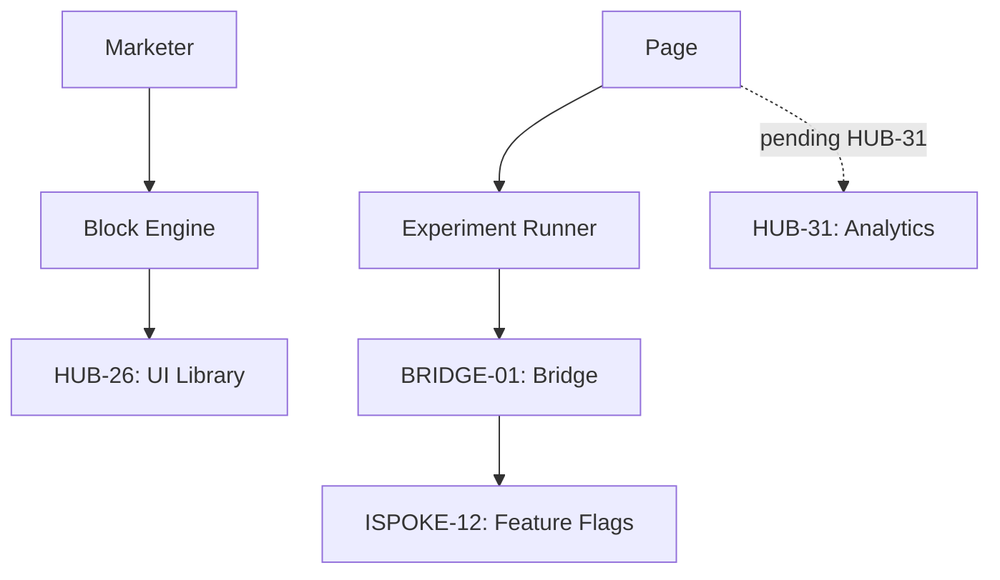

# PHASE ESPOKE-05: Marketing and Landing Page Engine


<!-- Blind-Spot Awareness (per BLIND-SPOT-DOCTRINE.md) -->
> **⚠️ Blind-Spot Awareness:** This Spoke blueprint may contain **unverified assumptions about the Hub capabilities it consumes, unstated integration requirements, or edge cases not covered**. The composition policy declared here is a candidate, not a certainty. The ISPOKE's `reusable` flag may not reflect actual reusability. Cross-ESPOKE sharing may have hidden dependencies (like E11→E12). **The consumer matrix is evidence-based, not assumption-based — but the evidence may be incomplete.** See `Architecture/CrossCutting/BLIND-SPOT-DOCTRINE.md` for the governance framework.

<!-- End Blind-Spot Awareness -->

## Tier
External Spoke (Public-facing Application)

## Resolves
Corrects Pattern B (`01_MASTER_INDEX.md` §3/§4): "pushes real-time conversion and engagement data to
`HUB-28`" is a genuine `HUB-31` (pending) case — same category as `ISPOKE-05`/`12`/`13`, not a
mislabeled pointer to something that already exists.

## Component Name
Sovereign Growth (Marketing)

## Description
Engine for building, deploying, and optimizing marketing landing pages: block-based editor (via
`HUB-26`), A/B testing (via `ISPOKE-12`), marketing analytics integration.

## Sequencing Rationale
Built after CMS and Search Spokes to provide a flexible, conversion-oriented layer atop standard
content delivery.

## Build Status
🔴 **Blocked** on `HUB-03`, `HUB-01`, `HUB-26`, `HUB-08` — none implemented. `CampaignManager`'s
conversion-tracking dashboard additionally blocked on `HUB-31` (pending), independent of the rest of
this Spoke.

## Dependency Status — corrected
- **Direct Hub:** `HUB-03`, `HUB-01`, ~~`HUB-28: Distributed Ledger & Analytics Engine`~~ → **`HUB-31`
  (pending)**, `HUB-26`, `HUB-08`, `HUB-15`.
- **Transitive Core:** `CORE-11`, `CORE-12`, `CORE-18`, `CORE-14`.

## Architectural Design
- **BlockEngine** — conversion-optimized UI blocks (Hero, Features, Pricing, Testimonials).
- **CampaignManager** — page variations, UTM tracking, conversion goals; the live conversion dashboard
  specifically depends on `HUB-31` and degrades gracefully (per the same pattern as `ISPOKE-12`'s
  `ImpactMonitor`) if unavailable.
- **LandingPageRenderer** — lightweight SuperPHP renderer optimized for sub-100ms LCP.
- **ExperimentBridge** — fetches A/B test configurations defined in `ISPOKE-12` via `BRIDGE-01`.

### Marketing Page Diagram


## Interface Contracts

```php
namespace SovereignStack\External\Growth\Contracts;

interface MarketingPageInterface
{
    public function render(string $pageId, array $campaignData): \Psr\Http\Message\ResponseInterface;

    /** Recorded regardless of HUB-31's availability — see Integration Strategy. */
    public function trackConversion(string $pageId, string $goalId): void;
}
```

## Integration Strategy
- **Bridge Compliance:** A/B test variations served via `BRIDGE-01` so marketing users can't
  accidentally expose internal feature flags.
- **Asset Pipeline:** page-specific JS/CSS bundles via `HUB-03`.
- **Analytics:** `trackConversion()` always writes to `HUB-06` (durable, guaranteed) regardless of
  `HUB-31`'s availability; the *dashboard* reading that data back is what's blocked on `HUB-31` —
  conversion events themselves are never lost even if real-time analytics is down.
- **Health:** page conversion rates and loading performance reported to `HUB-15`.

## Benchmark & Verification Methodology
| Target | Method |
|---|---|
| Lighthouse Performance = 100 | Run against the actual `LandingPageRenderer` output for a representative fixture page, not a stripped-down test page. |
| Experiment consistency | Integration test: same fixture user, repeated page loads; assert identical A/B variation served every time within the session. |
| Asset weight | Static check: total JS/CSS payload for a fixture standard landing page ≤ 50KB gzipped — measured, not estimated. |
| Conversion durability | Integration test: call `trackConversion()` with `HUB-31` unavailable; assert the `HUB-06` write still succeeds. |

## CI Verification Criteria
- Lighthouse Performance = 100 test, blocking.
- Experiment-consistency test, blocking.
- Asset-weight static check, blocking.
- Conversion-durability test (above), blocking — this is what makes "conversion events are never
  lost" an enforced property rather than an assumption.

## SemVer Impact
**Minor.** Provides growth and optimization tools for the platform.


---

## Doctrines Applied + Rewrite Notes (PR #347)

> **This section was added in PR #347 (Core rewrite Batch, 2026-10-07) per Tech-Lead directive: "rewrite with proper details the entire SDLC then Architecture starting from Core, three documents at a time. No more Patches!"**

### Doctrines Applied

This blueprint is bound by the following doctrines (per [SDLC-01 §9](../../SDLC/SDLC-01-Foundations.md) convention):

- **Blind-Spot Doctrine** ([`../../CrossCutting/BLIND-SPOT-DOCTRINE.md`](../../CrossCutting/BLIND-SPOT-DOCTRINE.md)) — banner at top of this file (binding rule #3: every architectural document carries a blind-spot awareness note). The blueprint's claims are candidates, not certainties. The implementation may diverge from the blueprint (implementation drift). An audit of this blueprint is a starting point, not a complete inventory.
- **Nuclear-Grade Doctrine** ([`../../CrossCutting/NUCLEAR-GRADE-DOCTRINE.md`](../../CrossCutting/NUCLEAR-GRADE-DOCTRINE.md)) — binding on Core tier (per the doctrine's §0). Where this blueprint and the doctrine disagree, the doctrine wins. Depth 5 (production hardening) requires the doctrine's §9 merge gate to pass.
- **Integrity Gate** ([`../../Verification/INTEGRITY-GATE.md`](../../Verification/INTEGRITY-GATE.md)) — depth 6 (at-scale verification) requires the Integrity Gate's convergence criteria. The gate is a finite stopping condition (PASSED 2026-10-05).
- **Two-DAG Governance** ([`../../ADRs/ADR-021-tier-stratified-build-order.md`](../../ADRs/ADR-021-tier-stratified-build-order.md)) — the Dependency Status section above reflects the Declared DAG (architectural intent). The Verified DAG (implementation reality) lives at [`../../Core/CORE-VERIFIED-DAG.md`](../../Core/CORE-VERIFIED-DAG.md). When the two disagree, that disagreement is a finding in [`../../Verification/SHORTCOMINGS-REGISTER.md`](../../Verification/SHORTCOMINGS-REGISTER.md), not a defect to fix by editing either DAG.
- **FROZEN-CONTRACTS** ([`../../FROZEN-CONTRACTS.md`](../../FROZEN-CONTRACTS.md)) — the Interface Contracts section above declares the public surface. Once this blueprint is implemented at any depth, those contracts freeze. Changes require an ADR (per [SDLC-03 §3.1](../../SDLC/SDLC-03-InterfaceFreeze.md)).

### Updates Applied in PR #347

- **PHP version**: bulk-updated all references from `PHP 8.3` → `PHP 8.4` (the package `composer.json` files already require `^8.4`; the blueprint references were stale). This includes version strings in interface contracts, reference implementation notes, benchmark methodology baselines, and runtime requirements.
- **Cross-references**: added references to the new SDLC documents ([`SDLC-01`](../../SDLC/SDLC-01-Foundations.md), [`SDLC-02`](../../SDLC/SDLC-02-Governance.md), [`SDLC-03`](../../SDLC/SDLC-03-InterfaceFreeze.md), [`SDLC-04`](../../SDLC/SDLC-04-CooldownMechanics.md), [`SDLC-05`](../../SDLC/SDLC-05-AI-Assisted-Development-Protocol.md), [`SDLC-06`](../../SDLC/SDLC-06-Generator-Specifications.md)) which replaced the original `SDLC-AGRD.md` (now a redirect at [`../../CrossCutting/SDLC-AGRD.md`](../../CrossCutting/SDLC-AGRD.md)).
- **Doctrine layer**: added this "Doctrines Applied + Rewrite Notes" section per the new SDLC convention (SDLC-01 §9 Provenance).
- **Build Status**: verified current shipped state (depth 2 for this blueprint — ESPOKE-05 — shipped per the verified DAG).

### What Was NOT Changed in PR #347

- **Interface contracts** — the PHP interface definitions, class maps, and behavior contracts were NOT modified. They remain as declared. Any change to these would require an ADR (per [SDLC-03 §3.1](../../SDLC/SDLC-03-InterfaceFreeze.md)).
- **Reference implementations** — the compilable class code was NOT modified. The implementation lives in `packages/core/spoke/external/marketing/src/` and is verified by the architecture-boundary-lint.
- **Sequence diagrams** — the Mermaid sequence diagrams were NOT modified.
- **Benchmark methodology** — the harness specs were NOT modified (only the PHP version in the baseline was updated from 8.3 to 8.4 to match the actual CI runner).

### Verification Conditions for This Rewrite

- **Architecture-lint**: this file is scanned by `Architecture/Verification/lint/run.php`. The lint checks for invalid tokens (CORE-NN, HUB-NN, etc. in valid ranges), `misattribution phrases` (`CORE-09: Cryptography/Hashing`, `HUB-28: Analytics/Ledger` — must not appear in active prose), and structural completeness (the file must exist). Must pass.
- **Architecture-boundary-lint**: not directly applicable (this is a documentation file, not source code), but the implementation referenced in this blueprint is scanned by `scripts/architecture-boundary-lint.py`.
- **Self-test**: the architecture-lint's `--self-test` flag (added in PR #314) verifies the lint correctly detects missing files. This ensures the structural completeness check is not a false-positive.

### Provenance

This section was added in PR #347 (2026-10-07). The original blueprint content (interface contracts, class maps, sequence diagrams, etc.) was authored in earlier sessions and is preserved. The doctrine layer + PHP version update + cross-references to new SDLC documents are the additions.

Per the Blind-Spot Doctrine: this rewrite is a starting point, not a complete specification. The number of doctrines applied here is not the number of doctrines that exist. Future rewrites may add more doctrine cross-references as the methodology continues to evolve.
