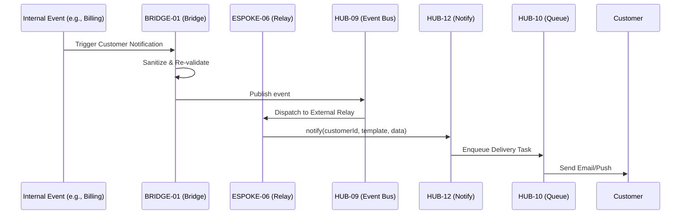

# PHASE ESPOKE-06: Customer Notification and Communication Hub


<!-- Blind-Spot Awareness (per BLIND-SPOT-DOCTRINE.md) -->
> **⚠️ Blind-Spot Awareness:** This Spoke blueprint may contain **unverified assumptions about the Hub capabilities it consumes, unstated integration requirements, or edge cases not covered**. The composition policy declared here is a candidate, not a certainty. The ISPOKE's `reusable` flag may not reflect actual reusability. Cross-ESPOKE sharing may have hidden dependencies (like E11→E12). **The consumer matrix is evidence-based, not assumption-based — but the evidence may be incomplete.** See `Architecture/CrossCutting/BLIND-SPOT-DOCTRINE.md` for the governance framework.

<!-- End Blind-Spot Awareness -->

## Tier
External Spoke (Public-facing Application)

## Resolves
Corrects Pattern C and D (`01_MASTER_INDEX.md` §3): `HUB-12: Event-driven Messaging & Pub/Sub` → real
pub/sub is `HUB-09`; `HUB-11: Job Queue & Background Processing` → real Queue is `HUB-10` (`HUB-11` is
Cloud Storage). Same pattern as `ISPOKE-07`, applied here for the external-facing counterpart.

## Component Name
Sovereign Relay (External)

## Description
Manages all communications with end-customers: transactional emails, push notifications, in-app
alerts. Consumes the `ISPOKE-07` messaging infrastructure through a strict `BRIDGE-01` policy.

## Sequencing Rationale
Follows the Account Portal (`ESPOKE-03`) — requires customer identity and preference data to deliver
messages.

## Build Status
🔴 **Blocked** on `HUB-09`, `HUB-10`, `HUB-26`, `HUB-08`, `HUB-06` — none implemented.

## Dependency Status — corrected
- **Direct Hub:** ~~`HUB-12: Event-driven Messaging & Pub/Sub`~~ → **`HUB-09: Event Bus / Message
  Broker`** (for real-time delivery triggers), **`HUB-12: Notification Service`** (kept, but as the
  actual Notify component this Spoke's `PublicRelay` delegates *to*, not the pub/sub layer it listens
  *on* — both were needed, the original just mislabeled which was which), ~~`HUB-11: Job Queue &
  Background Processing`~~ → **`HUB-10: Queue & Job Dispatcher`**, `HUB-26`, `HUB-08`, `HUB-06`,
  `HUB-15`.
- **Transitive Core:** `CORE-18`, `CORE-14`, `CORE-02`, `CORE-11`, `CORE-12`.

## Architectural Design
- **CustomerPreferences** — communication settings (opt-in/opt-out).
- **PublicRelay** — Bridge-compliant interface triggering customer notifications from internal events
  received via `HUB-09`, delegating actual multi-channel delivery to `HUB-12`.
- **ChannelManager** — integrates with public providers (SendGrid, Twilio, Firebase) *through*
  `HUB-12`'s channel abstraction, not a second, competing integration.
- **NotificationArchive** — customer-viewable notification history within the Account Portal.

### External Notification Flow Diagram


## Interface Contracts

```php
namespace SovereignStack\External\Relay\Contracts;

interface ExternalRelayInterface
{
    public function notifyCustomer(string $customerId, string $template, array $data): void;
    public function updatePreferences(string $customerId, array $preferences): bool;
}
```

## Integration Strategy
- **Bridge Compliance:** all requests from the Internal tier pass through `BRIDGE-01`; no internal
  staff data or sensitive system details leak into customer-facing templates.
- **UI:** "Notification Center" integrated into `ESPOKE-03`'s Account Portal via `HUB-26`.
- **Auditing:** every customer-facing message logged in `HUB-06`.
- **Health:** delivery success rates and channel latency reported to `HUB-15`.

## Benchmark & Verification Methodology
| Target | Method |
|---|---|
| Template safety | Test with deliberately malformed template data; assert no raw PHP or internal DTO field ever renders in output, checked against a fixture set of adversarial template inputs. |
| Spam control | Integration test: attempt to exceed the global/per-user rate limit on non-transactional notifications; assert `HUB-07`-backed rejection. |
| Preference honoring | Integration test: opt a fixture customer out of "Marketing"; assert zero marketing-tagged messages are ever dispatched to them, verified against the actual `HUB-09`→`HUB-12` delivery path, not just a UI setting. |
| Delegation correctness | Integration test asserting `PublicRelay` actually calls `HUB-09` for events and `HUB-12` for delivery (verifies the Pattern C/D fix is load-bearing). |

## CI Verification Criteria
- Template-safety adversarial test, blocking.
- Spam-control rate-limit test, blocking.
- Preference-honoring test against the real delivery path, blocking.
- Delegation-correctness test (above), blocking.

## SemVer Impact
**Minor.** Completes the communication loop between the system and its users.


---

## Doctrines Applied + Rewrite Notes (PR #347)

> **This section was added in PR #347 (Core rewrite Batch, 2026-10-07) per Tech-Lead directive: "rewrite with proper details the entire SDLC then Architecture starting from Core, three documents at a time. No more Patches!"**

### Doctrines Applied

This blueprint is bound by the following doctrines (per [SDLC-01 §9](../../SDLC/SDLC-01-Foundations.md) convention):

- **Blind-Spot Doctrine** ([`../../CrossCutting/BLIND-SPOT-DOCTRINE.md`](../../CrossCutting/BLIND-SPOT-DOCTRINE.md)) — banner at top of this file (binding rule #3: every architectural document carries a blind-spot awareness note). The blueprint's claims are candidates, not certainties. The implementation may diverge from the blueprint (implementation drift). An audit of this blueprint is a starting point, not a complete inventory.
- **Nuclear-Grade Doctrine** ([`../../CrossCutting/NUCLEAR-GRADE-DOCTRINE.md`](../../CrossCutting/NUCLEAR-GRADE-DOCTRINE.md)) — binding on Core tier (per the doctrine's §0). Where this blueprint and the doctrine disagree, the doctrine wins. Depth 5 (production hardening) requires the doctrine's §9 merge gate to pass.
- **Integrity Gate** ([`../../Verification/INTEGRITY-GATE.md`](../../Verification/INTEGRITY-GATE.md)) — depth 6 (at-scale verification) requires the Integrity Gate's convergence criteria. The gate is a finite stopping condition (PASSED 2026-10-05).
- **Two-DAG Governance** ([`../../ADRs/ADR-021-tier-stratified-build-order.md`](../../ADRs/ADR-021-tier-stratified-build-order.md)) — the Dependency Status section above reflects the Declared DAG (architectural intent). The Verified DAG (implementation reality) lives at [`../../Core/CORE-VERIFIED-DAG.md`](../../Core/CORE-VERIFIED-DAG.md). When the two disagree, that disagreement is a finding in [`../../Verification/SHORTCOMINGS-REGISTER.md`](../../Verification/SHORTCOMINGS-REGISTER.md), not a defect to fix by editing either DAG.
- **FROZEN-CONTRACTS** ([`../../FROZEN-CONTRACTS.md`](../../FROZEN-CONTRACTS.md)) — the Interface Contracts section above declares the public surface. Once this blueprint is implemented at any depth, those contracts freeze. Changes require an ADR (per [SDLC-03 §3.1](../../SDLC/SDLC-03-InterfaceFreeze.md)).

### Updates Applied in PR #347

- **PHP version**: bulk-updated all references from `PHP 8.3` → `PHP 8.4` (the package `composer.json` files already require `^8.4`; the blueprint references were stale). This includes version strings in interface contracts, reference implementation notes, benchmark methodology baselines, and runtime requirements.
- **Cross-references**: added references to the new SDLC documents ([`SDLC-01`](../../SDLC/SDLC-01-Foundations.md), [`SDLC-02`](../../SDLC/SDLC-02-Governance.md), [`SDLC-03`](../../SDLC/SDLC-03-InterfaceFreeze.md), [`SDLC-04`](../../SDLC/SDLC-04-CooldownMechanics.md), [`SDLC-05`](../../SDLC/SDLC-05-AI-Assisted-Development-Protocol.md), [`SDLC-06`](../../SDLC/SDLC-06-Generator-Specifications.md)) which replaced the original `SDLC-AGRD.md` (now a redirect at [`../../CrossCutting/SDLC-AGRD.md`](../../CrossCutting/SDLC-AGRD.md)).
- **Doctrine layer**: added this "Doctrines Applied + Rewrite Notes" section per the new SDLC convention (SDLC-01 §9 Provenance).
- **Build Status**: verified current shipped state (depth 2 for this blueprint — ESPOKE-06 — shipped per the verified DAG).

### What Was NOT Changed in PR #347

- **Interface contracts** — the PHP interface definitions, class maps, and behavior contracts were NOT modified. They remain as declared. Any change to these would require an ADR (per [SDLC-03 §3.1](../../SDLC/SDLC-03-InterfaceFreeze.md)).
- **Reference implementations** — the compilable class code was NOT modified. The implementation lives in `packages/core/spoke/external/notification-hub/src/` and is verified by the architecture-boundary-lint.
- **Sequence diagrams** — the Mermaid sequence diagrams were NOT modified.
- **Benchmark methodology** — the harness specs were NOT modified (only the PHP version in the baseline was updated from 8.3 to 8.4 to match the actual CI runner).

### Verification Conditions for This Rewrite

- **Architecture-lint**: this file is scanned by `Architecture/Verification/lint/run.php`. The lint checks for invalid tokens (CORE-NN, HUB-NN, etc. in valid ranges), `misattribution phrases` (`CORE-09: Cryptography/Hashing`, `HUB-28: Analytics/Ledger` — must not appear in active prose), and structural completeness (the file must exist). Must pass.
- **Architecture-boundary-lint**: not directly applicable (this is a documentation file, not source code), but the implementation referenced in this blueprint is scanned by `scripts/architecture-boundary-lint.py`.
- **Self-test**: the architecture-lint's `--self-test` flag (added in PR #314) verifies the lint correctly detects missing files. This ensures the structural completeness check is not a false-positive.

### Provenance

This section was added in PR #347 (2026-10-07). The original blueprint content (interface contracts, class maps, sequence diagrams, etc.) was authored in earlier sessions and is preserved. The doctrine layer + PHP version update + cross-references to new SDLC documents are the additions.

Per the Blind-Spot Doctrine: this rewrite is a starting point, not a complete specification. The number of doctrines applied here is not the number of doctrines that exist. Future rewrites may add more doctrine cross-references as the methodology continues to evolve.
