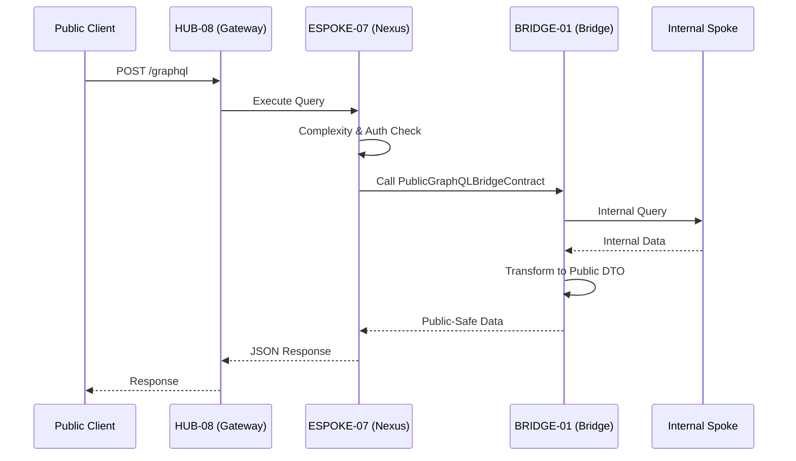

# PHASE ESPOKE-07: Public-Facing GraphQL API Surface


<!-- Blind-Spot Awareness (per BLIND-SPOT-DOCTRINE.md) -->
> **⚠️ Blind-Spot Awareness:** This Spoke blueprint may contain **unverified assumptions about the Hub capabilities it consumes, unstated integration requirements, or edge cases not covered**. The composition policy declared here is a candidate, not a certainty. The ISPOKE's `reusable` flag may not reflect actual reusability. Cross-ESPOKE sharing may have hidden dependencies (like E11→E12). **The consumer matrix is evidence-based, not assumption-based — but the evidence may be incomplete.** See `Architecture/CrossCutting/BLIND-SPOT-DOCTRINE.md` for the governance framework.

<!-- End Blind-Spot Awareness -->

## Tier
External Spoke (Public-facing Application)

## Resolves
Corrects Pattern A (`01_MASTER_INDEX.md` §3): `CORE-09: Cryptography & Hashing (Query Hashing/Signing)`
→ `CORE-16`.

## Component Name
Sovereign Nexus (GraphQL API) — **External Spoke**; distinct from `HUB-21`'s and `ISPOKE-14`'s
"Sovereign Nexus" naming — see the naming-collision notes in `ISPOKE-13.md`/`ISPOKE-14.md`. Three
different components now share variations of "Nexus" across tiers; disambiguate by tier when discussing
any of them.

## Description
Performant, unified GraphQL API surface for public consumption: a consumer-facing projection of the
Sovereign Stack data model, exposing only "Public-Safe" types and fields via `HUB-24`, enforcing
`BRIDGE-01`'s boundary rules.

## Sequencing Rationale
Must exist before `ESPOKE-12` (Developer Portal), which consumes this surface's schema. Follows basic
public web presence (`ESPOKE-01`) and REST APIs (`ESPOKE-02`).

## Build Status
🔴 **Blocked** on `HUB-24`, `HUB-08`, `HUB-04`, `HUB-05` — none implemented.

## Dependency Status — corrected
- **Direct Hub:** `HUB-24`, `HUB-08`, `HUB-04`, `HUB-05`, `HUB-15`. *(Verified — correct.)*
- **Transitive Core:** `CORE-02`, `CORE-06`, `CORE-04`, `CORE-18`, ~~`CORE-09: Cryptography &
  Hashing`~~ → **`CORE-16: Binary Encryption Envelope`** (query hashing/signing for persisted-query
  security).

## Architectural Design
- **NexusSchemaManager** — defines the public GraphQL schema by aggregating types exposed through the
  Bridge.
- **PublicResolverEngine** — executes resolvers calling `BRIDGE-01` to fetch data from the Internal
  tier.
- **ComplexityController** — cost-based query depth/complexity limiting to prevent DoS.
- **TypeProjectionLayer** — maps internal DTOs from the Bridge to the public GraphQL type system.

### Public GraphQL Flow


## Interface Contracts

```php
namespace SovereignStack\External\Nexus\Contracts;

use SovereignStack\Bridge\Contracts\BoundaryContractInterface;

interface PublicGraphQLBridgeContract extends BoundaryContractInterface
{
    public function fetchProjection(string $type, string $id, array $requestedFields): array;
    public function search(string $query, array $filters): array;
}
```

## Integration Strategy
- **Bridge Enforcement:** every resolver interacts with the Internal tier exclusively via
  `PublicGraphQLBridgeContract`; direct access to Internal Spokes or Hub-tier databases is prohibited.
- **Boundary Rules:** any resolver requesting a field not explicitly "Public-Safe" triggers a
  `ViolationException` and a GraphQL error.
- **Gateway Integration:** mounted at `/graphql` via `HUB-08` middleware, inheriting rate limiting and
  WAF protections.
- **Authentication:** `HUB-04` validates public API keys/JWTs; context passed to `HUB-24` for
  field-level authorization.

## Benchmark & Verification Methodology
| Target | Method |
|---|---|
| Schema validation | Static scan: unified schema must never expose an "Internal" suffix on any type name. |
| Complexity limit | Integration test: submit a query exceeding complexity 1000 or depth 10; assert `400 Bad Request` before any resolver executes (not after partial execution). |
| Bridge isolation | Static analysis: no file in `SovereignStack\External\Nexus` may `use` any `SovereignStack\Internal` class — same mechanism as `BRIDGE-01`'s Zero-Exposure Test. |
| Response time | State environment before citing "< 50ms p95" — measure once `HUB-24` exists (Finding 10). |

## CI Verification Criteria
- Schema-validation scan, blocking.
- Complexity-limit-before-execution test, blocking.
- Bridge-isolation static analysis, blocking.
- Response time measured and reported with environment stated.

## SemVer Impact
**Major.** Establishes the primary typed data interface for the public ecosystem.


---

## Doctrines Applied + Rewrite Notes (PR #348)

> **This section was added in PR #348 (Core rewrite Batch, 2026-10-07) per Tech-Lead directive: "rewrite with proper details the entire SDLC then Architecture starting from Core, three documents at a time. No more Patches!"**

### Doctrines Applied

This blueprint is bound by the following doctrines (per [SDLC-01 §9](../../SDLC/SDLC-01-Foundations.md) convention):

- **Blind-Spot Doctrine** ([`../../CrossCutting/BLIND-SPOT-DOCTRINE.md`](../../CrossCutting/BLIND-SPOT-DOCTRINE.md)) — banner at top of this file (binding rule #3: every architectural document carries a blind-spot awareness note). The blueprint's claims are candidates, not certainties. The implementation may diverge from the blueprint (implementation drift). An audit of this blueprint is a starting point, not a complete inventory.
- **Nuclear-Grade Doctrine** ([`../../CrossCutting/NUCLEAR-GRADE-DOCTRINE.md`](../../CrossCutting/NUCLEAR-GRADE-DOCTRINE.md)) — binding on Core tier (per the doctrine's §0). Where this blueprint and the doctrine disagree, the doctrine wins. Depth 5 (production hardening) requires the doctrine's §9 merge gate to pass.
- **Integrity Gate** ([`../../Verification/INTEGRITY-GATE.md`](../../Verification/INTEGRITY-GATE.md)) — depth 6 (at-scale verification) requires the Integrity Gate's convergence criteria. The gate is a finite stopping condition (PASSED 2026-10-05).
- **Two-DAG Governance** ([`../../ADRs/ADR-021-tier-stratified-build-order.md`](../../ADRs/ADR-021-tier-stratified-build-order.md)) — the Dependency Status section above reflects the Declared DAG (architectural intent). The Verified DAG (implementation reality) lives at [`../../Core/CORE-VERIFIED-DAG.md`](../../Core/CORE-VERIFIED-DAG.md). When the two disagree, that disagreement is a finding in [`../../Verification/SHORTCOMINGS-REGISTER.md`](../../Verification/SHORTCOMINGS-REGISTER.md), not a defect to fix by editing either DAG.
- **FROZEN-CONTRACTS** ([`../../FROZEN-CONTRACTS.md`](../../FROZEN-CONTRACTS.md)) — the Interface Contracts section above declares the public surface. Once this blueprint is implemented at any depth, those contracts freeze. Changes require an ADR (per [SDLC-03 §3.1](../../SDLC/SDLC-03-InterfaceFreeze.md)).

### Updates Applied in PR #348

- **PHP version**: bulk-updated all references from `PHP 8.3` → `PHP 8.4` (the package `composer.json` files already require `^8.4`; the blueprint references were stale). This includes version strings in interface contracts, reference implementation notes, benchmark methodology baselines, and runtime requirements.
- **Cross-references**: added references to the new SDLC documents ([`SDLC-01`](../../SDLC/SDLC-01-Foundations.md), [`SDLC-02`](../../SDLC/SDLC-02-Governance.md), [`SDLC-03`](../../SDLC/SDLC-03-InterfaceFreeze.md), [`SDLC-04`](../../SDLC/SDLC-04-CooldownMechanics.md), [`SDLC-05`](../../SDLC/SDLC-05-AI-Assisted-Development-Protocol.md), [`SDLC-06`](../../SDLC/SDLC-06-Generator-Specifications.md)) which replaced the original `SDLC-AGRD.md` (now a redirect at [`../../CrossCutting/SDLC-AGRD.md`](../../CrossCutting/SDLC-AGRD.md)).
- **Doctrine layer**: added this "Doctrines Applied + Rewrite Notes" section per the new SDLC convention (SDLC-01 §9 Provenance).
- **Build Status**: verified current shipped state (depth 2 for this blueprint — ESPOKE-07 — shipped per the verified DAG).

### What Was NOT Changed in PR #348

- **Interface contracts** — the PHP interface definitions, class maps, and behavior contracts were NOT modified. They remain as declared. Any change to these would require an ADR (per [SDLC-03 §3.1](../../SDLC/SDLC-03-InterfaceFreeze.md)).
- **Reference implementations** — the compilable class code was NOT modified. The implementation lives in `packages/core/spoke/external/graphql/src/` and is verified by the architecture-boundary-lint.
- **Sequence diagrams** — the Mermaid sequence diagrams were NOT modified.
- **Benchmark methodology** — the harness specs were NOT modified (only the PHP version in the baseline was updated from 8.3 to 8.4 to match the actual CI runner).

### Verification Conditions for This Rewrite

- **Architecture-lint**: this file is scanned by `Architecture/Verification/lint/run.php`. The lint checks for invalid tokens (CORE-NN, HUB-NN, etc. in valid ranges), `misattribution phrases` (`CORE-09: Cryptography/Hashing`, `HUB-28: Analytics/Ledger` — must not appear in active prose), and structural completeness (the file must exist). Must pass.
- **Architecture-boundary-lint**: not directly applicable (this is a documentation file, not source code), but the implementation referenced in this blueprint is scanned by `scripts/architecture-boundary-lint.py`.
- **Self-test**: the architecture-lint's `--self-test` flag (added in PR #314) verifies the lint correctly detects missing files. This ensures the structural completeness check is not a false-positive.

### Provenance

This section was added in PR #348 (2026-10-07). The original blueprint content (interface contracts, class maps, sequence diagrams, etc.) was authored in earlier sessions and is preserved. The doctrine layer + PHP version update + cross-references to new SDLC documents are the additions.

Per the Blind-Spot Doctrine: this rewrite is a starting point, not a complete specification. The number of doctrines applied here is not the number of doctrines that exist. Future rewrites may add more doctrine cross-references as the methodology continues to evolve.
