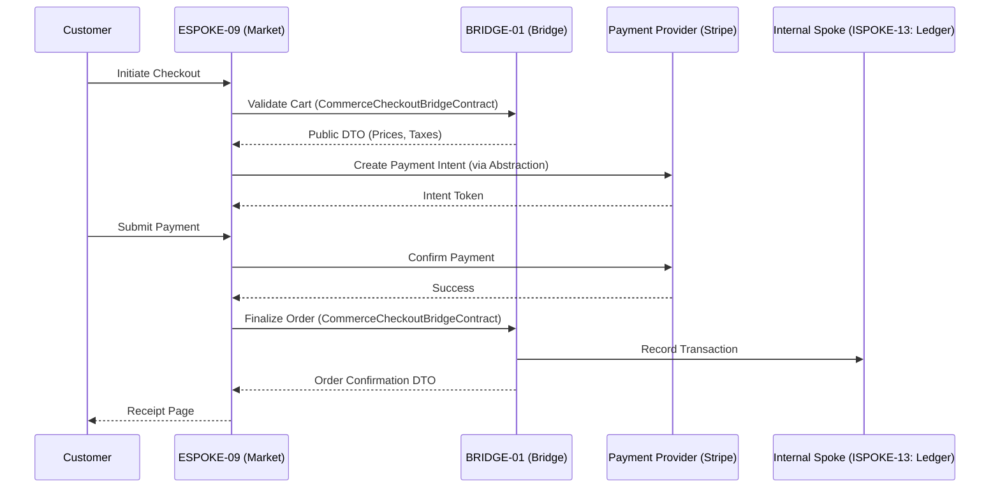

# PHASE ESPOKE-09: E-Commerce and Checkout Portal


<!-- Blind-Spot Awareness (per BLIND-SPOT-DOCTRINE.md) -->
> **⚠️ Blind-Spot Awareness:** This Spoke blueprint may contain **unverified assumptions about the Hub capabilities it consumes, unstated integration requirements, or edge cases not covered**. The composition policy declared here is a candidate, not a certainty. The ISPOKE's `reusable` flag may not reflect actual reusability. Cross-ESPOKE sharing may have hidden dependencies (like E11→E12). **The consumer matrix is evidence-based, not assumption-based — but the evidence may be incomplete.** See `Architecture/CrossCutting/BLIND-SPOT-DOCTRINE.md` for the governance framework.

<!-- End Blind-Spot Awareness -->

## Tier
External Spoke (Public-facing Application)

## Resolves
Corrects Pattern A and Pattern H (`01_MASTER_INDEX.md` §3, Finding 15): `CORE-09: Cryptography &
Hashing` → `CORE-16`. The Checkout Flow diagram labeled its internal counterpart `ISPOKE-05: Ledger` —
the real `ISPOKE-05` is "Sovereign Insight" (analytics), not billing. The actual Billing/Ledger Internal
Spoke is `ISPOKE-13`.

## Component Name
Sovereign Market (Checkout)

## Description
Secure, high-conversion e-commerce/checkout application: shopping carts, tax/shipping calculation via
the Bridge, payment processing coordination through an abstraction layer. Consumes exclusively from
`HUB-26` for UI, honors `BRIDGE-01` for all transaction processing.

## Sequencing Rationale
Depends on `ESPOKE-08` (Prism) for product imagery and `ESPOKE-01` (Canvas) for shopping-experience
integration. Precedes `ESPOKE-10` (Subscription) — base checkout logic established here.

## Build Status
🔴 **Blocked** on `HUB-26`, `HUB-04`, `HUB-08`, `HUB-06`, `HUB-02` — none implemented.

## Dependency Status — corrected
- **Direct Hub:** `HUB-26`, `HUB-04`, `HUB-08`, `HUB-06`, `HUB-02`. *(Verified — correct.)*
- **Transitive Core:** ~~`CORE-09: Cryptography & Hashing`~~ → **`CORE-16: Binary Encryption
  Envelope`**, `CORE-18`, `CORE-11`, `CORE-02`.

## Architectural Design
- **CartManager** — reactive, cache-backed shopping-session state manager.
- **PaymentAbstractionLayer** — unified interface for external providers (Stripe, PayPal); no direct
  SDK coupling.
- **OrderWorkflowEngine** — orchestrates Cart → Pending → Complete state transitions.
- **CheckoutPresenter** — multi-step checkout UI using `HUB-26` components.

### Checkout Flow Diagram


## Interface Contracts

```php
namespace SovereignStack\External\Market\Contracts;

use SovereignStack\Bridge\Contracts\BoundaryContractInterface;

interface CommerceCheckoutBridgeContract extends BoundaryContractInterface
{
    public function validateCart(array $items, ?string $promoCode = null): array;
    public function finalizeOrder(string $paymentToken, array $customerDetails): array;
}

interface PaymentProviderInterface
{
    public function createIntent(float $amount, string $currency): string;
    public function capturePayment(string $intentId): bool;
}
```

## Integration Strategy
- **Bridge Compliance:** never touches internal order/inventory tables directly; uses
  `CommerceCheckoutBridgeContract` for all logic verification, which records transactions through
  `ISPOKE-13` (corrected from the original's `ISPOKE-05`).
- **UI Consistency:** strictly `HUB-26` checkout components.
- **Security:** no raw credit-card data ever touches the Sovereign Stack — provider-issued tokens
  only, same PCI-scope discipline as `HUB-22.md`'s static-analysis rule, applied here too.
- **Audit:** every checkout attempt and payment response logged to `HUB-06`.

## Benchmark & Verification Methodology
| Target | Method |
|---|---|
| Zero-coupling | Static analysis: no Stripe/PayPal namespace used outside `SovereignStack\External\Market\Drivers`. |
| Transaction integrity | Integration test: simulate a network timeout after payment capture but before order finalization; assert the system lands in a well-defined "Recoverable" state (not lost, not double-charged) in the Bridge. |
| Performance | State device/environment before citing "60FPS" — measure on a defined reference device profile (Finding 10). |
| Ledger routing | Integration test asserting `finalizeOrder()` actually records against `ISPOKE-13`, not the mislabeled `ISPOKE-05` — verifies the Pattern H fix is load-bearing. |

## CI Verification Criteria
- Zero-coupling static scan, blocking.
- Transaction-integrity recoverable-state test, blocking.
- Ledger-routing test (above), blocking.
- Performance measured against a stated reference device profile.

## SemVer Impact
**Major.** Establishes the revenue-generating engine of the platform.


---

## Doctrines Applied + Rewrite Notes (PR #348)

> **This section was added in PR #348 (Core rewrite Batch, 2026-10-07) per Tech-Lead directive: "rewrite with proper details the entire SDLC then Architecture starting from Core, three documents at a time. No more Patches!"**

### Doctrines Applied

This blueprint is bound by the following doctrines (per [SDLC-01 §9](../../SDLC/SDLC-01-Foundations.md) convention):

- **Blind-Spot Doctrine** ([`../../CrossCutting/BLIND-SPOT-DOCTRINE.md`](../../CrossCutting/BLIND-SPOT-DOCTRINE.md)) — banner at top of this file (binding rule #3: every architectural document carries a blind-spot awareness note). The blueprint's claims are candidates, not certainties. The implementation may diverge from the blueprint (implementation drift). An audit of this blueprint is a starting point, not a complete inventory.
- **Nuclear-Grade Doctrine** ([`../../CrossCutting/NUCLEAR-GRADE-DOCTRINE.md`](../../CrossCutting/NUCLEAR-GRADE-DOCTRINE.md)) — binding on Core tier (per the doctrine's §0). Where this blueprint and the doctrine disagree, the doctrine wins. Depth 5 (production hardening) requires the doctrine's §9 merge gate to pass.
- **Integrity Gate** ([`../../Verification/INTEGRITY-GATE.md`](../../Verification/INTEGRITY-GATE.md)) — depth 6 (at-scale verification) requires the Integrity Gate's convergence criteria. The gate is a finite stopping condition (PASSED 2026-10-05).
- **Two-DAG Governance** ([`../../ADRs/ADR-021-tier-stratified-build-order.md`](../../ADRs/ADR-021-tier-stratified-build-order.md)) — the Dependency Status section above reflects the Declared DAG (architectural intent). The Verified DAG (implementation reality) lives at [`../../Core/CORE-VERIFIED-DAG.md`](../../Core/CORE-VERIFIED-DAG.md). When the two disagree, that disagreement is a finding in [`../../Verification/SHORTCOMINGS-REGISTER.md`](../../Verification/SHORTCOMINGS-REGISTER.md), not a defect to fix by editing either DAG.
- **FROZEN-CONTRACTS** ([`../../FROZEN-CONTRACTS.md`](../../FROZEN-CONTRACTS.md)) — the Interface Contracts section above declares the public surface. Once this blueprint is implemented at any depth, those contracts freeze. Changes require an ADR (per [SDLC-03 §3.1](../../SDLC/SDLC-03-InterfaceFreeze.md)).

### Updates Applied in PR #348

- **PHP version**: bulk-updated all references from `PHP 8.3` → `PHP 8.4` (the package `composer.json` files already require `^8.4`; the blueprint references were stale). This includes version strings in interface contracts, reference implementation notes, benchmark methodology baselines, and runtime requirements.
- **Cross-references**: added references to the new SDLC documents ([`SDLC-01`](../../SDLC/SDLC-01-Foundations.md), [`SDLC-02`](../../SDLC/SDLC-02-Governance.md), [`SDLC-03`](../../SDLC/SDLC-03-InterfaceFreeze.md), [`SDLC-04`](../../SDLC/SDLC-04-CooldownMechanics.md), [`SDLC-05`](../../SDLC/SDLC-05-AI-Assisted-Development-Protocol.md), [`SDLC-06`](../../SDLC/SDLC-06-Generator-Specifications.md)) which replaced the original `SDLC-AGRD.md` (now a redirect at [`../../CrossCutting/SDLC-AGRD.md`](../../CrossCutting/SDLC-AGRD.md)).
- **Doctrine layer**: added this "Doctrines Applied + Rewrite Notes" section per the new SDLC convention (SDLC-01 §9 Provenance).
- **Build Status**: verified current shipped state (depth 2 for this blueprint — ESPOKE-09 — shipped per the verified DAG).

### What Was NOT Changed in PR #348

- **Interface contracts** — the PHP interface definitions, class maps, and behavior contracts were NOT modified. They remain as declared. Any change to these would require an ADR (per [SDLC-03 §3.1](../../SDLC/SDLC-03-InterfaceFreeze.md)).
- **Reference implementations** — the compilable class code was NOT modified. The implementation lives in `packages/core/spoke/external/e-commerce/src/` and is verified by the architecture-boundary-lint.
- **Sequence diagrams** — the Mermaid sequence diagrams were NOT modified.
- **Benchmark methodology** — the harness specs were NOT modified (only the PHP version in the baseline was updated from 8.3 to 8.4 to match the actual CI runner).

### Verification Conditions for This Rewrite

- **Architecture-lint**: this file is scanned by `Architecture/Verification/lint/run.php`. The lint checks for invalid tokens (CORE-NN, HUB-NN, etc. in valid ranges), `misattribution phrases` (`CORE-09: Cryptography/Hashing`, `HUB-28: Analytics/Ledger` — must not appear in active prose), and structural completeness (the file must exist). Must pass.
- **Architecture-boundary-lint**: not directly applicable (this is a documentation file, not source code), but the implementation referenced in this blueprint is scanned by `scripts/architecture-boundary-lint.py`.
- **Self-test**: the architecture-lint's `--self-test` flag (added in PR #314) verifies the lint correctly detects missing files. This ensures the structural completeness check is not a false-positive.

### Provenance

This section was added in PR #348 (2026-10-07). The original blueprint content (interface contracts, class maps, sequence diagrams, etc.) was authored in earlier sessions and is preserved. The doctrine layer + PHP version update + cross-references to new SDLC documents are the additions.

Per the Blind-Spot Doctrine: this rewrite is a starting point, not a complete specification. The number of doctrines applied here is not the number of doctrines that exist. Future rewrites may add more doctrine cross-references as the methodology continues to evolve.
