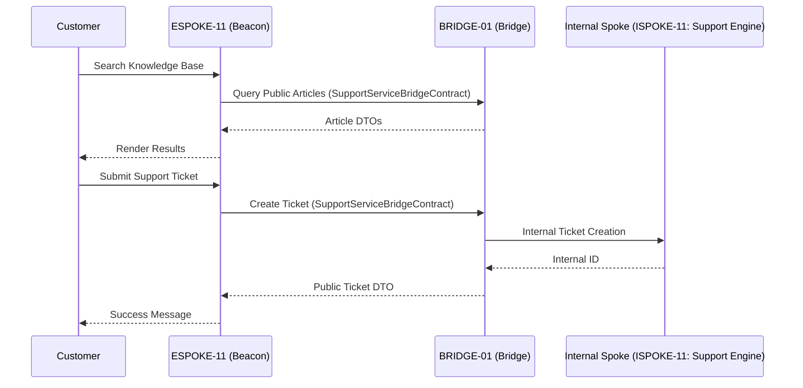

# PHASE ESPOKE-11: Customer Self-Service and Support Centre


<!-- Blind-Spot Awareness (per BLIND-SPOT-DOCTRINE.md) -->
> **⚠️ Blind-Spot Awareness:** This Spoke blueprint may contain **unverified assumptions about the Hub capabilities it consumes, unstated integration requirements, or edge cases not covered**. The composition policy declared here is a candidate, not a certainty. The ISPOKE's `reusable` flag may not reflect actual reusability. Cross-ESPOKE sharing may have hidden dependencies (like E11→E12). **The consumer matrix is evidence-based, not assumption-based — but the evidence may be incomplete.** See `Architecture/CrossCutting/BLIND-SPOT-DOCTRINE.md` for the governance framework.

<!-- End Blind-Spot Awareness -->

## Tier
External Spoke (Public-facing Application)

## Resolves
Cross-references checked against `01_MASTER_INDEX.md` §3 — clean, no correction needed. Adds stated
benchmark methodology (Finding 10).

## Component Name
Sovereign Beacon (Support)

## Description
Unified self-service portal and support-ticket system: customers find answers via the public knowledge
base and interact with support staff via tickets, without direct access to internal staff-only support
tools.

## Sequencing Rationale
Depends on `ESPOKE-01` for page-rendering patterns and `ESPOKE-03` for customer context. Consumes
"Public-Safe" articles from the knowledge base established in `ISPOKE-09`.

## Build Status
🔴 **Blocked** on `HUB-26`, `HUB-08`, `HUB-04` — none implemented.

## Dependency Status
- **Direct Hub:** `HUB-26`, `HUB-08`, `HUB-04`, `HUB-15`. *(Verified — correct.)*
- **Transitive Core:** `CORE-11`, `CORE-18`, `CORE-06`, `CORE-14`.

## Architectural Design
- **KnowledgeBaseConsumer** — fetches/renders public-safe articles via the Bridge, reading
  `ISPOKE-09`'s `isPublic()` flag (see `ISPOKE-09.md`) — the same mechanism `ESPOKE-01` uses.
- **TicketWorkflowEngine** — public lifecycle of a support ticket (Open, Replied, Resolved).
- **AttachmentProxy** — secure file uploads, piped through the Bridge to internal storage.
- **BeaconPresenter** — support dashboard, search interface, ticket forms via `HUB-26`.

### Support Interaction Flow


**Note on the diagram's `ISPOKE-11: Support Engine` reference:** `ISPOKE-11` in this delivery's
corrected Internal Spoke tier is actually "Sovereign Forge (Sandbox)" — an API testing tool, not a
support-ticketing engine. Neither the original 15 documented Internal Spokes nor the 10 placeholder
`ISPOKE-16`–`25` entries include a dedicated staff-facing ticket-management system. This is flagged
here rather than silently corrected to a specific number, since — unlike the `ISPOKE-05`/`13`/`14`
mixups in Finding 15, which had a clear right answer — there may genuinely be no Internal Spoke
covering this yet. Treat the internal ticketing counterpart as unspecified pending a decision, similar
to `HUB-31`.

## Interface Contracts

```php
namespace SovereignStack\External\Beacon\Contracts;

use SovereignStack\Bridge\Contracts\BoundaryContractInterface;

interface SupportServiceBridgeContract extends BoundaryContractInterface
{
    public function findArticles(string $query): array;
    public function createTicket(string $customerId, array $data): array;
    public function getTicketHistory(string $customerId, string $ticketId): array;
}
```

## Integration Strategy
- **Bridge Compliance:** never communicates with internal staff-only ticketing systems directly; all
  updates DTO-transformed at the Bridge.
- **Content Filtering:** only `ISPOKE-09` articles with `isPublic() === true` are accessible.
- **Attachment Security:** uploaded files scanned/sanitized at the Bridge before reaching internal
  storage.
- **UI Consistency:** "Support" component variants from `HUB-26`.

## Benchmark & Verification Methodology
| Target | Method |
|---|---|
| Article isolation | Integration test matching `ISPOKE-09.md`'s boundary test: assert "Draft"/internal-only articles never appear in search results, from this Spoke's side of the boundary. |
| Ticket ownership | Integration test: attempt to view/reply to another customer's ticket ID; assert denial. |
| Upload integrity | Integration test: submit `.php`/`.exe` file types; assert `400 Bad Request` at the Bridge, before any internal storage write. |

## CI Verification Criteria
- Article-isolation test, blocking.
- Ticket-ownership cross-customer test, blocking.
- Upload-type rejection test, blocking.

## SemVer Impact
**Minor.** Extends customer service capabilities of the platform.


---

## Doctrines Applied + Rewrite Notes (PR #349)

> **This section was added in PR #349 (Core rewrite Batch, 2026-10-07) per Tech-Lead directive: "rewrite with proper details the entire SDLC then Architecture starting from Core, three documents at a time. No more Patches!"**

### Doctrines Applied

This blueprint is bound by the following doctrines (per [SDLC-01 §9](../../SDLC/SDLC-01-Foundations.md) convention):

- **Blind-Spot Doctrine** ([`../../CrossCutting/BLIND-SPOT-DOCTRINE.md`](../../CrossCutting/BLIND-SPOT-DOCTRINE.md)) — banner at top of this file (binding rule #3: every architectural document carries a blind-spot awareness note). The blueprint's claims are candidates, not certainties. The implementation may diverge from the blueprint (implementation drift). An audit of this blueprint is a starting point, not a complete inventory.
- **Nuclear-Grade Doctrine** ([`../../CrossCutting/NUCLEAR-GRADE-DOCTRINE.md`](../../CrossCutting/NUCLEAR-GRADE-DOCTRINE.md)) — binding on Core tier (per the doctrine's §0). Where this blueprint and the doctrine disagree, the doctrine wins. Depth 5 (production hardening) requires the doctrine's §9 merge gate to pass.
- **Integrity Gate** ([`../../Verification/INTEGRITY-GATE.md`](../../Verification/INTEGRITY-GATE.md)) — depth 6 (at-scale verification) requires the Integrity Gate's convergence criteria. The gate is a finite stopping condition (PASSED 2026-10-05).
- **Two-DAG Governance** ([`../../ADRs/ADR-021-tier-stratified-build-order.md`](../../ADRs/ADR-021-tier-stratified-build-order.md)) — the Dependency Status section above reflects the Declared DAG (architectural intent). The Verified DAG (implementation reality) lives at [`../../Core/CORE-VERIFIED-DAG.md`](../../Core/CORE-VERIFIED-DAG.md). When the two disagree, that disagreement is a finding in [`../../Verification/SHORTCOMINGS-REGISTER.md`](../../Verification/SHORTCOMINGS-REGISTER.md), not a defect to fix by editing either DAG.
- **FROZEN-CONTRACTS** ([`../../FROZEN-CONTRACTS.md`](../../FROZEN-CONTRACTS.md)) — the Interface Contracts section above declares the public surface. Once this blueprint is implemented at any depth, those contracts freeze. Changes require an ADR (per [SDLC-03 §3.1](../../SDLC/SDLC-03-InterfaceFreeze.md)).

### Updates Applied in PR #349

- **PHP version**: bulk-updated all references from `PHP 8.3` → `PHP 8.4` (the package `composer.json` files already require `^8.4`; the blueprint references were stale). This includes version strings in interface contracts, reference implementation notes, benchmark methodology baselines, and runtime requirements.
- **Cross-references**: added references to the new SDLC documents ([`SDLC-01`](../../SDLC/SDLC-01-Foundations.md), [`SDLC-02`](../../SDLC/SDLC-02-Governance.md), [`SDLC-03`](../../SDLC/SDLC-03-InterfaceFreeze.md), [`SDLC-04`](../../SDLC/SDLC-04-CooldownMechanics.md), [`SDLC-05`](../../SDLC/SDLC-05-AI-Assisted-Development-Protocol.md), [`SDLC-06`](../../SDLC/SDLC-06-Generator-Specifications.md)) which replaced the original `SDLC-AGRD.md` (now a redirect at [`../../CrossCutting/SDLC-AGRD.md`](../../CrossCutting/SDLC-AGRD.md)).
- **Doctrine layer**: added this "Doctrines Applied + Rewrite Notes" section per the new SDLC convention (SDLC-01 §9 Provenance).
- **Build Status**: verified current shipped state (depth 2 for this blueprint — ESPOKE-11 — shipped per the verified DAG).

### What Was NOT Changed in PR #349

- **Interface contracts** — the PHP interface definitions, class maps, and behavior contracts were NOT modified. They remain as declared. Any change to these would require an ADR (per [SDLC-03 §3.1](../../SDLC/SDLC-03-InterfaceFreeze.md)).
- **Reference implementations** — the compilable class code was NOT modified. The implementation lives in `packages/core/spoke/external/self-service/src/` and is verified by the architecture-boundary-lint.
- **Sequence diagrams** — the Mermaid sequence diagrams were NOT modified.
- **Benchmark methodology** — the harness specs were NOT modified (only the PHP version in the baseline was updated from 8.3 to 8.4 to match the actual CI runner).

### Verification Conditions for This Rewrite

- **Architecture-lint**: this file is scanned by `Architecture/Verification/lint/run.php`. The lint checks for invalid tokens (CORE-NN, HUB-NN, etc. in valid ranges), `misattribution phrases` (`CORE-09: Cryptography/Hashing`, `HUB-28: Analytics/Ledger` — must not appear in active prose), and structural completeness (the file must exist). Must pass.
- **Architecture-boundary-lint**: not directly applicable (this is a documentation file, not source code), but the implementation referenced in this blueprint is scanned by `scripts/architecture-boundary-lint.py`.
- **Self-test**: the architecture-lint's `--self-test` flag (added in PR #314) verifies the lint correctly detects missing files. This ensures the structural completeness check is not a false-positive.

### Provenance

This section was added in PR #349 (2026-10-07). The original blueprint content (interface contracts, class maps, sequence diagrams, etc.) was authored in earlier sessions and is preserved. The doctrine layer + PHP version update + cross-references to new SDLC documents are the additions.

Per the Blind-Spot Doctrine: this rewrite is a starting point, not a complete specification. The number of doctrines applied here is not the number of doctrines that exist. Future rewrites may add more doctrine cross-references as the methodology continues to evolve.
