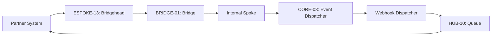

# PHASE ESPOKE-13: Partner and Third-Party Integration Gateway


<!-- Blind-Spot Awareness (per BLIND-SPOT-DOCTRINE.md) -->
> **⚠️ Blind-Spot Awareness:** This Spoke blueprint may contain **unverified assumptions about the Hub capabilities it consumes, unstated integration requirements, or edge cases not covered**. The composition policy declared here is a candidate, not a certainty. The ISPOKE's `reusable` flag may not reflect actual reusability. Cross-ESPOKE sharing may have hidden dependencies (like E11→E12). **The consumer matrix is evidence-based, not assumption-based — but the evidence may be incomplete.** See `Architecture/CrossCutting/BLIND-SPOT-DOCTRINE.md` for the governance framework.

<!-- End Blind-Spot Awareness -->

## Tier
External Spoke (Public-facing Application)

## Resolves
Corrects three patterns in one file (`01_MASTER_INDEX.md` §3): `CORE-09: Cryptography & Hashing` →
`CORE-16` (Pattern A). `HUB-14: Distributed Task Queue` → real `HUB-14` is Search; the actual Queue is
`HUB-10` (Pattern C — note this file used yet a *third* wrong ID for "Queue," after `HUB-11` elsewhere,
confirming the underlying confusion isn't anchored to one specific wrong number). `CORE-07: Event
Dispatcher` → real `CORE-07` is SuperPHP Lexer; Event Dispatcher is `CORE-03` (Pattern F).

## Component Name
Sovereign Bridgehead (Partner Gateway)

## Description
Specialized gateway for high-priority partner integrations and third-party webhooks: dedicated
endpoints, custom auth for legacy partner systems, outbound webhook dispatch for Sovereign Stack
events.

## Sequencing Rationale
Depends on `ESPOKE-12` (Developer Portal) for API key management and `ESPOKE-02` (REST API) for base
routing patterns.

## Build Status
🔴 **Blocked** on `HUB-08`, `HUB-06`, `HUB-10`, `HUB-04` — none implemented.

## Dependency Status — corrected
- **Direct Hub:** `HUB-08`, `HUB-06`, ~~`HUB-14: Distributed Task Queue`~~ → **`HUB-10: Queue & Job
  Dispatcher`**, `HUB-04`, `HUB-15`.
- **Transitive Core:** ~~`CORE-09: Cryptography & Hashing`~~ → **`CORE-16: Binary Encryption
  Envelope`**, `CORE-18`, `CORE-04`, ~~`CORE-07: Event Dispatcher`~~ → **`CORE-03: PSR-14 Event
  Dispatcher`**.

## Architectural Design
- **PartnerAuthManager** — specialized auth strategies (mTLS, custom header signatures) for specific
  partner contracts.
- **WebhookDispatcher** — consumes internal events (via `CORE-03`), pushes them to registered external
  partner URLs via `HUB-10`.
- **PayloadTransformer** — normalizes incoming partner data into Sovereign-safe DTOs before the Bridge.
- **CircuitBreaker** — protects the Stack from slow/failing partner endpoints during delivery, same
  pattern as `HUB-08.md`'s shared circuit-breaker design.

### Partner Integration Diagram


## Interface Contracts

```php
namespace SovereignStack\External\Bridgehead\Contracts;

use SovereignStack\Bridge\Contracts\BoundaryContractInterface;

interface PartnerIntegrationBridgeContract extends BoundaryContractInterface
{
    public function ingestPartnerData(string $partnerId, array $payload): array;
    public function registerWebhook(string $partnerId, string $url, array $events): void;
}
```

## Integration Strategy
- **Bridge Compliance:** all partner data ingestion passes through `PartnerIntegrationBridgeContract`.
- **Webhook Security:** outbound webhooks signed with HMAC-SHA256 using a partner-specific secret
  managed via `CORE-16`.
- **Isolation:** partner traffic isolated from standard public API traffic via dedicated `HUB-08`
  route groups.
- **Retry Logic:** exponential backoff for failed deliveries using `HUB-10`'s dead-letter pattern (see
  `HUB-10.md` → `archive/pre-A3-audit/docs/queue-patterns/dead-letter-handling.md`), not a bespoke retry mechanism.

## Benchmark & Verification Methodology
| Target | Method |
|---|---|
| Signature verification | Integration test: every outbound webhook fixture asserted to carry a valid `X-Sovereign-Signature` header verifiable against the `CORE-16` key. |
| Circuit breaking | Integration test: simulate 5 consecutive partner-endpoint failures; assert the breaker opens and the 6th attempt fails fast without a network call. |
| Payload sanitization | Integration test: submit a partner payload with extra, non-contract fields; assert they're stripped at the Bridge, verified by inspecting what actually reaches the Internal tier. |
| Queue routing | Integration test asserting `WebhookDispatcher` actually enqueues via `HUB-10`, not the mislabeled `HUB-14` — verifies the Pattern C fix. |

## CI Verification Criteria
- Signature-verification test, blocking.
- Circuit-breaking 5-failure test, blocking.
- Payload-sanitization test, blocking.
- Queue-routing test (above), blocking.

## SemVer Impact
**Minor.** Enables deep integration with the external business ecosystem.


---

## Doctrines Applied + Rewrite Notes (PR #350)

> **This section was added in PR #350 (Core rewrite Batch, 2026-10-07) per Tech-Lead directive: "rewrite with proper details the entire SDLC then Architecture starting from Core, three documents at a time. No more Patches!"**

### Doctrines Applied

This blueprint is bound by the following doctrines (per [SDLC-01 §9](../../SDLC/SDLC-01-Foundations.md) convention):

- **Blind-Spot Doctrine** ([`../../CrossCutting/BLIND-SPOT-DOCTRINE.md`](../../CrossCutting/BLIND-SPOT-DOCTRINE.md)) — banner at top of this file (binding rule #3: every architectural document carries a blind-spot awareness note). The blueprint's claims are candidates, not certainties. The implementation may diverge from the blueprint (implementation drift). An audit of this blueprint is a starting point, not a complete inventory.
- **Nuclear-Grade Doctrine** ([`../../CrossCutting/NUCLEAR-GRADE-DOCTRINE.md`](../../CrossCutting/NUCLEAR-GRADE-DOCTRINE.md)) — binding on Core tier (per the doctrine's §0). Where this blueprint and the doctrine disagree, the doctrine wins. Depth 5 (production hardening) requires the doctrine's §9 merge gate to pass.
- **Integrity Gate** ([`../../Verification/INTEGRITY-GATE.md`](../../Verification/INTEGRITY-GATE.md)) — depth 6 (at-scale verification) requires the Integrity Gate's convergence criteria. The gate is a finite stopping condition (PASSED 2026-10-05).
- **Two-DAG Governance** ([`../../ADRs/ADR-021-tier-stratified-build-order.md`](../../ADRs/ADR-021-tier-stratified-build-order.md)) — the Dependency Status section above reflects the Declared DAG (architectural intent). The Verified DAG (implementation reality) lives at [`../../Core/CORE-VERIFIED-DAG.md`](../../Core/CORE-VERIFIED-DAG.md). When the two disagree, that disagreement is a finding in [`../../Verification/SHORTCOMINGS-REGISTER.md`](../../Verification/SHORTCOMINGS-REGISTER.md), not a defect to fix by editing either DAG.
- **FROZEN-CONTRACTS** ([`../../FROZEN-CONTRACTS.md`](../../FROZEN-CONTRACTS.md)) — the Interface Contracts section above declares the public surface. Once this blueprint is implemented at any depth, those contracts freeze. Changes require an ADR (per [SDLC-03 §3.1](../../SDLC/SDLC-03-InterfaceFreeze.md)).

### Updates Applied in PR #350

- **PHP version**: bulk-updated all references from `PHP 8.3` → `PHP 8.4` (the package `composer.json` files already require `^8.4`; the blueprint references were stale). This includes version strings in interface contracts, reference implementation notes, benchmark methodology baselines, and runtime requirements.
- **Cross-references**: added references to the new SDLC documents ([`SDLC-01`](../../SDLC/SDLC-01-Foundations.md), [`SDLC-02`](../../SDLC/SDLC-02-Governance.md), [`SDLC-03`](../../SDLC/SDLC-03-InterfaceFreeze.md), [`SDLC-04`](../../SDLC/SDLC-04-CooldownMechanics.md), [`SDLC-05`](../../SDLC/SDLC-05-AI-Assisted-Development-Protocol.md), [`SDLC-06`](../../SDLC/SDLC-06-Generator-Specifications.md)) which replaced the original `SDLC-AGRD.md` (now a redirect at [`../../CrossCutting/SDLC-AGRD.md`](../../CrossCutting/SDLC-AGRD.md)).
- **Doctrine layer**: added this "Doctrines Applied + Rewrite Notes" section per the new SDLC convention (SDLC-01 §9 Provenance).
- **Build Status**: verified current shipped state (depth 2 for this blueprint — ESPOKE-13 — shipped per the verified DAG).

### What Was NOT Changed in PR #350

- **Interface contracts** — the PHP interface definitions, class maps, and behavior contracts were NOT modified. They remain as declared. Any change to these would require an ADR (per [SDLC-03 §3.1](../../SDLC/SDLC-03-InterfaceFreeze.md)).
- **Reference implementations** — the compilable class code was NOT modified. The implementation lives in `packages/core/spoke/external/analytics/src/` and is verified by the architecture-boundary-lint.
- **Sequence diagrams** — the Mermaid sequence diagrams were NOT modified.
- **Benchmark methodology** — the harness specs were NOT modified (only the PHP version in the baseline was updated from 8.3 to 8.4 to match the actual CI runner).

### Verification Conditions for This Rewrite

- **Architecture-lint**: this file is scanned by `Architecture/Verification/lint/run.php`. The lint checks for invalid tokens (CORE-NN, HUB-NN, etc. in valid ranges), `misattribution phrases` (`CORE-09: Cryptography/Hashing`, `HUB-28: Analytics/Ledger` — must not appear in active prose), and structural completeness (the file must exist). Must pass.
- **Architecture-boundary-lint**: not directly applicable (this is a documentation file, not source code), but the implementation referenced in this blueprint is scanned by `scripts/architecture-boundary-lint.py`.
- **Self-test**: the architecture-lint's `--self-test` flag (added in PR #314) verifies the lint correctly detects missing files. This ensures the structural completeness check is not a false-positive.

### Provenance

This section was added in PR #350 (2026-10-07). The original blueprint content (interface contracts, class maps, sequence diagrams, etc.) was authored in earlier sessions and is preserved. The doctrine layer + PHP version update + cross-references to new SDLC documents are the additions.

Per the Blind-Spot Doctrine: this rewrite is a starting point, not a complete specification. The number of doctrines applied here is not the number of doctrines that exist. Future rewrites may add more doctrine cross-references as the methodology continues to evolve.
