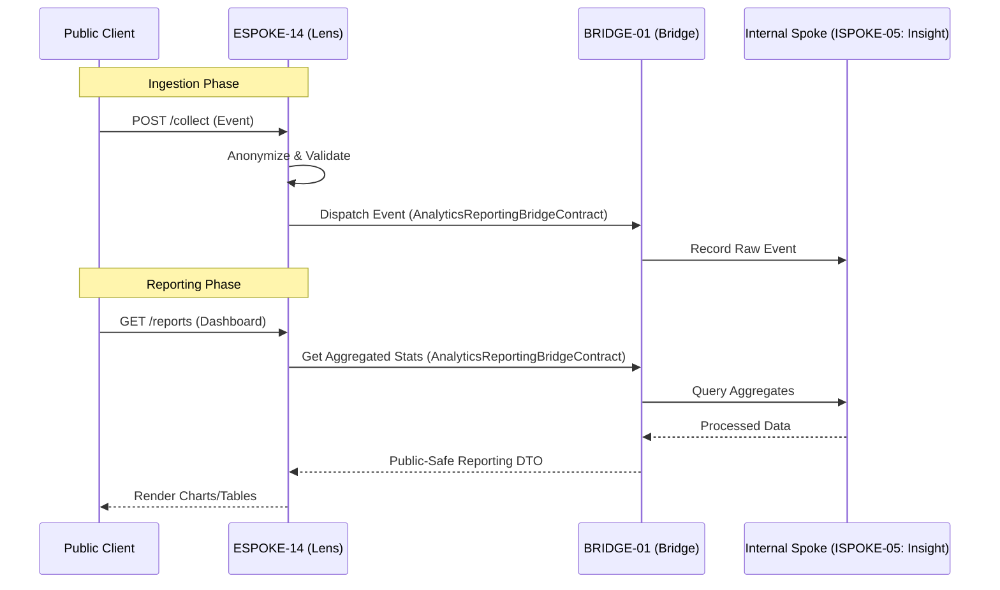

# PHASE ESPOKE-14: Public Analytics and Reporting Endpoint


<!-- Blind-Spot Awareness (per BLIND-SPOT-DOCTRINE.md) -->
> **⚠️ Blind-Spot Awareness:** This Spoke blueprint may contain **unverified assumptions about the Hub capabilities it consumes, unstated integration requirements, or edge cases not covered**. The composition policy declared here is a candidate, not a certainty. The ISPOKE's `reusable` flag may not reflect actual reusability. Cross-ESPOKE sharing may have hidden dependencies (like E11→E12). **The consumer matrix is evidence-based, not assumption-based — but the evidence may be incomplete.** See `Architecture/CrossCutting/BLIND-SPOT-DOCTRINE.md` for the governance framework.

<!-- End Blind-Spot Awareness -->

## Tier
External Spoke (Public-facing Application)

## Resolves
Corrects Pattern A and Pattern H (`01_MASTER_INDEX.md` §3, Finding 15): `CORE-09: Cryptography &
Hashing` → `CORE-16`. This file's "uses the reporting patterns established in `ISPOKE-14` (Internal
Analytics)" and its diagram's `ISPOKE-14: Insight` participant are both wrong — the real `ISPOKE-14` is
"Sovereign Nexus (Tenancy)," a multi-tenancy admin console with no analytics function. The actual
internal analytics counterpart is `ISPOKE-05` ("Sovereign Insight"). This is the mirror image of
`ESPOKE-09`/`10`'s bug (which pointed at `ISPOKE-05` when meaning Billing) — between the three files,
every plausible wrong pairing of `{05, 13, 14}` × `{Insight, Ledger, Nexus}` was used somewhere except
the correct one.

## Component Name
Sovereign Lens (Analytics)

## Description
Dual-purpose analytics engine: an ingestion endpoint for public client events (clicks, views,
conversions) and a reporting interface for authenticated customers to view their own performance
metrics. Bridges raw public activity and processed internal reporting data.

## Sequencing Rationale
Depends on almost all other External Spokes — it collects data from them. Uses reporting patterns
established in `ISPOKE-05` (corrected from `ISPOKE-14`).

## Build Status
🔴 **Blocked** on `HUB-08`, `HUB-02`, `HUB-26`, `HUB-06` — none implemented. Also implicitly depends on
`ISPOKE-05`'s own `HUB-31` (pending) dependency for the deepest reporting features, though this Spoke's
own ingestion endpoint does not.

## Dependency Status — corrected
- **Direct Hub:** `HUB-08`, `HUB-02`, `HUB-26`, `HUB-06`, `HUB-15`.
- **Transitive Core:** ~~`CORE-09: Cryptography & Hashing`~~ → **`CORE-16: Binary Encryption
  Envelope`** (anonymization/salting), `CORE-18`, `CORE-14`, `CORE-11`.

## Architectural Design
- **EventIngestor** — high-throughput, low-latency endpoint for JSON analytics payloads.
- **AnonymizationLayer** — strips PII, salts identifiers using `CORE-16` before internal storage.
- **MetricAggregator** — consumes raw events, updates real-time counters in `HUB-02`.
- **ReportingPresenter** — customer-facing dashboard via `HUB-26` visualization components.

### Analytics Ingestion & Reporting Flow


## Interface Contracts

```php
namespace SovereignStack\External\Lens\Contracts;

use SovereignStack\Bridge\Contracts\BoundaryContractInterface;

interface AnalyticsReportingBridgeContract extends BoundaryContractInterface
{
    public function dispatchEvent(array $anonymizedData): void;
    public function getCustomerReport(string $customerId, string $reportType, array $params): array;
}
```

## Integration Strategy
- **Bridge Compliance:** raw event ingestion and reporting queries strictly mediated by
  `AnalyticsReportingBridgeContract`, backed by `ISPOKE-05` (corrected from `ISPOKE-14`).
- **Privacy First:** no raw IP addresses or user-agent strings cross the Bridge — anonymized within
  `ESPOKE-14` first.
- **Visualization:** `HUB-26` primitives for SVG charts/data tables.
- **Buffering:** high-volume ingestion buffered in `HUB-02` before flushing to the Bridge in batches.

## Benchmark & Verification Methodology
| Target | Method |
|---|---|
| Anonymization | Test payload containing email, name, raw IP; assert none present in the `anonymizedData` sent to the Bridge. |
| Ingestion latency | Integration test measuring actual `/collect` response time on a stated environment, don't restate "< 10ms" unmeasured (Finding 10). |
| Data isolation | Integration test: fetch Customer A's aggregated report using Customer B's session; assert denial. |
| Routing correction | Integration test asserting `getCustomerReport()` actually queries `ISPOKE-05`, not the mislabeled `ISPOKE-14` — verifies the Pattern H fix. |

## CI Verification Criteria
- Anonymization test, blocking.
- Cross-customer data-isolation test, blocking.
- Routing-correction test (above), blocking.
- Ingestion latency measured and reported with environment stated.

## SemVer Impact
**Minor.** Provides transparency and data-driven insights to the public ecosystem.


---

## Doctrines Applied + Rewrite Notes (PR #350)

> **This section was added in PR #350 (Core rewrite Batch, 2026-10-07) per Tech-Lead directive: "rewrite with proper details the entire SDLC then Architecture starting from Core, three documents at a time. No more Patches!"**

### Doctrines Applied

This blueprint is bound by the following doctrines (per [SDLC-01 §9](../../SDLC/SDLC-01-Foundations.md) convention):

- **Blind-Spot Doctrine** ([`../../CrossCutting/BLIND-SPOT-DOCTRINE.md`](../../CrossCutting/BLIND-SPOT-DOCTRINE.md)) — banner at top of this file (binding rule #3: every architectural document carries a blind-spot awareness note). The blueprint's claims are candidates, not certainties. The implementation may diverge from the blueprint (implementation drift). An audit of this blueprint is a starting point, not a complete inventory.
- **Nuclear-Grade Doctrine** ([`../../CrossCutting/NUCLEAR-GRADE-DOCTRINE.md`](../../CrossCutting/NUCLEAR-GRADE-DOCTRINE.md)) — binding on Core tier (per the doctrine's §0). Where this blueprint and the doctrine disagree, the doctrine wins. Depth 5 (production hardening) requires the doctrine's §9 merge gate to pass.
- **Integrity Gate** ([`../../Verification/INTEGRITY-GATE.md`](../../Verification/INTEGRITY-GATE.md)) — depth 6 (at-scale verification) requires the Integrity Gate's convergence criteria. The gate is a finite stopping condition (PASSED 2026-10-05).
- **Two-DAG Governance** ([`../../ADRs/ADR-021-tier-stratified-build-order.md`](../../ADRs/ADR-021-tier-stratified-build-order.md)) — the Dependency Status section above reflects the Declared DAG (architectural intent). The Verified DAG (implementation reality) lives at [`../../Core/CORE-VERIFIED-DAG.md`](../../Core/CORE-VERIFIED-DAG.md). When the two disagree, that disagreement is a finding in [`../../Verification/SHORTCOMINGS-REGISTER.md`](../../Verification/SHORTCOMINGS-REGISTER.md), not a defect to fix by editing either DAG.
- **FROZEN-CONTRACTS** ([`../../FROZEN-CONTRACTS.md`](../../FROZEN-CONTRACTS.md)) — the Interface Contracts section above declares the public surface. Once this blueprint is implemented at any depth, those contracts freeze. Changes require an ADR (per [SDLC-03 §3.1](../../SDLC/SDLC-03-InterfaceFreeze.md)).

### Updates Applied in PR #350

- **PHP version**: bulk-updated all references from `PHP 8.3` → `PHP 8.4` (the package `composer.json` files already require `^8.4`; the blueprint references were stale). This includes version strings in interface contracts, reference implementation notes, benchmark methodology baselines, and runtime requirements.
- **Cross-references**: added references to the new SDLC documents ([`SDLC-01`](../../SDLC/SDLC-01-Foundations.md), [`SDLC-02`](../../SDLC/SDLC-02-Governance.md), [`SDLC-03`](../../SDLC/SDLC-03-InterfaceFreeze.md), [`SDLC-04`](../../SDLC/SDLC-04-CooldownMechanics.md), [`SDLC-05`](../../SDLC/SDLC-05-AI-Assisted-Development-Protocol.md), [`SDLC-06`](../../SDLC/SDLC-06-Generator-Specifications.md)) which replaced the original `SDLC-AGRD.md` (now a redirect at [`../../CrossCutting/SDLC-AGRD.md`](../../CrossCutting/SDLC-AGRD.md)).
- **Doctrine layer**: added this "Doctrines Applied + Rewrite Notes" section per the new SDLC convention (SDLC-01 §9 Provenance).
- **Build Status**: verified current shipped state (depth 2 for this blueprint — ESPOKE-14 — shipped per the verified DAG).

### What Was NOT Changed in PR #350

- **Interface contracts** — the PHP interface definitions, class maps, and behavior contracts were NOT modified. They remain as declared. Any change to these would require an ADR (per [SDLC-03 §3.1](../../SDLC/SDLC-03-InterfaceFreeze.md)).
- **Reference implementations** — the compilable class code was NOT modified. The implementation lives in `packages/core/spoke/external/orchestration/src/` and is verified by the architecture-boundary-lint.
- **Sequence diagrams** — the Mermaid sequence diagrams were NOT modified.
- **Benchmark methodology** — the harness specs were NOT modified (only the PHP version in the baseline was updated from 8.3 to 8.4 to match the actual CI runner).

### Verification Conditions for This Rewrite

- **Architecture-lint**: this file is scanned by `Architecture/Verification/lint/run.php`. The lint checks for invalid tokens (CORE-NN, HUB-NN, etc. in valid ranges), `misattribution phrases` (`CORE-09: Cryptography/Hashing`, `HUB-28: Analytics/Ledger` — must not appear in active prose), and structural completeness (the file must exist). Must pass.
- **Architecture-boundary-lint**: not directly applicable (this is a documentation file, not source code), but the implementation referenced in this blueprint is scanned by `scripts/architecture-boundary-lint.py`.
- **Self-test**: the architecture-lint's `--self-test` flag (added in PR #314) verifies the lint correctly detects missing files. This ensures the structural completeness check is not a false-positive.

### Provenance

This section was added in PR #350 (2026-10-07). The original blueprint content (interface contracts, class maps, sequence diagrams, etc.) was authored in earlier sessions and is preserved. The doctrine layer + PHP version update + cross-references to new SDLC documents are the additions.

Per the Blind-Spot Doctrine: this rewrite is a starting point, not a complete specification. The number of doctrines applied here is not the number of doctrines that exist. Future rewrites may add more doctrine cross-references as the methodology continues to evolve.
