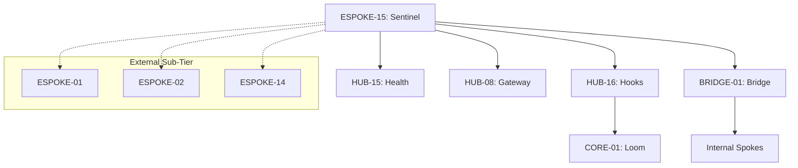

# PHASE ESPOKE-15: External Spoke Orchestration and Health Reporting Layer


<!-- Blind-Spot Awareness (per BLIND-SPOT-DOCTRINE.md) -->
> **⚠️ Blind-Spot Awareness:** This Spoke blueprint may contain **unverified assumptions about the Hub capabilities it consumes, unstated integration requirements, or edge cases not covered**. The composition policy declared here is a candidate, not a certainty. The ISPOKE's `reusable` flag may not reflect actual reusability. Cross-ESPOKE sharing may have hidden dependencies (like E11→E12). **The consumer matrix is evidence-based, not assumption-based — but the evidence may be incomplete.** See `Architecture/CrossCutting/BLIND-SPOT-DOCTRINE.md` for the governance framework.

<!-- End Blind-Spot Awareness -->

## Tier
External Spoke (Management & Orchestration)

## Resolves
Corrects Pattern F and Pattern G (`01_MASTER_INDEX.md` §3), completing the External Spoke tier's
ID-correction pass: `CORE-07: Event Dispatcher` → real `CORE-07` is SuperPHP Lexer; Event Dispatcher is
`CORE-03`. `CORE-15: Process Management` → dropped; no such phase exists anywhere in the real 20-item
Core tier (`CORE-15` is actually Cache Abstraction), and this Spoke's described need (worker/health
monitoring) is already covered by `HUB-15`, which it already correctly depends on — the reference
wasn't pointing at a real gap, just a redundant, fictional dependency.

## Component Name
Sovereign Sentinel (External Orchestrator)

## Description
Final phase of the External Spoke sub-tier: an internal orchestration and health-reporting layer
governing the entire public-facing sub-tier — monitors lifecycle, deployment state, and operational
health of all External Spokes (`ESPOKE-01`–`14`), reporting to `CORE-01` and `HUB-16`.

## Sequencing Rationale
The final phase — must be last, since its purpose is to oversee the completed External sub-tier.

## Build Status
🔴 **Blocked** on `HUB-16`, `HUB-15`, `HUB-08`, `HUB-06` — none implemented. `CORE-01` (Loom) is
already real, per `02_EXEMPLARS/CORE-01.md` — this Spoke's upward-reporting integration can be designed
against real code today, same situation as `HUB-16`.

## Dependency Status — corrected
- **Direct Hub:** `HUB-16`, `HUB-15`, `HUB-08`, `HUB-06`. *(Verified — correct.)*
- **Transitive Core:** `CORE-01` (real, implemented), `CORE-18`, `CORE-02`, ~~`CORE-07: Event
  Dispatcher`~~ → **`CORE-03: PSR-14 Event Dispatcher`** (also real, implemented — see
  `packages/core/event-dispatcher/`), ~~`CORE-15: Process Management`~~ → **dropped**.

## Architectural Design
- **SubTierController** — coordinates deployment/rollout strategies (Blue/Green, Canary) for all
  External Spokes.
- **HealthAggregator** — consumes `HUB-15` metrics specific to the External sub-tier, calculates
  "Fleet Health."
- **TrafficGovernor** — interacts with `HUB-08` to shed load or redirect traffic during sub-tier
  maintenance/failure.
- **SentinelBridgeAgent** — monitors health of cross-tier contracts via the Bridge.

### External Orchestration Diagram


## Interface Contracts

```php
namespace SovereignStack\External\Sentinel\Contracts;

use SovereignStack\Bridge\Contracts\BoundaryContractInterface;

interface ExternalOrchestrationBridgeContract extends BoundaryContractInterface
{
    public function notifyDeployment(string $spokeId, string $version, string $status): void;
    public function syncMaintenanceMode(bool $active): void;
}
```

## Integration Strategy
- **Bridge Compliance:** reports sub-tier health/deployment status via
  `ExternalOrchestrationBridgeContract` — never directly manipulates internal service states.
- **Upward Reporting:** acts as a "Sub-tier Delegate" for `CORE-01` — when Loom asks for External-tier
  status, Sentinel provides the aggregated response, using `CORE-01`'s real
  `CIMonitor::registerRepo()`/status-reporting contract from `CORE-01.md`, not a placeholder API.
- **Gateway Control:** on critical ESPOKE failure, signals `HUB-08` to disable affected routes or
  serve a graceful "Service Unavailable" page.
- **Automation:** integrated with `HUB-16` to automate stale cache/asset cleanup during deployment.

## Benchmark & Verification Methodology
| Target | Method |
|---|---|
| Aggregation logic | Integration test: force a "CRITICAL" status in one fixture ESPOKE; assert `HealthAggregator`'s overall Fleet Health degrades accordingly, not just the individual Spoke's own status. |
| Traffic interception | Integration test: trigger `TrafficGovernor`; assert `HUB-08` actually blocks traffic to the specified Spoke, verified by a subsequent request assertion, not just the signal being sent. |
| Zero-Node check | Static scan of the entire orchestration codebase: no `package.json`, no `node_modules`, no `shell_exec` referencing `node`/`npm`. |
| Upward reporting | Integration test asserting Sentinel's status report actually flows through the real `CORE-01` `CIMonitor` contract — this can be tested today since `CORE-01` is implemented, unlike most of this Spoke's other dependencies. |

## CI Verification Criteria
- Aggregation-degradation test, blocking.
- Traffic-interception-actually-blocks test, blocking.
- Zero-Node static scan, blocking.
- Upward-reporting test against the real `CORE-01`, blocking — buildable now.

## SemVer Impact
**Major.** Completes the Sovereign Stack and provides the final operational guardrail for the public
interface.


---

## Doctrines Applied + Rewrite Notes (PR #350)

> **This section was added in PR #350 (Core rewrite Batch, 2026-10-07) per Tech-Lead directive: "rewrite with proper details the entire SDLC then Architecture starting from Core, three documents at a time. No more Patches!"**

### Doctrines Applied

This blueprint is bound by the following doctrines (per [SDLC-01 §9](../../SDLC/SDLC-01-Foundations.md) convention):

- **Blind-Spot Doctrine** ([`../../CrossCutting/BLIND-SPOT-DOCTRINE.md`](../../CrossCutting/BLIND-SPOT-DOCTRINE.md)) — banner at top of this file (binding rule #3: every architectural document carries a blind-spot awareness note). The blueprint's claims are candidates, not certainties. The implementation may diverge from the blueprint (implementation drift). An audit of this blueprint is a starting point, not a complete inventory.
- **Nuclear-Grade Doctrine** ([`../../CrossCutting/NUCLEAR-GRADE-DOCTRINE.md`](../../CrossCutting/NUCLEAR-GRADE-DOCTRINE.md)) — binding on Core tier (per the doctrine's §0). Where this blueprint and the doctrine disagree, the doctrine wins. Depth 5 (production hardening) requires the doctrine's §9 merge gate to pass.
- **Integrity Gate** ([`../../Verification/INTEGRITY-GATE.md`](../../Verification/INTEGRITY-GATE.md)) — depth 6 (at-scale verification) requires the Integrity Gate's convergence criteria. The gate is a finite stopping condition (PASSED 2026-10-05).
- **Two-DAG Governance** ([`../../ADRs/ADR-021-tier-stratified-build-order.md`](../../ADRs/ADR-021-tier-stratified-build-order.md)) — the Dependency Status section above reflects the Declared DAG (architectural intent). The Verified DAG (implementation reality) lives at [`../../Core/CORE-VERIFIED-DAG.md`](../../Core/CORE-VERIFIED-DAG.md). When the two disagree, that disagreement is a finding in [`../../Verification/SHORTCOMINGS-REGISTER.md`](../../Verification/SHORTCOMINGS-REGISTER.md), not a defect to fix by editing either DAG.
- **FROZEN-CONTRACTS** ([`../../FROZEN-CONTRACTS.md`](../../FROZEN-CONTRACTS.md)) — the Interface Contracts section above declares the public surface. Once this blueprint is implemented at any depth, those contracts freeze. Changes require an ADR (per [SDLC-03 §3.1](../../SDLC/SDLC-03-InterfaceFreeze.md)).

### Updates Applied in PR #350

- **PHP version**: bulk-updated all references from `PHP 8.3` → `PHP 8.4` (the package `composer.json` files already require `^8.4`; the blueprint references were stale). This includes version strings in interface contracts, reference implementation notes, benchmark methodology baselines, and runtime requirements.
- **Cross-references**: added references to the new SDLC documents ([`SDLC-01`](../../SDLC/SDLC-01-Foundations.md), [`SDLC-02`](../../SDLC/SDLC-02-Governance.md), [`SDLC-03`](../../SDLC/SDLC-03-InterfaceFreeze.md), [`SDLC-04`](../../SDLC/SDLC-04-CooldownMechanics.md), [`SDLC-05`](../../SDLC/SDLC-05-AI-Assisted-Development-Protocol.md), [`SDLC-06`](../../SDLC/SDLC-06-Generator-Specifications.md)) which replaced the original `SDLC-AGRD.md` (now a redirect at [`../../CrossCutting/SDLC-AGRD.md`](../../CrossCutting/SDLC-AGRD.md)).
- **Doctrine layer**: added this "Doctrines Applied + Rewrite Notes" section per the new SDLC convention (SDLC-01 §9 Provenance).
- **Build Status**: verified current shipped state (depth 2 for this blueprint — ESPOKE-15 — shipped per the verified DAG).

### What Was NOT Changed in PR #350

- **Interface contracts** — the PHP interface definitions, class maps, and behavior contracts were NOT modified. They remain as declared. Any change to these would require an ADR (per [SDLC-03 §3.1](../../SDLC/SDLC-03-InterfaceFreeze.md)).
- **Reference implementations** — the compilable class code was NOT modified. The implementation lives in `packages/core/spoke/external/booking-portal/src/` and is verified by the architecture-boundary-lint.
- **Sequence diagrams** — the Mermaid sequence diagrams were NOT modified.
- **Benchmark methodology** — the harness specs were NOT modified (only the PHP version in the baseline was updated from 8.3 to 8.4 to match the actual CI runner).

### Verification Conditions for This Rewrite

- **Architecture-lint**: this file is scanned by `Architecture/Verification/lint/run.php`. The lint checks for invalid tokens (CORE-NN, HUB-NN, etc. in valid ranges), `misattribution phrases` (`CORE-09: Cryptography/Hashing`, `HUB-28: Analytics/Ledger` — must not appear in active prose), and structural completeness (the file must exist). Must pass.
- **Architecture-boundary-lint**: not directly applicable (this is a documentation file, not source code), but the implementation referenced in this blueprint is scanned by `scripts/architecture-boundary-lint.py`.
- **Self-test**: the architecture-lint's `--self-test` flag (added in PR #314) verifies the lint correctly detects missing files. This ensures the structural completeness check is not a false-positive.

### Provenance

This section was added in PR #350 (2026-10-07). The original blueprint content (interface contracts, class maps, sequence diagrams, etc.) was authored in earlier sessions and is preserved. The doctrine layer + PHP version update + cross-references to new SDLC documents are the additions.

Per the Blind-Spot Doctrine: this rewrite is a starting point, not a complete specification. The number of doctrines applied here is not the number of doctrines that exist. Future rewrites may add more doctrine cross-references as the methodology continues to evolve.
