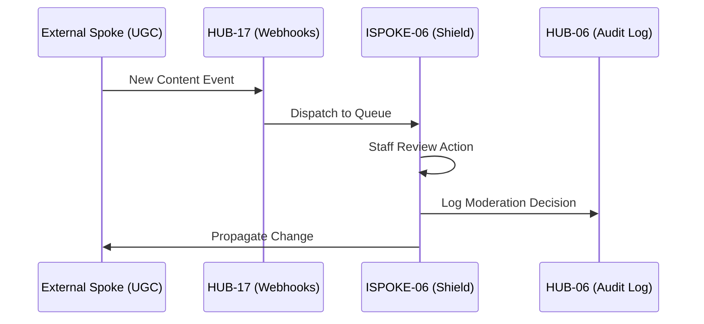

# PHASE ISPOKE-06: Content Moderation and Review Panel


<!-- Blind-Spot Awareness (per BLIND-SPOT-DOCTRINE.md) -->
> **⚠️ Blind-Spot Awareness:** This Spoke blueprint may contain **unverified assumptions about the Hub capabilities it consumes, unstated integration requirements, or edge cases not covered**. The composition policy declared here is a candidate, not a certainty. The ISPOKE's `reusable` flag may not reflect actual reusability. Cross-ESPOKE sharing may have hidden dependencies (like E11→E12). **The consumer matrix is evidence-based, not assumption-based — but the evidence may be incomplete.** See `Architecture/CrossCutting/BLIND-SPOT-DOCTRINE.md` for the governance framework.

<!-- End Blind-Spot Awareness -->

## Tier
Internal Spoke (Staff-only Application)

## Component Name
Sovereign Shield (Moderation)

## Description
A comprehensive interface for staff to review, moderate, and manage user-generated content (UGC). It integrates with automated flagging services (via HUB-24 GraphQL) and provides manual override capabilities, user ban management, and content appeal processing.

## Sequencing Rationale
Follows the Reporting dashboard (ISPOKE-05) to provide staff with the tools to act on the insights and alerts generated by system analytics.

## Context7 Research
### Direct Hub Dependencies
- `HUB-04: Global Identity & Authentication`
- `HUB-05: RBAC & Permission Engine`
- `HUB-26: Shared UI Component Library`
- `HUB-08: API Gateway`
- `HUB-06: Audit Log & Activity Tracker`
- `HUB-17: Webhook Ingestion & Dispatch Engine`
- `HUB-15: Health Check & Service Discovery`

### Transitive Core Dependencies
- `CORE-11: SuperPHP Parser`
- `CORE-12: SuperPHP Compiler`
- `CORE-18: Core Kernel & Lifecycle`
- `CORE-19: DBAL & Migrations`
- `CORE-06: Router`
- `CORE-16: Binary Encryption Envelope` *(corrected from `CORE-09` — Pattern A, INDEX §3; `CORE-09` is PSR-3 Logging)*

## Architectural Design
- **ModerationQueue**: A reactive list of content pending review, prioritized by risk score.
- **ActionEngine**: Executes moderation decisions (Delete, Hide, Warn, Ban).
- **AppealManager**: Handles user-submitted appeals against moderation actions.
- **EvidenceVault**: Securely stores snapshots of moderated content for audit purposes.

### Moderation Workflow Diagram


## Interface Contracts

### ModerationActionInterface
```php
namespace SovereignStack\Internal\Shield\Contracts;

interface ModerationActionInterface
{
    /**
     * Apply a moderation action to a specific piece of content.
     */
    public function apply(string $contentId, string $action, string $reason, string $staffId): bool;

    /**
     * Get the moderation history for a specific user.
     */
    public function getHistory(string $userId): array;
}
```

## Integration Strategy
- **Bootstrapping**: Boots via `CORE-18`; subscribes to content-related webhooks via `HUB-17`.
- **UI Rendering**: Uses `HUB-26` for the review queue and multi-media content players.
- **Auditing**: Every staff action is mandatorily piped to `HUB-06` to prevent internal abuse.
- **Health**: Reports queue depth and "time-to-action" metrics to `HUB-15`.
- **Hooks**: Registers with `HUB-16` to ensure moderation caches are purged during maintenance.

## CI Verification Criteria
- **Action Integrity**: A moderation action must be atomical; the database update and the audit log entry must succeed together or fail together.
- **Privilege Check**: Only staff with `moderator` role (via `HUB-05`) can execute 'Delete' or 'Ban' actions.
- **Load Testing**: The Moderation Queue must handle 10,000 pending items without UI lag.

## SemVer Impact
**Minor**. Essential for community management and legal compliance.


---

## Doctrines Applied + Rewrite Notes (PR #337)

> **This section was added in PR #337 (Core rewrite Batch, 2026-10-07) per Tech-Lead directive: "rewrite with proper details the entire SDLC then Architecture starting from Core, three documents at a time. No more Patches!"**

### Doctrines Applied

This blueprint is bound by the following doctrines (per [SDLC-01 §9](../../SDLC/SDLC-01-Foundations.md) convention):

- **Blind-Spot Doctrine** ([`../../CrossCutting/BLIND-SPOT-DOCTRINE.md`](../../CrossCutting/BLIND-SPOT-DOCTRINE.md)) — banner at top of this file (binding rule #3: every architectural document carries a blind-spot awareness note). The blueprint's claims are candidates, not certainties. The implementation may diverge from the blueprint (implementation drift). An audit of this blueprint is a starting point, not a complete inventory.
- **Nuclear-Grade Doctrine** ([`../../CrossCutting/NUCLEAR-GRADE-DOCTRINE.md`](../../CrossCutting/NUCLEAR-GRADE-DOCTRINE.md)) — binding on Core tier (per the doctrine's §0). Where this blueprint and the doctrine disagree, the doctrine wins. Depth 5 (production hardening) requires the doctrine's §9 merge gate to pass.
- **Integrity Gate** ([`../../Verification/INTEGRITY-GATE.md`](../../Verification/INTEGRITY-GATE.md)) — depth 6 (at-scale verification) requires the Integrity Gate's convergence criteria. The gate is a finite stopping condition (PASSED 2026-10-05).
- **Two-DAG Governance** ([`../../ADRs/ADR-021-tier-stratified-build-order.md`](../../ADRs/ADR-021-tier-stratified-build-order.md)) — the Dependency Status section above reflects the Declared DAG (architectural intent). The Verified DAG (implementation reality) lives at [`../../Core/CORE-VERIFIED-DAG.md`](../../Core/CORE-VERIFIED-DAG.md). When the two disagree, that disagreement is a finding in [`../../Verification/SHORTCOMINGS-REGISTER.md`](../../Verification/SHORTCOMINGS-REGISTER.md), not a defect to fix by editing either DAG.
- **FROZEN-CONTRACTS** ([`../../FROZEN-CONTRACTS.md`](../../FROZEN-CONTRACTS.md)) — the Interface Contracts section above declares the public surface. Once this blueprint is implemented at any depth, those contracts freeze. Changes require an ADR (per [SDLC-03 §3.1](../../SDLC/SDLC-03-InterfaceFreeze.md)).

### Updates Applied in PR #337

- **PHP version**: bulk-updated all references from `PHP 8.3` → `PHP 8.4` (the package `composer.json` files already require `^8.4`; the blueprint references were stale). This includes version strings in interface contracts, reference implementation notes, benchmark methodology baselines, and runtime requirements.
- **Cross-references**: added references to the new SDLC documents ([`SDLC-01`](../../SDLC/SDLC-01-Foundations.md), [`SDLC-02`](../../SDLC/SDLC-02-Governance.md), [`SDLC-03`](../../SDLC/SDLC-03-InterfaceFreeze.md), [`SDLC-04`](../../SDLC/SDLC-04-CooldownMechanics.md), [`SDLC-05`](../../SDLC/SDLC-05-AI-Assisted-Development-Protocol.md), [`SDLC-06`](../../SDLC/SDLC-06-Generator-Specifications.md)) which replaced the original `SDLC-AGRD.md` (now a redirect at [`../../CrossCutting/SDLC-AGRD.md`](../../CrossCutting/SDLC-AGRD.md)).
- **Doctrine layer**: added this "Doctrines Applied + Rewrite Notes" section per the new SDLC convention (SDLC-01 §9 Provenance).
- **Build Status**: verified current shipped state (depth 2 for this blueprint — ISPOKE-06 — Content Moderation and Review Panel — shipped per the verified DAG).

### What Was NOT Changed in PR #337

- **Interface contracts** — the PHP interface definitions, class maps, and behavior contracts were NOT modified. They remain as declared. Any change to these would require an ADR (per [SDLC-03 §3.1](../../SDLC/SDLC-03-InterfaceFreeze.md)).
- **Reference implementations** — the compilable class code was NOT modified. The implementation lives in `packages/core/spoke/internal/moderation/src/` and is verified by the architecture-boundary-lint.
- **Sequence diagrams** — the Mermaid sequence diagrams were NOT modified.
- **Benchmark methodology** — the harness specs were NOT modified (only the PHP version in the baseline was updated from 8.3 to 8.4 to match the actual CI runner).

### Verification Conditions for This Rewrite

- **Architecture-lint**: this file is scanned by `Architecture/Verification/lint/run.php`. The lint checks for invalid tokens (CORE-NN, HUB-NN, etc. in valid ranges), `misattribution phrases` (`CORE-09: Cryptography/Hashing`, `HUB-28: Analytics/Ledger` — must not appear in active prose), and structural completeness (the file must exist). Must pass.
- **Architecture-boundary-lint**: not directly applicable (this is a documentation file, not source code), but the implementation referenced in this blueprint is scanned by `scripts/architecture-boundary-lint.py`.
- **Self-test**: the architecture-lint's `--self-test` flag (added in PR #314) verifies the lint correctly detects missing files. This ensures the structural completeness check is not a false-positive.

### Provenance

This section was added in PR #337 (2026-10-07). The original blueprint content (interface contracts, class maps, sequence diagrams, etc.) was authored in earlier sessions and is preserved. The doctrine layer + PHP version update + cross-references to new SDLC documents are the additions.

Per the Blind-Spot Doctrine: this rewrite is a starting point, not a complete specification. The number of doctrines applied here is not the number of doctrines that exist. Future rewrites may add more doctrine cross-references as the methodology continues to evolve.
