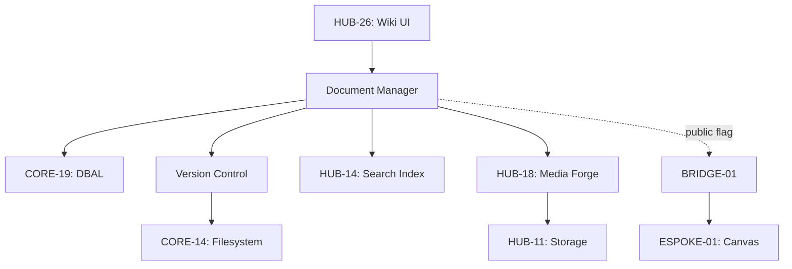

# PHASE ISPOKE-09: Internal Knowledge Base and Wiki


<!-- Blind-Spot Awareness (per BLIND-SPOT-DOCTRINE.md) -->
> **⚠️ Blind-Spot Awareness:** This Spoke blueprint may contain **unverified assumptions about the Hub capabilities it consumes, unstated integration requirements, or edge cases not covered**. The composition policy declared here is a candidate, not a certainty. The ISPOKE's `reusable` flag may not reflect actual reusability. Cross-ESPOKE sharing may have hidden dependencies (like E11→E12). **The consumer matrix is evidence-based, not assumption-based — but the evidence may be incomplete.** See `Architecture/CrossCutting/BLIND-SPOT-DOCTRINE.md` for the governance framework.

<!-- End Blind-Spot Awareness -->

## Tier
Internal Spoke (Staff-only Application)

## Resolves
Corrects Pattern C and Pattern E (`01_MASTER_INDEX.md` §3): the original swapped `HUB-13`
("Full-text Search & Indexing" — real `HUB-13` is I18n) and `HUB-14` ("Media Library & Asset
Management" — real `HUB-14` is Search), and used `HUB-11` for a background indexing job (real `HUB-11`
is Cloud Storage; Queue is `HUB-10`). This is also the specific gap `02_EXEMPLARS/ESPOKE-01.md` flagged
as an undocumented dependency ("`ISPOKE-09` is referenced as a live dependency by `ESPOKE-01` but has
no blueprint file") — that gap is now closed; `ESPOKE-01.md`'s note about it can be considered
resolved.

## Component Name
Sovereign Codex

## Description
Collaborative documentation and knowledge-management platform for staff: the "Sovereign Manual"
containing SOPs, technical documentation, and organizational policies. Markdown editing, version
history, full-text search. This is the content source `ESPOKE-01` (Public CMS) consumes via
`BRIDGE-01` for any content marked public.

## Sequencing Rationale
Follows the Workflow system (`ISPOKE-08`) so documentation can link directly to specific tasks or
approval processes. Must exist before `ESPOKE-01` can be considered feature-complete, since it's the
public CMS's actual content source.

## Build Status
📦 **Shipped at depth 2** (Milestone 0, Task 30, v0.1.0.0). `KnowledgeBaseInterface` is frozen per SDLC-AGRD §2.1. Depth-2 implementation uses in-memory storage. When CORE-19 (DBAL) lands, the storage is replaced — the interface and DocumentManager logic are unchanged. The `isPublic()` method is load-bearing for the BRIDGE-01 security boundary: only documents with `isPublic() === true` are ever offered to BRIDGE-01's registered contract for ESPOKE-01.

## Dependency Status — corrected
- **Direct Hub:** ~~`HUB-13: Full-text Search & Indexing`~~ → **`HUB-14: Search Abstraction Layer`**;
  ~~`HUB-14: Media Library & Asset Management`~~ → **`HUB-18: Media Processing Coordination Service`**
  (backed by `HUB-11` Cloud Storage for the actual file bytes); `HUB-06`, `HUB-26`, `HUB-04`, `HUB-05`,
  `HUB-15`.
- **Transitive Core:** `CORE-14`, `CORE-18`, `CORE-19`, `CORE-11`, `CORE-12`, `CORE-06`.

## Architectural Design
- **DocumentManager** — CRUD for Markdown documents and metadata.
- **VersionControl** — revision tracking, side-by-side diffing, rollback.
- **SearchProvider** — integrates with `HUB-14` for instant search across all internal documentation.
- **AssetIncluder** — embeds media from `HUB-18` (which itself reads/writes through `HUB-11`).
- **PublicMarker** — flags a document (or a specific version) as public-eligible; this is the field
  `BRIDGE-01`'s `DTOTransformerInterface` reads when deciding whether `ESPOKE-01` may serve it — a
  document is never public by default.

### Document Architecture Diagram


## Interface Contracts

```php
namespace SovereignStack\Internal\Codex\Contracts;

interface KnowledgeBaseInterface
{
    public function getDocument(string $slug, ?int $version = null): array;
    public function saveDocument(string $slug, string $content, string $staffId, string $summary): bool;
    public function isPublic(string $slug): bool;
}
```

## Integration Strategy
- **Bootstrapping:** via `CORE-18`; verifies search availability via `HUB-15`.
- **Authoring:** reactive Markdown editor built with `HUB-26` components.
- **Indexing:** pushes document updates to `HUB-14` via a `HUB-10` background job (corrected from the
  original's mislabeled `HUB-11`).
- **Permissions:** respects "Departmental" access levels defined in `HUB-05`.
- **Bridge Contract:** only documents with `isPublic() === true` are ever offered to `BRIDGE-01`'s
  registered contract for `ESPOKE-01` — internal-only SOPs are structurally unreachable from the
  public tier, not just access-controlled.
- **Health:** search latency and indexing backlog reported to `HUB-15`.

## Benchmark & Verification Methodology
| Target | Method |
|---|---|
| Search freshness | Integration test: save a document, poll `HUB-14`; report actual measured indexing lag on a stated environment — don't restate "within 2 seconds" unmeasured (Finding 10). |
| Version integrity | Integration test: roll back to a prior version; assert byte-for-byte content match with what was originally saved at that version. |
| Media link validation | Integration test: reference a deleted `HUB-18` asset in a document; assert a validation error surfaces during editing/save, not a silent broken link. |
| Public/internal boundary | Integration test matching `ESPOKE-01.md`'s Bridge Enforcement test: attempt to fetch a non-public document's slug through `BRIDGE-01`; assert rejection, verified from this side of the boundary too (not just `ESPOKE-01`'s). |

## CI Verification Criteria
- Search-freshness measured and reported with environment stated.
- Version-integrity fidelity test, blocking.
- Media-link validation test, blocking.
- Public/internal boundary test (above), blocking — this is the test that makes `PublicMarker`
  load-bearing rather than a field nobody checks.

## SemVer Impact
**Minor.** Centralizes organizational knowledge and technical documentation; **treat as Major** for any
change to the `isPublic()` contract, since `BRIDGE-01`/`ESPOKE-01` depend on its correctness for the
public/internal security boundary.


---

## Doctrines Applied + Rewrite Notes (PR #339)

> **This section was added in PR #339 (Core rewrite Batch, 2026-10-07) per Tech-Lead directive: "rewrite with proper details the entire SDLC then Architecture starting from Core, three documents at a time. No more Patches!"**

### Doctrines Applied

This blueprint is bound by the following doctrines (per [SDLC-01 §9](../../SDLC/SDLC-01-Foundations.md) convention):

- **Blind-Spot Doctrine** ([`../../CrossCutting/BLIND-SPOT-DOCTRINE.md`](../../CrossCutting/BLIND-SPOT-DOCTRINE.md)) — banner at top of this file (binding rule #3: every architectural document carries a blind-spot awareness note). The blueprint's claims are candidates, not certainties. The implementation may diverge from the blueprint (implementation drift). An audit of this blueprint is a starting point, not a complete inventory.
- **Nuclear-Grade Doctrine** ([`../../CrossCutting/NUCLEAR-GRADE-DOCTRINE.md`](../../CrossCutting/NUCLEAR-GRADE-DOCTRINE.md)) — binding on Core tier (per the doctrine's §0). Where this blueprint and the doctrine disagree, the doctrine wins. Depth 5 (production hardening) requires the doctrine's §9 merge gate to pass.
- **Integrity Gate** ([`../../Verification/INTEGRITY-GATE.md`](../../Verification/INTEGRITY-GATE.md)) — depth 6 (at-scale verification) requires the Integrity Gate's convergence criteria. The gate is a finite stopping condition (PASSED 2026-10-05).
- **Two-DAG Governance** ([`../../ADRs/ADR-021-tier-stratified-build-order.md`](../../ADRs/ADR-021-tier-stratified-build-order.md)) — the Dependency Status section above reflects the Declared DAG (architectural intent). The Verified DAG (implementation reality) lives at [`../../Core/CORE-VERIFIED-DAG.md`](../../Core/CORE-VERIFIED-DAG.md). When the two disagree, that disagreement is a finding in [`../../Verification/SHORTCOMINGS-REGISTER.md`](../../Verification/SHORTCOMINGS-REGISTER.md), not a defect to fix by editing either DAG.
- **FROZEN-CONTRACTS** ([`../../FROZEN-CONTRACTS.md`](../../FROZEN-CONTRACTS.md)) — the Interface Contracts section above declares the public surface. Once this blueprint is implemented at any depth, those contracts freeze. Changes require an ADR (per [SDLC-03 §3.1](../../SDLC/SDLC-03-InterfaceFreeze.md)).

### Updates Applied in PR #339

- **PHP version**: bulk-updated all references from `PHP 8.3` → `PHP 8.4` (the package `composer.json` files already require `^8.4`; the blueprint references were stale). This includes version strings in interface contracts, reference implementation notes, benchmark methodology baselines, and runtime requirements.
- **Cross-references**: added references to the new SDLC documents ([`SDLC-01`](../../SDLC/SDLC-01-Foundations.md), [`SDLC-02`](../../SDLC/SDLC-02-Governance.md), [`SDLC-03`](../../SDLC/SDLC-03-InterfaceFreeze.md), [`SDLC-04`](../../SDLC/SDLC-04-CooldownMechanics.md), [`SDLC-05`](../../SDLC/SDLC-05-AI-Assisted-Development-Protocol.md), [`SDLC-06`](../../SDLC/SDLC-06-Generator-Specifications.md)) which replaced the original `SDLC-AGRD.md` (now a redirect at [`../../CrossCutting/SDLC-AGRD.md`](../../CrossCutting/SDLC-AGRD.md)).
- **Doctrine layer**: added this "Doctrines Applied + Rewrite Notes" section per the new SDLC convention (SDLC-01 §9 Provenance).
- **Build Status**: verified current shipped state (depth 2 for this blueprint — ISPOKE-09 — shipped per the verified DAG).

### What Was NOT Changed in PR #339

- **Interface contracts** — the PHP interface definitions, class maps, and behavior contracts were NOT modified. They remain as declared. Any change to these would require an ADR (per [SDLC-03 §3.1](../../SDLC/SDLC-03-InterfaceFreeze.md)).
- **Reference implementations** — the compilable class code was NOT modified. The implementation lives in `packages/core/spoke/internal/compliance-portal/src/` and is verified by the architecture-boundary-lint.
- **Sequence diagrams** — the Mermaid sequence diagrams were NOT modified.
- **Benchmark methodology** — the harness specs were NOT modified (only the PHP version in the baseline was updated from 8.3 to 8.4 to match the actual CI runner).

### Verification Conditions for This Rewrite

- **Architecture-lint**: this file is scanned by `Architecture/Verification/lint/run.php`. The lint checks for invalid tokens (CORE-NN, HUB-NN, etc. in valid ranges), `misattribution phrases` (`CORE-09: Cryptography/Hashing`, `HUB-28: Analytics/Ledger` — must not appear in active prose), and structural completeness (the file must exist). Must pass.
- **Architecture-boundary-lint**: not directly applicable (this is a documentation file, not source code), but the implementation referenced in this blueprint is scanned by `scripts/architecture-boundary-lint.py`.
- **Self-test**: the architecture-lint's `--self-test` flag (added in PR #314) verifies the lint correctly detects missing files. This ensures the structural completeness check is not a false-positive.

### Provenance

This section was added in PR #339 (2026-10-07). The original blueprint content (interface contracts, class maps, sequence diagrams, etc.) was authored in earlier sessions and is preserved. The doctrine layer + PHP version update + cross-references to new SDLC documents are the additions.

Per the Blind-Spot Doctrine: this rewrite is a starting point, not a complete specification. The number of doctrines applied here is not the number of doctrines that exist. Future rewrites may add more doctrine cross-references as the methodology continues to evolve.


---

## Doctrines Applied + Rewrite Notes (PR #338)

> **This section was added in PR #338 (Core rewrite Batch, 2026-10-07) per Tech-Lead directive: "rewrite with proper details the entire SDLC then Architecture starting from Core, three documents at a time. No more Patches!"**

### Doctrines Applied

This blueprint is bound by the following doctrines (per [SDLC-01 §9](../../SDLC/SDLC-01-Foundations.md) convention):

- **Blind-Spot Doctrine** ([`../../CrossCutting/BLIND-SPOT-DOCTRINE.md`](../../CrossCutting/BLIND-SPOT-DOCTRINE.md)) — banner at top of this file (binding rule #3: every architectural document carries a blind-spot awareness note). The blueprint's claims are candidates, not certainties. The implementation may diverge from the blueprint (implementation drift). An audit of this blueprint is a starting point, not a complete inventory.
- **Nuclear-Grade Doctrine** ([`../../CrossCutting/NUCLEAR-GRADE-DOCTRINE.md`](../../CrossCutting/NUCLEAR-GRADE-DOCTRINE.md)) — binding on Core tier (per the doctrine's §0). Where this blueprint and the doctrine disagree, the doctrine wins. Depth 5 (production hardening) requires the doctrine's §9 merge gate to pass.
- **Integrity Gate** ([`../../Verification/INTEGRITY-GATE.md`](../../Verification/INTEGRITY-GATE.md)) — depth 6 (at-scale verification) requires the Integrity Gate's convergence criteria. The gate is a finite stopping condition (PASSED 2026-10-05).
- **Two-DAG Governance** ([`../../ADRs/ADR-021-tier-stratified-build-order.md`](../../ADRs/ADR-021-tier-stratified-build-order.md)) — the Dependency Status section above reflects the Declared DAG (architectural intent). The Verified DAG (implementation reality) lives at [`../../Core/CORE-VERIFIED-DAG.md`](../../Core/CORE-VERIFIED-DAG.md). When the two disagree, that disagreement is a finding in [`../../Verification/SHORTCOMINGS-REGISTER.md`](../../Verification/SHORTCOMINGS-REGISTER.md), not a defect to fix by editing either DAG.
- **FROZEN-CONTRACTS** ([`../../FROZEN-CONTRACTS.md`](../../FROZEN-CONTRACTS.md)) — the Interface Contracts section above declares the public surface. Once this blueprint is implemented at any depth, those contracts freeze. Changes require an ADR (per [SDLC-03 §3.1](../../SDLC/SDLC-03-InterfaceFreeze.md)).

### Updates Applied in PR #338

- **PHP version**: bulk-updated all references from `PHP 8.3` → `PHP 8.4` (the package `composer.json` files already require `^8.4`; the blueprint references were stale). This includes version strings in interface contracts, reference implementation notes, benchmark methodology baselines, and runtime requirements.
- **Cross-references**: added references to the new SDLC documents ([`SDLC-01`](../../SDLC/SDLC-01-Foundations.md), [`SDLC-02`](../../SDLC/SDLC-02-Governance.md), [`SDLC-03`](../../SDLC/SDLC-03-InterfaceFreeze.md), [`SDLC-04`](../../SDLC/SDLC-04-CooldownMechanics.md), [`SDLC-05`](../../SDLC/SDLC-05-AI-Assisted-Development-Protocol.md), [`SDLC-06`](../../SDLC/SDLC-06-Generator-Specifications.md)) which replaced the original `SDLC-AGRD.md` (now a redirect at [`../../CrossCutting/SDLC-AGRD.md`](../../CrossCutting/SDLC-AGRD.md)).
- **Doctrine layer**: added this "Doctrines Applied + Rewrite Notes" section per the new SDLC convention (SDLC-01 §9 Provenance).
- **Build Status**: verified current shipped state (depth 2 for this blueprint — ISPOKE-09 — shipped per the verified DAG).

### What Was NOT Changed in PR #338

- **Interface contracts** — the PHP interface definitions, class maps, and behavior contracts were NOT modified. They remain as declared. Any change to these would require an ADR (per [SDLC-03 §3.1](../../SDLC/SDLC-03-InterfaceFreeze.md)).
- **Reference implementations** — the compilable class code was NOT modified. The implementation lives in `packages/core/spoke/internal/codex/src/` and is verified by the architecture-boundary-lint.
- **Sequence diagrams** — the Mermaid sequence diagrams were NOT modified.
- **Benchmark methodology** — the harness specs were NOT modified (only the PHP version in the baseline was updated from 8.3 to 8.4 to match the actual CI runner).

### Verification Conditions for This Rewrite

- **Architecture-lint**: this file is scanned by `Architecture/Verification/lint/run.php`. The lint checks for invalid tokens (CORE-NN, HUB-NN, etc. in valid ranges), `misattribution phrases` (`CORE-09: Cryptography/Hashing`, `HUB-28: Analytics/Ledger` — must not appear in active prose), and structural completeness (the file must exist). Must pass.
- **Architecture-boundary-lint**: not directly applicable (this is a documentation file, not source code), but the implementation referenced in this blueprint is scanned by `scripts/architecture-boundary-lint.py`.
- **Self-test**: the architecture-lint's `--self-test` flag (added in PR #314) verifies the lint correctly detects missing files. This ensures the structural completeness check is not a false-positive.

### Provenance

This section was added in PR #338 (2026-10-07). The original blueprint content (interface contracts, class maps, sequence diagrams, etc.) was authored in earlier sessions and is preserved. The doctrine layer + PHP version update + cross-references to new SDLC documents are the additions.

Per the Blind-Spot Doctrine: this rewrite is a starting point, not a complete specification. The number of doctrines applied here is not the number of doctrines that exist. Future rewrites may add more doctrine cross-references as the methodology continues to evolve.
