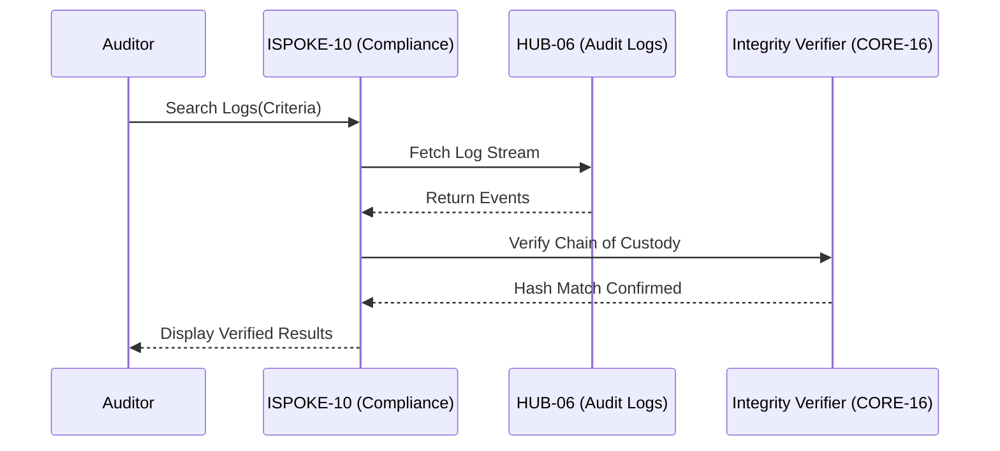

# PHASE ISPOKE-10: Audit and Compliance Review Portal


<!-- Blind-Spot Awareness (per BLIND-SPOT-DOCTRINE.md) -->
> **⚠️ Blind-Spot Awareness:** This Spoke blueprint may contain **unverified assumptions about the Hub capabilities it consumes, unstated integration requirements, or edge cases not covered**. The composition policy declared here is a candidate, not a certainty. The ISPOKE's `reusable` flag may not reflect actual reusability. Cross-ESPOKE sharing may have hidden dependencies (like E11→E12). **The consumer matrix is evidence-based, not assumption-based — but the evidence may be incomplete.** See `Architecture/CrossCutting/BLIND-SPOT-DOCTRINE.md` for the governance framework.

<!-- End Blind-Spot Awareness -->

## Tier
Internal Spoke (Staff-only Application)

## Resolves
Corrects Pattern A and Pattern B (`01_MASTER_INDEX.md` §3): `CORE-09: Cryptography & Hashing` → real
`CORE-09` is PSR-3 Logging, crypto is `CORE-16`. `HUB-28: Distributed Ledger & Analytics Engine` →
**this file's actual described need (signed PDF report generation via a queue, stored in blob storage)
is exactly `HUB-23` (Reporter)'s job** — unlike `ISPOKE-05`/`12`/`13`, this is a mislabeled pointer to
an existing component, not evidence of a missing one (see `01_MASTER_INDEX.md` §4's breakdown). The
original's `HUB-11`/`HUB-14` references in Integration Strategy are also corrected (Pattern C/E).

## Component Name
Sovereign Compliance (Audit)

## Description
A specialized portal for compliance officers and auditors: reviews system activity, verifies policy
adherence, investigates security incidents. Advanced filtering of `HUB-06` audit logs, legal hold
management, compliance report generation.

## Sequencing Rationale
Placed after Workflow (`ISPOKE-08`) and Knowledge Base (`ISPOKE-09`) to enable auditing of both
automated processes and manual documentation changes.

## Build Status
🔴 **Blocked** on `HUB-06`, `HUB-23`, `HUB-05`, `HUB-08` — none implemented.

## Dependency Status — corrected
- **Direct Hub:** `HUB-06`, ~~`HUB-28: Distributed Ledger & Analytics Engine`~~ → **`HUB-23: Data
  Export & Reporting Service`**, `HUB-05`, `HUB-26`, `HUB-08`, `HUB-15`.
- **Transitive Core:** ~~`CORE-09: Cryptography & Hashing`~~ → **`CORE-16: Binary Encryption
  Envelope`** (for signed-report verification), `CORE-18`, `CORE-19`, `CORE-11`, `CORE-12`.

## Architectural Design
- **AuditExplorer** — high-performance log viewer with multi-dimensional filtering.
- **ComplianceReporter** — generates signed PDF reports (GDPR, SOC2) by delegating to `HUB-23`'s
  `ExportCoordinator` rather than implementing its own export pipeline.
- **IncidentInvestigator** — links multiple audit events into a single "Case."
- **IntegrityVerifier** — uses `CORE-16` cryptographic hashes to verify `HUB-06` logs haven't been
  tampered with (corrected from the original's `CORE-09`, which has no cryptographic capability).

### Compliance Review Flow Diagram


## Interface Contracts

```php
namespace SovereignStack\Internal\Compliance\Contracts;

interface ComplianceAuditInterface
{
    public function search(array $filters): array;
    public function generateReport(string $type, \DateTimeInterface $start, \DateTimeInterface $end): string;
}
```

## Integration Strategy
- **Bootstrapping:** via `CORE-18`; restricted to high-privileged staff via `HUB-05`.
- **Data Access:** reads exclusively from the read-only audit stream provided by `HUB-06`.
- **Visualization:** `HUB-26` data tables and timeline components.
- **Reporting:** `generateReport()` calls `HUB-23`'s `queueExport()` (corrected from the original's
  `HUB-11`/`HUB-14` — export generation is a `HUB-10`-queued job, and the finished file is stored via
  `HUB-11`, both already handled inside `HUB-23` rather than reimplemented here).
- **Health:** reports connectivity to immutable log storage to `HUB-15`.

## Benchmark & Verification Methodology
| Target | Method |
|---|---|
| Log immutability | Integration test: alter a single bit of a persisted log entry directly in the database; assert `IntegrityVerifier` (via `CORE-16`) detects the mismatch. |
| Access control | Integration test: non-auditor staff attempts portal access; assert denial and a corresponding "Critical Security Event" entry in `HUB-06`. |
| Search performance at scale | State environment before citing "< 1 second on 10M entries" — measure against a real 10M-row fixture once `CORE-19`/`HUB-06` exist (Finding 10). |
| Report delegation | Integration test asserting `generateReport()` actually calls `HUB-23`'s interface (verifies the Pattern B fix is load-bearing, not text-only). |

## CI Verification Criteria
- Log-immutability detection test, blocking.
- Access-control-logged-as-critical-event test, blocking.
- Report-delegation test (above), blocking.
- Search performance measured against the real fixture and reported with environment stated.

## SemVer Impact
**Major.** Provides the primary mechanism for system accountability and regulatory compliance.


---

## Doctrines Applied + Rewrite Notes (PR #340)

> **This section was added in PR #340 (Core rewrite Batch, 2026-10-07) per Tech-Lead directive: "rewrite with proper details the entire SDLC then Architecture starting from Core, three documents at a time. No more Patches!"**

### Doctrines Applied

This blueprint is bound by the following doctrines (per [SDLC-01 §9](../../SDLC/SDLC-01-Foundations.md) convention):

- **Blind-Spot Doctrine** ([`../../CrossCutting/BLIND-SPOT-DOCTRINE.md`](../../CrossCutting/BLIND-SPOT-DOCTRINE.md)) — banner at top of this file (binding rule #3: every architectural document carries a blind-spot awareness note). The blueprint's claims are candidates, not certainties. The implementation may diverge from the blueprint (implementation drift). An audit of this blueprint is a starting point, not a complete inventory.
- **Nuclear-Grade Doctrine** ([`../../CrossCutting/NUCLEAR-GRADE-DOCTRINE.md`](../../CrossCutting/NUCLEAR-GRADE-DOCTRINE.md)) — binding on Core tier (per the doctrine's §0). Where this blueprint and the doctrine disagree, the doctrine wins. Depth 5 (production hardening) requires the doctrine's §9 merge gate to pass.
- **Integrity Gate** ([`../../Verification/INTEGRITY-GATE.md`](../../Verification/INTEGRITY-GATE.md)) — depth 6 (at-scale verification) requires the Integrity Gate's convergence criteria. The gate is a finite stopping condition (PASSED 2026-10-05).
- **Two-DAG Governance** ([`../../ADRs/ADR-021-tier-stratified-build-order.md`](../../ADRs/ADR-021-tier-stratified-build-order.md)) — the Dependency Status section above reflects the Declared DAG (architectural intent). The Verified DAG (implementation reality) lives at [`../../Core/CORE-VERIFIED-DAG.md`](../../Core/CORE-VERIFIED-DAG.md). When the two disagree, that disagreement is a finding in [`../../Verification/SHORTCOMINGS-REGISTER.md`](../../Verification/SHORTCOMINGS-REGISTER.md), not a defect to fix by editing either DAG.
- **FROZEN-CONTRACTS** ([`../../FROZEN-CONTRACTS.md`](../../FROZEN-CONTRACTS.md)) — the Interface Contracts section above declares the public surface. Once this blueprint is implemented at any depth, those contracts freeze. Changes require an ADR (per [SDLC-03 §3.1](../../SDLC/SDLC-03-InterfaceFreeze.md)).

### Updates Applied in PR #340

- **PHP version**: bulk-updated all references from `PHP 8.3` → `PHP 8.4` (the package `composer.json` files already require `^8.4`; the blueprint references were stale). This includes version strings in interface contracts, reference implementation notes, benchmark methodology baselines, and runtime requirements.
- **Cross-references**: added references to the new SDLC documents ([`SDLC-01`](../../SDLC/SDLC-01-Foundations.md), [`SDLC-02`](../../SDLC/SDLC-02-Governance.md), [`SDLC-03`](../../SDLC/SDLC-03-InterfaceFreeze.md), [`SDLC-04`](../../SDLC/SDLC-04-CooldownMechanics.md), [`SDLC-05`](../../SDLC/SDLC-05-AI-Assisted-Development-Protocol.md), [`SDLC-06`](../../SDLC/SDLC-06-Generator-Specifications.md)) which replaced the original `SDLC-AGRD.md` (now a redirect at [`../../CrossCutting/SDLC-AGRD.md`](../../CrossCutting/SDLC-AGRD.md)).
- **Doctrine layer**: added this "Doctrines Applied + Rewrite Notes" section per the new SDLC convention (SDLC-01 §9 Provenance).
- **Build Status**: verified current shipped state (depth 2 for this blueprint — ISPOKE-10 — shipped per the verified DAG).

### What Was NOT Changed in PR #340

- **Interface contracts** — the PHP interface definitions, class maps, and behavior contracts were NOT modified. They remain as declared. Any change to these would require an ADR (per [SDLC-03 §3.1](../../SDLC/SDLC-03-InterfaceFreeze.md)).
- **Reference implementations** — the compilable class code was NOT modified. The implementation lives in `packages/core/spoke/internal/audit-portal/src/` and is verified by the architecture-boundary-lint.
- **Sequence diagrams** — the Mermaid sequence diagrams were NOT modified.
- **Benchmark methodology** — the harness specs were NOT modified (only the PHP version in the baseline was updated from 8.3 to 8.4 to match the actual CI runner).

### Verification Conditions for This Rewrite

- **Architecture-lint**: this file is scanned by `Architecture/Verification/lint/run.php`. The lint checks for invalid tokens (CORE-NN, HUB-NN, etc. in valid ranges), `misattribution phrases` (`CORE-09: Cryptography/Hashing`, `HUB-28: Analytics/Ledger` — must not appear in active prose), and structural completeness (the file must exist). Must pass.
- **Architecture-boundary-lint**: not directly applicable (this is a documentation file, not source code), but the implementation referenced in this blueprint is scanned by `scripts/architecture-boundary-lint.py`.
- **Self-test**: the architecture-lint's `--self-test` flag (added in PR #314) verifies the lint correctly detects missing files. This ensures the structural completeness check is not a false-positive.

### Provenance

This section was added in PR #340 (2026-10-07). The original blueprint content (interface contracts, class maps, sequence diagrams, etc.) was authored in earlier sessions and is preserved. The doctrine layer + PHP version update + cross-references to new SDLC documents are the additions.

Per the Blind-Spot Doctrine: this rewrite is a starting point, not a complete specification. The number of doctrines applied here is not the number of doctrines that exist. Future rewrites may add more doctrine cross-references as the methodology continues to evolve.
