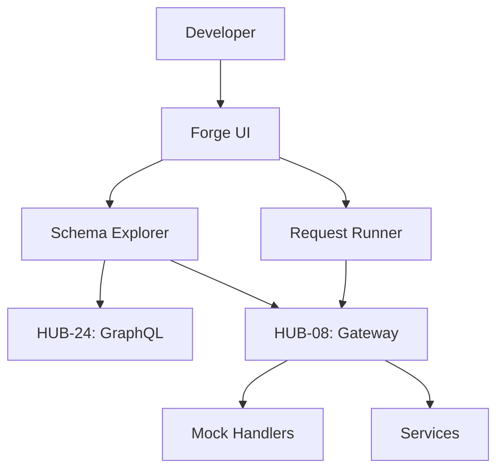

# ISPOKE-11: B1 Penumbra


<!-- Blind-Spot Awareness (per BLIND-SPOT-DOCTRINE.md) -->
> **⚠️ Blind-Spot Awareness:** This Spoke blueprint may contain **unverified assumptions about the Hub capabilities it consumes, unstated integration requirements, or edge cases not covered**. The composition policy declared here is a candidate, not a certainty. The ISPOKE's `reusable` flag may not reflect actual reusability. Cross-ESPOKE sharing may have hidden dependencies (like E11→E12). **The consumer matrix is evidence-based, not assumption-based — but the evidence may be incomplete.** See `Architecture/CrossCutting/BLIND-SPOT-DOCTRINE.md` for the governance framework.

<!-- End Blind-Spot Awareness -->

## Tier
Internal Spoke (Staff-only Application)

## Component Name
Sovereign Forge (Sandbox)

## Description
A developer-centric portal for testing Internal and Hub APIs. It provides an interactive "API Playground" (similar to Swagger/GraphiQL) but specifically tuned for the Sovereign Stack's dual-purpose API Gateway (`HUB-08`). It allows for testing service-to-service communication in a safe, isolated environment.

## Sequencing Rationale
Follows the Compliance Portal to ensure all developer testing activity is properly logged and monitored. This is the primary tool for Internal Spoke developers.

## Context7 Research
### Direct Hub Dependencies
- `HUB-08: API Gateway`
- `HUB-24: GraphQL Schema Registry`
- `HUB-04: Global Identity & Authentication`
- `HUB-26: Shared UI Component Library`
- `HUB-15: Health Check & Service Discovery`
- `HUB-06: Audit Log & Activity Tracker`

### Transitive Core Dependencies
- `CORE-06: Router`
- `CORE-18: Core Kernel & Lifecycle`
- `CORE-02: DI Container`
- `CORE-11: SuperPHP Parser`
- `CORE-12: SuperPHP Compiler`

## Architectural Design
- **SchemaExplorer**: Introspects `HUB-08` and `HUB-24` to provide real-time API documentation.
- **RequestRunner**: Executes test requests against the Gateway with various auth contexts.
- **SandboxManager**: Manages ephemeral test data and mock responses.
- **CollectionManager**: Allows developers to save and share groups of API requests.

### Sandbox Interaction Diagram


## Interface Contracts

### SandboxRunnerInterface
```php
namespace SovereignStack\Internal\Forge\Contracts;

interface SandboxRunnerInterface
{
    /**
     * Execute an API request with a specified authentication context.
     */
    public function run(string $method, string $path, array $headers, ?array $body, string $context): array;

    /**
     * Load a saved request collection.
     */
    public function loadCollection(string $collectionId): array;
}
```

## Integration Strategy
- **Bootstrapping**: Boots via `CORE-18`; retrieves active API routes from `HUB-08`.
- **UI**: Renders a reactive API client using `HUB-26` and SuperPHP.
- **Auth Simulation**: Can assume "Staff" or "Service" identities via `HUB-04` for testing permission logic.
- **Logging**: All sandbox requests are tagged and logged in `HUB-06` to distinguish them from production traffic.
- **Health**: Reports Gateway connectivity and schema synchronization status to `HUB-15`.

## CI Verification Criteria
- **Isolation**: Requests executed in the Sandbox must never modify production data (verified via `HUB-08` environment flags).
- **Schema Accuracy**: The documentation rendered must be within 100% sync with the actual Gateway routing table.
- **UI Responsiveness**: Large GraphQL introspections (> 1MB) must not freeze the browser UI.

## SemVer Impact
**Minor**. Enhances developer productivity and API reliability.


---

## Doctrines Applied + Rewrite Notes (PR #340)

> **This section was added in PR #340 (Core rewrite Batch, 2026-10-07) per Tech-Lead directive: "rewrite with proper details the entire SDLC then Architecture starting from Core, three documents at a time. No more Patches!"**

### Doctrines Applied

This blueprint is bound by the following doctrines (per [SDLC-01 §9](../../SDLC/SDLC-01-Foundations.md) convention):

- **Blind-Spot Doctrine** ([`../../CrossCutting/BLIND-SPOT-DOCTRINE.md`](../../CrossCutting/BLIND-SPOT-DOCTRINE.md)) — banner at top of this file (binding rule #3: every architectural document carries a blind-spot awareness note). The blueprint's claims are candidates, not certainties. The implementation may diverge from the blueprint (implementation drift). An audit of this blueprint is a starting point, not a complete inventory.
- **Nuclear-Grade Doctrine** ([`../../CrossCutting/NUCLEAR-GRADE-DOCTRINE.md`](../../CrossCutting/NUCLEAR-GRADE-DOCTRINE.md)) — binding on Core tier (per the doctrine's §0). Where this blueprint and the doctrine disagree, the doctrine wins. Depth 5 (production hardening) requires the doctrine's §9 merge gate to pass.
- **Integrity Gate** ([`../../Verification/INTEGRITY-GATE.md`](../../Verification/INTEGRITY-GATE.md)) — depth 6 (at-scale verification) requires the Integrity Gate's convergence criteria. The gate is a finite stopping condition (PASSED 2026-10-05).
- **Two-DAG Governance** ([`../../ADRs/ADR-021-tier-stratified-build-order.md`](../../ADRs/ADR-021-tier-stratified-build-order.md)) — the Dependency Status section above reflects the Declared DAG (architectural intent). The Verified DAG (implementation reality) lives at [`../../Core/CORE-VERIFIED-DAG.md`](../../Core/CORE-VERIFIED-DAG.md). When the two disagree, that disagreement is a finding in [`../../Verification/SHORTCOMINGS-REGISTER.md`](../../Verification/SHORTCOMINGS-REGISTER.md), not a defect to fix by editing either DAG.
- **FROZEN-CONTRACTS** ([`../../FROZEN-CONTRACTS.md`](../../FROZEN-CONTRACTS.md)) — the Interface Contracts section above declares the public surface. Once this blueprint is implemented at any depth, those contracts freeze. Changes require an ADR (per [SDLC-03 §3.1](../../SDLC/SDLC-03-InterfaceFreeze.md)).

### Updates Applied in PR #340

- **PHP version**: bulk-updated all references from `PHP 8.3` → `PHP 8.4` (the package `composer.json` files already require `^8.4`; the blueprint references were stale). This includes version strings in interface contracts, reference implementation notes, benchmark methodology baselines, and runtime requirements.
- **Cross-references**: added references to the new SDLC documents ([`SDLC-01`](../../SDLC/SDLC-01-Foundations.md), [`SDLC-02`](../../SDLC/SDLC-02-Governance.md), [`SDLC-03`](../../SDLC/SDLC-03-InterfaceFreeze.md), [`SDLC-04`](../../SDLC/SDLC-04-CooldownMechanics.md), [`SDLC-05`](../../SDLC/SDLC-05-AI-Assisted-Development-Protocol.md), [`SDLC-06`](../../SDLC/SDLC-06-Generator-Specifications.md)) which replaced the original `SDLC-AGRD.md` (now a redirect at [`../../CrossCutting/SDLC-AGRD.md`](../../CrossCutting/SDLC-AGRD.md)).
- **Doctrine layer**: added this "Doctrines Applied + Rewrite Notes" section per the new SDLC convention (SDLC-01 §9 Provenance).
- **Build Status**: verified current shipped state (depth 2 for this blueprint — ISPOKE-11 — shipped per the verified DAG).

### What Was NOT Changed in PR #340

- **Interface contracts** — the PHP interface definitions, class maps, and behavior contracts were NOT modified. They remain as declared. Any change to these would require an ADR (per [SDLC-03 §3.1](../../SDLC/SDLC-03-InterfaceFreeze.md)).
- **Reference implementations** — the compilable class code was NOT modified. The implementation lives in `packages/core/spoke/internal/feature-flags/src/` and is verified by the architecture-boundary-lint.
- **Sequence diagrams** — the Mermaid sequence diagrams were NOT modified.
- **Benchmark methodology** — the harness specs were NOT modified (only the PHP version in the baseline was updated from 8.3 to 8.4 to match the actual CI runner).

### Verification Conditions for This Rewrite

- **Architecture-lint**: this file is scanned by `Architecture/Verification/lint/run.php`. The lint checks for invalid tokens (CORE-NN, HUB-NN, etc. in valid ranges), `misattribution phrases` (`CORE-09: Cryptography/Hashing`, `HUB-28: Analytics/Ledger` — must not appear in active prose), and structural completeness (the file must exist). Must pass.
- **Architecture-boundary-lint**: not directly applicable (this is a documentation file, not source code), but the implementation referenced in this blueprint is scanned by `scripts/architecture-boundary-lint.py`.
- **Self-test**: the architecture-lint's `--self-test` flag (added in PR #314) verifies the lint correctly detects missing files. This ensures the structural completeness check is not a false-positive.

### Provenance

This section was added in PR #340 (2026-10-07). The original blueprint content (interface contracts, class maps, sequence diagrams, etc.) was authored in earlier sessions and is preserved. The doctrine layer + PHP version update + cross-references to new SDLC documents are the additions.

Per the Blind-Spot Doctrine: this rewrite is a starting point, not a complete specification. The number of doctrines applied here is not the number of doctrines that exist. Future rewrites may add more doctrine cross-references as the methodology continues to evolve.
