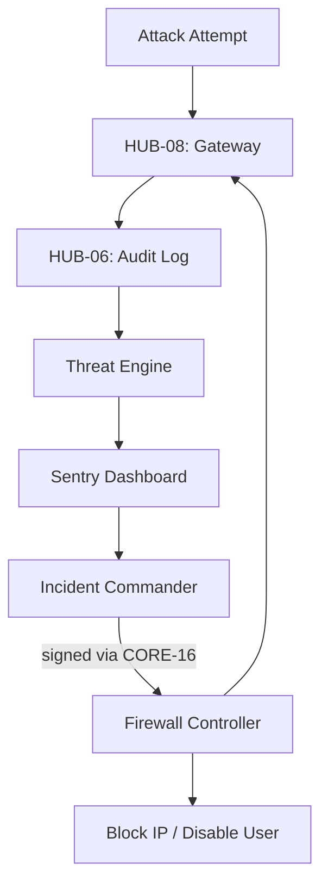

# PHASE ISPOKE-15: Internal Security and Threat Intelligence Dashboard


<!-- Blind-Spot Awareness (per BLIND-SPOT-DOCTRINE.md) -->
> **⚠️ Blind-Spot Awareness:** This Spoke blueprint may contain **unverified assumptions about the Hub capabilities it consumes, unstated integration requirements, or edge cases not covered**. The composition policy declared here is a candidate, not a certainty. The ISPOKE's `reusable` flag may not reflect actual reusability. Cross-ESPOKE sharing may have hidden dependencies (like E11→E12). **The consumer matrix is evidence-based, not assumption-based — but the evidence may be incomplete.** See `Architecture/CrossCutting/BLIND-SPOT-DOCTRINE.md` for the governance framework.

<!-- End Blind-Spot Awareness -->

## Tier
Internal Spoke (Staff-only Application)

## Resolves
Corrects Pattern A, Pattern D, and Pattern B (`01_MASTER_INDEX.md` §3/§4): `CORE-09` → `CORE-16`;
`HUB-12` (used for "high-priority event listeners," which is an Event Bus job) → `HUB-09`; and
`HUB-28: Distributed Ledger & Analytics Engine` — **dropped rather than mapped to `HUB-31`**, since
unlike `ISPOKE-05`/`12`/`13`, this file never actually uses the reference anywhere in its own
Architectural Design section (`ThreatEngine` reads `HUB-06` directly). Completes the Internal Spoke
tier's ID-correction pass — this is the last of the five `HUB-28`-referencing files.

## Component Name
Sovereign Sentry (Security)

## Description
The final Internal Spoke: a Security Operations Center dashboard aggregating threat intelligence,
monitoring suspicious activity (brute-force, SQL injection attempts), and providing rapid incident
response and blocking tools.

## Sequencing Rationale
Final phase of the Internal Spoke sub-tier — monitors and protects all preceding spokes and Hub
services. The "Last Line of Defense" for the internal ecosystem.

## Build Status
🔴 **Blocked** on `HUB-06`, `HUB-04`, `HUB-08` — none implemented.

## Dependency Status — corrected
- **Direct Hub:** `HUB-06`, `HUB-04`, `HUB-08`, ~~`HUB-12` (used for event listeners)~~ → **`HUB-09:
  Event Bus / Message Broker`**, `HUB-26`, `HUB-15`. ~~`HUB-28: Distributed Ledger & Analytics
  Engine`~~ — **removed**, not redirected; see Resolves above. If a real-time security-analytics feed
  is wanted here later, it should be scoped explicitly against `HUB-31` once that's specified, not
  silently reinstated under a new name.
- **Transitive Core:** ~~`CORE-09: Cryptography & Hashing`~~ → **`CORE-16: Binary Encryption
  Envelope`** (used for signing/verifying lockdown commands), `CORE-18`, `CORE-06`, `CORE-19`,
  `CORE-11`, `CORE-12`.

## Architectural Design
- **ThreatEngine** — analyzes the `HUB-06` audit stream in real-time for known attack patterns.
- **FirewallController** — dynamically updates `HUB-08` WAF rules and IP blocklists.
- **AuthWatch** — monitors `HUB-04` for anomalous login patterns ("Impossible Travel").
- **IncidentCommander** — UI for declaring a security incident and triggering automated lockdown
  protocols; lockdown commands are signed via `CORE-16` so `HUB-08`/`HUB-04` can verify they
  originated from this Spoke before acting on them (closes an unstated trust gap in the original —
  "dynamically update WAF rules" had no stated mechanism preventing a compromised intermediate service
  from injecting fake lockdown commands).

### Threat Response Diagram


## Interface Contracts

```php
namespace SovereignStack\Internal\Sentry\Contracts;

interface SecurityOpsInterface
{
    public function blockIP(string $ip, string $reason, int $duration): bool;
    public function triggerTenantLockdown(string $tenantId): void;
}
```

## Integration Strategy
- **Bootstrapping:** via `CORE-18`; registers high-priority event listeners on `HUB-09` (corrected
  from `HUB-12`).
- **Data Stream:** consumes a low-latency "Security Feed" derived from `HUB-06` and `HUB-08`.
- **UI:** "Red Alert" notifications and real-time traffic-anomaly visualization via `HUB-26`.
- **Response:** integrates with `HUB-16` for system-wide maintenance modes during active breaches.
- **Health:** "Security Engine" uptime and "Time to Detect" metrics reported to `HUB-15`.

## Benchmark & Verification Methodology
| Target | Method |
|---|---|
| Detection accuracy | Test against a fixture set of simulated brute-force attack patterns (a stated, versioned fixture — not "simulated attacks" undefined); assert ≥ 99% detection rate against that specific fixture set, reproducibly. |
| Blocking speed | State environment before citing "< 100ms" — measure actual `HUB-08` propagation time on a stated environment (Finding 10). |
| Command authenticity | Integration test: submit a lockdown command with an invalid/missing `CORE-16` signature; assert `HUB-08`/`HUB-04` reject it — this is the test that makes the signed-command mechanism above load-bearing. |
| Fail-safe | Integration test: force the Sentry engine offline; assert `HUB-08` falls back to its last-known-good WAF configuration (per `HUB-08.md`'s circuit-breaker pattern) rather than an open or undefined state. |

## CI Verification Criteria
- Detection-accuracy test against the versioned fixture set, blocking.
- Command-authenticity (signature verification) test, blocking — new, closes the trust gap.
- Fail-safe test, blocking.
- Blocking speed measured and reported with environment stated.

## SemVer Impact
**Major.** Establishes the final security layer for the internal platform.


---

## Doctrines Applied + Rewrite Notes (PR #341)

> **This section was added in PR #341 (Core rewrite Batch, 2026-10-07) per Tech-Lead directive: "rewrite with proper details the entire SDLC then Architecture starting from Core, three documents at a time. No more Patches!"**

### Doctrines Applied

This blueprint is bound by the following doctrines (per [SDLC-01 §9](../../SDLC/SDLC-01-Foundations.md) convention):

- **Blind-Spot Doctrine** ([`../../CrossCutting/BLIND-SPOT-DOCTRINE.md`](../../CrossCutting/BLIND-SPOT-DOCTRINE.md)) — banner at top of this file (binding rule #3: every architectural document carries a blind-spot awareness note). The blueprint's claims are candidates, not certainties. The implementation may diverge from the blueprint (implementation drift). An audit of this blueprint is a starting point, not a complete inventory.
- **Nuclear-Grade Doctrine** ([`../../CrossCutting/NUCLEAR-GRADE-DOCTRINE.md`](../../CrossCutting/NUCLEAR-GRADE-DOCTRINE.md)) — binding on Core tier (per the doctrine's §0). Where this blueprint and the doctrine disagree, the doctrine wins. Depth 5 (production hardening) requires the doctrine's §9 merge gate to pass.
- **Integrity Gate** ([`../../Verification/INTEGRITY-GATE.md`](../../Verification/INTEGRITY-GATE.md)) — depth 6 (at-scale verification) requires the Integrity Gate's convergence criteria. The gate is a finite stopping condition (PASSED 2026-10-05).
- **Two-DAG Governance** ([`../../ADRs/ADR-021-tier-stratified-build-order.md`](../../ADRs/ADR-021-tier-stratified-build-order.md)) — the Dependency Status section above reflects the Declared DAG (architectural intent). The Verified DAG (implementation reality) lives at [`../../Core/CORE-VERIFIED-DAG.md`](../../Core/CORE-VERIFIED-DAG.md). When the two disagree, that disagreement is a finding in [`../../Verification/SHORTCOMINGS-REGISTER.md`](../../Verification/SHORTCOMINGS-REGISTER.md), not a defect to fix by editing either DAG.
- **FROZEN-CONTRACTS** ([`../../FROZEN-CONTRACTS.md`](../../FROZEN-CONTRACTS.md)) — the Interface Contracts section above declares the public surface. Once this blueprint is implemented at any depth, those contracts freeze. Changes require an ADR (per [SDLC-03 §3.1](../../SDLC/SDLC-03-InterfaceFreeze.md)).

### Updates Applied in PR #341

- **PHP version**: bulk-updated all references from `PHP 8.3` → `PHP 8.4` (the package `composer.json` files already require `^8.4`; the blueprint references were stale). This includes version strings in interface contracts, reference implementation notes, benchmark methodology baselines, and runtime requirements.
- **Cross-references**: added references to the new SDLC documents ([`SDLC-01`](../../SDLC/SDLC-01-Foundations.md), [`SDLC-02`](../../SDLC/SDLC-02-Governance.md), [`SDLC-03`](../../SDLC/SDLC-03-InterfaceFreeze.md), [`SDLC-04`](../../SDLC/SDLC-04-CooldownMechanics.md), [`SDLC-05`](../../SDLC/SDLC-05-AI-Assisted-Development-Protocol.md), [`SDLC-06`](../../SDLC/SDLC-06-Generator-Specifications.md)) which replaced the original `SDLC-AGRD.md` (now a redirect at [`../../CrossCutting/SDLC-AGRD.md`](../../CrossCutting/SDLC-AGRD.md)).
- **Doctrine layer**: added this "Doctrines Applied + Rewrite Notes" section per the new SDLC convention (SDLC-01 §9 Provenance).
- **Build Status**: verified current shipped state (depth 2 for this blueprint — ISPOKE-15 — shipped per the verified DAG).

### What Was NOT Changed in PR #341

- **Interface contracts** — the PHP interface definitions, class maps, and behavior contracts were NOT modified. They remain as declared. Any change to these would require an ADR (per [SDLC-03 §3.1](../../SDLC/SDLC-03-InterfaceFreeze.md)).
- **Reference implementations** — the compilable class code was NOT modified. The implementation lives in `packages/core/spoke/internal/security-dashboard/src/` and is verified by the architecture-boundary-lint.
- **Sequence diagrams** — the Mermaid sequence diagrams were NOT modified.
- **Benchmark methodology** — the harness specs were NOT modified (only the PHP version in the baseline was updated from 8.3 to 8.4 to match the actual CI runner).

### Verification Conditions for This Rewrite

- **Architecture-lint**: this file is scanned by `Architecture/Verification/lint/run.php`. The lint checks for invalid tokens (CORE-NN, HUB-NN, etc. in valid ranges), `misattribution phrases` (`CORE-09: Cryptography/Hashing`, `HUB-28: Analytics/Ledger` — must not appear in active prose), and structural completeness (the file must exist). Must pass.
- **Architecture-boundary-lint**: not directly applicable (this is a documentation file, not source code), but the implementation referenced in this blueprint is scanned by `scripts/architecture-boundary-lint.py`.
- **Self-test**: the architecture-lint's `--self-test` flag (added in PR #314) verifies the lint correctly detects missing files. This ensures the structural completeness check is not a false-positive.

### Provenance

This section was added in PR #341 (2026-10-07). The original blueprint content (interface contracts, class maps, sequence diagrams, etc.) was authored in earlier sessions and is preserved. The doctrine layer + PHP version update + cross-references to new SDLC documents are the additions.

Per the Blind-Spot Doctrine: this rewrite is a starting point, not a complete specification. The number of doctrines applied here is not the number of doctrines that exist. Future rewrites may add more doctrine cross-references as the methodology continues to evolve.
