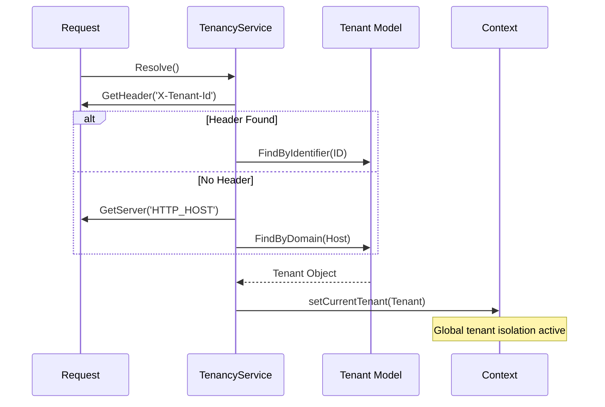

# Tenancy Service Specification

## 1. Overview
The `TenancyService` is the core architectural component responsible for isolating data and logic across multiple tenants. It ensures that every request is correctly associated with a specific tenant identity before processing.

## 2. Tenant Identification
Identification happens automatically during the service initialization via the following strategy:

1. **Header Identification**: Checks for `X-Tenant-Id` or `X-Tenant-Identifier` headers (useful for API/Spoke requests).
2. **Domain Mapping**: Resolves the tenant based on the `HTTP_HOST` server variable (standard for web traffic).
3. **Session Persistence**: For authenticated web users, the tenant can be stored in the session for cross-domain stability.

## 3. Data Isolation Strategy
Currently, the framework utilizes a **Shared Database / Shared Schema** approach with row-level filtering.

- **Tenant Key**: All tenant-owned tables must contain a `tenant_id` foreign key.
- **Global Scope**: Future implementations of the `Model` class will automatically apply a `WHERE tenant_id = ?` clause to all queries when a tenant is active.
- **Cross-Tenant Prevention**: Direct SQL queries must use the `getCurrentTenantId()` helper to ensure isolation.

## 4. Hub-and-Spoke Integration
In the Hub-and-Spoke model, the Hub (CMS Studio) is the primary "Tenant Orchestrator."

- **Hub Enforcement**: The Hub's `TenantMemberMiddleware` ensures the authenticated user is a member of the requested tenant.
- **Spoke Consumption**: Spokes receive the tenant context via internal headers when the Hub delegates a request to them.
- **Audit Integration**: Every log entry generated by the `AuditService` is automatically tagged with the current `tenant_id`.

## 5. History & Evolution
- **Phase 1 (Basic Identification)**: Support for domain-based resolution.
- **Phase 2 (Header Resolution)**: Support for `X-Tenant-Id` headers to enable API-driven multi-tenancy.
- **Phase 3 (Middleware Integration)**: Added `TenantMemberMiddleware` for authorization enforcement.

## 6. Future Roadmap
- **Phase 4: Global Query Scopes (M)**: Implement an automatic `tenant_id` scope in the `Model` core to eliminate manual filtering in controllers.
- **Phase 5: Domain Mapping UI (S)**: A CMS Studio app for managing custom domains and SSL certificates for tenants.
- **Phase 6: Advanced Isolation (XL)**: Support for "Shared Database / Separate Schema" (PostgreSQL schemas) or "Separate Database" drivers for high-compliance tenants.

## 7. Validation
### Success Criteria
- **Zero Leakage**: Users must never be able to access data belonging to another tenant via ID enumeration.
- **Performance**: Tenant resolution must add < 2ms to the request lifecycle.
- **Transparency**: Developers should not need to manually include `tenant_id` in standard `save()` operations.

### Verification Steps
- [ ] Run `vendor/bin/phpunit --group tenancy` to verify isolation logic.
- [ ] Attempt a request to a tenant-owned resource using a cross-tenant ID to confirm 403/404 behavior.
- [ ] Verify that `AuditService` correctly associates logs with the active tenant.
