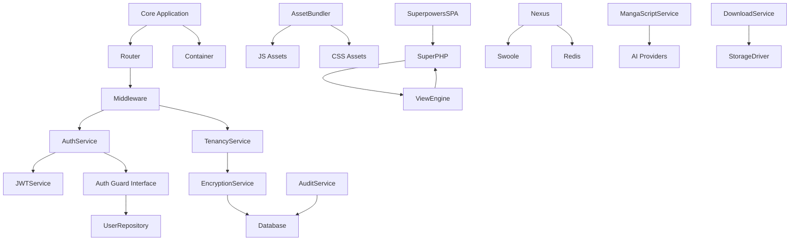

# DGLab Codebase Analysis Report

## 1. High‑Level System Overview

The **DGLab** project is a **Node‑free, reactive‑first web application** built on **PHP 8.2+**. It follows a **hub‑and‑spoke** architecture where a central **Hub** (the core framework and Superpowers SPA) provides shared services such as routing, dependency injection, event handling, authentication, and real‑time communication. Domain‑specific **Spokes** (e.g., **CMS Studio**, **MangaScript**, **Media Library**) plug into the Hub via well‑defined service interfaces.

Key architectural pillars:
- **Pure‑PHP Asset Bundler** (`WebpackService`) eliminates the need for Node.js build tools.
- **SuperPHP Engine** compiles declarative component syntax into optimized PHP code, enabling server‑side rendering and fine‑grained UI diffing.
- **Superpowers SPA** provides client‑side navigation, fragment morphing, and PWA capabilities without a heavyweight JavaScript framework.
- **Nexus** offers a high‑performance WebSocket layer built on **Swoole** for real‑time features.
- **Tenancy Service** enforces hard isolation of data per tenant, backed by envelope encryption.

## 2. Major Components and Responsibilities

| Component | Responsibility |
|---|---|
| `DGLab\Core\Application` | Central IoC container, auto‑wiring, lifecycle management |
| `DGLab\Core\Router` | Regex‑based routing, middleware pipeline |
| `DGLab\Core\Middleware` | Request preprocessing (auth, tenancy, rate‑limit) |
| `DGLab\Core\Controller` | Dispatches to business logic, returns `Response` |
| `DGLab\Core\View` | Integrates with **SuperPHP** to render templates |
| `DGLab\Core\EventDispatcher` | Decoupled event bus (sync & async drivers) |
| **SuperPHP Engine** (`DGLab\Services\Superpowers\*`) | Lexing, parsing, compiling component files (`*.super.php`) |
| **Superpowers SPA** (`resources/assets/js/superpowers.*`) | Client‑side navigation, fragment requests, morphing |
| **AssetBundler** (`WebpackService`) | Pure‑PHP JS/CSS dependency resolution, minification, SRI hash generation |
| **Auth Service** (`AuthManager`, guards, `JWTService`, `MfaService`) | Authentication, session/JWT handling, MFA, RBAC |
| **Download Service** (`DownloadService`, drivers) | Secure signed URLs, storage abstraction, cleanup |
| **Tenancy Service** (`TenancyService`) | Tenant identification, context injection, scoped auditing |
| **Encryption Service** (`EncryptionService`) | Envelope encryption, blind‑index generation |
| **Nexus** (`NexusServer`, `SwooleConnectionManager`) | Real‑time WebSocket gateway, Redis pub/sub scaling |
| **MangaScript Service** (`MangaScriptService`) | AI‑driven script generation, LLM provider orchestration |
| **Media Library Service** (`MediaLibraryService`) | Asset metadata, transformation pipeline (referenced in docs) |
| **Localization Service** (`LocalizationService`) | Locale resolution, string translation, caching |
| **Search Service** (`SearchService`) | Full‑text indexing and query (planned) |
| **Audit Service** (`AuditService`) | Immutable audit log with cryptographic chaining |

## 3. Dependency Graph

### PHP Packages (from [`Legacy/composer.json`](Legacy/composer.json))

- `php >=8.0`
- `doctrine/dbal`
- `intervention/image`
- `matthiasmullie/minify`
- `monolog/monolog`
- `psr/container`
- `psr/log`
- `scssphp/scssphp`
- `twig/twig`
- **Dev**: `phpspec/prophecy-phpunit`, `phpstan/phpstan`, `phpunit/phpunit`, `squizlabs/php_codesniffer`, `symfony/panther`, `textalk/websocket`

### Internal Services (high‑level relationships)

> **Note**: The diagram omits low‑level classes for readability but captures the primary service dependencies.

## 4. Data Storage and Tenancy Model

- **Database Connections** are defined in [`Legacy/config/database.php`](Legacy/config/database.php) supporting MySQL, PostgreSQL, SQLite, and a Kafka driver for event streaming.
- **Upload & Asset Storage** uses the local `storage/uploads` directory; the `DownloadService` abstracts drivers (currently a `LocalDriver`).
- **Tenancy** is enforced by `TenancyService` (see [`Legacy/app/Services/Tenancy/TenancyService.php`](Legacy/app/Services/Tenancy/TenancyService.php)). It works in three layers:
  1. **Middleware** (`TenantMemberMiddleware`) validates tenant access on every request.
  2. **Cryptographic Isolation** – each tenant’s data is encrypted with a tenant‑specific key (`EncryptionService`).
  3. **Scoped Auditing** – audit entries are tagged with `tenant_id` for per‑tenant reporting.
- **Encryption** follows the envelope format described in [`Legacy/Architecture/Sovereign_Stack_Blueprint/VOLUME_III_CRYPTOGRAPHIC_FORTRESS.md`](Legacy/Architecture/Sovereign_Stack_Blueprint/VOLUME_III_CRYPTOGRAPHIC_FORTRESS.md).

## 5. CI/CD Pipeline Steps and Status

### Test Workflow (`.github/workflows/tests.yml`)
1. Checkout repository
2. Set up PHP (8.1 / 8.2) with required extensions
3. Install Composer dependencies
4. Run static analysis (`composer run analyse`)
5. Run coding standards (`composer run cs`)
6. Execute unified test suite (`php cli/test.php run --stop-on-failure --testdox`)
7. Generate health report (`php cli/test.php health`)
8. Upload test artifacts

### Deploy Workflow (`.github/workflows/deploy.yml`)
1. Checkout repository (main branch only)
2. Set up PHP 8.0
3. Validate `composer.json`/`composer.lock`
4. Install dependencies (dev)
5. Run PHPCS and PHPStan
6. Run full test suite (`composer run test`)
7. Install production dependencies (`composer install --no-dev --optimize-autoloader`)
8. Deploy via FTP (`SamKirkland/FTP-Deploy-Action`)

Both pipelines are defined and trigger on pushes/pull‑requests. No explicit status badges are present, but the workflows will report success/failure in GitHub Actions.

## 6. Test Coverage Summary

- **PHPUnit configuration** (`Legacy/phpunit.xml`) defines three test suites: Unit, Integration, Browser.
- **Coverage** is enabled (`processUncoveredFiles="true"`) and includes the entire `app` directory while excluding helpers.
- **HTML coverage report** is generated under `storage/coverage-html`.
- The project contains **~200+ test classes** across `tests/Unit`, `tests/Integration`, and `tests/Browser` (e.g., `AuthIntegrationTest.php`, `DownloadIntegrationTest.php`, `Browser/LoginTest.php`).
- **Parallel execution** is used in the CLI test runner (`cli/test.php`) to speed up the suite.
- No explicit coverage thresholds are enforced; adding a minimum coverage gate is recommended.

## 7. Recommendations for Improvement

1. **Enforce Minimum Coverage** – add a coverage threshold in `phpunit.xml` or CI step to fail builds below, e.g., 80%.
2. **Add Dependency Update Automation** – enable Dependabot or Renovate to keep Composer packages current and reduce security risk.
3. **Expand Security Scanning** – integrate tools such as `phpstan‑security` or `Psalm` with security plugins.
4. **Document Service Dependency Graph** – generate an up‑to‑date diagram (e.g., using `php-diagram` or manual Mermaid) and keep it in `Architecture/` for onboarding.
5. **CI Asset Build Verification** – add a step that runs the `WebpackService` to bundle assets and validates generated SRI hashes.
6. **Containerize Development Environment** – provide a Docker Compose file to standardize PHP, Swoole, Redis, and database services for local CI runs.
7. **Improve Tenancy Auditing** – ensure all write paths (including background jobs) tag audit entries with tenant context.
8. **Add End‑to‑End Tests for Nexus** – currently skipped if Swoole is missing; consider a lightweight mock or integration container in CI.
9. **Upgrade to PHP 8.3** – when feasible, to benefit from new language features and performance improvements.
10. **Refresh Documentation** – consolidate the many architecture markdown files into a single living document with a table of contents and versioned changelog.

---

*Report generated by the automated analysis assistant.*
