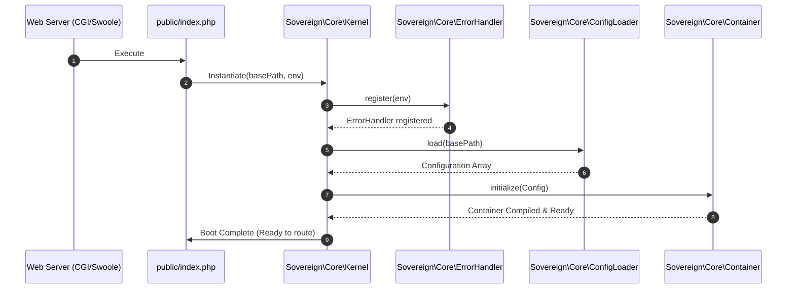

# Phase ID: CORE-01
## Tier: Core
## Component Name and Description: Foundational Bootstrapper & Kernel

The [`Kernel`](blueprints/CORE-01.md) and [`Bootstrapper`](blueprints/CORE-01.md) serve as the entry and initialization layer of the rebooted Sovereign Stack. It prepares the PHP 8.2+ runtime environment, sets up global error and exception handlers, detects the environment stage (e.g. development, production), loads critical system settings, and coordinates the sequential boot process of all other Core tier systems. It guarantees a sub-1ms boot baseline by avoiding external user-land dependencies and leveraging native PHP features.

---

## Context7 Research
### 1. PSR Standards Reference
- **No direct PSR standard** governs kernel bootstrapping or error handlers, but the bootstrapper must prepare the environment for PSR-11 and PSR-7 components which follow.
- Integrates with standard PHP logging which aligns with **PSR-3 (Logger Interface)** to allow error/exception output handling.

### 2. PHP 8.2+ Best Practices
- **Readonly Classes & Properties**: All bootstrapper state (like environment, directories) should be represented via immutable data structures using PHP's native `readonly` properties.
- **OPcache Preloading**: Design the Kernel with strict file structures so that it is fully compatible with preloading (`opcache.preload`), enabling high-performance, warm-state execution.
- **Native Error Capturing**: Utilize `set_error_handler()`, `set_exception_handler()`, and `register_shutdown_function()` to convert all legacy PHP errors, warnings, and notices into throwables ([`Sovereign\Core\Exceptions\FatalThrowableError`](blueprints/CORE-01.md:65)).

### 3. Design Patterns
- **Singleton Pattern / Registry Pattern**: The running application environment is accessed via a global, thread-safe execution context or static instance manager to avoid global variable state pollution.
- **Chain of Responsibility**: Bootstrapping executes a ordered array of bootstrapper stages (e.g., config load, container compilation, route compilation).

---

## Architectural Design

### Class & Interface Structure

The core Bootstrapper subsystem is represented by the following classes:

1. **[`Sovereign\Core\Kernel`](blueprints/CORE-01.md:45)**: The central orchestrator managing the system life cycle.
2. **[`Sovereign\Core\Bootstrapper`](blueprints/CORE-01.md:85)**: Abstract base or runner that sequentially triggers boot stages.
3. **[`Sovereign\Core\Environment`](blueprints/CORE-01.md:110)**: Strict typed enum representing `DEVELOPMENT`, `TESTING`, `STAGING`, and `PRODUCTION`.
4. **[`Sovereign\Core\ErrorHandler`](blueprints/CORE-01.md:135)**: Global error and exception hook registry.

```php
namespace Sovereign\Core;

/**
 * Kernel orchestration interface.
 */
interface KernelInterface
{
    public function boot(): void;
    public function handleRequest(): void;
    public function shutdown(): void;
}
```

```php
namespace Sovereign\Core;

enum Environment: string
{
    case DEVELOPMENT = 'development';
    case TESTING = 'testing';
    case STAGING = 'staging';
    case PRODUCTION = 'production';
}
```

```php
namespace Sovereign\Core;

use Throwable;

final class ErrorHandler
{
    public static function register(Environment $environment): self
    {
        $handler = new self($environment);
        set_error_handler([$handler, 'handleError']);
        set_exception_handler([$handler, 'handleException']);
        register_shutdown_function([$handler, 'handleShutdown']);
        return $handler;
    }

    private function __construct(private Environment $environment) {}

    public function handleError(int $level, string $message, string $file, int $line): bool
    {
        if (!(error_reporting() & $level)) {
            return false;
        }
        throw new \ErrorException($message, 0, $level, $file, $line);
    }

    public function handleException(Throwable $exception): void
    {
        // Suppress or format output based on environment
        $this->logException($exception);
        
        if ($this->environment === Environment::PRODUCTION) {
            http_response_code(500);
            echo json_encode(['error' => 'Internal Server Error']);
            exit(1);
        }

        http_response_code(500);
        echo json_encode([
            'error' => $exception->getMessage(),
            'trace' => $exception->getTraceAsString(),
            'file' => $exception->getFile(),
            'line' => $exception->getLine()
        ]);
        exit(1);
    }

    public function handleShutdown(): void
    {
        $error = error_get_last();
        if ($error !== null && in_array($error['type'], [E_ERROR, E_PARSE, E_CORE_ERROR, E_COMPILE_ERROR])) {
            $this->handleException(new \ErrorException(
                $error['message'],
                0,
                $error['type'],
                $error['file'],
                $error['line']
            ));
        }
    }

    private function logException(Throwable $exception): void
    {
        // Write raw panic log to system stream/stderr or fallback file
        error_log(sprintf(
            "[%s] %s in %s:%d\nStack trace:\n%s",
            date('Y-m-d H:i:s'),
            $exception->getMessage(),
            $exception->getFile(),
            $exception->getLine(),
            $exception->getTraceAsString()
        ));
    }
}
```

### System Boot Sequence Diagram



---

## Integration Strategy

As the absolute lowest software level in the Core tier, [`Sovereign\Core\Kernel`](blueprints/CORE-01.md:45) has zero user-land software dependencies below it.

- It directly interfaces with **Swoole** or **PHP-FPM** SAPI.
- It supplies the raw directory path environment context and handles root errors before [`Sovereign\Core\Container`](blueprints/CORE-02.md) or [`Sovereign\Core\ConfigLoader`](blueprints/CORE-06.md) can be safely constructed.
- [`CORE-02`](blueprints/CORE-02.md) and [`CORE-06`](blueprints/CORE-06.md) are initialized *by* this Kernel, making them downstream targets.

---

## CI Verification Criteria

### 1. Test Coverage
- **Unit Tests**: Must cover environment detection, boot sequences, error handler register, and handler catch overrides with 100% path coverage.
- **Simulation**: Mock custom catastrophic fatal throwables to verify exit statuses match expectations across all `Environment` stages.

### 2. Performance Benchmarks
- **Boot Execution Time**: Must initialize and register handlers in **< 0.15ms** on PHP 8.2 with OPcache preloading.
- **Memory Overhead**: Absolute memory footprints for raw kernel boot must not exceed **1.2 MB**.

---

## SemVer Impact

- **Major Bump** (v1.0.0-core.1): This component marks the death of the legacy monolith's framework bootloader and establishes the zero-Node reboot core lifecycle. All existing code must migrate to the new `Kernel` bootstrap entrypoint.
