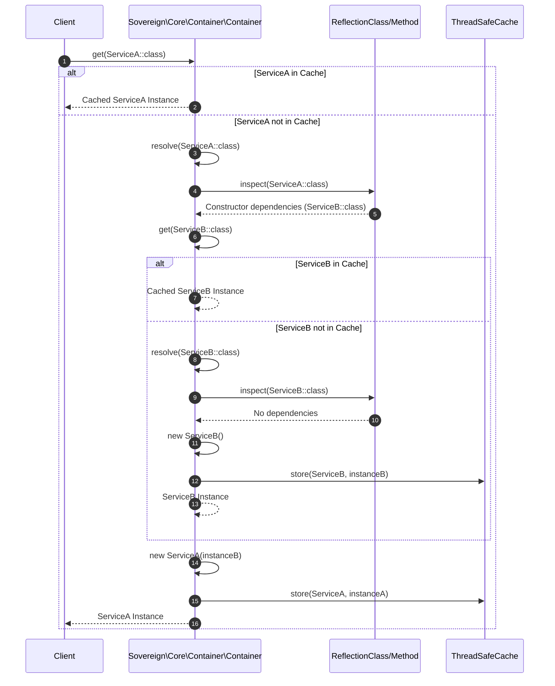

# Phase ID: CORE-02
## Tier: Core
## Component Name and Description: Dependency Injection Container (DIC)

The [`Dependency Injection Container`](blueprints/CORE-02.md) is a PSR-11 compliant service container responsible for managing class dependencies, enabling inversion of control, and facilitating testability and modularity within the Sovereign Stack. It supports advanced features like autowiring, compiler passes for dynamic modifications, thread-safe caching for performance, and robust singleton resolution.

---

## Context7 Research

### 1. PSR Standards Reference
- **PSR-11 (Container Interface)**: The DIC must implement the [`Psr\Container\ContainerInterface`](blueprints/CORE-02.md) and [`Psr\Container\ContainerExceptionInterface`](blueprints/CORE-02.md) and [`NotFoundExceptionInterface`](blueprints/CORE-02.md) to ensure interoperability and adherence to a common standard for accessing services.

### 2. PHP 8.2+ Best Practices
- **Attribute-Based Configuration**: Leverage PHP 8+ attributes for defining dependencies, lifecycle hooks, or custom injection logic (e.g., `@Inject`, `@Singleton`).
- **Strict Typing**: Utilize PHP 8.2+ strict types for all method signatures and property declarations within the container to enhance type safety and reduce runtime errors.
- **JIT Compilation Compatibility**: Design the container's reflection and resolution logic to be as predictable as possible for PHP's JIT compiler to optimize performance.

### 3. Design Patterns
- **Service Locator (with caution)**: While the primary goal is DI, the container itself acts as a Service Locator for resolving dependencies. The facade pattern may be implemented for ease of use but with explicit awareness of its potential pitfalls.
- **Factory Pattern**: Used internally to create instances of classes, especially when complex initialization logic is required or when different implementations need to be resolved based on context.
- **Compiler Pass Pattern**: Allows for extensible and modular modification of service definitions before the container is fully compiled and optimized.

---

## Architectural Design

### Class & Interface Structure

1.  **[`Sovereign\Core\Container\Container`](blueprints/CORE-02.md:50)**: The main DIC implementation, adhering to PSR-11.
2.  **[`Sovereign\Core\Container\Definition`](blueprints/CORE-02.md:55)**: Represents a service definition, including its class, dependencies, and lifecycle (e.g., singleton, transient).
3.  **[`Sovereign\Core\Container\Compiler`](blueprints/CORE-02.md:60)**: Processes definitions and applies compiler passes.
4.  **[`Sovereign\Core\Container\CompilerPassInterface`](blueprints/CORE-02.md:65)**: Interface for compiler passes to extend container functionality.
5.  **[`Sovereign\Core\Container\Exception\ContainerException`](blueprints/CORE-02.md:70)**: Custom exception for container-related errors.
6.  **[`Sovereign\Core\Container\Exception\NotFoundException`](blueprints/CORE-02.md:75)**: Custom exception for when a service cannot be found.

```php
namespace Sovereign\Core\Container;

use Psr\Container\ContainerInterface;
use Psr\Container\ContainerExceptionInterface;
use Psr\Container\NotFoundExceptionInterface;

interface ContainerInterface extends ContainerInterface
{
    public function get(string $id): mixed;
    public function has(string $id): bool;
    public function set(string $id, callable|string $concrete, bool $singleton = false): void;
    public function singleton(string $id, callable|string $concrete): void;
    public function autowire(string $className): object;
    public function call(callable $callback, array $parameters = []): mixed;
}
```

```php
namespace Sovereign\Core\Container;

class Definition
{
    public function __construct(
        public readonly string $id,
        public readonly callable|string $concrete,
        public readonly bool $singleton = false,
        public ?object $instance = null
    ) {}
}
```

### Dependency Resolution & Autowiring Sequence Diagram



---

## Integration Strategy

- The [`Sovereign\Core\Kernel`](blueprints/CORE-01.md) will be responsible for initializing and compiling the [`Sovereign\Core\Container`](blueprints/CORE-02.md) during the boot sequence.
- Other Core components like the [`Router`](blueprints/CORE-03.md) and [`Middleware Pipeline`](blueprints/CORE-05.md) will receive instances of the `ContainerInterface` to resolve their own dependencies.
- The container will manage the lifecycle of all services, including those defined in [`CORE-06.md`](blueprints/CORE-06.md) (Config Manager), ensuring they are available throughout the application.

---

## CI Verification Criteria

### 1. Test Coverage
- **Unit Tests**: 100% line and branch coverage for service registration, resolution (both concrete and callable), singleton behavior, autowiring, and exception handling (NotFoundException, ContainerException).
- **Integration Tests**: Verify compiler pass execution, dynamic service overriding, and interaction with core bootstrapping process.

### 2. Performance Benchmarks
- **Resolution Time**: Resolve a simple class with one level of autowired dependency in **< 0.05ms** (after initial compilation/cache warm-up).
- **Compilation Time**: Full container compilation with 100+ services and 5 compiler passes must complete in **< 5ms**.
- **Memory Footprint**: Active container memory overhead (excluding service instances) must not exceed **2 MB**.

### 3. Compliance
- **PSR-11 Compliance**: Automated tests to verify adherence to `Psr\Container\ContainerInterface` specifications.

---

## SemVer Impact

- **Minor Bump** (v1.1.0-core.2): This component introduces the core dependency injection mechanism. While fundamental, it allows for iterative development of services without breaking the core `Kernel` interface. Changes to the `ContainerInterface` itself would result in a Major bump.
