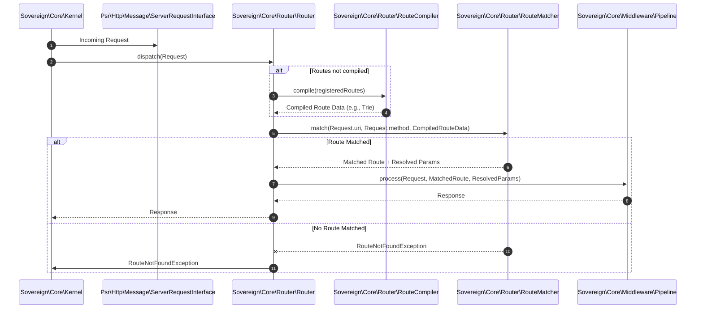

# Phase ID: CORE-03
## Tier: Core
## Component Name and Description: High-Performance Router

The [`High-Performance Router`](blueprints/CORE-03.md) is responsible for efficiently matching incoming HTTP requests to their corresponding handlers (controllers or callables) and associated middleware. It is designed for optimal performance, leveraging compiled routes and advanced matching algorithms. It adheres to PSR-7 and integrates with PSR-15 for middleware, supporting features like group routing, parameter resolution, and dynamic route binding.

---

## Context7 Research

### 1. PSR Standards Reference
- **PSR-7 (HTTP Message Interface)**: The router will receive and return instances of [`Psr\Http\Message\ServerRequestInterface`](blueprints/CORE-04.md) and [`Psr\Http\Message\ResponseInterface`](blueprints/CORE-04.md) from [`CORE-04.md`](blueprints/CORE-04.md).
- **PSR-15 (HTTP Handlers and Middleware)**: The router will dispatch requests through a middleware pipeline conforming to [`Psr\Http\Server\RequestHandlerInterface`](blueprints/CORE-05.md) and [`Psr\Http\Server\MiddlewareInterface`](blueprints/CORE-05.md) as defined in [`CORE-05.md`](blueprints/CORE-05.md).

### 2. PHP 8.2+ Best Practices
- **Readonly Properties**: Utilize `readonly` properties for immutable route definitions and compiled route data to ensure consistency and prevent accidental modification.
- **JIT Optimization**: Implement route matching logic that is predictable and avoids excessive dynamic calls to benefit from PHP JIT compilation, ensuring extremely fast route resolution.
- **Attribute Routing**: Potentially use PHP 8+ attributes for defining routes directly on controller methods for improved developer experience, processed by a compiler pass in [`CORE-02.md`](blueprints/CORE-02.md) or [`CORE-06.md`](blueprints/CORE-06.md).

### 3. Design Patterns
- **Trie/Radix Tree (for route compiling)**: Employ a Trie or Radix tree data structure for compiling and matching routes. This allows for `O(1)` or near `O(log n)` lookup times, significantly boosting performance over linear or simple regex matching.
- **Strategy Pattern**: Different route matching strategies (e.g., static, regex, parameter) can be encapsulated as separate strategies.
- **Builder Pattern / Fluent Interface**: Provide a fluent interface for defining routes and route groups, enhancing readability and developer ergonomics.

---

## Architectural Design

### Class & Interface Structure

1.  **[`Sovereign\Core\Router\Router`](blueprints/CORE-03.md:50)**: The main routing engine, responsible for registering, compiling, and dispatching routes.
2.  **[`Sovereign\Core\Router\Route`](blueprints/CORE-03.md:55)**: Represents a single route definition, including its path, method, handler, and middleware.
3.  **[`Sovereign\Core\Router\RouteCollector`](blueprints/CORE-03.md:60)**: Provides a fluent API for defining routes and groups.
4.  **[`Sovereign\Core\Router\RouteCompiler`](blueprints/CORE-03.md:65)**: Converts raw route definitions into an optimized, matchable structure (e.g., a Trie).
5.  **[`Sovereign\Core\Router\RouteMatcher`](blueprints/CORE-03.md:70)**: Performs the actual matching of a request URI against compiled routes.
6.  **[`Sovereign\Core\Router\Exception\RouteNotFoundException`](blueprints/CORE-03.md:75)**: Thrown when no matching route is found.

```php
namespace Sovereign\Core\Router;

use Psr\Http\Message\ServerRequestInterface;
use Psr\Http\Server\MiddlewareInterface;

interface RouterInterface
{
    public function addRoute(string $method, string $path, callable|string $handler): Route;
    public function group(string $prefix, callable $callback): void;
    public function dispatch(ServerRequestInterface $request): array; // Returns matched Route and resolved parameters
    public function compileRoutes(): void;
}
```

```php
namespace Sovereign\Core\Router;

final class Route
{
    public function __construct(
        public readonly string $method,
        public readonly string $path,
        public readonly callable|string $handler,
        public readonly array $middleware = [],
        public readonly array $parameters = [] // Resolved parameters after matching
    ) {}

    public function addMiddleware(string|MiddlewareInterface ...$middleware): self;
}
```

### Route Dispatching Sequence Diagram



---

## Integration Strategy

- The [`Sovereign\Core\Kernel`](blueprints/CORE-01.md) will instantiate and configure the [`High-Performance Router`](blueprints/CORE-03.md) during the boot process.
- The router will rely on [`CORE-04.md`](blueprints/CORE-04.md) (HTTP Message & Request/Response Factory) for creating and handling PSR-7 compatible request and response objects.
- Once a route is matched, the router will hand off the `ServerRequestInterface` and the matched route's handler to the [`Middleware Pipeline & Request Handlers`](blueprints/CORE-05.md) for processing.
- The [`Dependency Injection Container`](blueprints/CORE-02.md) will be used by the router to resolve controller dependencies or middleware instances.

---

## CI Verification Criteria

### 1. Test Coverage
- **Unit Tests**: 100% path coverage for route registration, group routing, parameter extraction, route compilation, and matching logic (static, dynamic, optional parameters).
- **Integration Tests**: Verify end-to-end request dispatching, correct handler execution, and middleware binding with various route configurations.

### 2. Performance Benchmarks
- **Route Resolution Time**: Must resolve a complex route with 3+ parameters and 2+ middleware entries in **< 0.08ms** (after warm-up/compilation).
- **Compilation Time**: Compiling 1000+ routes must complete in **< 10ms**.
- **Memory Footprint**: Route table (compiled) memory consumption must be optimized, e.g., **< 5MB** for 1000 routes.

### 3. Compliance
- **PSR-7/PSR-15 Compatibility**: Ensure the router correctly processes and passes PSR-7 request/response objects and integrates with PSR-15 middleware.

---

## SemVer Impact

- **Minor Bump** (v1.2.0-core.3): This introduces the core routing functionality. While crucial, it builds upon the existing Kernel and Container. Any changes to the `RouterInterface` or `Route` definition after initial implementation would likely result in a Major bump due to widespread impact on application routing logic.
