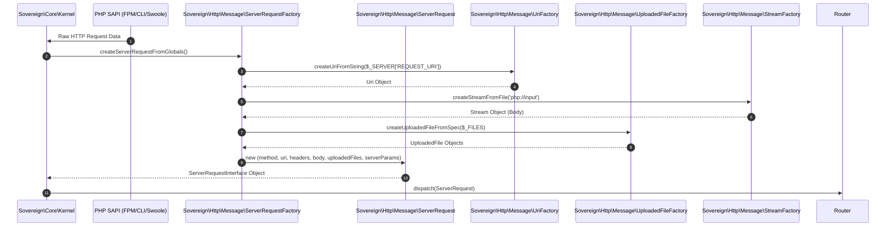

# Phase ID: CORE-04
## Tier: Core
## Component Name and Description: HTTP Message & Request/Response Factory

The [`HTTP Message & Request/Response Factory`](blueprints/CORE-04.md) component provides a robust and PSR-7/PSR-17 compliant implementation for HTTP messages (requests and responses) within the Sovereign Stack. It encapsulates all aspects of HTTP message handling, including streams for efficient body management, uploaded file abstractions, and URI handling. This foundational component ensures that all network communication adheres to a consistent and interoperable standard.

---

## Context7 Research

### 1. PSR Standards Reference
- **PSR-7 (HTTP Message Interface)**: The core of this component will implement interfaces such as [`Psr\Http\Message\RequestInterface`](blueprints/CORE-04.md), [`Psr\Http\Message\ResponseInterface`](blueprints/CORE-04.md), [`Psr\Http\Message\ServerRequestInterface`](blueprints/CORE-04.md), [`Psr\Http\Message\StreamInterface`](blueprints/CORE-04.md), [`Psr\Http\Message\UploadedFileInterface`](blueprints/CORE-04.md), and [`Psr\Http\Message\UriInterface`](blueprints/CORE-04.md).
- **PSR-17 (HTTP Factories)**: This component will also implement factories like [`Psr\Http\Message\RequestFactoryInterface`](blueprints/CORE-04.md), [`Psr\Http\Message\ResponseFactoryInterface`](blueprints/CORE-04.md), [`Psr\Http\Message\ServerRequestFactoryInterface`](blueprints/CORE-04.md), [`Psr\Http\Message\StreamFactoryInterface`](blueprints/CORE-04.md), [`Psr\Http\Message\UploadedFileFactoryInterface`](blueprints/CORE-04.md), and [`Psr\Http\Message\UriFactoryInterface`](blueprints/CORE-04.md) to provide a standardized way of creating HTTP objects.

### 2. PHP 8.2+ Best Practices
- **Readonly Properties**: Utilize `readonly` properties for immutable message components like URI, headers, and uploaded file metadata to enforce immutability and predictability.
- **Stream Resource Management**: Implement stream handling using PHP's native stream resources (e.g., `php://input`, `fopen`) with careful resource management to prevent leaks and optimize memory usage, especially for large file uploads/downloads.
- **Strict Typing**: Enforce strict type declarations for all method parameters and return types to ensure type safety and leverage PHP 8.2+ optimizations.

### 3. Design Patterns
- **Factory Pattern**: Central to PSR-17, this pattern is used to abstract the creation of HTTP message objects, allowing for flexible implementation and easy swapping of concrete message implementations.
- **Value Object Pattern**: HTTP message components like `Uri` and `UploadedFile` are ideal candidates for value objects, representing their data immutably.
- **Decorator Pattern (for Streams)**: Potentially used for adding functionality to streams (e.g., encryption, compression) without altering the core `StreamInterface`.

---

## Architectural Design

### Class & Interface Structure

1.  **[`Sovereign\Http\Message\Request`](blueprints/CORE-04.md:50)**: PSR-7 compliant `RequestInterface` implementation.
2.  **[`Sovereign\Http\Message\Response`](blueprints/CORE-04.md:55)**: PSR-7 compliant `ResponseInterface` implementation.
3.  **[`Sovereign\Http\Message\ServerRequest`](blueprints/CORE-04.md:60)**: PSR-7 compliant `ServerRequestInterface` implementation.
4.  **[`Sovereign\Http\Message\Stream`](blueprints/CORE-04.md:65)**: PSR-7 compliant `StreamInterface` implementation.
5.  **[`Sovereign\Http\Message\UploadedFile`](blueprints/CORE-04.md:70)**: PSR-7 compliant `UploadedFileInterface` implementation.
6.  **[`Sovereign\Http\Message\Uri`](blueprints/CORE-04.md:75)**: PSR-7 compliant `UriInterface` implementation.
7.  **[`Sovereign\Http\Message\RequestFactory`](blueprints/CORE-04.md:80)**: PSR-17 compliant `RequestFactoryInterface` implementation.
8.  **[`Sovereign\Http\Message\ResponseFactory`](blueprints/CORE-04.md:85)**: PSR-17 compliant `ResponseFactoryInterface` implementation.
9.  **[`Sovereign\Http\Message\ServerRequestFactory`](blueprints/CORE-04.md:90)**: PSR-17 compliant `ServerRequestFactoryInterface` implementation.
10. **[`Sovereign\Http\Message\StreamFactory`](blueprints/CORE-04.md:95)**: PSR-17 compliant `StreamFactoryInterface` implementation.
11. **[`Sovereign\Http\Message\UploadedFileFactory`](blueprints/CORE-04.md:100)**: PSR-17 compliant `UploadedFileFactoryInterface` implementation.
12. **[`Sovereign\Http\Message\UriFactory`](blueprints/CORE-04.md:105)**: PSR-17 compliant `UriFactoryInterface` implementation.

```php
namespace Sovereign\Http\Message;

use Psr\Http\Message\ServerRequestInterface;
use Psr\Http\Message\ResponseInterface;
use Psr\Http\Message\StreamInterface;
use Psr\Http\Message\UploadedFileInterface;
use Psr\Http\Message\UriInterface;

use Psr\Http\Message\ServerRequestFactoryInterface;
use Psr\Http\Message\ResponseFactoryInterface;
use Psr\Http\Message\StreamFactoryInterface;
use Psr\Http\Message\UploadedFileFactoryInterface;
use Psr\Http\Message\UriFactoryInterface;

interface HttpFactoryInterface extends
    ServerRequestFactoryInterface,
    ResponseFactoryInterface,
    StreamFactoryInterface,
    UploadedFileFactoryInterface,
    UriFactoryInterface
{
    // Additional methods if needed, e.g., createFromGlobals()
    public function createServerRequestFromGlobals(): ServerRequestInterface;
}
```

### Request Creation and Processing Sequence Diagram



---

## Integration Strategy

- The [`Sovereign\Core\Kernel`](blueprints/CORE-01.md) will utilize the `ServerRequestFactory` to create the initial [`ServerRequestInterface`](blueprints/CORE-04.md) object from global PHP variables (`$_SERVER`, `$_GET`, `$_POST`, `$_FILES`, `php://input`).
- The [`High-Performance Router`](blueprints/CORE-03.md) will receive a `ServerRequestInterface` object and pass it down the [`Middleware Pipeline`](blueprints/CORE-05.md).
- The [`Middleware Pipeline`](blueprints/CORE-05.md) and eventual request handlers/controllers will operate on these PSR-7 message objects, potentially creating new `ResponseInterface` objects via the `ResponseFactory`.
- The [`Dependency Injection Container`](blueprints/CORE-02.md) will be responsible for binding the various `*FactoryInterface` implementations to their concrete classes.

---

## CI Verification Criteria

### 1. Test Coverage
- **Unit Tests**: 100% path coverage for all PSR-7 message implementations (Request, Response, ServerRequest, Stream, UploadedFile, Uri) and PSR-17 factories. This includes header manipulation, stream reading/writing, URI parsing, and uploaded file validation.
- **Integration Tests**: Verify seamless creation of `ServerRequestInterface` from global variables and its correct propagation through the `Router` and `Middleware` components.

### 2. Performance Benchmarks
- **Request Object Creation**: `ServerRequestInterface` creation from typical globals must complete in **< 0.05ms**.
- **Stream Operations**: Reading a 1MB stream chunk-by-chunk must be highly efficient, with minimal overhead.
- **Memory Footprint**: HTTP message objects should be memory-efficient, especially for large uploads, utilizing streams instead of loading entire bodies into memory.

### 3. Compliance
- **PSR-7 & PSR-17 Compliance**: Automated tests to verify full adherence to all specified interfaces and their behaviors.

---

## SemVer Impact

- **Minor Bump** (v1.3.0-core.4): This component provides the fundamental HTTP messaging layer required by the router and middleware. While it is a new core component, its interfaces are standardized by PSRs, making it relatively stable. Any breaking changes to these PSR-compliant interfaces would necessitate a Major bump.
