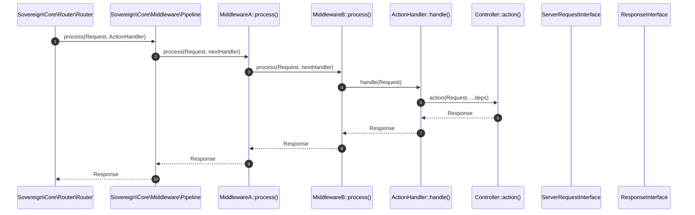

# Phase ID: CORE-05
## Tier: Core
## Component Name and Description: Middleware Pipeline & Request Handlers

The [`Middleware Pipeline & Request Handlers`](blueprints/CORE-05.md) component is responsible for processing incoming HTTP requests through a chain of configurable middleware and ultimately dispatching them to the appropriate request handler. Adhering to PSR-15 (HTTP Handlers and Middleware), this component implements an efficient "onion-pattern" middleware runner, allowing for modular and flexible request processing, response modification, and common cross-cutting concerns (e.g., authentication, logging, caching).

---

## Context7 Research

### 1. PSR Standards Reference
- **PSR-15 (HTTP Handlers and Middleware)**: This component will strictly implement [`Psr\Http\Server\MiddlewareInterface`](blueprints/CORE-05.md) and [`Psr\Http\Server\RequestHandlerInterface`](blueprints/CORE-05.md) to ensure interoperability and a standardized approach to HTTP request processing.
- **PSR-7 (HTTP Message Interface)**: Middleware and handlers will operate on [`Psr\Http\Message\ServerRequestInterface`](blueprints/CORE-04.md) and return [`Psr\Http\Message\ResponseInterface`](blueprints/CORE-04.md) instances, as defined in [`CORE-04.md`](blueprints/CORE-04.md).

### 2. PHP 8.2+ Best Practices
- **Immutable Messages**: Middleware should return new instances of `ServerRequestInterface` and `ResponseInterface` after modification, adhering to the immutability principle of PSR-7 messages.
- **Callable Type Hints**: Leverage PHP 8.2+ `callable` type hints for middleware definitions and request handlers to improve code clarity and enforce type safety.
- **Closure-based Pipelining**: The "onion-pattern" is efficiently implemented using nested closures, minimizing object instantiation overhead for each middleware layer.

### 3. Design Patterns
- **Chain of Responsibility**: The core pattern for the middleware pipeline, where each middleware acts as a handler in a chain, deciding whether to process the request, pass it to the next handler, or return a response directly.
- **Decorator Pattern**: Each middleware effectively decorates the next handler in the pipeline, adding functionality before or after the core request processing.
- **Strategy Pattern (for Request Handlers)**: The final request handler (e.g., controller method) can be seen as a strategy for generating a response.

---

## Architectural Design

### Class & Interface Structure

1.  **[`Sovereign\Core\Middleware\Pipeline`](blueprints/CORE-05.md:50)**: The main pipeline runner that processes a list of middleware.
2.  **[`Sovereign\Core\Middleware\RequestHandler`](blueprints/CORE-05.md:55)**: A concrete implementation of `RequestHandlerInterface` that ultimately dispatches to the route's handler.
3.  **[`Sovereign\Core\Middleware\MiddlewareStack`](blueprints/CORE-05.md:60)**: A collection of `MiddlewareInterface` instances, potentially organized by groups.
4.  **[`Sovereign\Core\Middleware\CallableMiddleware`](blueprints/CORE-05.md:65)**: An adapter to allow simple `callable` functions to act as `MiddlewareInterface`.

```php
namespace Sovereign\Core\Middleware;

use Psr\Http\Message\ServerRequestInterface;
use Psr\Http\Message\ResponseInterface;
use Psr\Http\Server\MiddlewareInterface;
use Psr\Http\Server\RequestHandlerInterface;

class Pipeline implements RequestHandlerInterface
{
    private array $middleware = [];
    private RequestHandlerInterface $finalHandler;

    public function __construct(RequestHandlerInterface $finalHandler)
    {
        $this->finalHandler = $finalHandler;
    }

    public function add(MiddlewareInterface|string $middleware): self;

    public function process(ServerRequestInterface $request): ResponseInterface
    {
        // Implement the onion-pattern recursive dispatching
        // The internal implementation will reverse the middleware array
        // and build a nested series of callables.
        // Each callable will invoke the 'process' method of a middleware
        // passing the next callable as the $handler.
        // The last callable will invoke $this->finalHandler->handle($request).
    }

    public function handle(ServerRequestInterface $request): ResponseInterface
    {
        // Alias for process, primarily for PSR-15 compatibility when Pipeline acts as a handler
        return $this->process($request);
    }
}
```

```php
namespace Sovereign\Core\Middleware;

use Psr\Http\Message\ServerRequestInterface;
use Psr\Http\Message\ResponseInterface;
use Psr\Http\Server\RequestHandlerInterface;
use Sovereign\Core\Container\ContainerInterface;

class ActionHandler implements RequestHandlerInterface
{
    public function __construct(
        private readonly ContainerInterface $container,
        private readonly callable|string $handler
    ) {}

    public function handle(ServerRequestInterface $request): ResponseInterface
    {
        // Resolve dependencies using the container and invoke the handler
        // The handler can be a controller method or any callable.
        // Example: if $handler is [Controller::class, 'method'], resolve Controller::class from container
        // and then call method with request and other resolved dependencies.
        return $this->container->call($this->handler, ['request' => $request]);
    }
}
```

### Middleware Pipeline Execution Diagram



---

## Integration Strategy

- The [`High-Performance Router`](blueprints/CORE-03.md) will initiate the middleware pipeline by calling `Pipeline::process()` with the matched `ServerRequestInterface` and an `ActionHandler` (which encapsulates the route's actual handler).
- All middleware will receive and return PSR-7 `ServerRequestInterface` and `ResponseInterface` objects from [`CORE-04.md`](blueprints/CORE-04.md).
- The [`Dependency Injection Container`](blueprints/CORE-02.md) will be used by the `Pipeline` and `ActionHandler` to resolve middleware instances and controller dependencies.
- Global and route-specific middleware will be configured and added to the `Pipeline` by the `Kernel` or `Router` during the boot phase.

---

## CI Verification Criteria

### 1. Test Coverage
- **Unit Tests**: 100% path coverage for `Pipeline` construction, middleware addition, correct sequence of execution, short-circuiting middleware, and `ActionHandler` dispatching with dependency resolution.
- **Integration Tests**: Verify complex middleware chains (global, group, route-specific) interact correctly with the `Router` and produce expected responses, including cases of error handling middleware.

### 2. Performance Benchmarks
- **Middleware Execution**: Processing a request through a pipeline of 5 middleware layers must complete in **< 0.1ms**.
- **Memory Overhead**: Minimal memory footprint added per middleware instance to ensure efficient scaling.

### 3. Compliance
- **PSR-15 Compliance**: Automated tests to confirm adherence to `MiddlewareInterface` and `RequestHandlerInterface` specifications.

---

## SemVer Impact

- **Minor Bump** (v1.4.0-core.5): This component formalizes the middleware pattern using PSR-15, building upon the HTTP messaging and routing layers. Its interfaces are standardized. Future additions of specific middleware implementations are typically non-breaking. Major changes to the `Pipeline` interface or underlying processing logic would be a Major bump.
