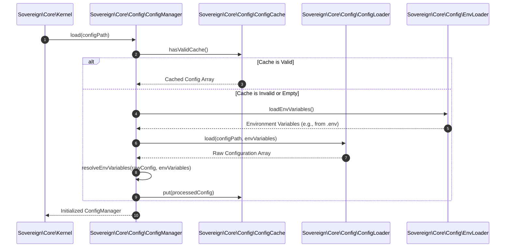

# Phase ID: CORE-06
## Tier: Core
## Component Name and Description: Config Manager & Loader

The [`Config Manager & Loader`](blueprints/CORE-06.md) provides a robust and high-performance system for loading, parsing, caching, and managing application configuration. It supports hierarchical dot-notation access, environment variable substitution, and ensures immutability of loaded configurations. This component is critical for centralizing application settings, promoting Twelve-Factor App principles, and enabling consistent behavior across different deployment environments.

---

## Context7 Research

### 1. PSR Standards Reference
- **No direct PSR standard** for configuration management. However, its output (a configuration array or object) will be used by PSR-11 compliant services (from [`CORE-02.md`](blueprints/CORE-02.md)) and other core components.

### 2. PHP 8.2+ Best Practices
- **Readonly Properties & Immutability**: Loaded configuration should be immutable to prevent runtime modification, ensuring predictable behavior. PHP 8.2+ `readonly` properties are ideal for this.
- **OPcache Preloading**: Design configuration file loading to be compatible with OPcache preloading, ensuring that parsed configuration arrays are cached in opcode memory for fastest access.
- **Lazy Loading**: Implement lazy loading for configuration files or sections that are not immediately required, reducing initial boot time and memory footprint.

### 3. Design Patterns
- **Singleton Pattern**: The `Config Manager` itself will likely be a singleton, accessible globally (e.g., via the [`Container`](blueprints/CORE-02.md)) to provide a single source of truth for configuration.
- **Registry Pattern**: The loaded configuration data can be viewed as a registry, accessible via a consistent interface.
- **Composite Pattern (implicit for hierarchical data)**: The dot-notation access implies a composite-like structure for the configuration data.
- **Decorator Pattern (for caching/validation)**: The core config loader can be decorated with caching or validation logic.

---

## Architectural Design

### Class & Interface Structure

1.  **[`Sovereign\Core\Config\ConfigManager`](blueprints/CORE-06.md:50)**: The central access point for configuration values.
2.  **[`Sovereign\Core\Config\ConfigLoader`](blueprints/CORE-06.md:55)**: Responsible for reading and parsing configuration files (e.g., PHP arrays, `.env` files).
3.  **[`Sovereign\Core\Config\ConfigCache`](blueprints/CORE-06.md:60)**: Handles caching of compiled configuration for performance.
4.  **[`Sovereign\Core\Config\EnvLoader`](blueprints/CORE-06.md:65)**: Specifically for loading and parsing `.env` files and managing environment variables.
5.  **[`Sovereign\Core\Config\Exception\ConfigException`](blueprints/CORE-06.md:70)**: Custom exception for configuration-related errors.

```php
namespace Sovereign\Core\Config;

interface ConfigManagerInterface
{
    public function get(string $key, mixed $default = null): mixed;
    public function has(string $key): bool;
    public function all(): array;
    public function load(string $path): void;
}
```

```php
namespace Sovereign\Core\Config;

final class ConfigManager implements ConfigManagerInterface
{
    private array $config = [];

    public function __construct(private readonly ConfigLoaderInterface $loader, private readonly ConfigCacheInterface $cache) {}

    public function load(string $configPath): void
    {
        if ($this->cache->hasValidCache()) {
            $this->config = $this->cache->get();
            return;
        }

        $loadedConfig = $this->loader->load($configPath);
        $this->config = $this->resolveEnvVariables($loadedConfig);
        $this->cache->put($this->config);
    }

    public function get(string $key, mixed $default = null): mixed
    {
        // Implement dot-notation access: 'app.name', 'database.connections.mysql.host'
        // Use a fast array traversal or a pre-flattened array if performance demands.
    }

    // ... other methods as defined in ConfigManagerInterface

    private function resolveEnvVariables(array $config): array
    {
        // Recursively iterate through config array and replace ${ENV_VAR} with actual env values.
    }
}
```

### Configuration Loading Sequence Diagram



---

## Integration Strategy

- The [`Sovereign\Core\Kernel`](blueprints/CORE-01.md) will be responsible for initializing the [`Config Manager & Loader`](blueprints/CORE-06.md) very early in the boot sequence, making configuration available to all subsequent components.
- The `Config Manager` will be registered in the [`Dependency Injection Container`](blueprints/CORE-02.md), allowing other services to inject `ConfigManagerInterface` to access settings.
- Configuration values will drive the behavior of other Core components, such as database connections, caching strategies, and environment-specific settings for the `Kernel` itself.

---

## CI Verification Criteria

### 1. Test Coverage
- **Unit Tests**: 100% path coverage for loading various configuration formats, dot-notation access, environment variable substitution, caching mechanisms (hit/miss), and error handling for missing keys or malformed files.
- **Integration Tests**: Verify configuration integrity across different environments (development, production) and ensure correct values are loaded and accessible by dependent services.

### 2. Performance Benchmarks
- **Initial Load Time**: Loading and parsing 5-10 configuration files with environment variables must complete in **< 1.0ms** (without cache) and **< 0.1ms** (with warm cache).
- **Access Time**: Retrieving a nested configuration value via dot-notation must be `O(1)` or near `O(1)` for a warm cache, taking **< 0.005ms**.
- **Memory Footprint**: Cached configuration array memory footprint must be efficient, scaled for typical application requirements.

### 3. Verification
- **Environment Variable Integrity**: Automated checks to ensure sensitive environment variables are not accidentally exposed or logged and are correctly substituted.
- **Schema Validation (Optional but Recommended)**: Future phases could introduce configuration schema validation to ensure loaded configurations adhere to expected structures and types.

---

## SemVer Impact

- **Minor Bump** (v1.5.0-core.6): This component establishes the core configuration management system, a foundational service for the entire application. Its interfaces are expected to be stable after initial implementation. Changes to the core `ConfigManagerInterface` or the underlying configuration format would constitute a Major bump.
