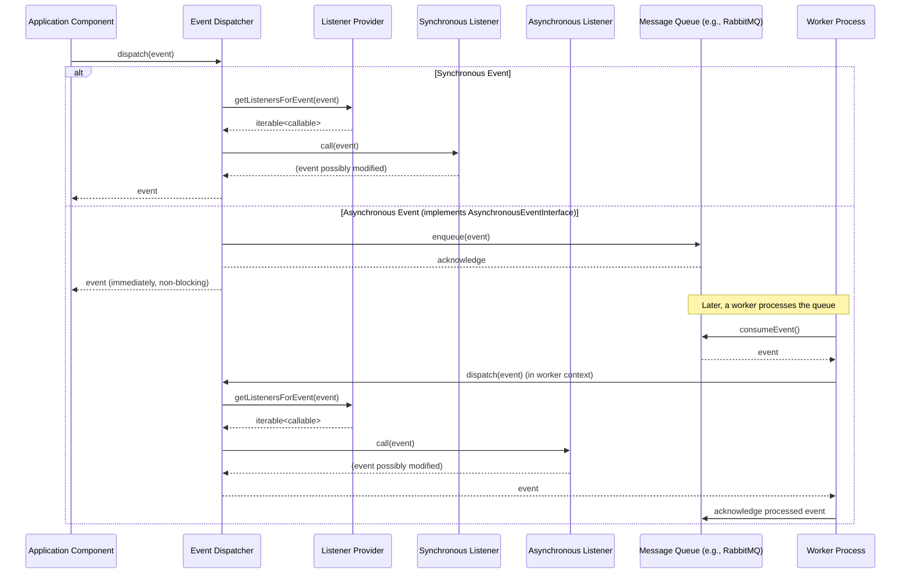

# CORE-07: Event Dispatcher & Listener

**Phase ID**: CORE-07
**Tier**: Core
**Component Name and Description**:
The Event Dispatcher & Listener component provides a robust, loosely coupled communication mechanism within the application. It implements the PSR-14 Event Dispatcher specification, allowing various parts of the system to dispatch events and other components to listen for and react to those events without direct dependencies. This fosters a highly modular and extensible architecture, supporting synchronous and asynchronous event processing, event propagation control, and flexible subscriber patterns.

**Context7 Research**:
*   **PSR-14: Event Dispatcher**: Defines a common interface for event dispatchers and listeners, promoting interoperability between different event-driven libraries and frameworks. It outlines the `EventDispatcherInterface`, `ListenerProviderInterface`, and `EventInterface`.
*   **PHP Best Practices**: Emphasize single responsibility principle for listeners, immutability for event objects, and careful consideration of synchronous vs. asynchronous processing based on performance and reliability needs.
*   **Design Patterns**: Observer Pattern (fundamental to event systems), Mediator Pattern (event dispatcher acts as a mediator), and Command Bus (can be built on top of or integrate with an event dispatcher for specific use cases).
*   **Asynchronous Processing**: While PHP itself is synchronous, asynchronous event handling can be achieved through mechanisms like message queues (e.g., RabbitMQ, Redis streams) combined with worker processes, allowing events to be processed in the background without blocking the main application flow.

**Architectural Design**:

### Interfaces & Classes

*   `Sovereign\Core\Event\EventDispatcherInterface` (PSR-14 compliant):
    ```php
    namespace Sovereign\\Core\\Event;

    use Psr\\EventDispatcher\\EventDispatcherInterface as PsrEventDispatcherInterface;
    use Psr\\EventDispatcher\\ListenerProviderInterface;
    use Psr\\EventDispatcher\\StoppableEventInterface;

    interface EventDispatcherInterface extends PsrEventDispatcherInterface
    {
        public function addListener(string $eventName, callable $listener, int $priority = 0): void;
        public function addSubscriber(EventSubscriberInterface $subscriber): void;
        public function removeListener(string $eventName, callable $listener): void;
        public function getListenersForEvent(object $event): iterable;
        public function dispatch(object $event): object;
    }
    ```

*   `Sovereign\Core\Event\ListenerProviderInterface` (PSR-14 compliant):
    ```php
    namespace Sovereign\\Core\\Event;

    use Psr\\EventDispatcher\\ListenerProviderInterface as PsrListenerProviderInterface;

    interface ListenerProviderInterface extends PsrListenerProviderInterface
    {
        public function addListener(string $eventName, callable $listener, int $priority = 0): void;
        public function addSubscriber(EventSubscriberInterface $subscriber): void;
        public function getListenersForEvent(object $event): iterable;
    }
    ```

*   `Sovereign\Core\Event\EventSubscriberInterface`:
    ```php
    namespace Sovereign\\Core\\Event;

    interface EventSubscriberInterface
    {
        public static function getSubscribedEvents(): array;
    }
    ```
    (Example `getSubscribedEvents` return: `['user.registered' => 'onUserRegistered', 'order.placed' => ['onOrderPlaced', 10]]`)

*   `Sovereign\Core\Event\AbstractEvent`:
    ```php
    namespace Sovereign\\Core\\Event;

    use Psr\\EventDispatcher\\StoppableEventInterface;

    abstract class AbstractEvent implements StoppableEventInterface
    {
        private bool $propagationStopped = false;
        private array $payload = [];

        public function isPropagationStopped(): bool
        {
            return $this->propagationStopped;
        }

        public function stopPropagation(): void
        {
            $this->propagationStopped = true;
        }

        public function getPayload(): array
        {
            return $this->payload;
        }

        protected function setPayload(array $payload): void
        {
            $this->payload = $payload;
        }
    }
    ```

*   `Sovereign\Core\Event\EventDispatcher` (Implementation of `EventDispatcherInterface`):
    Handles listener registration, priority sorting, event dispatching, and propagation stopping.

*   `Sovereign\Core\Event\ListenerProvider` (Implementation of `ListenerProviderInterface`):
    Manages listeners and subscribers, providing them to the dispatcher based on the event.

### Synchronous vs. Asynchronous Events

*   **Synchronous**: Default behavior. Listeners are executed immediately when `dispatch()` is called. Suitable for fast, non-blocking operations.
*   **Asynchronous**: Events intended for background processing will implement `Sovereign\Core\Event\AsynchronousEventInterface`. The dispatcher, upon encountering such an event, will not execute its listeners immediately but instead enqueue it into a message queue (e.g., via CORE-XX Message Queue component). A separate worker process will then consume from the queue and dispatch the event, triggering its asynchronous listeners.

### Mermaid Diagram: Event Dispatching Flow



**Integration Strategy**:
The Event Dispatcher will be registered as a singleton in the Dependency Injection Container (CORE-02). Components will inject `EventDispatcherInterface` to dispatch events. Listeners and subscribers will be registered with the Listener Provider, either directly during application bootstrapping or through auto-discovery mechanisms. Asynchronous event handling will depend on a future Message Queue component (e.g., CORE-13) and a Worker component (e.g., CORE-14). Events themselves can carry payloads from CORE-01 (Foundational Kernel) data structures.

**CI Verification Criteria**:
*   **Unit Tests**: 100% code coverage for `EventDispatcher` and `ListenerProvider` classes, covering listener registration, dispatching, priority handling, and propagation stopping.
*   **Integration Tests**: Verify end-to-end event flow, including synchronous and mock asynchronous event handling.
*   **Performance Benchmarks**:
    *   Synchronous event dispatch: under 0.5 ms for an event with 5 listeners.
    *   Asynchronous event enqueue: under 1 ms (excluding actual queue processing time).
*   **Static Analysis**: Ensure PSR-14 compliance and adherence to coding standards.

**SemVer Impact**:
**Minor**: This component introduces new core functionality and public interfaces (PSR-14 compliant). While foundational, it doesn't break existing APIs (as the stack is new). Future additions of asynchronous event infrastructure or advanced features would be part of subsequent minor releases or new major versions if they drastically alter the core dispatching mechanism or require breaking changes to existing event/listener contracts.