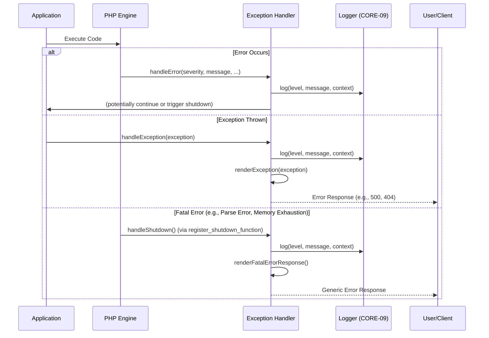

# CORE-08: Error & Exception Handling

**Phase ID**: CORE-08
**Tier**: Core
**Component Name and Description**:
The Error & Exception Handling component provides a centralized and robust mechanism for managing errors and exceptions within the Sovereign Stack application. It ensures consistent error reporting, allows for custom exception types to convey specific application states, integrates with a PSR-3 compliant logger for persistent error records, and facilitates graceful shutdowns to prevent data corruption or inconsistent states during critical failures. This component is crucial for application stability, debugging, and providing a good user experience.

**Context7 Research**:
*   **PHP Error Handling**: Understanding the difference between errors (recoverable and fatal) and exceptions. Utilizing `set_error_handler()` and `set_exception_handler()` for global error and exception interception.
*   **PSR-3: Logger Interface**: Defines a common interface for logging libraries, enabling interoperability and allowing the application to use various logging implementations without changing its logging calls. This component will integrate with a PSR-3 compliant logger (CORE-09).
*   **Custom Exception Types**: Best practice to create specific exception classes for different application domains or error conditions (e.g., `NotFoundException`, `InvalidArgumentException`, `AuthenticationException`). This provides more semantic error information than generic `Exception`.
*   **Graceful Shutdowns**: Techniques to ensure that when a critical error or exception occurs, the application attempts to clean up resources, log the event, and provide a user-friendly error response rather than a raw PHP error. This often involves a shutdown handler that is registered to execute at the end of a script's execution or upon fatal errors.
*   **Design Patterns**: Chain of Responsibility (for handling different exception types), Singleton (for a centralized error handler), and Strategy (for different error rendering approaches).

**Architectural Design**:

### Interfaces & Classes

*   `Sovereign\Core\ErrorHandling\ExceptionHandlerInterface`:
    ```php
    namespace Sovereign\\Core\\ErrorHandling;

    use Throwable;
    use Psr\\Log\\LoggerInterface;
    use Sovereign\\Core\\Http\\ResponseInterface;

    interface ExceptionHandlerInterface
    {
        public function register(): void;
        public function handleException(Throwable $e): void;
        public function handleError(int $severity, string $message, string $file = '', int $line = 0): void;
        public function handleShutdown(): void;
        public function renderException(Throwable $e): ResponseInterface;
        public function setLogger(LoggerInterface $logger): void;
    }
    ```

*   `Sovereign\Core\ErrorHandling\AbstractExceptionHandler`:
    Provides a base implementation for common error handling logic, including logging, and can be extended for environment-specific rendering.

*   `Sovereign\Core\ErrorHandling\SovereignException`:
    Base custom exception for the application.
    ```php
    namespace Sovereign\\Core\\ErrorHandling;

    use Exception;

    class SovereignException extends Exception
    {
        // Custom properties or methods for application-specific exceptions
    }
    ```

*   `Sovereign\Core\ErrorHandling\Http\NotFoundException` (Extends `SovereignException`):
    Specific exception for 404 Not Found errors.

*   `Sovereign\Core\ErrorHandling\Http\UnauthorizedException` (Extends `SovereignException`):
    Specific exception for 401 Unauthorized errors.

*   `Sovereign\Core\ErrorHandling\Http\ForbiddenException` (Extends `SovereignException`):
    Specific exception for 403 Forbidden errors.

*   `Sovereign\Core\ErrorHandling\FatalErrorShutdownHandler`:
    A dedicated class/function registered via `register_shutdown_function` to catch fatal errors that cannot be caught by `set_error_handler`.

### Centralized Error Flow

All exceptions and errors will be routed through a single `ExceptionHandlerInterface` implementation. This handler will: 
1.  Log the error/exception using the PSR-3 compliant logger (CORE-09).
2.  Potentially notify developers (e.g., via email, monitoring services).
3.  Render an appropriate error response based on the application environment (e.g., detailed stack trace in development, generic error page in production).
4.  Ensure graceful shutdown procedures are initiated.

### Mermaid Diagram: Error & Exception Handling Flow



**Integration Strategy**:
The `ExceptionHandler` will be instantiated and registered early in the application bootstrap process, ideally after the Dependency Injection Container (CORE-02) is available, allowing it to inject the `LoggerInterface` (CORE-09). The router (CORE-03) and other core components will throw specific custom exceptions defined within this component. The `ExceptionHandler` will also be responsible for creating `ResponseInterface` (from CORE-01 Foundational Kernel) for error pages.

**CI Verification Criteria**:
*   **Unit Tests**: 100% code coverage for `ExceptionHandlerInterface` implementation and custom exception classes, verifying correct logging, error type distinction, and propagation.
*   **Integration Tests**: Simulate various error conditions (e.g., throwing exceptions, triggering fatal errors) and verify that the `ExceptionHandler` correctly logs, handles, and renders appropriate responses. Test graceful shutdown in different scenarios.
*   **Performance Benchmarks**: Ensure that error handling overhead is minimal, e.g., exception logging and rendering add no more than 10ms to request time.
*   **Static Analysis**: Verify correct exception hierarchy, use of `Throwable`, and adherence to PSR-3 logging standards.

**SemVer Impact**:
**Minor**: This component introduces new core interfaces and classes for error handling, enhancing application stability and observability without breaking existing (or nascent) APIs. Its integration with CORE-09 (Logger) and CORE-01 (ResponseInterface) will be designed to be non-breaking. Future significant changes to the error reporting or recovery mechanisms might warrant a Major bump.