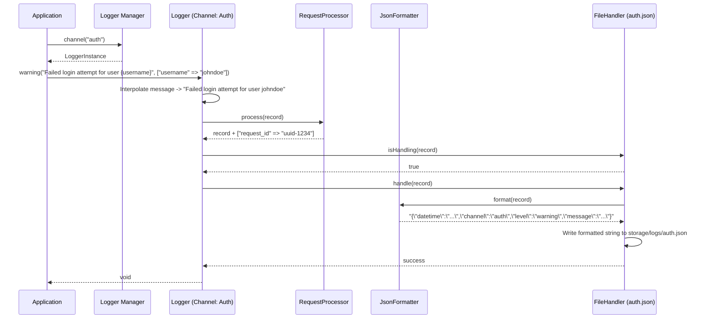

# CORE-09: Logger & PSR-3 Integration

**Phase ID**: CORE-09
**Tier**: Core
**Component Name and Description**:
The Logger & PSR-3 Integration component provides a highly flexible, standardized logging framework for the Sovereign Stack. Implementing the PSR-3 `LoggerInterface`, it enables structured and severity-tiered message recording across multiple log channels (e.g., application, security, database, console, audit). It handles context interpolation, formatting, and route-based dispatch (e.g., file, system log, cloud storage) to guarantee high-fidelity operational transparency without adding I/O latency to critical request paths.

**Context7 Research**:
*   **PSR-3: Logger Interface**: Standardizes logging methods (`emergency`, `alert`, `critical`, `error`, `warning`, `notice`, `info`, `debug`, `log`) and parameter passing (message + context array). Ensures standard context keys like `exception` hold a `Throwable` object.
*   **Monolog Patterns**: Monolog is the industry standard PHP logging library. We will emulate or wrap Monolog concepts like Handlers (where the log goes), Formatters (how the log looks), and Processors (injecting extra context like request ID, user ID, memory usage).
*   **Context Handling & Interpolation**: Placeholders in log messages must follow the format `{placeholder}` and must be replaced by values from the context array (per PSR-3 Section 1.2).
*   **Log Channels**: Categorizing logs is essential for production operations. For instance, authentication failures should go to a `security` channel, while query errors go to a `database` channel.
*   **Severity Levels**: RFC 5424 severity levels are mapped directly inside PSR-3, helping operators filter logs effectively.

**Architectural Design**:

### Interfaces & Classes

*   `Sovereign\Core\Log\LoggerManagerInterface`:
    ```php
    namespace Sovereign\\Core\\Log;

    use Psr\\Log\\LoggerInterface;

    interface LoggerManagerInterface
    {
        public function channel(string $channel = null): LoggerInterface;
        public function registerChannel(string $name, LoggerInterface $logger): void;
    }
    ```

*   `Sovereign\Core\Log\HandlerInterface`:
    Defines where log records are written.
    ```php
    namespace Sovereign\\Core\\Log;

    interface HandlerInterface
    {
        public function isHandling(array $record): bool;
        public function handle(array $record): bool;
        public function handleBatch(array $records): void;
    }
    ```

*   `Sovereign\Core\Log\FormatterInterface`:
    Defines how log records are formatted.
    ```php
    namespace Sovereign\\Core\\Log;

    interface FormatterInterface
    {
        public function format(array $record): string;
        public function formatBatch(array $records): array;
    }
    ```

*   `Sovereign\Core\Log\Logger` (Implements `Psr\Log\LoggerInterface`):
    The main logger class that accepts log messages, performs placeholder interpolation, processes context additions (via Processors), and routes records to handlers.
    ```php
    namespace Sovereign\\Core\\Log;

    use Psr\\Log\\AbstractLogger;
    use Psr\\Log\\InvalidArgumentException;

    class Logger extends AbstractLogger
    {
        private string $name;
        private array $handlers = [];
        private array $processors = [];

        public function __construct(string $name, array $handlers = [], array $processors = [])
        {
            $this->name = $name;
            $this->handlers = $handlers;
            $this->processors = $processors;
        }

        public function log($level, $message, array $context = []): void
        {
            // Interpolate placeholders
            // Call processors
            // Route through handlers
        }
    }
    ```

### Handlers & Formatters Ecosystem
-   **Handlers**:
    -   `FileHandler`: Writes logs to a local file (e.g., rotating by date, or using a stream).
    -   `ConsoleHandler`: Writes logs directly to stdout/stderr (crucial for CLI commands or containerized setups).
    -   `SyslogHandler`: Interfaces with the system logger.
    -   `BufferHandler`: Buffers logs in memory and writes them in batch at the end of the request to minimize IO calls.
-   **Formatters**:
    -   `LineFormatter`: Outputs text lines (e.g., `[%datetime%] %channel%.%level_name%: %message% %context% %extra%\n`).
    -   `JsonFormatter`: Standardized JSON output for machine consumption (ELK stack, FluentBit).

### Mermaid Diagram: Log Dispatch Pipeline



**Integration Strategy**:
The `LoggerManager` is registered inside the DI Container (CORE-02) as a singleton, mapping PSR-3 `Psr\Log\LoggerInterface` to the default application channel logger. During bootstrap, the `ExceptionHandler` (CORE-08) retrieves the Logger to write critical and unhandled exceptions. In CORE-10 (Console), command loggers are bound to the `ConsoleHandler` to mirror verbose output to standard error interfaces. In CORE-11 (FileSystem), the `FileHandler` can optionally write over Flysystem streams when logging to remote disks.

**CI Verification Criteria**:
*   **Unit Tests**: 100% code coverage for placeholder interpolation logic, level verification, processor ordering, and handler filtering.
*   **Integration Tests**: Verify channel separation (e.g., message logged in `database` channel does not show up in `auth` log). Verify structured JSON formatter outputs correct schema.
*   **Performance Benchmarks**:
    *   Log statement overhead (no handler action due to level configuration): under 0.05 ms.
    *   FileHandler write with line formatting: under 0.2 ms.
    *   BufferHandler bulk write speed to disk.
*   **Static Analysis**: Enforced compliance with PSR-3 interfaces, proper handling of `Throwable` in the `exception` context key.

**SemVer Impact**:
**Minor**: Establishes a standard, configurable diagnostic infrastructure (PSR-3 compliant) that does not break backward compatibility. It acts as an upgrade over legacy logging systems by introducing channel segmentation and structured JSON serialization formatting. Subsequent integrations or cloud driver additions (like Datadog/Sentry handlers) will follow Minor bumps.