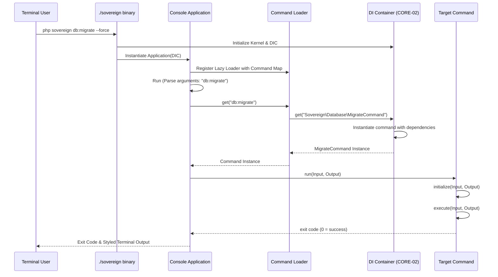

# CORE-10: Console & CLI Application

**Phase ID**: CORE-10
**Tier**: Core
**Component Name and Description**:
The Console & CLI Application component serves as the command-line interface (CLI) engine for the Sovereign Stack. It integrates the robust Symfony Console component to manage command execution, input parsing (arguments and options), interactive prompt management, helper sets (e.g., progress bars, tables), and styled ANSI output. It supports automatic command discovery, dependency injection container injection into commands, and a unified command-chaining strategy for robust automation tasks.

**Context7 Research**:
*   **Symfony Console**: Recognized as the industry-standard PHP package for terminal CLI interfaces. Key classes include `Symfony\Component\Console\Application`, `Symfony\Component\Console\Command\Command`, `Symfony\Component\Console\Input\InputInterface`, and `Symfony\Component\Console\Output\OutputInterface`.
*   **Dependency Injection in Commands**: Standard CLI implementations often struggle with commands that require deep dependencies. We will resolve commands directly from our CORE-02 DI Container using a specialized Command Loader or service tags to preserve decoupled design.
*   **Chaining & Subprocesses**: Executing commands from within other commands. We can achieve this cleanly by calling `$this->getApplication()->find('other:command')->run($subInput, $output)` or utilizing native Symfony process components for isolation.
*   **Interactive Prompts & Security**: Symfony Console provides helpers like `QuestionHelper` and `ConfirmationQuestion`. This is essential for secure interactions (like masking passwords during setup) and interactive database migrations.

**Architectural Design**:

### Interfaces & Classes

*   `Sovereign\Core\Console\Application`:
    Extends `Symfony\Component\Console\Application` to bind into the Sovereign Stack's kernel lifecycles.
    ```php
    namespace Sovereign\\Core\\Console;

    use Symfony\\Component\\Console\\Application as SymfonyApplication;
    use Psr\\Container\\ContainerInterface;

    class Application extends SymfonyApplication
    {
        private ContainerInterface $container;

        public function __construct(ContainerInterface $container, string $name = 'Sovereign CLI', string $version = '1.0.0')
        {
            parent::__construct($name, $version);
            $this->container = $container;
            
            // Register default commands or command loader
        }

        public function getContainer(): ContainerInterface
        {
            return $this->container;
        }
    }
    ```

*   `Sovereign\Core\Console\CommandLoader` (Implements `Symfony\Component\Console\CommandLoader\CommandLoaderInterface`):
    Enables lazy loading of commands from the container, improving startup performance so we don't instantiate every command class on execution.
    ```php
    namespace Sovereign\\Core\\Console;

    use Symfony\\Component\\Console\\CommandLoader\\CommandLoaderInterface;
    use Symfony\\Component\\Console\\Command\\Command;
    use Psr\\Container\\ContainerInterface;

    class ContainerCommandLoader implements CommandLoaderInterface
    {
        private ContainerInterface $container;
        private array $commandMap; // ['app:migrate' => 'Sovereign\\Database\\MigrateCommand']

        public function __construct(ContainerInterface $container, array $commandMap)
        {
            $this->container = $container;
            $this->commandMap = $commandMap;
        }

        public function get(string $name): Command
        {
            if (!$this->has($name)) {
                throw new CommandNotFoundException(sprintf('Command "%s" does not exist.', $name));
            }

            return $this->container->get($this->commandMap[$name]);
        }

        public function has(string $name): bool
        {
            return isset($this->commandMap[$name]);
        }

        public function getNames(): array
        {
            return array_keys($this->commandMap);
        }
    }
    ```

*   `Sovereign\Core\Console\AbstractCommand` (Extends `Symfony\Component\Console\Command\Command`):
    A baseline command wrapper that simplifies standard operational actions (like writing styled errors, formatting tables, checking authorization, or logging outcomes).
    ```php
    namespace Sovereign\\Core\\Console;

    use Symfony\\Component\\Console\\Command\\Command;
    use Symfony\\Component\\Console\\Input\\InputInterface;
    use Symfony\\Component\\Console\\Output\\OutputInterface;
    use Symfony\\Component\\Console\\Style\\SymfonyStyle;

    abstract class AbstractCommand extends Command
    {
        protected SymfonyStyle $io;

        protected function initialize(InputInterface $input, OutputInterface $output): void
        {
            $this->io = new SymfonyStyle($input, $output);
        }
    }
    ```

### Command Autodiscovery
During bootstrap, the CLI application reads configuration or scans designated directories (e.g., `app/Console/Commands/` and package providers). It compiles a map of command names to command class names, registers them with the lazy-loaded `ContainerCommandLoader`, and exposes them to the runtime.

### Mermaid Diagram: CLI Command Lifecycle



**Integration Strategy**:
The CLI execution script (`bin/sovereign` or `sovereign`) bootlaces the application kernel (CORE-01), loads the DI Container configuration (CORE-02), and instantiates `Sovereign\Core\Console\Application`. Event listeners from CORE-07 can hook into Symfony Console lifecycle events (e.g., `ConsoleEvents::COMMAND`, `ConsoleEvents::ERROR`, `ConsoleEvents::TERMINATE`) to log commands or measure execution times. Exceptions occurring during command executions are captured by the core Exception Handler (CORE-08) and written to the `console` channel via the PSR-3 Logger (CORE-09).

**CI Verification Criteria**:
*   **Unit Tests**: Mock Symfony input/output interfaces to test custom command logic. 100% test coverage on `ContainerCommandLoader` and `AbstractCommand` helpers.
*   **Integration Tests**: Run the console application via process isolation in tests, capturing exit codes and output patterns (verifying ANSI formatting, correct error messages on exception, and database seeds).
*   **Performance Benchmarks**:
    *   Console bootstrap time (up to command resolve stage, ensuring lazy loading): under 15ms.
    *   Command autodiscovery cached compilation: under 5ms.
*   **Static Analysis**: Verify proper usage of return types (always returning integer exit codes per Symfony specs) and strictly typed signatures.

**SemVer Impact**:
**Minor**: Establishes standard script execution wrappers. It provides a structured replacement for custom legacy entry-point shell scripts, shifting operations to a highly debuggable PHP CLI. Future custom console formatting options or internal pipeline tools represent non-breaking Minor features.