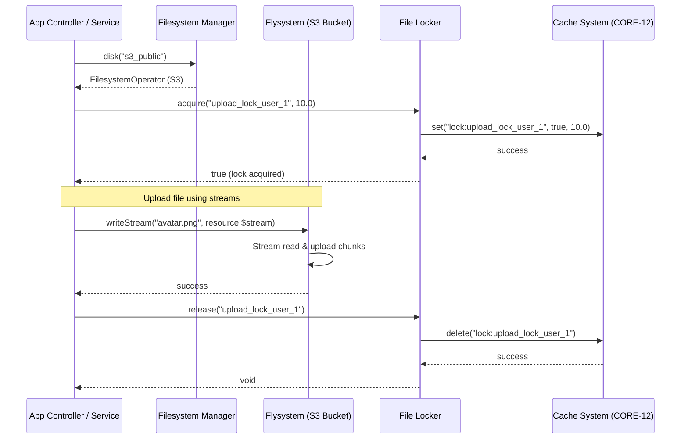

# CORE-11: File System Abstraction

**Phase ID**: CORE-11
**Tier**: Core
**Component Name and Description**:
The File System Abstraction component provides a unified API for interacting with storage backends across local disk configurations and cloud-based systems (e.g., AWS S3, MinIO, SFTP). It integrates the League Flysystem package to abstract physical file system details, exposes consistent stream wrappers, manages concurrent write file locks safely, and provides a multi-disk driver registration pattern to support tenancy isolation and dynamic file routing.

**Context7 Research**:
*   **Flysystem (League\Flysystem)**: The standard-bearer file storage abstraction library in the PHP community. It introduces a `FilesystemOperator` which handles directory actions, files, mime-types, stream writing, and metadata inquiries under a standardized signature.
*   **Local Storage and Cloud Storage Drivers**: Handlers like `LocalFilesystemAdapter` and `AwsS3V3Adapter` translate standard calls into storage-specific protocols.
*   **File Locking**: Essential in preventing race conditions during concurrent local file writes (e.g., sessions, caching, CSV compile actions). Can be solved using PHP's native `flock()` or Symfony's Lock component for distributed setups.
*   **Stream Wrappers**: Exposing file resources as streams (e.g., `fopen()`) allows efficient transfer of massive files (e.g., media assets, high-volume exports) without exhausting PHP's memory limit.
*   **Tenancy Segmentation**: Keeping tenant files separated under dedicated prefixes (e.g., `storage/tenants/tenant_01/`) or isolating them to different storage buckets.

**Architectural Design**:

### Interfaces & Classes

*   `Sovereign\Core\Filesystem\FilesystemManagerInterface`:
    Provides access to configured disk storage instances.
    ```php
    namespace Sovereign\\Core\\Filesystem;

    use League\\Flysystem\\FilesystemOperator;

    interface FilesystemManagerInterface
    {
        public function disk(string $name = null): FilesystemOperator;
        public function registerDisk(string $name, FilesystemOperator $disk): void;
    }
    ```

*   `Sovereign\Core\Filesystem\FilesystemManager` (Implements `FilesystemManagerInterface`):
    Constructs Flysystem adapters and operators based on application config (`config/filesystems.php`).
    ```php
    namespace Sovereign\\Core\\Filesystem;

    use League\\Flysystem\\Filesystem;
    use League\\Flysystem\\FilesystemOperator;
    use League\\Flysystem\\Local\\LocalFilesystemAdapter;
    use League\\Flysystem\\AwsS3V3\\AwsS3V3Adapter;
    use Aws\\S3\\S3Client;

    class FilesystemManager implements FilesystemManagerInterface
    {
        private array $disks = [];
        private array $config;

        public function __construct(array $config)
        {
            $this->config = $config;
        }

        public function disk(string $name = null): FilesystemOperator
        {
            $name = $name ?: $this->config['default'] ?? 'local';

            if (isset($this->disks[$name])) {
                return $this->disks[$name];
            }

            return $this->disks[$name] = $this->createDisk($name);
        }

        private function createDisk(string $name): FilesystemOperator
        {
            $diskConfig = $this->config['disks'][$name] ?? null;
            if (!$diskConfig) {
                throw new InvalidArgumentException("Disk [{$name}] is not configured.");
            }

            switch ($diskConfig['driver']) {
                case 'local':
                    $adapter = new LocalFilesystemAdapter($diskConfig['root']);
                    break;
                case 's3':
                    $client = new S3Client($diskConfig['credentials']);
                    $adapter = new AwsS3V3Adapter($client, $diskConfig['bucket'], $diskConfig['prefix'] ?? '');
                    break;
                default:
                    throw new InvalidArgumentException("Unsupported filesystem driver [{$diskConfig['driver']}].");
            }

            return new Filesystem($adapter);
        }

        public function registerDisk(string $name, FilesystemOperator $disk): void
        {
            $this->disks[$name] = $disk;
        }
    }
    ```

*   `Sovereign\Core\Filesystem\FileLockerInterface`:
    An abstraction for acquiring locks on storage paths.
    ```php
    namespace Sovereign\\Core\\Filesystem;

    interface FileLockerInterface
    {
        public function acquire(string $key, float $ttl = 300.0): bool;
        public function release(string $key): void;
        public function isLocked(string $key): bool;
    }
    ```

### Dynamic Tenant Storage Isolation
When tenancy resolves (via Tenancy Services in Spoke tiers), the application configures a custom driver at runtime. For example, registering `tenant_disk` dynamically mapping to S3 under path prefix `tenants/{tenant_id}/` or utilizing a specific partitioned storage system.

### Mermaid Diagram: File Operations Sequence



**Integration Strategy**:
The `FilesystemManager` is bound into the DIC (CORE-02) as a singleton, pulling configurations directly from core system states (CORE-01). The file caching driver configured in Cache Management (CORE-12) can write caching directories directly onto a local Flysystem disk. Temporary session file-locking is abstracted through `FileLockerInterface`. Errors thrown during file interactions are funneled through the default `ExceptionHandler` (CORE-08) for unified error parsing.

**CI Verification Criteria**:
*   **Unit Tests**: 100% test coverage for file write, read, exist, delete, and copy routines using in-memory virtual file system adapters (e.g., `vfsStream`) to eliminate disk dependence in testing.
*   **Integration Tests**: Verify physical operations against local directory targets and MinIO (mocking S3) via local Docker containers to validate credential checks, directory building, and file streaming.
*   **Performance Benchmarks**:
    *   File write stream buffering threshold: Ensure writing a 10MB stream spends less than 50MB of execution RAM.
    *   Disk configuration instantiation: under 1ms.
*   **Static Analysis**: Verify proper type checking of stream resources (`resource`) vs paths (`string`).

**SemVer Impact**:
**Minor**: Upgrades the stack with unified external storage support. Files and media logic shift from standard PHP file operations (like `file_put_contents` or `mkdir`) to a resilient API. Future releases integrating other cloud adapters (e.g., GCP, Dropbox, SFTP) represent Patch or Minor releases. Breaking the default signature of `FilesystemManagerInterface` will trigger a Major version bump.